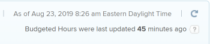

# Report on *Resource Planner* Budgeted Hours

You can budget resources on your projects by using the *Resource Planner*. For information about budgeting your resources using the *Resource Planner*, see the article [Budget resources in the Resource Planner using the Project and Role views](../../resource-mgmt/resource-planning/budget-resources-project-role-views-resource-planner.md).

Budgeting resources means that you define (or budget) a certain number of hours that the resources on a project need to complete their work on the project. To share the budgeted hour information that you enter in the *Resource Planner* with other users who might not have access to the *Resource Planner*, you can build a Budgdted Hour report. For information, see [Report: Budgeted Hour](../../reports-and-dashboards/reports/custom-view-filter-grouping-samples/report-budgeted-hour.md).

<!--

When you want to share Budgeted Hour information with other users who do not have access to the Resource Planner, you can do so by building a Budgeted Hour report. You can then share the report with them.

-->

When you want to share Budgeted Hour information with other users who do not have access to the Resource Planner, you can do so by building a Budgeted Hour report. You can then share the report with them.

>[!IMPORTANT]
>
><!-->
>
Budgeted Hours are updated every hour in the <em>Adobe Workfront</em> database. Refreshing the report does not necessarily refresh the hour information in it. You can view the time lapsed since the last update in the upper-right corner of every Budgeted Hour report. Refreshing the report refreshes the information in it only when there has been more than one hour since the last update. 
>
>-->
>Budgeted Hours are updated every hour in the *Adobe Workfront* database. Refreshing the report does not necessarily refresh the hour information in it. You can view the time lapsed since the last update in the upper-right corner of every Budgeted Hour report. Refreshing the report refreshes the information in it only when there has been more than one hour since the last update. 
>
><!-->
>
  
>
>-->
>>

  <!--
  <li data-mc-conditions="QuicksilverOrClassic.Draft mode"><a href="#build" class="MCXref xref"> Build a Budgeted Hour report</a> </li>
  -->

* [Build a Budgeted Hour report](#build)

  <!--
  <li data-mc-conditions="QuicksilverOrClassic.Draft mode"><a href="#review" class="MCXref xref">Review the Budgeted Hour report</a> </li>
  -->

* [Review the Budgeted Hour report](#review)

<!--
<h2 data-mc-conditions="QuicksilverOrClassic.Draft mode"> Build a Budgeted Hour report</h2>
-->

##  Build a Budgeted Hour report

<ol> <draft-comment>
  <li value="1" data-mc-conditions="QuicksilverOrClassic.Draft mode"> <draft-comment>
    <MadCap:conditionalText data-mc-conditions="QuicksilverOrClassic.Quicksilver">
     Click the 
     Main Menu
      in the upper-right corner, then click 
     Reports. 
    </MadCap:conditionalText>
   </draft-comment><MadCap:conditionalText data-mc-conditions="QuicksilverOrClassic.Quicksilver">
    Click the 
    Main Menu
     in the upper-right corner, then click 
    Reports. 
   </MadCap:conditionalText> </li>
 </draft-comment>
 <li value="1" data-mc-conditions="QuicksilverOrClassic.Draft mode"> <MadCap:conditionalText data-mc-conditions="QuicksilverOrClassic.Quicksilver">
   Click the 
   Main Menu
    in the upper-right corner, then click 
   Reports. 
  </MadCap:conditionalText> </li> 
 <li value="2"> <draft-comment>
   
Click New Report> Budgeted Hour.

  </draft-comment>
Click New Report> Budgeted Hour.
 <draft-comment>
   
The default view is applied to the report.

  </draft-comment>
The default view is applied to the report.
 </li> 
 <li value="3"> <draft-comment>
   
(Optional) To make the report easier to read, click the Budgeted Hours column, then Switch to Text Mode, then change the <code>valuefield </code>line to <code>valueexpreesion </code>and enter the rounding expression. This rounds the number of Budgeted Hours to a number of decimals that you specify.

  </draft-comment>
(Optional) To make the report easier to read, click the Budgeted Hours column, then Switch to Text Mode, then change the <code>valuefield </code>line to <code>valueexpreesion </code>and enter the rounding expression. This rounds the number of Budgeted Hours to a number of decimals that you specify.
 <draft-comment>
   
For information about how to round a number in <em>Workfront</em>, see the article <a href="../../reports-and-dashboards/reports/calc-cstm-data-reports/condition-operators-calculated-custom-expressions.md" class="MCXref xref">Condition operators in calculated custom expressions</a>.

  </draft-comment>
For information about how to round a number in <em>Workfront</em>, see the article <a href="../../reports-and-dashboards/reports/calc-cstm-data-reports/condition-operators-calculated-custom-expressions.md" class="MCXref xref">Condition operators in calculated custom expressions</a>.
 </li> <draft-comment>
  <li value="4" data-mc-conditions="QuicksilverOrClassic.Draft mode">(Optional) Click Add Column to add additional columns. </li>
 </draft-comment>
 <li value="4" data-mc-conditions="QuicksilverOrClassic.Draft mode">(Optional) Click Add Column to add additional columns. </li> 
 <li value="5"> <draft-comment>
   
(Optional) To make the report easier to read, we recommend that you add a grouping to it. We suggest the following grouping: 

  </draft-comment>
(Optional) To make the report easier to read, we recommend that you add a grouping to it. We suggest the following grouping: 
 <draft-comment>
   
Click the Groupings tab, then do one or several of the following:

  </draft-comment>
Click the Groupings tab, then do one or several of the following:
 
  <ol style="list-style-type: lower-alpha;"> <draft-comment>
    <li value="1" data-mc-conditions="QuicksilverOrClassic.Draft mode">Click Add Grouping and start typing "Project Name", then select it when it appears in the list.</li>
   </draft-comment>
   <li value="1" data-mc-conditions="QuicksilverOrClassic.Draft mode">Click Add Grouping and start typing "Project Name", then select it when it appears in the list.</li> <draft-comment>
    <li value="2" data-mc-conditions="QuicksilverOrClassic.Draft mode">Click Add Grouping and start typing "Job Role Name", then select it when it appears in the list.</li>
   </draft-comment>
   <li value="2" data-mc-conditions="QuicksilverOrClassic.Draft mode">Click Add Grouping and start typing "Job Role Name", then select it when it appears in the list.</li> 
   <li value="3"> <draft-comment>
     
Click Add Grouping and start typing Allocation Date, select it when it appears in the list, and then select the timeframe you want to group by from the Group Dates by field. 

    </draft-comment>
Click Add Grouping and start typing Allocation Date, select it when it appears in the list, and then select the timeframe you want to group by from the Group Dates by field. 
 </li> 
  </ol> </li> <draft-comment>
  <li value="6" data-mc-conditions="QuicksilverOrClassic.Draft mode">(Optional) Click Filters to add filters to the report.</li>
 </draft-comment>
 <li value="6" data-mc-conditions="QuicksilverOrClassic.Draft mode">(Optional) Click Filters to add filters to the report.</li> <draft-comment>
  <li value="7" data-mc-conditions="QuicksilverOrClassic.Draft mode">(Optional) Click Chart to add a chart to the report.</li>
 </draft-comment>
 <li value="7" data-mc-conditions="QuicksilverOrClassic.Draft mode">(Optional) Click Chart to add a chart to the report.</li> <draft-comment>
  <li value="8" data-mc-conditions="QuicksilverOrClassic.Draft mode">Click Save + Close. </li>
 </draft-comment>
 <li value="8" data-mc-conditions="QuicksilverOrClassic.Draft mode">Click Save + Close. </li> 
</ol>

<!--
<h2 data-mc-conditions="QuicksilverOrClassic.Draft mode">Review the Budgeted Hour report</h2>
-->

## Review the Budgeted Hour report

<!--

The following information is available in the Budgeted Hour report by default:

-->

The following information is available in the Budgeted Hour report by default:

<!--
<table cellspacing="0" data-mc-conditions="QuicksilverOrClassic.Draft mode">
<col>
<col>
<tbody>
<tr> <draft-comment>
<td role="rowheader" data-mc-conditions="QuicksilverOrClassic.Draft mode">Project </td>
</draft-comment>
<td role="rowheader" data-mc-conditions="QuicksilverOrClassic.Draft mode">Project </td> <draft-comment>
<td data-mc-conditions="QuicksilverOrClassic.Draft mode">This is the name of the project associated with the Budgeted Hour. </td>
</draft-comment>
<td data-mc-conditions="QuicksilverOrClassic.Draft mode">This is the name of the project associated with the Budgeted Hour. </td>
</tr>
<tr>
<td role="rowheader"> <draft-comment>

Job Role

</draft-comment>
Job Role
 </td> <draft-comment>
<td data-mc-conditions="QuicksilverOrClassic.Draft mode">This is the name of the job role associated with the Budgeted Hour. </td>
</draft-comment>
<td data-mc-conditions="QuicksilverOrClassic.Draft mode">This is the name of the job role associated with the Budgeted Hour. </td>
</tr>
<tr> <draft-comment>
<td role="rowheader" data-mc-conditions="QuicksilverOrClassic.Draft mode">User</td>
</draft-comment>
<td role="rowheader" data-mc-conditions="QuicksilverOrClassic.Draft mode">User</td> <draft-comment>
<td data-mc-conditions="QuicksilverOrClassic.Draft mode">This is the name of the user associated with the Budgeted Hour. </td>
</draft-comment>
<td data-mc-conditions="QuicksilverOrClassic.Draft mode">This is the name of the user associated with the Budgeted Hour. </td>
</tr>
<tr> <draft-comment>
<td role="rowheader" data-mc-conditions="QuicksilverOrClassic.Draft mode">Alloc. Date</td>
</draft-comment>
<td role="rowheader" data-mc-conditions="QuicksilverOrClassic.Draft mode">Alloc. Date</td>
<td> <draft-comment>

This is the Allocation Date. It is the first day (a Sunday) of the week for which you budgeted the hours. 

</draft-comment>
This is the Allocation Date. It is the first day (a Sunday) of the week for which you budgeted the hours. 

Tip: </b>">
<b>Tip: </b> <draft-comment>

If a week spans for two months, this generates two rows in the report: one corresponding to the first day of the week (the Sunday of the week which is during the first month), and a second one corresponding with the first day of the second month (and which could be any day of the week.) 

</draft-comment>

If a week spans for two months, this generates two rows in the report: one corresponding to the first day of the week (the Sunday of the week which is during the first month), and a second one corresponding with the first day of the second month (and which could be any day of the week.) 
 <draft-comment>

For example, if you budget 8 hours for a user for the week of June 30 (Sunday) - July 6 (Saturday), the two rows show an Allocation Date of June 30, and July 1. 

</draft-comment>

For example, if you budget 8 hours for a user for the week of June 30 (Sunday) - July 6 (Saturday), the two rows show an Allocation Date of June 30, and July 1. 

 </td>
</tr>
<tr> <draft-comment>
<td role="rowheader" data-mc-conditions="QuicksilverOrClassic.Draft mode">Bud. Hours</td>
</draft-comment>
<td role="rowheader" data-mc-conditions="QuicksilverOrClassic.Draft mode">Bud. Hours</td> <draft-comment>
<td data-mc-conditions="QuicksilverOrClassic.Draft mode">These are the Budgeted Hours allocated to the User in the Resource Planner. </td>
</draft-comment>
<td data-mc-conditions="QuicksilverOrClassic.Draft mode">These are the Budgeted Hours allocated to the User in the Resource Planner. </td>
</tr>
<tr> <draft-comment>
<td role="rowheader" data-mc-conditions="QuicksilverOrClassic.Draft mode">Pln. Bud. Hours</td>
</draft-comment>
<td role="rowheader" data-mc-conditions="QuicksilverOrClassic.Draft mode">Pln. Bud. Hours</td> <draft-comment>
<td data-mc-conditions="QuicksilverOrClassic.Draft mode">These are the Budgeted Hours allocated to the Job Role or the Project in the Resource Planner. </td>
</draft-comment>
<td data-mc-conditions="QuicksilverOrClassic.Draft mode">These are the Budgeted Hours allocated to the Job Role or the Project in the Resource Planner. </td>
</tr>
<tr> <draft-comment>
<td role="rowheader" data-mc-conditions="QuicksilverOrClassic.Draft mode"> </td>
</draft-comment>
<td role="rowheader" data-mc-conditions="QuicksilverOrClassic.Draft mode"> </td> <draft-comment>
<td data-mc-conditions="QuicksilverOrClassic.Draft mode"> </td>
</draft-comment>
<td data-mc-conditions="QuicksilverOrClassic.Draft mode"> </td>
</tr>
</tbody>
</table>
-->

<table cellspacing="0" data-mc-conditions="QuicksilverOrClassic.Draft mode"> 
 <col> 
 <col> 
 <tbody> 
  <tr> 
   <td role="rowheader" data-mc-conditions="QuicksilverOrClassic.Draft mode">Project </td> 
   <td data-mc-conditions="QuicksilverOrClassic.Draft mode">This is the name of the project associated with the Budgeted Hour. </td> 
  </tr> 
  <tr> 
   <td role="rowheader"> 
Job Role
 </td> 
   <td data-mc-conditions="QuicksilverOrClassic.Draft mode">This is the name of the job role associated with the Budgeted Hour. </td> 
  </tr> 
  <tr> 
   <td role="rowheader" data-mc-conditions="QuicksilverOrClassic.Draft mode">User</td> 
   <td data-mc-conditions="QuicksilverOrClassic.Draft mode">This is the name of the user associated with the Budgeted Hour. </td> 
  </tr> 
  <tr> 
   <td role="rowheader" data-mc-conditions="QuicksilverOrClassic.Draft mode">Alloc. Date</td> 
   <td> 
This is the Allocation Date. It is the first day (a Sunday) of the week for which you budgeted the hours. 
 
    
Tip: </b>">
     <b>Tip: </b> 
     
If a week spans for two months, this generates two rows in the report: one corresponding to the first day of the week (the Sunday of the week which is during the first month), and a second one corresponding with the first day of the second month (and which could be any day of the week.) 
 
     
For example, if you budget 8 hours for a user for the week of June 30 (Sunday) - July 6 (Saturday), the two rows show an Allocation Date of June 30, and July 1. 
 
    
 </td> 
  </tr> 
  <tr> 
   <td role="rowheader" data-mc-conditions="QuicksilverOrClassic.Draft mode">Bud. Hours</td> 
   <td data-mc-conditions="QuicksilverOrClassic.Draft mode">These are the Budgeted Hours allocated to the User in the Resource Planner. </td> 
  </tr> 
  <tr> 
   <td role="rowheader" data-mc-conditions="QuicksilverOrClassic.Draft mode">Pln. Bud. Hours</td> 
   <td data-mc-conditions="QuicksilverOrClassic.Draft mode">These are the Budgeted Hours allocated to the Job Role or the Project in the Resource Planner. </td> 
  </tr> 
  <tr> 
   <td role="rowheader" data-mc-conditions="QuicksilverOrClassic.Draft mode"> </td> 
   <td data-mc-conditions="QuicksilverOrClassic.Draft mode"> </td> 
  </tr> 
 </tbody> 
</table>

