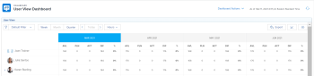

# Overview of the areas of the Resource Planner

By using the Resource Planner,&nbsp;you can&nbsp;easily understand the&nbsp;availability of your resources, as well as the planned time necessary to complete the work on your projects. You can then manage the allocation of your&nbsp;users and their job roles&nbsp;on&nbsp;the projects they are assigned to. You cannot manage the allocation of teams on&nbsp;the tasks they are assigned to in the Resource Planner.&nbsp;

For more information about how to budget your resources using the Resource Planner, see [Resource Planner overview](../../resource-mgmt/resource-planning/get-started-resource-planner.md).

You can find the following areas in the Resource Planner:

* [Timeline of Projects](#timeline-of-projects) 
* [Timeframe Selection](#timeframe-selection) 
* [Project/ Role/ User View Selection](#project-role-view-selection) 
* [Unique URL for the User View](#unique-url) 
* [Project Name](#project-name) 
* [Project Planning Priority](#project-planning-priority) 
* [Job Role Name](#job-role-name) 
* [Project and Role Options](#project-role-options) 
* [User Name](#user) 
* ["No Role" and "No User" Sections](#no-role-and-no-user-sections) 
* [Availability and Allocation of Resources](#availability-and-allocation-of-resources) 
* [Filters](#filters) 
* [Settings](#settings) 
* [Full Screen Option](#full-screen-option) 
* [Hours/ FTE/ Cost View Selection](#display-by-hour-or-fte-menu) 
* [User Allocation Chart](#user-allocation-chart) 
* [Export Option](#export-option)

##  Timeline of Projects

Use the calendar at the top of the Resource Planner to navigate the&nbsp;timeline of the projects you are viewing. The timeline starts with today's month, by default.  
For more information about&nbsp;changing the timeframe of the timeline you are displaying in the Resource Planner, see [Timeframe Selection](#timeframe-selection).

##  Timeframe Selection

By default, the Resource Planner shows resource information for three or four months at a time, starting with the current month. The number of time periods displayed depends on the width of your screen.&nbsp;You cannot display more than four time periods in the Resource Planner.

   
You can select from the following date range options in the Resource Planner by clicking the appropriate buttons:

* `Week` to display information by week.
* `Month` to display information by month.
* `Quarter` to display information by quarter.
* `Today` to return to today's month, week, or quarter.  
  By clicking the back and forward arrows you can move backwards and forwards on the timeline.

## Project/ Role/ User View Selection

You can change the view in the Resource Planner depending on how you want the information to display.

By default, the Resource Planner displays in the User view. If you change it to another view, your choice becomes your default view.&nbsp;

When you change the view, the following information also changes:

* The object hierarchy (information in the rows of the Resource Planner). 
* The hour allocation information (information in the columns of the Resource Planner).&nbsp;

For more information about what columns you see in the Resource Planner depending on which view you select, see [Availability and Allocation of Resources](#availability-and-allocation-of-resources). 
In order to display accurate information in the Resource Planner, you must meet the prerequisites for working with the Resource Planning tools. For more information about the prerequisites that must be met, see the "Understanding Prerequisites for Resource Planning" section in [Get started with Resource Planning](../../resource-mgmt/resource-planning/get-started-resource-planning.md).  To change the view in the Resource Planner:

1. Go to the `Resource Planner`.  
   For more information about accessing the Resource Planner, see the "Accessing the Resource Planner" section in [Resource Planner overview](../../resource-mgmt/resource-planning/get-started-resource-planner.md).  

1. In the `View by`&nbsp;drop-down menu, select one of the following views:

  * [View by Project](#view-by-project-subsection)
  * [View by Role](#view-by-role-subsection)
  * [View by User](#view-by-user-subsection)

   By default, the Resource Planner displays in the User view.

### View by Project

Consider the following when selecting the Project view in the Resource Planner:&nbsp;

<ul> 
 <li>You can see projects for which you are designated as the Resource Manager in the Project view of the Resource Planner.</li> 
 <li>You can see projects in all statuses in the Resource Planner. Filter the project list by Project Status to see projects that are current, for example.  For more information about filtering information in the Resource Planner, see <a href="../../resource-mgmt/resource-planning/filter-resource-planner.md" class="MCXref xref">Filter information in the Resource Planner</a>.</li> 
 <li> The number of items you display or can export from the Project view is limited, to improve performance. For more information about limitations when viewing the Resource Planner in the Project view, see the "Project View" section in <a href="../../resource-mgmt/resource-planning/resource-planner-display-limitations.md" class="MCXref xref">Resource Planner display limitations</a>.&nbsp; </li> 
 <li> The projects are listed in the order of their priority in the Project view. For more information about project priority in the Resource Planner, see <a href="#project-planning-priority" class="MCXref xref">Project Planning&nbsp;Priority</a>.</li> 
 <li> When this view is applied, the Role Hours, FTE or Cost add up to the Project&nbsp;Hours, FTE or Cost. </li> 
</ul>

###  View by Role

Consider the following when selecting the Role view in the Resource Planner:&nbsp;

<ul> 
 <li>You can see roles that are associated with projects for which you are designated as the Resource Manager in the Role view of the Resource Planner.</li> 
 <li>You can expand each role to display a list of projects, and every project to display a list of users that can fulfill those roles on the projects.&nbsp;</li> 
 <li> The number of items you display or can export from the Role view is limited, to improve performance. For more information about limitations when viewing the Resource Planner in the Role view, see the "Role View" section in <a href="../../resource-mgmt/resource-planning/resource-planner-display-limitations.md" class="MCXref xref">Resource Planner display limitations</a>.&nbsp; </li> 
 <li> The projects are listed under the job role in the same order of priority as they are listed in the Project view.&nbsp; </li> 
 <li> When this view is applied, the Project&nbsp;Hours, FTE or Cost add up to the Role&nbsp;Hours, FTE or Cost. </li> 
</ul>

###  View by User

You can display the Resource Planner in the User view to understand the difference between the Planned and the Available Hours or FTE for your users.&nbsp;

You cannot budget your resources when applying the User view to the Resource Planner. You must budget your resources using the ``Project or Role ``views, and use the User view to review your users' allocation and availability in relation to the planned work.*&nbsp;*

The User view is the default view of the Resource Planner.&nbsp;&nbsp;

Consider the following when selecting the User view in the Resource Planner:&nbsp;

* You do not have to be a Resource Manager on any projects to see information in this view. 
* You can see all the users you have permissions to View, up to 2000 users, that are active and have logged in to `Workfront` at least once.  
  Filter the user list by Team, Job Role, or Pools to see users associated only with those entities.  
  For more information about filtering information in the Resource Planner, see [Filter information in the Resource Planner](../../resource-mgmt/resource-planning/filter-resource-planner.md).

* The number of items you display or can export from the User view is limited, to improve performance.  
  For more information about limitations when viewing the Resource Planner in the User view, see the "User View" section in [Resource Planner display limitations](../../resource-mgmt/resource-planning/resource-planner-display-limitations.md).&nbsp; 

* The projects are listed under the name of the user in the same order of priority as they are listed in the Project view.  
  For more information about project priority in the Resource Planner, see [Project Planning Priority](#project-planning-priority).

* If users have no job role associated with them, the Hours or FTE values are listed under the `No Role` section.&nbsp; 
* When this view is applied, the Project Hours or FTE add up to the User Hours or FTE.  
  You cannot display the allocation and availability of the users by Cost in the User view.  

* Your permissions to projects and tasks determine what is displayed under the names of the users you see in the User view.   
  The following scenarios exist:&nbsp;

  * When you do not have permissions to see projects and the tasks or issues that are assigned to the users displayed in the Resource Planner, those items are listed under the `Inaccessible Items` sections. The `Inaccessible Items` sections replace the Project or Task sections in this case.
  
  * When you do not have permissions to see the projects, but you have access to see the tasks or issues on the projects, the projects, tasks, and issues are listed under the names of the users assigned to them.
  * When you have permissions to see the projects, but not any tasks or issues on the projects, the project name displays, and the tasks and issues are listed under the `Inaccessible Items` section.  
    For more information about permissions in `Adobe Workfront`, see [Overview of sharing permissions on objects in Adobe Workfront](../../workfront-basics/grant-and-request-access-to-objects/sharing-permissions-on-objects-overview.md).

## Unique URL for the User View

`Workfront` can generate a unique URL for the User view of the Resource Planner. You can share this URL with other users by embedding it into a shared dashboard as an External Page or by sending it in other applications.&nbsp;

Consider the following when generating a unique URL for the User view of the Resource Planner:

* You can obtain a unique URL only for the User view. The option to generate a URL does not exist in the Project or Role views.&nbsp;
* You can share the URL with other users, including those with a Work and Review license.  
  They must have access to view other users in order to view them in the User view of the Resource Planner.&nbsp;
* The following information is saved when you share the URL with other users:

  * The type of time periods (week, month, quarter).
  * The filters that you apply.
  * The type of display (Hours or FTE).&nbsp;

To obtain a unique URL in the User view of the Resource Planner and share it with other users:

<ol> 
 <li value="1">Go to the Resource Planner and select View By&nbsp;User.</li> 
 <li value="2">(Optional) Select the timeframe by which you want to view the information in the Resource Planner. Select from the following: 
  <ul>
   <li>Week</li>
   <li>Month</li>
   <li>Quarter</li>
  </ul></li> 
 <li value="3">(Optional) Select whether you want to view the information by FTE or Hours. </li> 
 <li value="4">(Optional) Apply filters to the Resource Planner. For information about applying filters, see&nbsp;<a href="../../resource-mgmt/resource-planning/filter-resource-planner.md" class="MCXref xref">Filter information in the Resource Planner</a>.</li> 
 <li value="5">Click the hyperlink icon. </li> 
 <li value="6">Click Copy URL. This copies the unique URL of the Resource Planner in the User view to your clipboard.&nbsp;</li> 
 <li value="7">(Optional) Do the following: 
  <ol>
   <li value="1">Go to Reporting>Dashboards>New Dashboard>Add External Page.</li>
   <li value="2">Paste the link you copied to your clipboard in the URL field.</li>
   <li value="3">Click Save, then&nbsp;Save + Close.  This will embed the URL into the dashboard and the User view of the Resource Planner displays in a separate dashboard.</li>
  </ol> Or Paste the URL into another application to send it to another user. The user must be logged in to Workfront to view the Resource Planner in the User view. Or Open a new browser tab or window and paste the link you copied, then click Enter on your keyboard to&nbsp;open the Resource Planner in a new tab or window.&nbsp;</li> 
 <li value="8">(Optional) If you embedded the URL into a dashboard, consider adding it to a layout template or share the dashboard with other users. For information about adding dashboards to a layout template, see <a href="../../administration-and-setup/customize-workfront/use-layout-templates/create-and-manage-layout-templates.md" class="MCXref xref">Create and manage layout templates</a>. For information about sharing dashboards, see <a href="../../reports-and-dashboards/dashboards/creating-and-managing-dashboards/share-dashboard.md" class="MCXref xref">Share a dashboard in Adobe Workfront</a>. When viewing the shared URL, users can see the information with the settings that you originally applied to the Resource Planner. </li> 
</ol>

## Project Name

You can see the following projects in the Resource Planner:

* You can see the Project Name in all views of the Resource Planner.&nbsp; 
* Projects you are designated for as a Resource Manager. 
* Projects in any Status.  
  We recommend using filters to reduce the number of projects you display in the Resource Planner.

## Project Planning&nbsp;Priority

Understanding&nbsp;Project Planning Priority is important for defining the order of the projects in the Resource Planner.

By default, the projects are listed in the Resource Planner by taking into consideration the following criteria, in this order:

1. By the&nbsp;Alignment Score on the project.   
   For more information about the Alignment Score of the project, see the [Apply a scorecard to a project and generate an Alignment Score](../../manage-work/projects/define-a-business-case/apply-scorecard-to-project-to-generate-alignment-score.md).

1. By the Planned Start Date of the project (if the Alignment field is null or is the same for several projects). 
1. Alphabetically (if the Alignment field is null or is the same, and the Planned Start date is the same for several projects).

You can manually prioritize your projects in the Resource Planner only when you apply the Project view.&nbsp;

When you apply the Role or User views in the Resource Planner, the projects appear in the same order of priority established in the Project view.

* [Changing the Project Planning Priority](#project-planning-priority-subsection) 
* [Understanding the Effect of Changing the Project Planning Priority on User Available Hours](#effect-of-priority-on-available-hours)

### Changing the Project Planning Priority

As a Resource Manager, you can reorder the projects in the Resource Planner by giving them a priority, when you display the Resource Planner in the Project view. By giving projects a new priority, you can rank them in order of importance.

>[!TIP]
>
>The priority number you give the projects in the Resource Planner is unique to you. Another Resource Manager looking at the same Resource Planner, with the same projects, might have the projects ranked by a different priority order.

You cannot report on the Project Planning&nbsp;Priority field. This is visible just in the Resource Planner and it serves as a flag for prioritizing your projects.&nbsp;

To edit the Project Planning&nbsp;Priority:

<ol> 
 <li value="1"> Go to the Resource Planner. </li> 
 <li value="2"> Click inside the field to the left of the project name which contains&nbsp;a number, enter a number to change Planning Priority, then click Enter.  Or Mouse over the name of the project and click the indicator to the left of the project name, then drag it and drop it in the correct spot, to change the priority.  When you select numbers to prioritize projects, select lower numbers for higher (more important) priorities, and higher numbers for lower (less important) priorities.&nbsp;When you change the priority number of a project to a lower number (higher priority), all other projects in the Resource Planner shift down on the list (become less important). When you change the priority number of a project to a higher number (lower&nbsp;priority), all other projects in the Resource Planner shift up on the list (become more important).</li> 
</ol>

### Understanding the Effect of Changing the Project Planning Priority on User Available Hours

The Project Planning&nbsp;Priority affects the Available Hours of users.&nbsp;The users associated with the project with the highest priority show their fullest availability for the Available Hours (AVL) column for this project.

The same users associated with the&nbsp;second project in order of priority will show an Available Hours value which is the difference between their full amount of Available Hours and what has already been budgeted for the first project in&nbsp;the Budgeted&nbsp;Hours column, and so on. &nbsp;

If no hours have been budgeted for the first project (in order of priority) for a user, but hours have been budgeted for the second&nbsp;project for the same user, the user will show the full amount of available hours for both projects.

We recommend updating the Budgeted Hours column for your users in the order of the projects in the Resource Planner, to ensure that you can accurately see the Available Hours for the user at all times.&nbsp;

>[!TIP]
>
>Because the Project Planning Priority is unique to every Resource Manager, your second priority project might be a first priority project for another Resource Manager. If another Resource Manager budgets a resource for their first project, the Available Hours will decrease for that resource&nbsp;for your first&nbsp;project based on that change.

* The Resource Manager who budgets the hours first allocates that resource and reduces the number of Available Hours&nbsp;for that resource across the system. The amount of Available Hours should update for all the Resource Managers as soon as the Budgeted Hours are saved for a resource in the Resource Planner. &nbsp;  
For more information about Available Hours, see&nbsp; [Availability and Allocation of Resources](#availability-and-allocation-of-resources)*

## Job Role Name

The following categories&nbsp;of job roles are listed&nbsp;in the Resource Planner:&nbsp;

<ul> 
 <li> The job roles that are assigned to tasks. </li> 
 <li> The job roles that are not assigned to tasks, but are the primary job roles of the users&nbsp;associated with the Resource Pools of the projects.&nbsp; </li> 
 <li> The secondary job roles of users who are assigned to tasks in those&nbsp;job roles.&nbsp; </li> 
 <li> The secondary job roles of users who have a valid Percentage of FTE Availability in their profile. For more information about&nbsp;the Percentage of FTE Availability for job roles, see <a href="../../administration-and-setup/add-users/create-and-manage-users/edit-a-users-profile.md" class="MCXref xref">Edit a user's profile</a>. <note type="tip">
    Job roles assigned to issues are also listed when the 
   Include hours from Issue setting is enabled. For more information about enabling issue hours in the Resource Planner, see "
   <a href="#settings" class="MCXref xref">Settings</a>.
  </note></li> 
</ul>

## Project and Role Options&nbsp;

You can use the quick links inside the `Options` menus for projects and job roles to automatically budget allocations for your resources in bulk. Because the quick links allow you to budget hours, they are available only on the Project and Role views.&nbsp;&nbsp;

>[!TIP]
>
>When using the quick links to budget allocations for resources, the budgeting is automatically applied only to the time periods displayed on the screen. If the timeline of a project spans over a period of time longer than the one displayed on your screen, you must scroll from left to right, and then use the quick links to automatically budget your resources.

To access the `Options` menu for projects and job roles displayed in the Resource Planner:

<ol> 
 <li value="1">Go to the Resource Planner. For more information about accessing the Resource Planner, see the&nbsp;"Accessing the Resource Planner" section in <a href="../../resource-mgmt/resource-planning/get-started-resource-planner.md" class="MCXref xref">Resource Planner overview</a>. The projects for which you are a Resource Manager display in the list, by default.&nbsp;</li> 
 <li value="2">(Optional) Expand each project to see a list of job roles associated with it. Or</li> 
 <li value="3">(Optional) Select View by Role, then expand each role to see a list of projects associated with it.&nbsp;</li> 
 <li value="4">Mouse over the name of a project or of a job role.</li> 
 <li value="5">Click the Options icon which displays to the far right of the project or role. </li> 
 <li value="6">Click an option to automatically specify the amount of Budgeted Hours (BDG), to access the project, or to review whether you can adjust the budgeting dates of the project.</li> 
</ol>

Depending on what view you apply to the Resource Planner, the `Options` menus for project and job roles change.  
For more information about what displays in the Resource Planner based on the view you select, see [Project/ Role/ User View Selection](#project-role-view-selection) [Project/ Role/ User View Selection](#project-role-view-selection).&nbsp;

>[!TIP]
>
>Some of the options might not display if some of the prerequisites of working in the Resource Planner are missing.   
>For example, some of the options might not display in the following scenarios:

* *When projects are not associated with Resource Pools.* 
* *When Resource Pools that are associated with projects do not contain users.* 
* *When Resource Pools that are associated with projects contain users with no job role associated with them.*

For more information about the prerequisites that must be met for accurate budgeting in the Resource Planner, see the "Understanding Prerequisites for Resource Planning" section in [Get started with Resource Planning](../../resource-mgmt/resource-planning/get-started-resource-planning.md).

The following information displays in the `Options` menus of projects and roles based on what view you select for the Resource Planner:&nbsp;

<table cellspacing="15"> 
 <col> 
 <col> 
 <col> 
 <tbody> 
  <tr> 
   <td>&nbsp;</td> 
   <td>Project View </td> 
   <td>Role View </td> 
  </tr> 
  <tr> 
   <td>Project Options</td> 
   <td> 
    <ul> 
     <li>Set Roles' Planned Hours as Budgeted: Select this option to make the Budgeted&nbsp;Hours of the role become identical to their Planned&nbsp;Hours. The total of&nbsp;the Budgeted Hours for the roles will display for the Project Budgeted Hours. </li> 
     <li>Adjust Budgeting Dates : Select this option to move the Budgeted Hours to a different timeframe. For more information about adjusting budgeting dates, see the "Adjusting Budgeted Dates" section in <a href="../../resource-mgmt/resource-planning/get-started-resource-planner.md" class="MCXref xref">Resource Planner overview</a>.</li> 
    </ul> </td> 
   <td> 
    <ul> 
     <li>Set Users' Planned Hours as Budgeted: Select this option to make the Budgeted&nbsp;Hours of the user become identical to the their Planned&nbsp;Hours.&nbsp; </li> 
     <li>Total Users' Budgeted Hours for Project: Select this option&nbsp;to add all the user Budgeted Hours together and&nbsp;display the total as the Budgeted Hours for the project and for the role. We recommend that you use this option after you have either manually&nbsp;budgeted your users, or you have used the previous option first.&nbsp; </li> 
    </ul> </td> 
  </tr> 
  <tr> 
   <td>Role Options</td> 
   <td> 
    <ul> 
     <li>Set Users' Planned Hours as Budgeted: Select this option to make the Budgeted&nbsp;Hours of the user become identical to their Planned&nbsp;Hours.&nbsp; </li> 
     <li>Total Users' Budgeted Hours for Role: Select this option&nbsp;to add all the Budgeted Hours of the user together and&nbsp;display the total as the Budgeted Hours for the role and the project. We recommend that you use this option after you have either manually&nbsp;budgeted your users, or you have used the previous option first.&nbsp; </li> 
    </ul> </td> 
   <td> 
    <ul> 
     <li>Set Projects' Planned Hours as Budgeted: Select this option to make the project Budgeted Hours become identical with the project Planned Hours.&nbsp;&nbsp;</li> 
    </ul> </td> 
  </tr> 
 </tbody> 
</table>

## User Name

The users listed in the Resource Planner belong to&nbsp;the Resource Pools associated with the projects.   
For more information about populating Resource Pools with users, see [Resource pools overview in Adobe Workfront](../../resource-mgmt/resource-planning/resource-pools/work-with-resource-pools.md).

All users that you have access to View and have logged in at least once display in the User view.&nbsp;

In the Project and Role views, users could appear listed under the following types of job roles:

* Their primary job role
* Their secondary job role, in the following scenarios:

  * If the secondary job role has a valid number for the `Percentage of FTE Availability` in their user profile.
  * If the user is assigned to tasks in those roles.

For more information about the  `Percentage of FTE Availability`&nbsp;for a job role, see&nbsp; [Edit a user's profile](../../administration-and-setup/add-users/create-and-manage-users/edit-a-users-profile.md).

##  "No Role" and "No User" Sections

* ["No Role" Section](#no-role-section) 
* ["No User" Section](#no-user-section)

### "No Role" Section

When a user belongs to a Resource Pool associated with a project, but they do not have a job role associated with them, they appear in the `No Role` section, instead of under a specific job role.

You cannot budget hours for a user in a `No Role` section. The user must have at least one job role associated with them to be budgeted for work.  

### "No User" Section

When you assign a task to a team, or you leave it unassigned, the Planned Hours appear under the `No User` section which appears under the `No Role` section in the Resource Planner. These tasks do not appear in the Resource Planner when using the `View by User` view.&nbsp;

You can see the amount of Planned Hours attributed to tasks on the project in the `No User` section in the Resource Planner, but you cannot budget for these allocations.&nbsp;

## Availability and Allocation of Resources

You can see the availability of your resources and the amount of planned work for your projects in the Resource Planner. These values are displayed in&nbsp;Hours, FTE, or Cost amounts and are organized in columns.  
These columns change depending on which view you apply to the Resource Planner:

<ul> 
 <li> When you apply the View by Project or View by Role views, you can see the following columns: 
  <ul>
   <li>Available&nbsp;Hours, FTE, or Cost</li>
   <li>Planned&nbsp;Hours, FTE, or Cost</li>
   <li>Budgeted&nbsp;Hours, FTE, or Cost</li>
   <li>Hours, FTE, or Cost Variance</li>
   <li>Net&nbsp;Hours, FTE, or Cost</li>
  </ul></li> 
 <li> When you apply the View by User view, you can see the following columns: 
  <ul>
   <li> Available Hours or FTE </li>
   <li> Planned Hours or FTE </li>
   <li> Hour or FTE Difference </li>
   <li> Planned Hours Allocation Percentage&nbsp; <note type="tip">
      The information is not available as Cost when applying the 
     View by User view to the Resource Planner.
    </note></li>
  </ul></li> 
</ul>

The hours for each column are distributed for the Duration of the tasks on the project.

The Duration of the tasks is the time between the Planned Start and the Planned Completion dates of the tasks.&nbsp;

For more information about what each column displays, mouse over the name of the column in which the number is displayed.  

For more information about the data displayed in each column, see the&nbsp;"Understanding the Information in the Resource Planner when Budgeting Resources by Hours and FTE" section in [Resource Planner overview](../../resource-mgmt/resource-planning/get-started-resource-planner.md).

>[!TIP]
>
>If any of the prerequisites required for the correct functionality of the Resource Planner are missing, some of the numbers may be zero, or the Budgeted Hours might be dimmed.   
>For&nbsp;more information about the prerequisites that must be met before you can start using the Resource Planner, see the&nbsp; [Get started with Resource Planning](../../resource-mgmt/resource-planning/get-started-resource-planning.md)&nbsp;section in&nbsp; [Get started with Resource Planning](../../resource-mgmt/resource-planning/get-started-resource-planning.md).

## Filters

Using filters, you can limit the information that you see in the Resource Planner.

You can filter the information displayed in the Resource Planner by the following objects and fields:

<ul> 
 <li>Portfolio</li> 
 <li>Project Status</li> 
 <li>Team</li> 
 <li>Job Role</li> 
 <li>Resource Pool </li> 
</ul>

For more information about filtering in the Resource Planner, see&nbsp; [Filter information in the Resource Planner](../../resource-mgmt/resource-planning/filter-resource-planner.md).

## Settings

By accessing the Settings area, you can enable or disable options to&nbsp;display or hide information in the Resource Planner.

You can enable the `Include hours from Issues` setting to display Planned Hours from issues in the Resource Planner. This setting is disabled, by default. &nbsp;

Consider the following when you enable this setting:

<ul> 
 <li> The name of the user assigned to the issues is displayed under the job role associated with them on the issue and you can specify Budgeted Hours for the user and the job role&nbsp; the in the Project and Role views. </li> 
 <li> The issues the users are assigned to are listed under the names of the job roles in the User view. <note type="tip"></note><em> &nbsp;W </em><em>hen the issue Planned Start and Completion Dates are outside the timeline of the project, the Planned Hours for the issue display according to the dates of the issue. For example, if the project timeline is between January and March, but the timeline of the issues is in August, the Planned Hours for the issues appear in the August time period.</em> </li> 
</ul>

##  Full Screen Option

You can display the Resource Planner in full screen, to enlarge the amount of information you can view on the screen.&nbsp;

The option to view information in full screen is available for all views of the Resource Planner.&nbsp;

To display the Resource Planner in full screen:

<ol> 
 <li value="1"> Go to the Resource Planner. </li> 
 <li value="2"> Click the Full Screen icon to view the Resource Planner in full screen.  The Resource Planner expands to occupy your entire browser window and the icon changes into a Close the Full Screen view option.&nbsp; </li> 
 <li value="3"> (Optional) Click the Close Full Screen icon to revert to the previous display.&nbsp; </li> 
</ol>

##  Hours/ FTE/ Cost View Selection

The type of information displayed is different depending on which view you apply to the Resource Planner.&nbsp;

You can select from the following:

* When you display the Resource Planner in the Role and Project view, the information displays in Hours, FTE, or Cost values. 
* When you display the Resource Planner in the User view, the information displays in Hours or FTE values.  
  Hours are displayed by default for all views. `(some of the information in this area is also covered in Calculating Costs in the RP - https://workfront.zendesk.com/hc/en-us/articles/115004186433 - update this article also, when changes here occur)`

To change the kind of information displayed in the Resource Planner:

<ol> 
 <li value="1"> Go to the Resource Planner. For more information about accessing the Resource Planner, see <a href="#accessing-the-resource-planner" class="MCXref xref">Overview of the areas of the Resource Planner</a>. </li> 
 <li value="2"> Expand the Hours drop-down menu. </li> 
 <li value="3"> Select Hours to display availability and allocation information in Hours. </li> 
 <li value="4">Select FTE to display availability and allocation information in FTE. For more information about how the FTE is calculated in the Resource Planner, see <a href="#calculating-fte-in-the-rp" class="MCXref xref">Overview of the areas of the Resource Planner</a>.</li> 
 <li value="5">(Conditional) If you are viewing the Resource Planner in the Project or Role views, select Cost to display availability and allocation information as Cost. The information displays values of the system currency.&nbsp;Your system administrator defines the system currency. For more information about setting up the system currency in Workfront, see <a href="../../administration-and-setup/manage-workfront/exchange-rates/set-up-exchange-rates.md" class="MCXref xref">Set up exchange rates</a>. <note type="tip">
    You must associate users and job roles with Cost per Hour rates in order to display Cost information in the Resource Planner.
  </note> <em>For more information about associating Cost per Hour rates with job roles, see <a href="../../administration-and-setup/set-up-workfront/organizational-setup/create-manage-job-roles.md" class="MCXref xref">Create and manage job roles</a>.</em> <em>For more information about associating Cost per Hour rates with users, see <a href="../../administration-and-setup/add-users/create-and-manage-users/edit-a-users-profile.md" class="MCXref xref">Edit a user's profile</a>. </em>For more information about how Cost is calculated in the Resource Planner, see <a href="../../resource-mgmt/resource-planning/calculate-costs-resource-planner.md" class="MCXref xref">Calculate costs in the Resource Planner </a>.</li> 
</ol>

## User Allocation Chart

You can display the Planned Allocation of users against their availability in a chart.

To display the allocation of users in a chart in the Resource Planner:

<ol> 
 <li value="1">Go to the Resource Planner.</li> 
 <li value="2">Select View by User. <note type="tip">
    You cannot view the user allocation chart when you select 
   View by Project or 
   View by Role.
  </note></li> 
 <li value="3">Click the user allocation chart icon.  The following information is displayed: 
  <ul>
   <li>Availability % with no overallocation for all users: this is the amount of time that all users are available for work in a time period, shown as a percentage from their total available time.&nbsp;</li>
   <li>Overallocation % for all users: this is the amount of time that users are overallocated in a time period, shown as a percentage from the total available time. <note type="tip">
      An overallocation happens when the Planned Hours are higher than the Available Hours.&nbsp;
    </note></li>
   <li>Underutilization % for all users: this is the amount of time that users are underutilized in a time period, shown as a percentage from the total available time. <note type="tip">
      Underutilization happens when the Planned Hours are lower than the Available Hours.&nbsp;
    </note></li>
   <li>There is an overallocation for at least one user during this time period: this indicates that there is an overallocation for at least one user in a time period, although the total amount of time of all users is not overallocated for the time period. You must scroll through the list of users and the hours for the user who is overallocated are highlighted in red. </li>
  </ul></li> 
 <li value="4">(Optional) Click the Overallocation % for all users area in the chart. All users that are overallocated are highlighted in red.</li> 
 <li value="5">(Optional) Click the Underutilization % for all users area in the chart. All users that are underutilized are highlighted in blue.</li> 
 <li value="6">(Optional) Click the indicator that shows where you have at least one user overallocated.  The users that are overallocated are highlighted in red.&nbsp;&nbsp;</li> 
 <li value="7">(Optional) Refresh the page to collapse the chart.&nbsp;</li> 
</ol>

## Export Option

You can export information to an Excel (.xlsx) file from any view of the Resource Planner.&nbsp;

The information is structured differently according to which view you select before exporting it.  
For information about what information you can export from the Resource Planner in each view, see [Resource Planner display limitations](../../resource-mgmt/resource-planning/resource-planner-display-limitations.md).

To export the information in the Resource Planner:

<ol> 
 <li value="1"> Go to the Resource Planner. For more information about accessing the Resource Planner, see&nbsp;<a href="../../resource-mgmt/resource-planning/get-started-resource-planner.md" class="MCXref xref">Resource Planner overview</a>&nbsp;in the article&nbsp;<a href="../../resource-mgmt/resource-planning/get-started-resource-planner.md" class="MCXref xref">Resource Planner overview</a>. </li> 
 <li value="2"> From any of the views of the Resource Planner, click Export. 
  

   
  
</li> 
 <li value="3">Specify the following: 
  <ul> 
   <li>Start Date: Indicates the start date of your export. The exported file contains allocation and availability information starting with the date specified here.&nbsp; </li> 
   <li>Number of Periods: Indicates how many time periods you want to include in your report. The default is four periods, which is also the maximum number of time periods that you can include in an export.&nbsp; </li> 
   <li>Type: Indicates whether you are exporting information displayed by weeks, months, or quarters.&nbsp; </li> 
  </ul> </li> 
 <li value="4">Click Export&nbsp;to downloads an Excel (.xlsx) file to your computer.&nbsp;  Or   (Conditional) If you have unsaved Budgeted Hours in the Role or Project views, click Save and Continue, then the Excel (.xlsx) file is exported to your computer. Only the information that you saved is exported. </li> 
 <li value="5"> (Optional) Share the file with another user by attaching it to an email, storing it on a shared drive, or print the file from your Excel application.&nbsp; </li> 
</ol>

`***`

`ALWAYS READ THESE NOTES FOR 2018 - THERE ARE MODIFICATIONS FOR EACH BETA CAPTURED IN HERE:`

`&#42;&#42;&#42; This links to Planning in the Resource Planner, Calculating Costs in the Resource Planner, Understanding Project Priority, ` `Understanding Limitations in Displaying Information in the Resource Planner (when this one is deleted, updated this article, as well)`` . `

`*** Some pink caveats in this article will have to be removed when the performance is corrected and other features are added - later in 2018`

`^^^^^ READ ALL PINK NOTES WITH EVERY PRODUCTION RELEASE AND REMOVE THE CAVEATS FOR PRODUCTION/ PREVIEW.^^^^^` 
