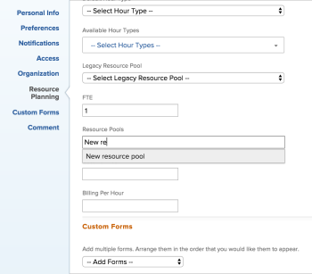
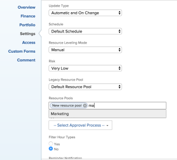

#  Resource pools overview in *Adobe Workfront*

As a resource manager, you can manage your resources by adding users to resource pools.

Efficient resource management cannot happen without populating your Resource Pools with users and attaching them to projects. This a prerequisite for using the Resource Planning functionality.

For more information about the prerequisites needed before you can start using Resource Planning, see the "Prerequisites for working in the *Resource Planner*" section in [Resource Planner overview](../../../resource-mgmt/resource-planning/get-started-resource-planner.md).

For information about creating and managing resource pools, see the following articles:

* [Create resource pools in Adobe Workfront](../../../resource-mgmt/resource-planning/resource-pools/create-resource-pools.md) 
* [Associate resource pools with projects and templates in Adobe Workfront](../../../resource-mgmt/resource-planning/resource-pools/associate-resource-pools-with-projects-and-templates.md) 
* [Associate resource pools with users in Adobe Workfront](../../../resource-mgmt/resource-planning/resource-pools/associate-resource-pools-with-users.md) 
* [Remove users from resource pools in Adobe Workfront](../../../resource-mgmt/resource-planning/resource-pools/remove-users-from-resource-pool.md)

<!--

<h2>Access requirements</h2>

You must have the following:

<table cellspacing="0">
<col>
<col>
<tbody>
<tr>
<td role="rowheader"><em>Adobe Workfront</em> plan*</td>
<td> 
<em>Pro</em> and higher
 </td>
</tr>
<tr>
<td role="rowheader"><em>Adobe Workfront</em> license*</td>
<td> 
<em>Plan</em> 
 </td>
</tr>
<tr>
<td role="rowheader">Access level configurations*</td>
<td> 
Edit access to&nbsp;Resource Management that includes access to Manage Resource Pools
 
Edit access to Projects, Templates, and Users
 <note type="note">
If you still don't have access, ask your
<em>Workfront administrator</em> if they set additional restrictions in your access level. For information on how a
<em>Workfront administrator</em> can change your access level, see
<a href="../../../administration-and-setup/add-users/configure-and-grant-access/create-modify-access-levels.md" class="MCXref xref">Create or modify custom access levels</a>.
</note> </td>
</tr> <draft-comment>
<tr data-mc-conditions="">
<td role="rowheader">Object permissions</td>
<td> 
Manage permissions for the projects, templates, and users you associate the Resource Pools with
 
For information on requesting additional access, see <a href="../../../workfront-basics/grant-and-request-access-to-objects/request-access.md" class="MCXref xref">Request access to objects in Adobe Workfront</a>.
 </td>
</tr>
</draft-comment>
<tr data-mc-conditions="">
<td role="rowheader">Object permissions</td>
<td> 
Manage permissions for the projects, templates, and users you associate the Resource Pools with
 
For information on requesting additional access, see <a href="../../../workfront-basics/grant-and-request-access-to-objects/request-access.md" class="MCXref xref">Request access to objects in Adobe Workfront</a>.
 </td>
</tr>
</tbody>
</table>

*To find out what plan, license type, or access you have, contact your <em>Workfront administrator</em>.

-->

## Access requirements

You must have the following:

<table cellspacing="0"> 
 <col> 
 <col> 
 <tbody> 
  <tr> 
   <td role="rowheader"><em>Adobe Workfront</em> plan*</td> 
   <td> 
<em>Pro</em> and higher
 </td> 
  </tr> 
  <tr> 
   <td role="rowheader"><em>Adobe Workfront</em> license*</td> 
   <td> 
<em>Plan</em> 
 </td> 
  </tr> 
  <tr> 
   <td role="rowheader">Access level configurations*</td> 
   <td> 
Edit access to&nbsp;Resource Management that includes access to Manage Resource Pools
 
Edit access to Projects, Templates, and Users
 
Note: If you still don't have access, ask your <em>Workfront administrator</em> if they set additional restrictions in your access level. For information on how a <em>Workfront administrator</em> can change your access level, see <a href="../../../administration-and-setup/add-users/configure-and-grant-access/create-modify-access-levels.md" class="MCXref xref">Create or modify custom access levels</a>.
 </td> 
  </tr> 
  <tr data-mc-conditions=""> 
   <td role="rowheader">Object permissions</td> 
   <td> 
Manage permissions for the projects, templates, and users you associate the Resource Pools with
 
For information on requesting additional access, see <a href="../../../workfront-basics/grant-and-request-access-to-objects/request-access.md" class="MCXref xref">Request access to objects in Adobe Workfront</a>.
 </td> 
  </tr> 
 </tbody> 
</table>

&#42;To find out what plan, license type, or access you have, contact your *Workfront administrator*.

## Overview of Resource Pools

* A Resource Pool is a collection of users that are needed at the same time for the completion of a project.
* A Resource Pool can be shared across multiple projects, programs, or portfolios when it is associated with all the projects in the programs and portfolios. 
* You can either create a Resource Pool and populate it with existing users upon its creation, or you can create the Resource Pool and associate it with an existing user or with a new user as you are creating or editing the user. 
* After you populate your Resource Pools with users, you can associate them with projects and templates, and manage your user allocation to the projects more efficiently. 
* You can associate as many Resource Pools as needed with a project, template, or user.

## Criteria for associating users with a Resource Pool

There are several ways to structure your Resource Pools.

We recommend the following approaches:

* You can have all the users in the same Resource Pool belong to the same team.

  For example, if you want all the users of a Marketing team to be available for a project, you would want a Marketing Resource Pool where you would add all the users in that team. You can then associate the Marketing Resource Pool with the projects the members of that team are assigned to.

* You can have all the users in the same Resource Pool fulfill similar roles, especially if the roles are in high demand and must be budgeted separately.

  For example, you may have external resources that work as Consultants that you want to have available for a project from time to time. You can create a Resource Pool for Consultants that you can attach to your projects, where you can place both users that are internal or external Consultants.

* You can also create Resource Pools by department or cost center. 
* We do not recommend adding all users in the system to one Resource Pools if you have a large number of users, or if you manage resources for a large number of a projects at a time.

<!--

<h2>Create a Resource Pool</h2>
<ol>
<li value="1">Log in as a user who has access to edit Resource Pools. For more information, see <a href="#access-to-edit-resource-pools" class="MCXref xref">Create a Resource Pool</a>.</li>
<li value="2">Click the Main Menu icon  in the upper-right corner of <em>Adobe Workfront</em>.</li>
<li value="3"> <draft-comment>
<MadCap:conditionalText data-mc-conditions="QuicksilverOrClassic.Quicksilver">
Click
Resourcing.
</MadCap:conditionalText>
</draft-comment><MadCap:conditionalText data-mc-conditions="QuicksilverOrClassic.Quicksilver">
Click
Resourcing.
</MadCap:conditionalText></li>
<li value="4"> <draft-comment>
<MadCap:conditionalText data-mc-conditions="QuicksilverOrClassic.Quicksilver">
Click
Resource Pools in the left panel.
</MadCap:conditionalText>
</draft-comment><MadCap:conditionalText data-mc-conditions="QuicksilverOrClassic.Quicksilver">
Click
Resource Pools in the left panel.
</MadCap:conditionalText> </li>
<li value="5">Click New Resource Pool.</li>
<li value="6">Specify the following: 

<table cellspacing="0">
<col>
<col>
<tbody>
<tr>
<td role="rowheader">Name</td>
<td>This is the name of the Resource Pool.</td>
</tr>
<tr>
<td role="rowheader">Description</td>
<td>This is a brief description about this Resource Pool. For example, you can specify for what purpose it should be used.</td>
</tr>
<tr>
<td role="rowheader">(Optional) Pool Members</td>
<td>
 Add users to the Resource Pool individually. Or  To add a large amount of users to the Resource Pool at one time, you can add one of the following entities associated with users. This adds those users to the Resource Pool:
<ul>
<li>Teams: all members of the team are added to the Resource Pool.</li>
<li>Groups: all members of the group are added to the Resource Pool.</li>
<li>Roles: all users associated with that role are added to the Resource Pool.</li>
<li>Companies: all users in the company are added to the Resource Pool.</li>
</ul><note type="tip">
You can only add active users, teams,
roles, or companies.
</note><note type="note">
If a user becomes a member of a group, team, company or is associated with a job role after the group, team, company or job role have been added to the Resource Pool, the new member is not automatically added to the Resource Pool.
 If a user belongs to the team, group, company, and job role you are adding, at the same time, the user is added only once to the Resource Pool.
 Users who are deactivated after having been added to the Resource Pool appear dimmed in the list of users and are marked as being deactivated.
</note>
</td>
</tr>
</tbody>
</table>
</li>
<li value="7"> 
(Optional) Use the Undo link to remove the users added through a group, team, company or job role.
 <note type="note">
There is no limit to how many users you can have in a Resource Pool. However, we recommend not adding too many users to a Resource Pool, as Resource Management could become a challenge otherwise. The list of users only shows the first 2,000 users in the Resource Pool, and they are listed alphabetically.
</note> 
  
 </li>
<li value="8">(Optional) Use the Search option to find a user in the Resource Pool.</li>
<li value="9">Click Create.</li>
</ol>

-->

## Create a Resource Pool

<ol> 
 <li value="1">Log in as a user who has access to edit Resource Pools. For more information, see <a href="#access-to-edit-resource-pools" class="MCXref xref">Create a Resource Pool</a>.</li> 
 <li value="2">Click the Main Menu icon  in the upper-right corner of <em>Adobe Workfront</em>.</li> 
 <li value="3"> <MadCap:conditionalText data-mc-conditions="QuicksilverOrClassic.Quicksilver">
   Click 
   Resourcing. 
  </MadCap:conditionalText></li> 
 <li value="4"> <MadCap:conditionalText data-mc-conditions="QuicksilverOrClassic.Quicksilver">
   Click 
   Resource Pools in the left panel. 
  </MadCap:conditionalText> </li> 
 <li value="5">Click New Resource Pool.</li> 
 <li value="6">Specify the following: 

   <table cellspacing="0">
    <col>
    <col>
    <tbody>
     <tr>
      <td role="rowheader">Name</td>
      <td>This is the name of the Resource Pool.</td>
     </tr>
     <tr>
      <td role="rowheader">Description</td>
      <td>This is a brief description about this Resource Pool. For example, you can specify for what purpose it should be used.</td>
     </tr>
     <tr>
      <td role="rowheader">(Optional) Pool Members</td>
      <td>
 Add users to the Resource Pool individually. Or  To add a large amount of users to the Resource Pool at one time, you can add one of the following entities associated with users. This adds those users to the Resource Pool:
        <ul>
         <li>Teams: all members of the team are added to the Resource Pool.</li>
         <li>Groups: all members of the group are added to the Resource Pool.</li>
         <li>Roles: all users associated with that role are added to the Resource Pool.</li>
         <li>Companies: all users in the company are added to the Resource Pool.</li>
        </ul><note type="tip">
         You can only add active users, teams, 
         roles, or companies.
        </note><note type="note">
          If a user becomes a member of a group, team, company or is associated with a job role after the group, team, company or job role have been added to the Resource Pool, the new member is not automatically added to the Resource Pool. 
          If a user belongs to the team, group, company, and job role you are adding, at the same time, the user is added only once to the Resource Pool.
          Users who are deactivated after having been added to the Resource Pool appear dimmed in the list of users and are marked as being deactivated.
        </note>
</td>
     </tr>
    </tbody>
   </table>
</li> 
 <li value="7"> 
(Optional) Use the Undo link to remove the users added through a group, team, company or job role.
 <note type="note">
    There is no limit to how many users you can have in a Resource Pool. However, we recommend not adding too many users to a Resource Pool, as Resource Management could become a challenge otherwise. The list of users only shows the first 2,000 users in the Resource Pool, and they are listed alphabetically. 
  </note> 
  
 </li> 
 <li value="8">(Optional) Use the Search option to find a user in the Resource Pool.</li> 
 <li value="9">Click Create.</li> 
</ol>

<!--

<h2>Remove users from a Resource Pool</h2>

You can remove users from a Resource Pool when those users are no longer needed in that pool. 

To remove a user from a Resource Pool:

<ol>
<li value="1">Log in as a user who has access to edit Resource Pools. For more information, see the section <a href="#access-to-edit-resource-pools" class="MCXref xref">Create a Resource Pool</a> in this article.</li>
<li value="2"> Click the Main Menu icon  in the upper-right corner of <em>Adobe Workfront</em>.</li>
<li value="3"> <draft-comment>
<MadCap:conditionalText data-mc-conditions="QuicksilverOrClassic.Quicksilver">
Click
Resourcing.
</MadCap:conditionalText>
</draft-comment><MadCap:conditionalText data-mc-conditions="QuicksilverOrClassic.Quicksilver">
Click
Resourcing.
</MadCap:conditionalText> </li>
<li value="4"> <draft-comment>
<MadCap:conditionalText data-mc-conditions="QuicksilverOrClassic.Quicksilver">
Click
Resource Pools in the left panel.
</MadCap:conditionalText>
</draft-comment><MadCap:conditionalText data-mc-conditions="QuicksilverOrClassic.Quicksilver">
Click
Resource Pools in the left panel.
</MadCap:conditionalText> </li>
<li value="5">Select a Resource Pool and click Edit. Or Click the name of a Resource Pool. </li>
<li value="6">Start typing the name of a user that you want to remove in the Search in this Resource Pool field. Or Start typing the name of a company, job role, team, or group, if you want to remove all the users associated with those entities. </li>
<li value="7">Click the 'x' icon at the user level to remove a user from the Resource Pool. They are removed from all the lists they appear in. Or To remove all users associated with a job role, group, team, or company, click Remove at the job role, group, team level, or company level. This removes all the users associated with that job role, group, team, or company from the Resource Pool. </li>
<li value="8">Click Save. </li>
</ol>

-->

## Remove users from a Resource Pool

You can remove users from a Resource Pool when those users are no longer needed in that pool.

To remove a user from a Resource Pool:

<ol> 
 <li value="1">Log in as a user who has access to edit Resource Pools. For more information, see the section <a href="#access-to-edit-resource-pools" class="MCXref xref">Create a Resource Pool</a> in this article.</li> 
 <li value="2"> Click the Main Menu icon  in the upper-right corner of <em>Adobe Workfront</em>.</li> 
 <li value="3"> <MadCap:conditionalText data-mc-conditions="QuicksilverOrClassic.Quicksilver">
   Click 
   Resourcing. 
  </MadCap:conditionalText> </li> 
 <li value="4"> <MadCap:conditionalText data-mc-conditions="QuicksilverOrClassic.Quicksilver">
   Click 
   Resource Pools in the left panel. 
  </MadCap:conditionalText> </li> 
 <li value="5">Select a Resource Pool and click Edit. Or Click the name of a Resource Pool. </li> 
 <li value="6">Start typing the name of a user that you want to remove in the Search in this Resource Pool field. Or Start typing the name of a company, job role, team, or group, if you want to remove all the users associated with those entities. </li> 
 <li value="7">Click the 'x' icon at the user level to remove a user from the Resource Pool. They are removed from all the lists they appear in. Or To remove all users associated with a job role, group, team, or company, click Remove at the job role, group, team level, or company level. This removes all the users associated with that job role, group, team, or company from the Resource Pool. </li> 
 <li value="8">Click Save. </li> 
</ol>

<!--

<h2>Associate Resource Pools with users</h2>

You must have administrative rights to editing users in order to edit or create users.  For more information about the access needed to edit or create users, see <a href="../../../administration-and-setup/add-users/configure-and-grant-access/grant-access-other-users.md" class="MCXref xref">Grant access to users</a>.

<ul>
<li><a href="#associate-pools-with-users-subsections" class="MCXref xref">Associate Resource Pools with one user</a> </li>
<li><a href="#resource-pools-with-users-in-bulk" class="MCXref xref">Associate Resource Pools with users in bulk</a> </li>
</ul>
<h3>Associate Resource Pools with one user</h3>

You can associate users with Resource Pools when you are creating your Resource Pools.  For more information about creating a Resource Pool, see the section <a href="#creating-a-resource-pool" target="_blank" rel="noopener noreferrer" class="MCXref xref">Create a Resource Pool</a> in this article.

If you create Resource Pools without populating them with users, you can later associate them with users as you are editing or creating new users. 

The Resource Pools must be created before you can associate them with a user. 

To associate Resource Pools with users:

<ol>
<li value="1">Click the Main Menu icon  in the upper-right corner of <em>Adobe Workfront</em>.</li>
<li value="2"> <draft-comment>
<MadCap:conditionalText data-mc-conditions="QuicksilverOrClassic.Quicksilver">
Click
Users.
</MadCap:conditionalText>
</draft-comment><MadCap:conditionalText data-mc-conditions="QuicksilverOrClassic.Quicksilver">
Click
Users.
</MadCap:conditionalText> </li>
<li value="3">Check the box next to the name of a user from the list, then click Edit.</li>
<li value="4">Click Resource Planning.</li>
<li value="5">Start typing the name of a Resource Pool that you want to associate with the user in the Resource Pools field, then select it from the list, when it appears. You can associate multiple Resource Pools with one user.  </li>
<li value="6">Click Save Changes.</li>
</ol>

For more information about editing users, see <a href="../../../administration-and-setup/add-users/create-and-manage-users/edit-a-users-profile.md" class="MCXref xref">Edit a user's profile</a>.

For more information about creating new users, see <a href="../../../administration-and-setup/add-users/create-and-manage-users/add-users.md" class="MCXref xref">Add users</a>.

<h3>Associate Resource Pools with users in bulk</h3>

You can edit multiple users in bulk and associate the same Resource Pools with all of them at the same time. 

To associate Resource Pools with several users in bulk:

<ol>
<li value="1"> Click the Main Menu icon  in the upper-right corner of <em>Adobe Workfront</em>.</li>
<li value="2"> <draft-comment>
<MadCap:conditionalText data-mc-conditions="QuicksilverOrClassic.Quicksilver">
Click
Users.
</MadCap:conditionalText>
</draft-comment><MadCap:conditionalText data-mc-conditions="QuicksilverOrClassic.Quicksilver">
Click
Users.
</MadCap:conditionalText></li>
<li value="3">Select several users on the list, and click Edit.</li>
<li value="4">Click Resource Planning.</li>
<li value="5">Start typing the name of a Resource Pool that you want to associate with the users in the Resource Pools field, then select it from the list, when it appears. You can associate multiple Resource Pools with multiple users. <note type="note">
Only the Resource Pools that are common to all the users selected appear in this field. If the users selected have no shared Resource Pools, this field is empty. If this field is empty, the Resource Pools you specify here will overwrite their individual Resource Pools.
</note>   </li>
<li value="6">Click Save Changes.</li>
</ol>

For more information about how to edit users in bulk, see <a href="../../../administration-and-setup/add-users/create-and-manage-users/edit-user-profiles-in-bulk.md" class="MCXref xref">Edit user profiles in bulk</a>. 

-->

## Associate Resource Pools with users

You must have administrative rights to editing users in order to edit or create users.   
For more information about the access needed to edit or create users, see [Grant access to users](../../../administration-and-setup/add-users/configure-and-grant-access/grant-access-other-users.md).

* [Associate Resource Pools with one user](#associate-pools-with-users-subsections) 
* [Associate Resource Pools with users in bulk](#resource-pools-with-users-in-bulk)

### Associate Resource Pools with one user

You can associate users with Resource Pools when you are creating your Resource Pools.   
For more information about creating a Resource Pool, see the section [Create a Resource Pool](#creating-a-resource-pool) in this article.

If you create Resource Pools without populating them with users, you can later associate them with users as you are editing or creating new users.

The Resource Pools must be created before you can associate them with a user.

To associate Resource Pools with users:

<ol> 
 <li value="1">Click the Main Menu icon  in the upper-right corner of <em>Adobe Workfront</em>.</li> 
 <li value="2"> <MadCap:conditionalText data-mc-conditions="QuicksilverOrClassic.Quicksilver">
   Click 
   Users. 
  </MadCap:conditionalText> </li> 
 <li value="3">Check the box next to the name of a user from the list, then click Edit.</li> 
 <li value="4">Click Resource Planning.</li> 
 <li value="5">Start typing the name of a Resource Pool that you want to associate with the user in the Resource Pools field, then select it from the list, when it appears. You can associate multiple Resource Pools with one user.  </li> 
 <li value="6">Click Save Changes.</li> 
</ol>

For more information about editing users, see [Edit a user's profile](../../../administration-and-setup/add-users/create-and-manage-users/edit-a-users-profile.md).

For more information about creating new users, see [Add users](../../../administration-and-setup/add-users/create-and-manage-users/add-users.md).

### Associate Resource Pools with users in bulk

You can edit multiple users in bulk and associate the same Resource Pools with all of them at the same time.

To associate Resource Pools with several users in bulk:

<ol> 
 <li value="1"> Click the Main Menu icon  in the upper-right corner of <em>Adobe Workfront</em>.</li> 
 <li value="2"> <MadCap:conditionalText data-mc-conditions="QuicksilverOrClassic.Quicksilver">
   Click 
   Users. 
  </MadCap:conditionalText></li> 
 <li value="3">Select several users on the list, and click Edit.</li> 
 <li value="4">Click Resource Planning.</li> 
 <li value="5">Start typing the name of a Resource Pool that you want to associate with the users in the Resource Pools field, then select it from the list, when it appears. You can associate multiple Resource Pools with multiple users. <note type="note">
    Only the Resource Pools that are common to all the users selected appear in this field. If the users selected have no shared Resource Pools, this field is empty. If this field is empty, the Resource Pools you specify here will overwrite their individual Resource Pools.
  </note>   </li> 
 <li value="6">Click Save Changes.</li> 
</ol>

For more information about how to edit users in bulk, see [Edit user profiles in bulk](../../../administration-and-setup/add-users/create-and-manage-users/edit-user-profiles-in-bulk.md).

<!--

<h2>Associate resource pools with projects and templates</h2>

 After you create Resource Pools, you can associate them with projects or templates so you can later budget your resources on the projects. 

You must have the following rights to associate Resource Pools with Projects and Templates: 

<ul>
<li>You must have rights to Edit projects in your access level, as well as Manage permissions on the project in order to edit the project and associate it with Resource Pools.</li>
<li>You must have rights to Edit templates in your access level, as well as Manage permissions on the template in order to edit the template and associate it with Resource Pools.</li>
</ul>

We recommend that you create your Resource Pools in advance, associate them with projects, and budget your resources before the project starts. 

<ul>
<li><a href="#associate-pools-with-one-project" class="MCXref xref">Associate Resource Pools with one project or template</a> </li>
<li><a href="#associate-pools-with-many-projects-and-templates" class="MCXref xref">Associate Resource Pools with several projects or templates in bulk</a> </li>
</ul>
<h3>Associate Resource Pools with one project or template</h3>

 You can associate Resource Pools with a template in the same manner you associate Resource Pools with a project. 

 To associate Resource Pools with a project: 

<ol>
<li value="1"><![CDATA[
]]><![CDATA[
]]><draft-comment>
<MadCap:conditionalText data-mc-conditions="QuicksilverOrClassic.Quicksilver">
Go to a project and click the
Edit icon
in the upper-right corner.
</MadCap:conditionalText>
</draft-comment><MadCap:conditionalText data-mc-conditions="QuicksilverOrClassic.Quicksilver">
Go to a project and click the
Edit icon
in the upper-right corner.
</MadCap:conditionalText></li>
<li value="2"> Click Settings. </li>
<li value="3">Start typing the name of a Resource Pool in the Resource Pools field, then select it from the list when it appears. You can associate multiple Resource Pools with one project or template.   </li>
<li value="4">Click Save Changes.</li>
</ol>

 For more information about how to edit a project and associate it with Resource Pools, see <a href="../../../manage-work/projects/manage-projects/edit-projects.md" class="MCXref xref">Edit projects</a>.

 For more information about how to edit a template and associate it with Resource Pools, see <a href="../../../manage-work/projects/create-and-manage-templates/edit-templates.md" class="MCXref xref">Edit project templates</a>.

<h3>Associate Resource Pools with several projects or templates in bulk</h3>

 You can edit multiple projects or templates in bulk and associate the same Resource Pools with all of them at the same time. 

You can associate Resource Pools with templates in the same manner you associate Resource Pools with projects. 

To associate Resource Pools with several projects in bulk:

<ol>
<li value="1">Go to a list of projects.</li>
<li value="2">Select multiple projects, then click Edit.</li>
<li value="3">Click Settings.</li>
<li value="4"> 
Start typing the name of a Resource Pool in the Resource Pools field, then select it from the list when it appears. You can associate multiple Resource Pools with the projects or templates. 
 <note type="note">
When you edit projects or templates in bulk, only the Resource Pools that are common to all the projects or templates selected appear in this field. If the projects selected have no shared Resource Pools, this field will be empty. The Resource Pools you specify here will overwrite the individual Resource Pools of the projects or templates.
</note> </li>
<li value="5">Click Save Changes.  When your Resource Pools are associated with your projects or your templates, you can budget user allocations for your projects inside the <em>Resource Planner</em>.  For more information about the <em>Resource Planner</em>, see <a href="../../../resource-mgmt/resource-planning/get-started-resource-planner.md" class="MCXref xref">Resource Planner overview</a>.</li>
</ol>

 For more information about how to edit projects in bulk, see the "Edit projects in bulk" section in <a href="../../../manage-work/projects/manage-projects/edit-projects.md" class="MCXref xref">Edit projects</a>.

 For more information about how to edit templates in bulk, see the "Edit templates in bulk" section in <a href="../../../manage-work/projects/create-and-manage-templates/edit-templates.md" class="MCXref xref">Edit project templates</a>.

-->

## Associate resource pools with projects and templates

After you create Resource Pools, you can associate them with projects or templates so you can later budget your resources on the projects.

You must have the following rights to associate Resource Pools with Projects and Templates:

* You must have rights to Edit projects in your access level, as well as Manage permissions on the project in order to edit the project and associate it with Resource Pools.
* You must have rights to Edit templates in your access level, as well as Manage permissions on the template in order to edit the template and associate it with Resource Pools.

We recommend that you create your Resource Pools in advance, associate them with projects, and budget your resources before the project starts.

* [Associate Resource Pools with one project or template](#associate-pools-with-one-project) 
* [Associate Resource Pools with several projects or templates in bulk](#associate-pools-with-many-projects-and-templates)

### Associate Resource Pools with one project or template

You can associate Resource Pools with a template in the same manner you associate Resource Pools with a project.

To associate Resource Pools with a project:

<ol> 
 <li value="1"><![CDATA[
				]]><![CDATA[
			]]><MadCap:conditionalText data-mc-conditions="QuicksilverOrClassic.Quicksilver">
   Go to a project and click the 
   Edit icon 
   in the upper-right corner.
  </MadCap:conditionalText></li> 
 <li value="2"> Click Settings. </li> 
 <li value="3">Start typing the name of a Resource Pool in the Resource Pools field, then select it from the list when it appears. You can associate multiple Resource Pools with one project or template.   </li> 
 <li value="4">Click Save Changes.</li> 
</ol>

For more information about how to edit a project and associate it with Resource Pools, see [Edit projects](../../../manage-work/projects/manage-projects/edit-projects.md).

For more information about how to edit a template and associate it with Resource Pools, see [Edit project templates](../../../manage-work/projects/create-and-manage-templates/edit-templates.md).

### Associate Resource Pools with several projects or templates in bulk

You can edit multiple projects or templates in bulk and associate the same Resource Pools with all of them at the same time.

You can associate Resource Pools with templates in the same manner you associate Resource Pools with projects.

To associate Resource Pools with several projects in bulk:

<ol> 
 <li value="1">Go to a list of projects.</li> 
 <li value="2">Select multiple projects, then click Edit.</li> 
 <li value="3">Click Settings.</li> 
 <li value="4"> 
Start typing the name of a Resource Pool in the Resource Pools field, then select it from the list when it appears. You can associate multiple Resource Pools with the projects or templates. 
 <note type="note">
   When you edit projects or templates in bulk, only the Resource Pools that are common to all the projects or templates selected appear in this field. If the projects selected have no shared Resource Pools, this field will be empty. The Resource Pools you specify here will overwrite the individual Resource Pools of the projects or templates. 
  </note> </li> 
 <li value="5">Click Save Changes.  When your Resource Pools are associated with your projects or your templates, you can budget user allocations for your projects inside the <em>Resource Planner</em>.  For more information about the <em>Resource Planner</em>, see <a href="../../../resource-mgmt/resource-planning/get-started-resource-planner.md" class="MCXref xref">Resource Planner overview</a>.</li> 
</ol>

For more information about how to edit projects in bulk, see the "Edit projects in bulk" section in [Edit projects](../../../manage-work/projects/manage-projects/edit-projects.md).

For more information about how to edit templates in bulk, see the "Edit templates in bulk" section in [Edit project templates](../../../manage-work/projects/create-and-manage-templates/edit-templates.md).
