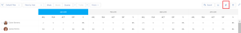

#  Share the *Resource Planner* user view with a link

*Adobe Workfront* can generate a unique URL for the User View of the *Resource Planner* which you can embed into a dashboard as an External Page, or open it separately in a new browser tab.

## Access requirements

You must have the following:

<table cellspacing="0"> 
 <col> 
 <col> 
 <tbody> 
  <tr> 
   <td role="rowheader"><em>Adobe Workfront</em> plan*</td> 
   <td> 
<em>Pro</em> and higher
 </td> 
  </tr> 
  <tr> 
   <td role="rowheader"><em>Adobe Workfront</em> license*</td> 
   <td> 
<em>Plan</em> 
 </td> 
  </tr> 
  <tr> 
   <td role="rowheader">Access level configurations*</td> 
   <td> 
View or higher access to&nbsp;Resource Management, Projects, and Users
 
View access to Financial Data to view cost information 
 
Note: If you still don't have access, ask your <em>Workfront administrator</em> if they set additional restrictions in your access level. For information on how a <em>Workfront administrator</em> can change your access level, see <a href="../../administration-and-setup/add-users/configure-and-grant-access/create-modify-access-levels.md" class="MCXref xref">Create or modify custom access levels</a>.
 </td> 
  </tr> 
  <tr> 
   <td role="rowheader">Object permissions</td> 
   <td> 
View or higher permissions to the projects you want to display in the <em>Resource Planner</em>
 
For information on requesting additional access, see <a href="../../workfront-basics/grant-and-request-access-to-objects/request-access.md" class="MCXref xref">Request access to objects in Adobe Workfront</a>.
 </td> 
  </tr> 
 </tbody> 
</table>

&#42;To find out what plan, license type, or access you have, contact your *Workfront administrator*.
<![CDATA[ ]]>

Consider the following when generating the unique URL for the User View of the *Resource Planner*:

* You can obtain a unique URL only for the User View. The option to generate the URL does not exist in the Project or Role Views. 
* You can share the URL with other users, including Work and Review licensed users.   
  They must have access to view other users in order to view the information in the *Resource Planner* from the URL that you share with them. 

* The following information is saved when you share the URL with other users:

  * The type of time periods (week, month, quarter).
  * The filters that you apply.
  * The type of display (Hours or FTE).

To obtain a unique URL in the User View of the *Resource Planner* and share it with other users:

<ol> <draft-comment>
  <li value="1" data-mc-conditions="QuicksilverOrClassic.Quicksilver">Click the Main Menu icon  in the upper-right corner of <em>Adobe Workfront</em>.</li>
 </draft-comment>
 <li value="1" data-mc-conditions="QuicksilverOrClassic.Quicksilver">Click the Main Menu icon  in the upper-right corner of <em>Adobe Workfront</em>.</li> 
 <li value="2"> <draft-comment>
   <MadCap:conditionalText data-mc-conditions="QuicksilverOrClassic.Quicksilver">
    Click 
    Resourcing.
   </MadCap:conditionalText>
  </draft-comment><MadCap:conditionalText data-mc-conditions="QuicksilverOrClassic.Quicksilver">
   Click 
   Resourcing.
  </MadCap:conditionalText> </li> 
 <li value="3">In the , select View by User.</li> 
 <li value="4">(Optional) Select the timeframe by which you want to view the information in the <em>Resource Planner</em>. Select from the following: 
  <ul>
   <li>Week</li>
   <li>Month</li>
   <li>Quarter</li>
  </ul></li> 
 <li value="5">(Optional) Select whether you want to view the information by FTE or Hours. </li> 
 <li value="6">(Optional) Apply filters to the <em>Resource Planner</em>. For information about applying filters, see <a href="../../resource-mgmt/resource-planning/filter-resource-planner.md" class="MCXref xref">Filter information in the Resource Planner</a> .</li> 
 <li value="7">Click the hyperlink icon. </li> 
 <li value="8">Click Copy URL. This copies the unique URL of the <em>Resource Planner</em> in the User View to your clipboard. </li> 
 <li value="9">(Optional) Do the following: 
  <ol>
   <li value="1">Go to Reporting>Dashboards>New Dashboard>Add External Page.</li>
   <li value="2">Paste the link you copied to your clipboard in the URL field.</li>
   <li value="3">Click Save, then Save + Close. This will embed the URL into the dashboard and the User view of the <em>Resource Planner</em> displays in a separate dashboard.</li>
  </ol> Or Paste the URL into another application to send it to another user. The user must be logged in to <em>Workfront</em> to view the <em>Resource Planner</em> in the User view. Or Open a new browser tab or window and paste the link you copied, then click Enter on your keyboard to open the <em>Resource Planner</em> in a new tab or window. </li> 
 <li value="10">(Optional) If you embedded the URL into a dashboard, consider adding it to a layout template or sharing it with other users who might not have access to the Resource Management area. For information about adding dashboards to a layout template, see <a href="../../administration-and-setup/customize-workfront/use-layout-templates/create-and-manage-layout-templates.md" class="MCXref xref">Create and manage layout templates</a> .  For information about sharing dashboards, see <a href="../../reports-and-dashboards/dashboards/creating-and-managing-dashboards/share-dashboard.md" class="MCXref xref">Share a dashboard in Adobe Workfront</a> .  When viewing the shared URL, users can see the information with the settings that you originally applied to the <em>Resource Planner</em>. They must be logged in to <em>Workfront</em> to view the shared URL. </li> 
</ol>

