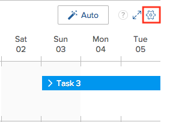
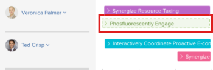
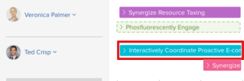

# Automatically assign unassigned tasks and issues in the Scheduling areas

>[!NOTE]
>
>We are no longer developing the Resource Scheduling tools and they will soon be removed from Adobe Workfront. We recommend that you use the Workload Balancer for scheduling your resources. 
>
>For information about scheduling resources using the new Workload Balancer, see the section [The Workload Balancer](../../resource-mgmt/workload-balancer/workload-balancer.md).
>
>For more information about the timeline for removing the Resource Scheduling tools and replacing them with the Workload Balancer, see [Deprecation of Resource Scheduling tools in Adobe Workfront](../../resource-mgmt/resource-mgmt-overview/deprecate-resource-scheduling.md).

You can allow Adobe Workfront to analyze current work assignments across your available users and propose intelligent, logical assignments for any tasks or issues that are not yet assigned. You can modify any proposed assignments prior to finalizing the assignments.

Workfront looks at the tasks and issues available in the Unassigned area within the currently selected date range and proposes assignments for each item at one time. You can create a filter to limit the number of items available in the Unassigned area.

Your system administrator determines how Workfront calculates resource availability at the system level (considering hours as well as FTE availability). Depending on this system-wide setting, resource availability is calculated either using the default schedule or the user's schedule. For more information, see [Configure how Workfront calculates resource hour and FTE availability for the Scheduling area](../../resource-mgmt/resource-scheduling/calculate-hours-fte-scheduling-area.md).

## Access requirements

You must have the following access to perform the steps in this article:

<table cellspacing="0"> 
 <col> 
 <col> 
 <tbody> 
  <tr> 
   <td role="rowheader">Adobe Workfront plan*</td> 
   <td> 
Any
 </td> 
  </tr> 
  <tr> 
   <td role="rowheader">Adobe Workfront license*</td> 
   <td> 
Work or higher
 </td> 
  </tr> 
  <tr> 
   <td role="rowheader">Access level*</td> 
   <td> 
View or higher access to&nbsp;Projects, Tasks, and Issues
 
Note: If you still don't have access, ask your Workfront administrator if they set additional restrictions in your access level. For information on how a Workfront administrator can change your access level, see <a href="../../administration-and-setup/add-users/configure-and-grant-access/create-modify-access-levels.md" class="MCXref xref">Create or modify custom access levels</a>.
 </td> 
  </tr> 
  <tr> 
   <td role="rowheader">Object permissions</td> 
   <td> 
Contribute permissions or higher to the projects, tasks, and issues you update assignments for
 
For information on requesting additional access, see <a href="../../workfront-basics/grant-and-request-access-to-objects/request-access.md" class="MCXref xref">Request access to objects in Adobe Workfront</a>.
 </td> 
  </tr> 
 </tbody> 
</table>

&#42;To find out what plan, license type, or access you have, contact your Workfront administrator.

## Prerequisites

Workfront uses a proprietary algorithm to determine assignment proposals. To facilitate the best results, ensure that the following information is accurate in Workfront:

* Task and issue information, including:

  * Role assignments   
    No proposal is made for tasks and issues that are not assigned to a role.
  * Planned Hours  
    If a task or issue currently has no planned hours, Workfront assumes 4 planned hours per workday when automatically assigning work. These hours are not automatically assigned to the work item; they are used only to ensure more realistic assignment distributions.
  * Planned Start Dates and Planned Completion Dates

* User information, including:

  * Primary and secondary role assignments on the user profile
  * Project team information

## Configure role limits

Role limits control the number of users, with a specific role, who can be assigned work automatically. Role limits work on a per-project basis to ensure role-based tasks are not spread out among a large number of users.

The following scenarios outline how role limits apply to projects:

* `Scenario 1`: If there are no users assigned to the project team, the system uses the role limit to assign tasks.  
  For example, you have a project with no users assigned to the project team. This project has 10 project management tasks that need to be assigned, and you have set a role limit of 1 for the Project Manager role. The system assigns all 10 tasks to 1 project manager because the role limit is set to 1.

* `Scenario 2`: If the role limit is greater than the number of users assigned to the project team, additional users are assigned tasks.  
  For example, you have a project with one writer assigned to the project team. This project has 12 writer tasks that need to be assigned, and you have a role limit of 2 set for the Writer role. The system assigns all 12 tasks between the project team writer and an additional writer because the role limit is set to 2.

* `Scenario 3`: If the role limit is less than the number of users assigned to the project team, the role limit is overridden.  
  For example, you have a project with 4 designers assigned to the project team. This project has 8 designer tasks that need to be assigned, and you have set a role limit of 2 for the Designer role. The system assigns all 8 tasks between each of the 4 project team designers even though the role limit is set to 2.

To set limits for job role assignments:

<ol> 
 
Go to the scheduling timeline for multiple projects or for an individual project:
 
 <ul> 
  <li> 
<b>For multiple projects</b>:&nbsp; Click the Main Menu icon in the upper-right corner of Workfront, click Resourcing > Workload Balancer, then select Scheduling in the upper-left drop-down menu.
 </li> 
  <li> 
<b>For an individual project</b>: Go to a project, click the Workload Balancer section in the left panel, then select Scheduling from the upper-left drop-down menu.
 </li> 
 </ul> 
 <li value="1">Click the Settings icon. </li> 
 <li value="2">In the Automated Resource Scheduling section, click in the Limit column inline with the item in the Role column and enter a positive number. Workfront automatically saves your changes.  <note type="note">  All current project team members are automatically eligible for all recommended work regardless of the role limit set. 
  </note> </li> 
 <li value="3">(Optional) Click the Showing menu at the top of the Limit column and select the desired display options.</li> 
 <li value="4">To go back to the resource scheduling area, click Return to Scheduling.</li> 
</ol>

## Automatically assign tasks and issues

You can assign tasks and issues to users on the scheduling timeline whether you are on the Scheduling tab (when scheduling resources for multiple projects) or the Staffing tab (when scheduling resources for an individual project).

To allow Workfront to automatically propose assignments for tasks and issues in the Unassigned area:

<ol> 
 <li value="1"> 
Go to the scheduling timeline for multiple projects or for an individual project:
 
  <ul> 
   <li> 
<b>For multiple projects</b>:&nbsp; Click the Main Menu icon in the upper-right corner of Workfront, click Resourcing > Workload Balancer, then select Scheduling in the upper-left drop-down menu.
 </li> 
   <li> 
<b>For an individual project</b>: Go to a project, click the Workload Balancer section in the left panel, then select Scheduling from the upper-left drop-down menu.
 </li> 
  </ul> </li> 
 <li value="2"> 
(Optional) Create a filter to customize what content is displayed in the Unassigned area on the scheduling timeline. For more information about creating a filter, see <a href="../../resource-mgmt/resource-scheduling/filter-scheduling-area.md#creating-and-modifying-filters-on-the-scheduling-tab-for-projects" class="MCXref xref">Filter information in the Scheduling area</a> in <a href="../../resource-mgmt/resource-scheduling/filter-scheduling-area.md" class="MCXref xref">Filter information in the Scheduling area</a><a href="../../resource-mgmt/resource-scheduling/filter-scheduling-area.md" class="MCXref xref">Filter information in the Scheduling area</a>
 
  
Tip: </b>"> <b>Tip: </b> 
   
To ensure that Workfront assigns work to the most eligible users:
 
   <ul> 
    <li>Filter only information that affects which tasks are displayed in the Unassigned area (such as Portfolios, Programs, an Projects). </li> 
    <li>We recommend that you do not filter information that affects which users are available to assign on the scheduling timeline. Doing so limits Workfront from viewing all potential assignees, which can result in less satisfactory assignments.</li> 
   </ul> 
  
 </li> 
 <li value="3">(Optional) Modify the date range that is displayed on the scheduling timeline, as described in <a href="../../resource-mgmt/resource-scheduling/get-started-resource-scheduling.md#adjusting-the-date-range-for-which-data-is-displayed" class="MCXref xref">Adjust the date range of the Scheduling areas</a> in <a href="../../resource-mgmt/resource-scheduling/get-started-resource-scheduling.md" class="MCXref xref">Get started with Resource Scheduling</a>. Workfront makes assignments only for tasks and issues within the visible date range on the scheduling timeline.</li> 
 <li value="4"> 
Click the Auto button in the upper-right corner of the scheduling timeline.  Workfront proposes assignments for each task or issue in the Unassigned area. 
 <note type="tip">
   Tasks and issues must already be assigned to a role in order for an assignment to be proposed. To ensure the best results, tasks and issues should contain the information described in 
   <a href="#prerequisites" class="MCXref xref">Prerequisites</a>.
  </note> 
Proposed assignments are differentiated with a dotted outline around each task or issue, as follows: Proposed task assignment:
 
 
 
Existing task assignment: 
 
 
 </li> 
 <li value="5">(Optional) You can modify any proposed or existing assignments prior to finalizing the assignments:  <note type="note">  If you modify an existing assignment, it changes to a proposed state. 
  </note>  
  <ul> 
   <li>To assign an item to a different user: 
    <ul> 
     <li>Drag the task or issue from the proposed user to the row of a different user you want to assign. A maximum of 10 tasks per day are displayed for a given user. You can expand the list to view all tasks currently assigned to that user. (After making assignments on the scheduling timeline, more than 10 tasks might be temporarily displayed.) As you drag an item, the following information is displayed prior to releasing the task or issue and completing the assignment: 
      <ul> 
       <li>A drop indicator is displayed in the row of the user. This enables you to see where an item is being assigned prior to making the assignment.</li> 
       <li>If user allocations are enabled on the scheduling timeline, the red overallocation indicators are displayed if completing the assignment will result in the user being overallocated. For more information about overallocation indicators, see <a href="../../resource-mgmt/resource-scheduling/manage-allocations-scheduling-areas.md#understanding-allocation-indicators" class="MCXref xref">Allocation indicators</a>.</li> 
       <li>Users who are not eligible to receive the assignment are dimmed.</li> 
      </ul></li> 
     <li>Expand the task or issue you want to assign, click the drop-down arrow in the Assignments field, begin typing the name of the user you want to assign, then click the user's name in the drop-down list. </li> 
    </ul></li> 
   <li>To postpone making an assignment, drag any task or issue that you are not yet ready to assign back to the Unassigned area.</li> 
  </ul></li> 
 <li value="6">Click the Make Assignments button at the top of the scheduling timeline to finalize any proposed assignments. Or Click Cancel to return all proposed assignments to their former positions.</li> 
</ol>

