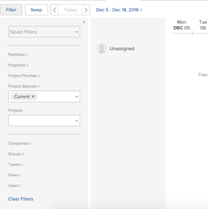

# Filter information in the Scheduling area

>[!NOTE]
>
>We are no longer developing the Resource Scheduling tools and they will soon be removed from Adobe Workfront. We recommend that you use the Workload Balancer for scheduling your resources. 
>
>For information about scheduling resources using the new Workload Balancer, see the section [The Workload Balancer](../../resource-mgmt/workload-balancer/workload-balancer.md).
>
>For more information about the timeline for removing the Resource Scheduling tools and replacing them with the Workload Balancer, see [Deprecation of Resource Scheduling tools in Adobe Workfront](../../resource-mgmt/resource-mgmt-overview/deprecate-resource-scheduling.md).

Using a filter in the Resource Scheduling area enables you to determine which work items are&nbsp;displayed on the scheduling timeline. This includes which tasks and issues are displayed in the Unassigned area, as well as which users are displayed.&nbsp;

Before you begin filtering content as&nbsp;described in this section, become familiar with how resource scheduling works in Adobe Workfront.  
For information about resource scheduling in Workfront, see the article [Get started with Resource Scheduling](../../resource-mgmt/resource-scheduling/get-started-resource-scheduling.md).  
For more information about the scheduling timeline, see the article [Get started with Resource Scheduling](../../resource-mgmt/resource-scheduling/get-started-resource-scheduling.md).

You can&nbsp;schedule resources or an individual team you are a member of or for any projects for which you are the Resource Manager.

## Access requirements

You must have the following:

<table cellspacing="0"> 
 <col> 
 <col> 
 <tbody> 
  <tr> 
   <td role="rowheader">Adobe Workfront plan*</td> 
   <td> 
Any
 </td> 
  </tr> 
  <tr> 
   <td role="rowheader">Adobe Workfront license*</td> 
   <td> 
Work or higher
 </td> 
  </tr> 
  <tr> 
   <td role="rowheader">Access level*</td> 
   <td> 
View access or higher to Projects, Tasks,&nbsp;and Issues
 
Note: If you still don't have access, ask your Workfront administrator if they set additional restrictions in your access level. For information on how a Workfront administrator can change your access level, see <a href="../../administration-and-setup/add-users/configure-and-grant-access/create-modify-access-levels.md" class="MCXref xref">Create or modify custom access levels</a>.
 </td> 
  </tr> 
  <tr> 
   <td role="rowheader">Object permissions</td> 
   <td> 
View permissions or higher to projects, tasks, and issues
 
For information on requesting additional access, see <a href="../../workfront-basics/grant-and-request-access-to-objects/request-access.md" class="MCXref xref">Request access to objects in Adobe Workfront</a>.
 </td> 
  </tr> 
 </tbody> 
</table>

&#42;To find out what plan, license type, or access you have, contact your Workfront administrator.
Create a filter in the Schedule section (for Teams) Tasks and issues from the projects, users, and roles you define in the filter are displayed on the scheduling timeline on the Working On tab. Use the options in the filter to determine which projects, users, and roles are represented on the scheduling timeline.

>[!NOTE]
>
>You cannot save a filter in the Working On Tab (for a team). When you refresh the page or navigate away from it, the filter reverts to the default settings.

To create a filter for the scheduling timeline on the Working On tab for teams:

1. Click the Main Menu icon in the upper-right corner of Workfront, then click Teams, select a team, click Workload Balancer in the left panel, then select Scheduling from the upper-left drop-down menu. 
1. Click `Filter`.
1. Determine which projects are represented in the Unassigned area by specifying the following information:  
   `Project Priorities:`&nbsp;Select the priority of the projects that you want to&nbsp;be represented on the scheduling timeline. Tasks and issues from projects with the priorities you select are&nbsp;displayed on the scheduling timeline.  
   Only priorities from projects that include tasks or issues that are assigned to the team are available to choose from this menu.  
   `Project Statuses:`&nbsp;Select the status of the projects that you want to be represented on the scheduling timeline. Tasks and issues from projects with the statuses&nbsp;you select are displayed&nbsp;on the scheduling timeline.  
   Only statuses&nbsp;from projects that include tasks or issues that are assigned to the team are available to choose from this menu.  
   `Projects:` Select any projects that you want to be represented on the scheduling timeline. Tasks and issues from the projects you select are displayed on the scheduling timeline.  
   Your selections in the previous fields determine the projects that are available to select.   
   Only projects that include tasks or issues that are assigned to the team are available to choose from this menu.

1. Determine which users are displayed on the scheduling timeline by specifying the following information. By default, all team members are displayed.  
   `Roles:`&nbsp;Select the roles&nbsp;you want to be represented&nbsp;on the scheduling timeline.  
   Only tasks that are assigned to that role are displayed in the Unassigned area. Only users with the roles&nbsp;you select who are able to be assigned those tasks are displayed.  
   Users are displayed on the scheduling timeline, organized by job role.  
   `Users:`&nbsp;Select the individual users&nbsp;you want to be represented&nbsp;on the scheduling timeline.  
   Only the users you select are displayed, regardless of whether they have a role assignment that matches the role assignment of tasks in the Unassigned area.  
   This option does not affect which&nbsp;tasks and issues are displayed in the Unassigned area.   

1. (Optional) To make further modifications to the scheduling timeline (such as changing the date range), and to make modifications to user assignments, see the article [Manually assign unassigned tasks and issues in the Scheduling areas](../../resource-mgmt/resource-scheduling/manually-assign-items-scheduling-areas.md).

Create and modify filters in the Scheduling section (for multiple projects) You can create a new filter, apply a filter that you previously created, modify a filter that you previously created, or delete a filter. You cannot share filters you create with other users.

* Create a filter in the Scheduling section (for projects) 
* [Apply a saved filter](#applying-a-saved-filter) 
* [Modify a saved filter](#modifying-an-existing-filter) 
* [Delete a saved filter](#deleting-a-filter)

Create a filter in the Scheduling section (for projects) Tasks and issues from the projects, users, and roles you define in the filter are displayed on the scheduling timeline on the Scheduling tab. Use the options in the filter to determine which projects, users, and roles are represented on the scheduling timeline.

To create a filter for the scheduling timeline on the Scheduling&nbsp;tab for multiple projects:

<ol> 
 <li value="1"> 
 Click the Main Menu icon in the upper-right corner of Workfront, click Resourcing > Workload Balancer, then select Scheduling in the upper-left drop-down menu. 
 </li> 
 <li value="2">Click Filter. </li> 
 <li value="3">Leave the Saved Filters field blank.</li> 
 <li id="project-filters" value="4">Determine which projects are represented in the Unassigned area by specifying the following information: Portfolios:&nbsp;Select any portfolios that include programs and projects that you want to be represented on the scheduling timeline.  Only programs within the portfolios you select are available to select&nbsp;in the Program field. Programs:&nbsp;Select any programs that&nbsp;include projects that you want to be represented on the scheduling timeline.  Your selections in the Portfolio field determine the programs that are available to select.  Only projects within the programs you select are available to select&nbsp;in the Projects field. Project Priorities: Select the priority of the projects that you want to&nbsp;be represented on the scheduling timeline.  Only projects with the priorities you select are represented. Project Statuses:&nbsp;Select the status of the projects that you want to be represented on the scheduling timeline.  Only projects with the statuses&nbsp;you select are represented. Project Companies:&nbsp;Tasks and issues are displayed on the scheduling timeline only when they belong to a project that matches a company you select. Project&nbsp;Groups:&nbsp;Tasks and issues are displayed on the scheduling timeline only when they belong to a project that matches a group you select. Projects: Select any projects that you want to be represented on the scheduling timeline.&nbsp;Tasks and issues from the projects you select are displayed on the scheduling timeline. Your selections in the previous fields determine the projects that are available to select.  Tasks and issues from the projects you select are displayed on the scheduling timeline. Only projects that include tasks or issues that are assigned to the team are available to choose from this menu.</li> 
 <li id="user-filters" value="5">Determine which users are displayed on the scheduling timeline by specifying the following information: (By default, only users who are eligible to be assigned a task or issue from the Unassigned area are displayed. When you select individual users, the users are displayed on the scheduling timeline regardless of whether they are eligible to be assigned a task or issue from the Unassigned area.)&nbsp; User Companies: This field enables you to restrict users from other companies from being displayed on the scheduling timeline. Leave this field blank if you want users from any company to be added. If you specify individual companies, only users from those companies can be added to the scheduling timeline. Specifying a company does not automatically add users from that company to the scheduling timeline. Instead, use the fields below to add specific users. This option does not affect which tasks and issues are displayed in the Unassigned area. User&nbsp;Groups: All users from any user group you specify are displayed on the scheduling timeline. Teams: All users from any team you specify are displayed on the scheduling timeline. This option does not affect which&nbsp;tasks and issues are displayed in the Unassigned area. Roles: Select the roles&nbsp;you want to be represented&nbsp;on the scheduling timeline. Only tasks that are assigned to that role are displayed in the Unassigned area. Only users with the roles&nbsp;you select who are able to be assigned those tasks are displayed. Users are displayed on the scheduling timeline, organized by job role. Users: Select the individual users&nbsp;you want to be represented&nbsp;on the scheduling timeline. Only the users you select are displayed, regardless of whether they have a role assignment that matches the role assignment of tasks in the Unassigned area. This option does not affect which&nbsp;tasks and issues are displayed in the Unassigned area. </li> 
 <li value="6">Click Save New Filter. Your data is displayed on the scheduling timeline.</li> 
 <li value="7">(Optional) To make further modifications to the scheduling timeline (such as changing the date range), and to make modifications to user assignments, see the article <a href="../../resource-mgmt/resource-scheduling/manually-assign-items-scheduling-areas.md" class="MCXref xref">Manually assign unassigned tasks and issues in the Scheduling areas</a>.</li> 
</ol>

### Apply a saved filter

>[!NOTE]
>
>This option applies only when scheduling resources for multiple projects (from the Scheduling tab); you cannot apply a saved filter when scheduling resources for a team (from the Working On tab) or when scheduling resources for a single project (from the Staffing tab).

You can apply a filter that you previously created.

To apply a saved filter for multiple projects:

1. Click the Main Menu icon in the upper-right corner of Workfront, click Resourcing > Workload Balancer, then select Scheduling in the upper-left drop-down menu. 
1. Click  `Filter`.
1. In the `Saved Filters` field, select the filter you want to apply.  
   Your data is displayed on the scheduling timeline.

1. (Optional) To make further modifications to the scheduling timeline (such as changing the date range), and to make modifications to user assignments, see the article [Manually assign unassigned tasks and issues in the Scheduling areas](../../resource-mgmt/resource-scheduling/manually-assign-items-scheduling-areas.md).

### Modify a&nbsp;saved&nbsp;filter

>[!NOTE]
>
>This option applies only when scheduling resources for multiple projects (from the Scheduling tab); you cannot modify&nbsp;a saved filter when scheduling resources for a team (from the Working On tab) or when scheduling resources for a single project (from the Staffing tab).

You can modify&nbsp;a filter that you previously created.

To modify&nbsp;a saved filter for multiple projects:

1. Click the Main Menu icon in the upper-right corner of Workfront, click Resourcing > Workload Balancer, then select Scheduling in the upper-left drop-down menu. 
1. Click  `Filter`.
1. In the `Saved Filters` field, select the filter you want to modify from the drop-down list.
1. Specify what data to display on the scheduling timeline. 
1. Click `Save`.  
   Your data is displayed on the scheduling timeline.

1. (Optional) To make further modifications to the scheduling timeline (such as changing the date range), and to make modifications to user assignments, see the article [Manually assign unassigned tasks and issues in the Scheduling areas](../../resource-mgmt/resource-scheduling/manually-assign-items-scheduling-areas.md).

### Delete a saved filter

>[!NOTE]
>
>This option applies only when scheduling resources for multiple projects (from the Scheduling tab); you cannot delete&nbsp;a saved filter when scheduling resources for a team (from the Working On tab) or when scheduling resources for a single project (from the Staffing tab).

You can delete a filter that you previously created.

1. Click the Main Menu icon in the upper-right corner of Workfront, click Resourcing > Workload Balancer, then select Scheduling in the upper-left drop-down menu. 
1. Click `Filter`.
1. In the `Saved Filters` field, in the drop-down list, click the (x) next to the filter you want to delete.&nbsp;

Create and modify filters in the Scheduling section (for a single project) Tasks and issues from the users, teams, and roles you define in the filter are displayed on the scheduling timeline on the Staffing&nbsp;tab. Use the options in the filter to determine which users, teams, and roles are represented on the scheduling timeline.

>[!NOTE]
>
>You cannot save a filter in the Staffing tab (for a single project). When you refresh the page or navigate away from it, the filter reverts to the default settings.

To create a filter for the scheduling timeline on the Staffing&nbsp;tab for a single projects:

1. Go to a project, click the Workload Balancer section in the left panel, then select Scheduling from the upper-left drop-down menu. 
1. Determine which users are displayed on the scheduling timeline by specifying the following information: (By default, only users who are eligible to be assigned a task or issue from the Unassigned area are displayed. When you select individual users, the users are displayed on the scheduling timeline regardless of whether they are eligible to be assigned a task or issue from the Unassigned area.)&nbsp; `  
   User Companies:`&nbsp;This field enables you to restrict users from other companies from being displayed on the scheduling timeline.  
   Leave this field blank if you want users from any company to be added. If you specify individual companies, only users from those companies can be added to the scheduling timeline. Specifying a company does not automatically add users from that company to the scheduling timeline. Instead, use the fields below to add specific users.  
   This option does not affect which tasks and issues are displayed in the Unassigned area.  
   `User Groups:` All users from any user group you specify are displayed on the scheduling timeline.  
   `Teams:` All users from any team you specify are displayed on the scheduling timeline.  
   This option does not affect which&nbsp;tasks and issues are displayed in the Unassigned area.  
   `Roles:` Select the roles&nbsp;you want to be represented&nbsp;on the scheduling timeline.  
   Only tasks that are assigned to that role are displayed in the Unassigned area. Only users with the roles&nbsp;you select who are able to be assigned those tasks are displayed.  
   Users are displayed on the scheduling timeline, organized by job role.  
   `Users:` Select the individual users&nbsp;you want to be represented&nbsp;on the scheduling timeline.  
   Only the users you select are displayed, regardless of whether they have a role assignment that matches the role assignment of tasks in the Unassigned area.  
   This option does not affect which&nbsp;tasks and issues are displayed in the Unassigned area.

