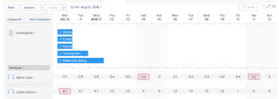

# Get started with Resource Scheduling

>[!NOTE]
>
>We are no longer developing the Resource Scheduling tools and they will soon be removed from `Adobe Workfront`. We recommend that you use the `Workload Balancer` for scheduling your resources. 
>
>For information about scheduling resources using the new `Workload Balancer`, see the section [The Workload Balancer](../../resource-mgmt/workload-balancer/workload-balancer.md).
>
>For more information about the timeline for removing the Resource Scheduling tools and replacing them with the `Workload Balancer`, see [Deprecation of Resource Scheduling tools in Adobe Workfront](../../resource-mgmt/resource-mgmt-overview/deprecate-resource-scheduling.md).

When using the resource scheduling functionality in `Adobe Workfront` you can more easily assign tasks and issues to the appropriate users. You can determine which users are capable of completing the task or issue, taking into consideration both the job role and the availability of the user.

The following sections provide more detail about using the Scheduling areas in `Workfront`.

## Prerequisites for using the scheduling tools in `Workfront`

>[!IMPORTANT]
>
>The prerequisites documented in this article apply only to the Scheduling areas of `Workfront`. For information about best practices for using the `Workload Balancer`, see [Overview of the Workload Balancer](../../resource-mgmt/workload-balancer/overview-workload-balancer.md).

To successfully use resource scheduling functionality in `Workfront`, you must first ensure that you, your projects, and your tasks and issues meet the following prerequisites:

* [User prerequisites](#user-prerequisites) 
* [Project prerequisites](#project-prerequisites) 
* [Task and issue prerequisites](#task-and-issue-prerequisites)

### User prerequisites

You can use the resource scheduling tools available from either the Scheduling tab, from the Staffing tab, or from the Working On tab when each of the following conditions are met:

`When scheduling resources as the resource manager (from the Scheduling tab):`

* You are designated as a Resource Manager for the projects for which you want to manage resources.

  For more information about designating resource managers for a project, see the article [Designate Resource Managers for a project or template](../../manage-work/projects/planning-a-project/designate-resource-managers-for-projects-and-templates.md).

* You are a user with a Plan license.

By default, users are displayed on the scheduling timeline only when they have a job role defined in the system (either the primary job role or a secondary job role), and that job role matches the job role assigned to a task or issue that is currently visible in the `Unassigned` area on the scheduling timeline. You can disable this functionality so to allow tasks and issues to be assigned to any user, regardless of whether that user has a role defined on their user profile that matches the role assignment of the task or issue that is being assigned to them. For more information, see the article [Allow user assignments regardless of role and group membership in the Scheduling areas](../../resource-mgmt/resource-scheduling/assignments-regardless-of-role-or-group-scheduling-areas.md).

By default, assignments can be made only to users who have a role defined on their user profile that matches the role assignment of the task or issue that is being assigned to them.

`When scheduling resources as a member of the project team (from the Staffing tab in a project):`

* You have permissions to View, Contribute, or Manage the project
* You have a Plan or Work license

<!--
Note: If Workfront has not removed the Use New Scheduling Area option from your Scheduling settings, users must have a Plan license and Manage permissions to the project to view the Scheduling timeline. For more information about the removal of the Use New Scheduling Area option, see the article Replacement of Flash-based tools in Adobe Workfront.
-->

* *

`When scheduling resources as a team member (from the Working On tab):`

* You are a member of the team  
  All members of the team are displayed on the scheduling timeline. Tasks and issues that are assigned to the team and not assigned to a user are displayed in the Unassigned area. Task and issues that are assigned to the team and to a user on the team are displayed in the row of the user to whom they are assigned.

### Project prerequisites

The project prerequisites described in this section apply only when scheduling resources as the resource manager from the scheduling timeline.

The projects you are managing must be in one of the following statuses (or a status that equates with one of these statuses) in order for work items from those projects to be displayed on the scheduling timeline: Planning, Current, or Approved. By default, only projects in the Current status are displayed.

For more information about project statuses, see the article [Create or edit a status](../../administration-and-setup/customize-workfront/creating-custom-status-and-priority-labels/create-or-edit-a-status.md).

### Task and issue prerequisites

In order to be most effective when using the resource scheduling tools in `Workfront`, ensure that tasks and issues in your system have the following criteria defined:

<ul> 
 <li>Durations</li> 
 <li>Planned Start Dates</li> 
 <li>Planned Hours  Planned Hours are required in order to modify user allocations, as described in the article <a href="../../resource-mgmt/resource-scheduling/manage-allocations-scheduling-areas.md" class="MCXref xref">Manage user allocations in the Scheduling areas</a>.  <note type="note">  The Planned Hours field in the Resource Scheduling card actually shows the sum of all workPerDay values, not the Planned Hours on the task. workPerDay values are calculated by dividing the Planned Hours value by the Task Duration. For non-zero Durations, the values usually match the Planned Hours of the task, although some small discrepancies due to rounding could happen. When a Duration is 0 Days, the Planned Hours displays 0 Hours. 
  </note></li> 
 <li>Role Assignments</li> 
</ul>

## View information in the Scheduling areas

* [Locate and view information in the Scheduling areas](#viewing-the-scheduling-timeline-in-full-screen-mode) 
* [View resource assignments and details](#viewing-resource-assingments-and-detials) 
* [Minimize tasks and issues on the Scheduling areas](#minimizing-tasks-and-issues-on-the-scheduling-timeline) 
* [Adjust the date range of the Scheduling areas](#adjusting-the-date-range-for-which-data-is-displayed)

### Locate and view information in the Scheduling areas

Depending on where you want to schedule resources, you can access the Scheduling timeline in the following areas of `Workfront`:

* For multiple projects, in the Scheduling area
* For a project in the Scheduling section 
* For a team, in the Schedule section

<ol> 
 <li value="1">Go to the scheduling timeline for multiple projects, for an individual project, or for a team: 
  <ul> 
   <li>
<b>For multiple projects</b>:&nbsp; Click the Main Menu icon in the upper-right corner of Workfront, click Resourcing > Workload Balancer, then select Scheduling in the upper-left drop-down menu.
</li> 
   <li>
<b>For an individual project</b>: Go to a project, click the Workload Balancer section in the left panel, then select Scheduling from the upper-left drop-down menu.
</li> 
   <li>
<b>For a team</b>: Click the Main Menu icon in the upper-right corner of Workfront, then click Teams, select a team, click Workload Balancer in the left panel, then select Scheduling from the upper-left drop-down menu.
</li> 
  </ul></li> 
 <li value="2">(Optional) Click the Full-Screen icon, located in the upper-right corner of the scheduling timeline.  The scheduling timeline displays in full-screen mode. When viewing the scheduling timeline in full-screen mode, the scheduling timeline occupies the entire screen; all other information is hidden (including any team or project information, the Global Navigation Bar, and browser information).</li> 
 <li value="3">(Optional) To exit full-screen mode, do either of the following: 
  <ul> 
   <li>Click the Full-Screen icon.</li> 
   <li>Press the Esc key. </li> 
  </ul></li> 
</ol>

### View resource assignments and details

You can view the current resourcing assignments and other details about individual tasks and issues on the scheduling timeline.

1. Go to the scheduling timeline for multiple projects, for an individual project, or for a team:

  * **For multiple projects**:&nbsp; Click the Main Menu icon in the upper-right corner of Workfront, click Resourcing > Workload Balancer, then select Scheduling in the upper-left drop-down menu.
  * **For an individual project**: Go to a project, click the Workload Balancer section in the left panel, then select Scheduling from the upper-left drop-down menu.
  * **For a team**: Click the Main Menu icon in the upper-right corner of Workfront, then click Teams, select a team, click Workload Balancer in the left panel, then select Scheduling from the upper-left drop-down menu.

1. (Optional) To customize what content dispalys on the scheduling timeline, create a filter, as described in [Filter information in the Scheduling area](../../resource-mgmt/resource-scheduling/filter-scheduling-area.md).
1. Expand a task or issue to view the following information:  
   `Project:` The name and link to the project where the task resides.  
   `Dates:` The Start on and Due On dates associated with the task.  
   `Planned Hours:` The number of Planned Hours associated with the task.  
   Planned Hours are displayed only if the task is assigned to a user or job role.  
   `Predecessor icon:` Any predecessors associated with the task. The predecessor icon displays only if there are predecessors associated with the task. The predecessor icon is green when the predecessor is completed and the task is ready to be worked on.   
   `Assignments:` Any user or job role assignments associated with the task. Job role assignments are displayed in parenthesis next to the user assignment.  
   Team assignments are not displayed.  
   If you have Contribute access to the task or issue, you can modify the hours for which users are allocated on each day within the task or issue duration. For more information about modifying user allocations, see the article [Manage user allocations in the Scheduling areas](../../resource-mgmt/resource-scheduling/manage-allocations-scheduling-areas.md).

### Minimize tasks and issues on the Scheduling areas

Minimizing tasks and issues allows you to view user assignments for a large number of users on a single screen.  
All tasks and issues on the scheduling timeline are minimized by default.

When tasks and issues are minimized, you can:

* View task duration
* View project color
* Assign tasks from the Unassigned area to users on the scheduling timeline

When tasks and issues are minimized, you cannot:

* View task names
* Drag tasks that are already assigned to a user and reassign them
* Expand tasks to view details

If you enable the Show Totals for Daily Planned Hours setting, when tasks and issues are minimized you can only:

* View the total of daily Planned Hours for each user.

When you minimize tasks and issues as described in this section, those changes are displayed only for you. Tasks and issues remain minimized until you expand them or until you end your browser session. (Refreshing the page does not revert minimized tasks and issues to an expanded state.)

On the scheduling timeline, you can minimize tasks and issues that are displayed for individual users, for job roles, or for all users.

* [Minimize tasks and issues for individual users](#minimizing-tasks-and-issues-for-individual-users) 
* [Minimize tasks and issues for a job role](#minimizing-tasks-and-issues-for-a-job-role) 
* [Minimize tasks and issues for all users](#minimizing-tasks-and-issues-for-all-users)

#### Minimize tasks and issues for individual users

<ol> 
 <li value="1">Click the caret next to the user on the scheduling timeline whose tasks and issues you want to minimize.  
The way tasks and issue display depends on the following settings:
 
  <ul> 
   <li>If you enable the Show Totals for Daily Planned Hours the following conditions apply: 
    <ul> 
     <li>Only Planned Hours for the user display</li> 
     <li>
Tasks and issues are hidden
</li> 
    </ul></li> 
  </ul></li> 
</ol>

<ol> 
 <li style="list-style-type: none;" value="1"> 
  <ul> 
   <li>If you enable the  Show Totals for Daily Planned Hours tasks and issues for the user are minimized. </li> 
  </ul> </li> 
</ol>

#### Minimize tasks and issues for a job role

You can minimize tasks and issues for all users that are associated with a specific job role.

<ol> 
 <li value="1">Click the caret next to the job role on the scheduling timeline that contains the users whose tasks and issues you want to minimize.  Tasks and issues for all users associated with that role are minimized if you disable the Show Totals for Daily Planned Hours setting. Tasks and issues are hidden and only the Planned Hours for the users display if you enable this setting. </li> 
</ol>

#### Minimize tasks and issues for all users

<ol> 
 <li value="1">Click Collapse All at the top of the Users and Roles area.  Or Click the caret next to any user or job role on the scheduling timeline while holding the Shift key.  Tasks and issues for all users and roles are minimized if you disable the Show Totals for Daily Planned Hours and tasks and issues are hidden if you enable it.  If the Show Totals for Daily Planned Hours is enabled only the Planned Hours for the users display. Tasks and issues remain minimized for the Unassigned area.  </li> 
</ol>

### Adjust the date range of the Scheduling areas

By default, 14 consecutive days (including weekends) are displayed on the scheduling timeline, beginning with the current day.

Use any of the following options to modify the date range for which data idisplays on the scheduling timeline:

<ul> 
 <li>Date Range Options: Click the current date range, then select the number of weeks to display on the timeline. You can display Day (single day), 1 week (7 days), 2 weeks (14 days), 3 weeks (21 days), 4 weeks (28 days), or 6 weeks (42 days). 
Consider the following when adjusting the date range of the scheduling timeline:
 
  <ul> 
   <li>The date range options you select are preserved the next time you visit the scheduling timeline. </li> 
   <li>When viewing the scheduling timeline in the Day view, user allocations are not displayed. </li> 
  </ul></li> 
 <li>Calendar: Click the current date range, then click the day prior to or after the current day. The time between the current day and the selected day is the new range.  </li> 
 <li> 
Today: Click this option to display the current day. The current day is then displayed on the far left of the date range. Click the left and right arrows to view past or future dates.
 <note type="note">
   The time frame you select is preserved when refreshing the page.
  </note> 
    
 </li> 
 <li>Drag-and-drop of the date range: Drag the date range at the top of the scheduling timeline. </li> 
</ul>

## Configure Settings in the Scheduling areas

Certain information displays by default in the Scheduling timeline. You can also configure your settings to display additional information.

For information about configuring your settings in the Scheduling timeline, see the following articles:

[Configure settings in the Scheduling areas](../../resource-mgmt/resource-scheduling/configure-settings-scheduling-areas.md)

[Allow user assignments regardless of role and group membership in the Scheduling areas](../../resource-mgmt/resource-scheduling/assignments-regardless-of-role-or-group-scheduling-areas.md)

[Automatically assign unassigned tasks and issues in the Scheduling areas](../../resource-mgmt/resource-scheduling/automatically-assign-items-scheduling-areas.md)

## Filter information in the Scheduling areas

You can define what displays on the scheduling timeline by creating a filter.

For more information, see the article [Filter information in the Scheduling area](../../resource-mgmt/resource-scheduling/filter-scheduling-area.md).

## Modify user assignments and allocations

* [Modify user assignments](#modifying-user-assignments) 
* [Modify user allocations](#modifying-user-allocations-contouring)

### Modify user assignments

You can modify user assignments from the Scheduling tab (when scheduling resources for projects) either by using the swap tool or by modifying tasks and issues directly from the scheduling timeline. You can modify user assignments from the Working On tab (when scheduling resources for teams) by modifying tasks and issues directly from the scheduling timeline.

For more information, see the article [Manually assign unassigned tasks and issues in the Scheduling areas](../../resource-mgmt/resource-scheduling/manually-assign-items-scheduling-areas.md).

### Modify user allocations

You can determine how the Planned Hours for a task or issue are allocated to users. Planned Hours can be divided in the following ways:

* Among users who are assigned to the task or issue.
* Across the duration of the task or issue.

For more information, see the article [Manage user allocations in the Scheduling areas](../../resource-mgmt/resource-scheduling/manage-allocations-scheduling-areas.md).

