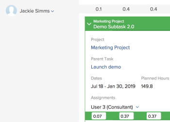

# Manage user allocations in the Scheduling areas {#manage-user-allocations-in-the-scheduling-areas}

>[!NOTE]
>
>We are no longer developing the Resource Scheduling tools and they will soon be removed from *`Adobe Workfront`*. We recommend that you use the *`Workload Balancer`* for scheduling your resources. 
>
>
>For information about scheduling resources using the new *`Workload Balancer`*, see the section [The Workload Balancer](_workload-balancer.md).
>
>
>For more information about the timeline for removing the Resource Scheduling tools and replacing them with the *`Workload Balancer`*, see [Deprecation of Resource Scheduling tools in Adobe Workfront](deprecate-resource-scheduling.md).

When a user is assigned to a task or issue, they become allocated to that task or issue for the amount of time indicated by the Planned Hours of that task or issue. 

You can display user allocations in the following areas of *`Adobe Workfront`*:

*  On the Scheduling section of the Resourcing area. 
*  On the Scheduling section of a project (when scheduling resources for a single project). 
*  On the Schedule section of a team (when scheduling resources for a team).

## Access requirements {#access-requirements}

You must have the following:

<table style="width: 100%;margin-left: 0;margin-right: auto;mc-table-style: url('../../Resources/TableStyles/TableStyle-List-options-in-steps.css');" class="TableStyle-TableStyle-List-options-in-steps" cellspacing="0"> 
 <col class="TableStyle-TableStyle-List-options-in-steps-Column-Column1"> 
 <col class="TableStyle-TableStyle-List-options-in-steps-Column-Column2"> 
 <tbody> 
  <tr class="TableStyle-TableStyle-List-options-in-steps-Body-LightGray"> 
   <td class="TableStyle-TableStyle-List-options-in-steps-BodyE-Column1-LightGray" role="rowheader">Adobe Workfront plan*</td> 
   <td class="TableStyle-TableStyle-List-options-in-steps-BodyD-Column2-LightGray"> 
Any
 </td> 
  </tr> 
  <tr class="TableStyle-TableStyle-List-options-in-steps-Body-MediumGray"> 
   <td class="TableStyle-TableStyle-List-options-in-steps-BodyE-Column1-MediumGray" role="rowheader">Adobe Workfront license*</td> 
   <td class="TableStyle-TableStyle-List-options-in-steps-BodyD-Column2-MediumGray"> 
Work or higher
 </td> 
  </tr> 
  <tr class="TableStyle-TableStyle-List-options-in-steps-Body-LightGray"> 
   <td class="TableStyle-TableStyle-List-options-in-steps-BodyE-Column1-LightGray" role="rowheader">Access level*</td> 
   <td class="TableStyle-TableStyle-List-options-in-steps-BodyD-Column2-LightGray"> 
View or higher access to Projects, Tasks,&nbsp;and Issues
 
Note: If you still don't have access, ask your Workfront administrator if they set additional restrictions in your access level. For information on how a Workfront administrator can change your access level, see <a href="create-modify-access-levels.md" class="MCXref xref">Create or modify custom access levels</a>.
 </td> 
  </tr> 
  <tr class="TableStyle-TableStyle-List-options-in-steps-Body-MediumGray"> 
   <td class="TableStyle-TableStyle-List-options-in-steps-BodyB-Column1-MediumGray" role="rowheader">Object permissions</td> 
   <td class="TableStyle-TableStyle-List-options-in-steps-BodyA-Column2-MediumGray"> 
Contribute permissions to projects, tasks, and issues
 
For information on requesting additional access, see <a href="request-access.md" class="MCXref xref">Request access to objects in Adobe Workfront</a>.
 </td> 
  </tr> 
 </tbody> 
</table>

&#42;To find out what plan, license type, or access you have, contact your *`Workfront administrator`*.

## User allocations in the Scheduling areas {#user-allocations-in-the-scheduling-areas}

Before you begin allocating time to users as described in this article, become familiar with how resource scheduling works in *`Workfront`*, as described in [Get started with Resource Scheduling](get-started-resource-scheduling.md).

You can schedule resources to work on tasks and issues for an individual team you are a member of, for an individual project where you are a member of the project team, or for multiple projects for which you are the resource manager.

The following sections describe how to enable and manage user allocations in *`Workfront`*:

* [Use the Scheduling areas to assign work](#using-scheduling-timelines-to-assign-work) 
* [Allocations set on the Edit Task or the Edit Issue boxes vs. in the Scheduling areas](#understanding-allocations-set-on-the-task-or-issue-details-versus-on-the-scheduling-timeline) 
* [Allocation indicators](#understanding-allocation-indicators) 
* [Default allocation for Planned Hours](#understanding-the-default-allocation-for-planned-hours) 
* [Who can view and modify allocations?](#understanding-who-can-view-and-modify-allocations) 
* [Time zone considerations in the Scheduling areas](#time-zone-considerations-on-the-scheduling-timeline) 

### Use the Scheduling areas to assign work {#use-the-scheduling-areas-to-assign-work}

When assigning new work to users on the Scheduling timeline, you can determine how the Planned Hours for a task or issue are allocated to users.   
For more information about Planned Hours, see [Planned Hours overview](planned-hours.md). 

Planned Hours can be divided in the following ways:

* Among users who are assigned to the task or issue
* Across the duration of the task or issue  
  For example, a sales-related task might require more work toward the end of the task duration. You can plan this uneven distribution of hours into your task.

>[!TIP] {type="tip"}
>
>When scheduling resources for multiple projects from the Scheduling `<MadCap:conditionalText data-mc-conditions="QuicksilverOrClassic.Quicksilver"> areas</MadCap:conditionalText>`, not all users and work items are displayed on the Scheduling timeline. For information about what information is displayed on the Scheduling timeline, see [Get started with Resource Scheduling](get-started-resource-scheduling.md).

### Allocations set on the Edit Task or the Edit Issue boxes vs. in the Scheduling areas {#allocations-set-on-the-edit-task-or-the-edit-issue-boxes-vs-in-the-scheduling-areas}

You can modify the user allocations for a task or issue from the following locations within *`Workfront`*:

* The Scheduling timeline  
  The Scheduling timeline is located in the following areas: 
    
    
    * On the Scheduling section of the Resourcing area. 
    * On the Scheduling section of a project (when scheduling resources for a single project). 
    * On the Schedule section of a team (when scheduling resources for a team).
    
    
  When you modify user allocations from the Scheduling timeline (as described in the [Modify user allocations](#modifying-user-allocations) section in this article), you can define allocations for each user on the task or issue, as well as for each day within the task or issue duration.  
  

* The Edit Task or Edit Issue dialog box.   
  When you modify user allocations from a Edit Task or Issue dialog box (as described in [Manage allocation percentage on tasks](manage-allocation-percentage-on-tasks.md)), you can define allocations for the task or issue only as a whole for each user. If you want to manage those allocations on a per-day basis, you must modify the allocations in the Scheduling timeline, as described in the [Modify user allocations](#modifying-user-allocations) section in this article.  

  >[!IMPORTANT] {type="important"}
  >
  >When modifying user allocations from an Edit Task or Issue dialog box, allocations you previously configured in the Scheduling timeline are overwritten. In addition, any change you make to allocations in the Scheduling timeline are not reflected on an Edit Task or Issue dialog box.

  

We recommend managing user allocations from the Scheduling timeline rather than from the Edit Task or Issue to benefit from the following advantages:

* You can clearly see when users are overallocated using allocation indicators, as described in the [Allocation indicators](#understanding-allocation-indicators) section.
* You can allocate more time for one user over another user.  
  Allocation indicators provide a visual representation of how allocated a user is compared to other users, as described in the [Allocation indicators](#understanding-allocation-indicators) section. 

* You can allocate more time for work on one day over another day.  
  Allocation indicators provide a visual representation of how allocated users are on a given day, as described in [Allocation indicators](#understanding-allocation-indicators).

* You can perform all resourcing responsibilities in one place, on the Scheduling timeline.

### Allocation indicators {#allocation-indicators}

Various visual indicators are available to provide quick information regarding the level of which a user is allocated to work on a given day. 

Your system administrator determines how *`Workfront`* calculates user availability at the system level (considering hours as well as FTE availability). Depending on this system-wide setting, user availability is calculated either using the default schedule or the user's schedule. For more information, see [Configure how Workfront calculates resource hour and FTE availability for the Scheduling area](calculate-hours-fte-scheduling-area.md).

* `Allocation shading`   
  Allocation is visually displayed on tasks assigned to users in the form of shading. Darker shading indicates the allocated hours as a percentage of the assigned users' FTE (Full Time Equivalent) on a given day. (For more information about how to configure FTE in *`Workfront`*, see [Configure how Workfront calculates resource hour and FTE availability for the Scheduling area](calculate-hours-fte-scheduling-area.md).)   
  For example, a single user is assigned to a task that has an amount of 4 Planned Hours and a Duration of 1 day. The FTE for the user is defined in the system as 1 (meaning that the user is scheduled to work at full-time status, or rather 40 hours a week, or 8 hours a day). The shading for the task on a given day occupies half of the vertical space of the task, this indicates that the user is allocated half of his or her FTE (4 hours) on that day.  
    
  The task or issue displays the cumulative allocation across all users assigned to the work item. You can expand a work item to view more details, including who is assigned to the work item and how many hours each user is assigned.  
  Shading is not displayed on tasks in the `Unassigned` area on the Scheduling timeline.  
  

* `Daily totals for each day for each user:` You can display the total Planned Hours allocated to a given user on each day. This information is displayed at the top of each user's row on the Scheduling timeline. This information is not displayed by default. You can enable this as described in [Enable user allocations](#enabling-user-allocations). Tasks from projects with any of the following statuses are included when determining daily totals: Current, Planning, or Approved.  
  

* `Overallocation indicators`   
  When the total number of Planned Hours assigned to a user on a given day exceeds the number of hours the user works in a day (across all tasks), that user is considered overallocated on that day.   
  When a user is overallocated, a red bar is displayed, outlining each task on the day.   
  Tasks from projects with any of the following statuses are included when determining a user's overallocation: Current, Planning, or Approved.  
  The number of hours a user works in a day is defined via the FTE field in the each user's profile, as described in see [Configure how Workfront calculates resource hour and FTE availability for the Scheduling area](calculate-hours-fte-scheduling-area.md).  
    
  When you enable the `Show Totals for Daily Planned Hours` and the `Show Resource Allocation Highlighting` options in your settings, the daily total number of Planned Hours displays in red when the user is overallocated. Hours are displayed to the nearest tenth by default (for example, 1.3).  
  

### Default allocation for Planned Hours {#default-allocation-for-planned-hours}

*`Workfront`* attempts to distribute Planned Hours among the assigned users and days as follows:

* When multiple users are assigned to a task or issue, hours are divided evenly among the users.  
  The distribution reflects any advanced assignments that have already been made on the task.   
  For more information about advanced assignments, see [Create advanced assignments](create-advanced-assignments.md).

* When the Duration of the task or issue spans multiple days, the Planned Hours are distributed equally among the days, and among all users assigned to the task, based on the user's schedule.
* When the Planned Hours of a task span multiple days, a user viewing the task from a different time zone might see a difference in the task duration or the Planned Start Date or Planned Completion Date. 

Hours are displayed to the nearest hundredth by default (for example, 1.33). You can scroll to the right to see more.   

### Who can view and modify allocations? {#who-can-view-and-modify-allocations}

The following types of users can view or modify user allocations in *`Workfront`*:

* `Resource Managers:` You can view and modify user allocations for tasks and issues on any projects for which you are the Resource Manager. You can do this either in the Scheduling timeline in the People area, or in the Staffing tab of a project.  
  For information about how Resource Managers can make changes to tasks and issues across projects, see [Manually assign unassigned tasks and issues in the Scheduling areas](manually-assign-items-scheduling-areas.md). 

* `Plan and Work Users:` You can view allocations for any tasks and issues you are assigned to by using either the new My Work Calendar or the Working On calendar on a team that you are a member of.   
  In addition to viewing allocations, you can modify your allocations if you have Contribute access to the tasks and issues. 

### Time zone considerations in the Scheduling areas  {#time-zone-considerations-in-the-scheduling-areas}

In rare cases, users viewing the Scheduling timeline might see inconsistencies where the Planned Hours of a task do not equal the total allocated hours of individual days. This can occur when the operating system time zone setting of one user is such that the Planned Start Date or Planned Completion Date differs from another user.

For example, if the Planned Completion Date of a task is set to 11:00am on 11/3/18, MST, a user in Australia who views the task would see the Planned Completion Date as 1:00am on 11/4/18, the following day. If the user in Australia allocates hours on 11/4/18, these allocated hours are not visible to the user on MST. However, these hours are always taken into consideration on the Planned Hours of the project. 

## Enable user allocations {#enable-user-allocations}

User allocation functionality is disabled by default on the Scheduling timeline. Before you can use the user allocation functionality described in this section, you must first enable it.

>[!NOTE]
>
>User allocations can be enabled only when the Scheduling timeline is configured to use Planned Dates. If the Scheduling timeline is configured to use Projected Dates, user allocations cannot be displayed. For more information about configuring the Scheduling timeline to use Planned or Projected Dates, see "Configuring Projected Dates to Display on the Scheduling Timeline" in [Configure settings in the Scheduling areas](configure-settings-scheduling-areas.md).

To enable user allocations on the Scheduling timeline:

1. Go to the scheduling timeline for multiple projects, for an individual project, or for a team: 
    
    
    * **For multiple projects**:&nbsp; `<MadCap:conditionalText data-mc-conditions="QuicksilverOrClassic.Quicksilver"> Click the  Main Menu icon   in the upper-right corner of  Workfront, click  Resourcing > Workload Balancer, then select  Scheduling in the upper-left drop-down menu. </MadCap:conditionalText>`
    * **For an individual project**: `<MadCap:conditionalText data-mc-conditions="QuicksilverOrClassic.Quicksilver">  Go to a project, click the  Workload Balancer  section in the left panel, then select  Scheduling from the upper-left drop-down menu. </MadCap:conditionalText>`
    * **For a team**: `<MadCap:conditionalText data-mc-conditions="QuicksilverOrClassic.Quicksilver">  Click the  Main Menu icon   in the upper-right corner of  Workfront, then click  Teams, select a team, click  Workload Balancer in the left panel, then select  Scheduling from the upper-left drop-down menu. </MadCap:conditionalText>`
    
    
   

1. Click the `Settings` icon on the Scheduling timeline.  
     
   The Resource Scheduling Settings dialog box is displayed.  
   

1.  Enable one or both of the following options to show user allocations on the Scheduling timeline:

<table style="width: 100%;mc-table-style: url('../../Resources/TableStyles/TableStyle-List-options-in-steps.css');" class="TableStyle-TableStyle-List-options-in-steps" cellspacing="0"> 
 <col class="TableStyle-TableStyle-List-options-in-steps-Column-Column1"> 
 <col class="TableStyle-TableStyle-List-options-in-steps-Column-Column2"> 
 <tbody> 
  <tr class="TableStyle-TableStyle-List-options-in-steps-Body-LightGray"> 
   <td class="TableStyle-TableStyle-List-options-in-steps-BodyE-Column1-LightGray" role="rowheader">Show Resource Allocation Highlighting</td> 
   <td class="TableStyle-TableStyle-List-options-in-steps-BodyD-Column2-LightGray"> 
Display user allocation shading on tasks and issues on the Scheduling timeline. 
 
This option is disabled by default.
 </td> 
  </tr> 
  <tr class="TableStyle-TableStyle-List-options-in-steps-Body-MediumGray"> 
   <td class="TableStyle-TableStyle-List-options-in-steps-BodyB-Column1-MediumGray" role="rowheader">Show Totals for Daily Planned Hours</td> 
   <td class="TableStyle-TableStyle-List-options-in-steps-BodyA-Column2-MediumGray">Displays the total number of Planned Hours that are allocated to each user for each day on the Scheduling timeline. The Planned Hours display to the nearest tenth (for example, 1.3). This option is disabled by default.</td> 
  </tr> 
 </tbody> 
</table>

1. (Optional) In the `Include Issues` section, select whether you want issues to be displayed on the Scheduling timeline.  
   This option is disabled by default.

1. Click `Return to Scheduling`.  
   User allocations are now displayed on the Scheduling timeline.  
   

## Modify user allocations {#modify-user-allocations}

You can modify the user allocations for a task or issue from the Scheduling timeline (as described in this section) or from the Edit Task or Issue dialog box. For more information, see [Allocations set on the Edit Task or the Edit Issue boxes vs. in the Scheduling areas](#understanding-allocations-set-on-the-task-or-issue-details-versus-on-the-scheduling-timeline).

By default, users are allocated to a task or issue evenly among assignees and among days in the duration, as described in [Default allocation for Planned Hours](#understanding-the-default-allocation-for-planned-hours).

To modify user allocations for a task or issue from the Scheduling timeline:

1. Go to the scheduling timeline for multiple projects, for an individual project, or for a team: 
    
    
    * **For multiple projects**:&nbsp; `<MadCap:conditionalText data-mc-conditions="QuicksilverOrClassic.Quicksilver"> Click the  Main Menu icon   in the upper-right corner of  Workfront, click  Resourcing > Workload Balancer, then select  Scheduling in the upper-left drop-down menu. </MadCap:conditionalText>`
    * **For an individual project**: `<MadCap:conditionalText data-mc-conditions="QuicksilverOrClassic.Quicksilver">  Go to a project, click the  Workload Balancer  section in the left panel, then select  Scheduling from the upper-left drop-down menu. </MadCap:conditionalText>`
    * **For a team**: `<MadCap:conditionalText data-mc-conditions="QuicksilverOrClassic.Quicksilver">  Click the  Main Menu icon   in the upper-right corner of  Workfront, then click  Teams, select a team, click  Workload Balancer in the left panel, then select  Scheduling from the upper-left drop-down menu. </MadCap:conditionalText>`
    
    
   

1. Ensure that user allocations are enabled on the Scheduling timeline, as described in the [Enable user allocations](#enabling-user-allocations) section in this article.
1. Expand the task where you want to manage user allocations.  
   By default, Planned Hours are divided evenly among the assigned users and days of the task Duration. Hours are not added on weekends (Saturdays and Sundays). For more information, see the [Default allocation for Planned Hours](#understanding-the-default-allocation-for-planned-hours) section in this article.

1. Click the field for the user whose hours you want to adjust on a given day.  

   >[!NOTE]
   >
   >To maintain the original distribution after modifying hours, click `Cancel`.

1. Specify the adjusted number of hours.
1. Click `Save`.  
   You can save your changes only when the total number of hours for the task is equal to the number of original Planned Hours. This number is shown in the `Planned Hours` field on the task. The number is displayed in red when the total is not equal to the total number of Planned Hours.  
   

## Criteria that reset user allocations {#criteria-that-reset-user-allocations}

*`Workfront`* resets the user allocations that you manually edit in the Scheduling timeline when a number of actions occur on the tasks or the project. Generally, *`Workfront`* resets user allocations any time the timeline of the project is recalculated if the number of Planned Hours on the tasks and issues has changed in this process.  
For more information about recalculating the timeline of projects, see [Recalculate project timelines](recalculate-project-timeline.md).

Some of the most common criteria that could reset user allocations in the Scheduling timeline are:

* Adding a task to an Iteration.  
  Because iterations have fixed dates, the dates of the tasks and the allocations are recalculated.  
  For information about how Iterations can affect task dates, see [Add stories to an existing iteration](add-stories-to-existing-iteration.md).

* Changing the Duration Type of a task to Effort Driven. 
* Changing the Duration Type of a task to Calculated Assignment when more than 1 person is assigned.   
  For information about Task Duration, see [Overview of Task Duration and Duration Type](task-duration-and-duration-type.md).

* Changing the project Planned Start and Planned Completion Dates.  
  For information about project dates, see [Overview of the project Planned Completion Date](project-planned-completion-date.md).

* Changing the dates of a predecessor task if the Task Constraint is a flexible constraint.  
  For example, As Soon as Possible or As Late as Possible.  
  For information about Task Constraint, see [Task Constraint overview](task-constraint-overview.md).

*  Changing the amount of Planned Hours of tasks or issues. 

  For information about Planned Hours in *`Workfront`*, see [Planned Hours overview](planned-hours.md).   
  

