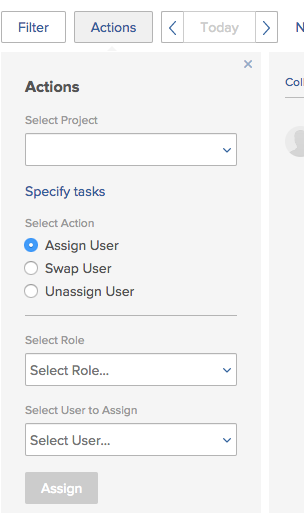
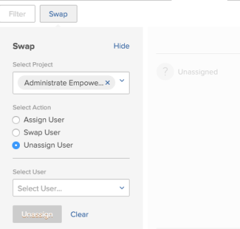

# Modify multiple users assignments to tasks in the Scheduling areas

>[!NOTE]
>
>We are no longer developing the Resource Scheduling tools and they will soon be removed from *Adobe Workfront*. We recommend that you use the *Workload Balancer* for scheduling your resources. 
>
>For information about scheduling resources using the new *Workload Balancer*, see the section [The Workload Balancer](../../resource-mgmt/workload-balancer/workload-balancer.md).
>
>For more information about the timeline for removing the Resource Scheduling tools and replacing them with the *Workload Balancer*, see [Deprecation of Resource Scheduling tools in Adobe Workfront](../../resource-mgmt/resource-mgmt-overview/deprecate-resource-scheduling.md).

This article refers to modifying user assignments for multiple tasks using the Scheduling area of *Adobe Workfront* . Please also see the following articles for modifying assignments on multiple tasks in other areas:

* For information about modifying assignments on multiple tasks in a task list, see [Modify multiple user assignments in a task list](../../manage-work/tasks/assign-tasks/modify-multiple-assignments-in-task-list.md). 
* For information about scheduling resources using the new Workload Balancer, see the section [The Workload Balancer](../../resource-mgmt/workload-balancer/workload-balancer.md).

You can assign users to multiple tasks at the same time when using the Resource Scheduler.

>[!NOTE]
>
>This article applies only when scheduling resources for multiple projects (from the Scheduling >
><!-->
><MadCap:conditionalText data-mc-conditions="QuicksilverOrClassic.Quicksilver">>
>section>
></MadCap:conditionalText>>
>-->
>`<MadCap:conditionalText data-mc-conditions="QuicksilverOrClassic.Quicksilver">  section </MadCap:conditionalText>`) or for a single project (from the >
><!-->
><MadCap:conditionalText data-mc-conditions="QuicksilverOrClassic.Quicksilver">>
>Scheduling section>
></MadCap:conditionalText>>
>-->
>`<MadCap:conditionalText data-mc-conditions="QuicksilverOrClassic.Quicksilver">  Scheduling section </MadCap:conditionalText>`); you cannot manage user assignments for multiple tasks as described in this section when scheduling resources for a team (from the >
><!-->
><MadCap:conditionalText data-mc-conditions="QuicksilverOrClassic.Quicksilver">>
>Schedule section>
></MadCap:conditionalText>>
>-->
>`<MadCap:conditionalText data-mc-conditions="QuicksilverOrClassic.Quicksilver">  Schedule section </MadCap:conditionalText>`).

## Access requirements

You must have the following:

<table cellspacing="0"> 
 <col> 
 <col> 
 <tbody> 
  <tr> 
   <td role="rowheader"><em>Adobe Workfront</em> plan*</td> 
   <td> 
Any
 </td> 
  </tr> 
  <tr> 
   <td role="rowheader"><em>Adobe Workfront</em> licenses overview*</td> 
   <td> 
<em>Work</em> or higher
 </td> 
  </tr> 
  <tr> 
   <td role="rowheader">Access level*</td> 
   <td> 
View or higher access to&nbsp;Projects, Tasks, and Issues
 
Note: If you still don't have access, ask your <em>Workfront administrator</em> if they set additional restrictions in your access level. For information on how a <em>Workfront administrator</em> can change your access level, see <a href="../../administration-and-setup/add-users/configure-and-grant-access/create-modify-access-levels.md" class="MCXref xref">Create or modify custom access levels</a>.
 </td> 
  </tr> 
  <tr> 
   <td role="rowheader">Object permissions</td> 
   <td> 
Contribute permissions or higher to the projects, tasks, and issues you update assignments for
 
For information on requesting additional access, see <a href="../../workfront-basics/grant-and-request-access-to-objects/request-access.md" class="MCXref xref">Request access to objects in Adobe Workfront</a>.
 </td> 
  </tr> 
 </tbody> 
</table>

&#42;To find out what plan, license type, or access you have, contact your *Workfront administrator*.

## Considerations for making multiple assignments in the Scheduling areas

You can quickly manage user assignments for multiple tasks and issues across one or more projects (changes are then reflected on the scheduling timeline).

You can assign a user to all tasks currently assigned to a job role, swap user assignments between users, or unassign a user from all tasks.

For example:

* A resource manager is responsible for making user assignments on a new project. The project was originally created as a template and job roles are already assigned to the various tasks within the project. The resource manager wants to assign a specific user to all tasks that are currently assigned to a job role.
* 45 tasks across 3 different projects are assigned to Jackie Simms. Jackie leaves the organization, and now the resource manager needs to reassign her tasks to another user.

>[!NOTE]
>
>Consider the following limitations when managing user assignments for multiple tasks:
>
>* When scheduling resources for multiple projects, the projects you are managing must be in one of the following statuses (or a status that equates with one of these statuses): Planning, Current, or Approved. For more information about project statuses, see [Create or edit a status](../../administration-and-setup/customize-workfront/creating-custom-status-and-priority-labels/create-or-edit-a-status.md).
>* When scheduling resources for a single project, the project status does not affect the availability of this functionality.
>* You can make resourcing changes for users with the following licenses: Plan, Work, and Review. You cannot make resourcing changes for users with a Request license. 
>

## Manage user assignments for one or more projects

<ol> 
 <li value="1"> 
Go to the scheduling timeline for multiple projects or for an individual project:
 
  <ul> 
   <li> 
<b>For multiple projects</b>:&nbsp; <draft-comment>
      <MadCap:conditionalText data-mc-conditions="QuicksilverOrClassic.Quicksilver">
        Click the 
       Main Menu icon 
        in the upper-right corner of 
       <em>Workfront</em>, click 
       Resourcing > <em>Workload Balancer</em>, then select 
       Scheduling in the upper-left drop-down menu. 
      </MadCap:conditionalText>
     </draft-comment><MadCap:conditionalText data-mc-conditions="QuicksilverOrClassic.Quicksilver">
       Click the 
      Main Menu icon 
       in the upper-right corner of 
      <em>Workfront</em>, click 
      Resourcing > <em>Workload Balancer</em>, then select 
      Scheduling in the upper-left drop-down menu. 
     </MadCap:conditionalText>
 </li> 
   <li> 
<b>For an individual project</b>: <draft-comment>
      <MadCap:conditionalText data-mc-conditions="QuicksilverOrClassic.Quicksilver">
        Go to a project, click the 
       <em>Workload Balancer</em> section in the left panel, then select 
       Scheduling from the upper-left drop-down menu. 
      </MadCap:conditionalText>
     </draft-comment><MadCap:conditionalText data-mc-conditions="QuicksilverOrClassic.Quicksilver">
       Go to a project, click the 
      <em>Workload Balancer</em> section in the left panel, then select 
      Scheduling from the upper-left drop-down menu. 
     </MadCap:conditionalText>
 </li> 
  </ul> </li> 
 <li value="2">Click Actions. </li> 
 <li value="3"> 
In the Select Project field, depending on whether you are viewing the scheduling timeline for multiple projects (from the Scheduling tab) or for an individual project (from the Staffing tab), do either of the following:
 
  <ul> 
   <li> 
For multiple projects: Begin typing the name of the project where you want to make assignment changes, then click the name when it appears in the drop-down list. Or, click the drop-down arrow to choose from a list of projects. Repeat this process to make assignment changes across multiple projects. Leave this field blank to make assignment changes on all projects for which you are the resource manager.
 <note type="note">  
     
Projects are available to select only if:
 
     <ul> 
      <li>You are designated as the resource manager on the project For more information, see <a href="../../manage-work/projects/planning-a-project/designate-resource-managers-for-projects-and-templates.md" class="MCXref xref">Designate Resource Managers for a project or template </a>.</li> 
      <li>The project is in one of the following statuses (or a status that equates with one of these statuses): Planning, Current, or Approved For more information about project statuses, see <a href="../../administration-and-setup/customize-workfront/creating-custom-status-and-priority-labels/create-or-edit-a-status.md" class="MCXref xref">Create or edit a status</a>.</li> 
      <li>You are a user with a Plan license.</li> 
     </ul> 
    </note> </li> 
   <li> 
For an individual project: The Select Project field cannot be modified. The Select Project field always contains the name of the project you are viewing.
 </li> 
  </ul> </li> 
 <li value="4">(Optional) Click Specify tasks to modify assignment changes on individual tasks. When you specify individual tasks, any projects you selected in the Select Project field are ignored.  In the Select Tasks field, begin typing the name of the task where you want to make assignment changes. Repeat this step to make assignment changes on additional tasks. If you leave this field blank, all tasks within the projects you selected in Step 3 are affected. When you make assignment changes on individual tasks, changes are applied to all subtasks for the tasks that you specify. Changes are also applied to all issues associated with the tasks if issues are configured to display on the scheduling timeline, as described in <a href="../../resource-mgmt/resource-scheduling/configure-settings-scheduling-areas.md#configuring-issues-to-display-on-the-scheduling-timeline" class="MCXref xref">You can configure various settings to customize how and what information displays in the scheduling timeline. </a> in <a href="../../resource-mgmt/resource-scheduling/configure-settings-scheduling-areas.md" class="MCXref xref">Configure settings in the Scheduling areas</a>.</li> 
 <li value="5">Continue with any of the following sections: 
  <ul> 
   <li><a href="#assigning-a-user" class="MCXref xref">Assign a user</a></li> 
   <li><a href="#swapping-a-user" class="MCXref xref">Swap a user</a></li> 
   <li><a href="#unassigning-a-user" class="MCXref xref">Unassign a user</a></li> 
  </ul></li> 
</ol>

### Assign a user

You can assign a user to all tasks currently assigned to a specific role within the selected projects.

When you assign a user in this way, the user is not assigned to the following types of tasks:

* Assignments on tasks that are already assigned to a user
* Tasks that are Complete

To assign a user to tasks throughout the selected projects or tasks:

<ol> 
 <li value="1">Select Assign User in the Select Action section. </li> 
 <li value="2">In the Select Role field, click the drop-down arrow to choose from a list of roles. Only roles currently assigned to tasks within the specified projects are displayed.  When you assign a user, the user replaces the roles that you select here.</li> 
 <li value="3">In the Select User to Assign field, click the drop-down arrow to choose from a list of users.  If the Limit Assignments to Users with a Matching Role option is enabled in the Settings area, users are available to select only if they have the selected role assigned to them in their user settings (either as the Primary Role or an Other Role). If this option is disabled, you can begin typing the name of another user you want to assign, even if that user does not have a matching role defined in the system. The option is enabled by default. For more information about this option, see <a href="../../resource-mgmt/resource-scheduling/assignments-regardless-of-role-or-group-scheduling-areas.md" class="MCXref xref">Allow user assignments regardless of role and group membership in the Scheduling areas</a>. By default, assignments can be made only to users who have a role defined on their user profile that matches the role assignment of the task or issue that is being assigned to them. </li> 
 <li value="4">Click Assign. You can make a maximum of 1,000 assignments in a single action. If the selections you make will make more than 1,000 assignment changes, you must re-adjust your selections and try again.</li> 
</ol>

### Swap a user

You can swap a user's task assignments with the task assignments of another user in the selected projects or for the selected tasks.

When you swap a user's task assignments as described in this section, any assignments that are already marked Complete are not swapped.

To swap a user's task assignments with the task assignments of another user:

<ol> 
 <li value="1">Select Swap User in the Select Action section. </li> 
 <li value="2">In the Select User field, click the drop-down arrow to choose from a list of users (or begin typing the name of the user you want to swap, then click the name when it appears in the drop-down list).  Users are displayed only when they are assigned to one or more uncompleted tasks within the specified projects.</li> 
 <li value="3">(Conditional) The Select a Role field is displayed only when the user you selected is assigned to multiple tasks with differing roles. (To view the job role set on the task for a user, see the Assignee's Role column in the Advanced Assignment dialog box on the task, as described in <a href="../../manage-work/tasks/assign-tasks/create-advanced-assignments.md" class="MCXref xref">Create advanced assignments</a>). In the Select a Role field, select the role to determine the type of tasks you want to swap. Only the tasks for which the user is assigned with this role will be assigned to the new user. For example, Hanna Marin is assigned to 5 tasks on the project. On 2 of the tasks her job role is defined as an "Engineer." On the remaining 3 of her tasks her job role is defined as a "Designer." If you select Designer in the Select Role field, this means you want to change the assignments on all 3 of Hanna's tasks where her job role is defined as a "Designer." The 2 tasks where her job role is defined as an "Engineer" remain unchanged.  </li> 
 <li value="4">In the Select User to Assign field, click the drop-down arrow to choose from a list of users. Users are available to assign only if their roles (as defined in their user settings) match the roles of the work assigned to the user you are replacing.  If the Limit Assignments to Users with a Matching Role option is enabled in the Settings area, users are available to assign only if their roles (as defined in their user settings) match the roles of the work assigned to the user you are replacing. If this option is disabled, you can begin typing the name of another user you want to assign, even if that user does not have a matching role defined in the system. The option is enabled by default. For more information about this option, see <a href="../../resource-mgmt/resource-scheduling/assignments-regardless-of-role-or-group-scheduling-areas.md" class="MCXref xref">Allow user assignments regardless of role and group membership in the Scheduling areas</a>. By default, assignments can be made only to users who have a role defined on their user profile that matches the role assignment of the task or issue that is being assigned to them.  If the user you are replacing is assigned in multiple roles on tasks in the selected projects, and you select more than one role in the Select a Role field, the Select User to Assign field shows only users who have all of the specified roles.</li> 
 <li value="5">Click Swap. You can make a maximum of 1,000 assignments in a single action. If the selections you make will make more than 1,000 assignment changes, you must re-adjust your selections and try again.</li> 
</ol>

### Unassign a user

You can unassign a user from all tasks the user is assigned to in the selected projects or for the selected tasks. When you unassign a user, any tasks that were assigned to that user are reverted to the assignment state before the user was assigned.

If a user has a primary role defined in the system and you unassign the user, the task is automatically assigned to the user's primary role when you unassign the user. Or it is assigned to the role it was assigned to prior to the user being assigned.

If a user does not have a primary role defined in the system and you unassign the user, the task goes into an unassigned state when you unassign the user.

Tasks marked Complete cannot be unassigned.

To unassign a user from tasks throughout the selected projects or for the selected tasks:

<ol> 
 <li value="1"> Select Unassign User in the Select Actionsection. </li> 
 <li value="2">In the Select User field, click the drop-down arrow to choose from a list of users (or begin typing the name of the user you want to unassign, then click the name when it appears in the drop-down list). You can unassign only one user at a time.</li> 
 <li value="3">(Conditional) The Select a Role field is displayed only when the user you selected is assigned to multiple tasks with differing roles. (To view what job role is set on the task for a user, see the Assignee's Role column in the Advanced Assignment dialog box on the task, as described in <a href="../../manage-work/tasks/assign-tasks/create-advanced-assignments.md" class="MCXref xref">Create advanced assignments</a>). In the Select a Role field, select the role to determine the type of tasks you want to unassign. Only the tasks where the user is assigned with this role will be unassigned. For example, Hanna Marin is assigned to 5 tasks on a project. On 2 tasks, her job role is defined as an Engineer. On the remaining 3 of her tasks her job role is defined as a Designer. If you select Designer in the Select Role field, this means that you want to unassign Hanna on all 3 of her tasks where her job role is defined as a Designer. The 2 tasks where her job role is defined as an Engineer will remain unchanged. </li> 
 <li value="4">Click Unassign. You can make a maximum of 1,000 assignments in a single action. If the selections you make will make more than 1,000 assignment changes, you must re-adjust your selections and try again.</li> 
</ol>

