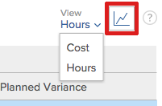

# View resource utilization information

You can view the utilization of your resources using the Utilization report. 

<!--
This report displays information about the assignments on work items for projects in your environment, like Planned, Actual, and Budgeted Hours, FTE, or Cost. These are hours, FTE, or costs associated with the assignments and not with the tasks and issues themselves.
-->

## Access requirements

You must have the following to access the Utilization report: 

<table cellspacing="0"> 
 <col> 
 <col> 
 <tbody> 
  <tr> 
   <td role="rowheader">Adobe Workfront plan*</td> 
   <td> 
Pro or higher
 </td> 
  </tr> 
  <tr> 
   <td role="rowheader">Adobe Workfront license*</td> 
   <td> 
Plan 
 </td> 
  </tr> 
  <tr> 
   <td role="rowheader">Access level configurations*</td> 
   <td> 
View or higher access to the following:
 
    <ul> 
     <li> 
Resource Management 
 </li> 
     <li> 
Projects
 </li> 
     <li> 
Portfolios
 </li> 
     <li> 
Programs
 </li> 
     <li> 
Financial Data if you want to view information by Cost
 </li> 
    </ul> 
Note: If you still don't have access, ask your Workfront administrator if they set additional restrictions in your access level. For information on how a Workfront administrator can change your access level, see <a href="../../administration-and-setup/add-users/configure-and-grant-access/create-modify-access-levels.md" class="MCXref xref">Create or modify custom access levels</a>.
 </td> 
  </tr> 
  <tr> 
   <td role="rowheader">Object permissions</td> 
   <td> 
View access to projects, portfolios, and programs to access the Utilization sectionin the Resourcingarea
  
Manage access to the project to access the Utilization sectionof a project
  
For information on requesting additional access, see <a href="../../workfront-basics/grant-and-request-access-to-objects/request-access.md" class="MCXref xref">Request access to objects in Adobe Workfront</a>.
 </td> 
  </tr> 
 </tbody> 
</table>

&#42;To find out what plan, license type, or access you have, contact your `Workfront administrator`.

<!--
You must have View access to the projects you want to view utilization information for as described in this section. If you are still unable to access this information, contact your Workfront administrator.
-->

The following sections describe how to view and use utilization information.

<!--
Prerequisites for accessing utilization information To access utilization information as described in this section, ensure that the following conditions are met: You have at least View access to the project, program, or portfolio for which you want to view the utilization information. Your Workfront administrator must grant you at least View access to Financial Data in your Access Level to be able to view cost and revenue information in the Utilization report. The Workfront administrator must enable both View Role Billing & Cost Rates as well as View User Billing & Cost Rates when they grant you the View access to Financial Data. For information about granting access to Financial Data, see Grant access to financial data. The Utilization tab is included on any layout template that is assigned to you and that is applied to either the projects you view or to the Reporting area. The Utilization section is included on any layout template that is assigned to you and that is applied to either the projects you view or to the Resourcing area. The Utilization tab is available by default in the Reporting area if the system administrator has not assigned a custom layout template to you. The Utilization section is available by default in the Resourcing area if the system administrator has not assigned a custom layout template to you.
-->

## Overview of the Utilization report

The Utilization report enables you to view the progress, cost, or revenue of a project, program, or portfolio in a single report. You can also compare revenue against cost.

For information about accessing and using the Utilization report, see the [Track progress, cost, and revenue with the Utilization report](#tracking-progress-and-cost-with-a-utilization-report) section in this article.

* [Track hours (progress)](#tracking-hours) 
* [Track cost](#tracking-cost) 
* [Track revenue](#tracking-revenue) 
* [Compare Revenue against Planned and Actual Costs](#comparing-revenue-against-cost)

### Track hours (progress)

You can track progress by viewing how the budgeted and planned hours compare to the actual hours.

When tracking the progress of a project, program, or portfolio, progress against both tasks and issues are included in the Utilization report.

The following information is available in the Utilization report when tracking Hours: 

<table cellspacing="15"> 
 <col> 
 <col> 
 <thead> 
  <tr> 
   <th>Column Title When Viewing Hours </th> 
   <th>Function </th> 
  </tr> 
 </thead> 
 <tbody> 
  <tr> 
   <td scope="col">Budgeted Hours </td> 
   <td scope="col"> 
The total budgeted hours on the included projects. You can view the total budgeted hours for the overall life of the included projects, or you can view total budgeted hours only for the specified date range (you can specify an individual week or month). 
 
Note: Budgeted Hours are populated from information available in the new Resource Budgeting area of the Business Case<em>.</em>
 
Budgeted Hours appear on the Utilization report in any of the following rows:
 
    <ul> 
     <li> Budgeted hours are summarized by job role and by individual user in the Utilization report, as follows: Individual User: Budgeted Hours are summarized for each user in the utilization report. These Budgeted Hours are associated with the tasks and issues that the user is assigned to on the included projects. (You can expand the row of the corresponding job role to view a list of users with that job role.) Job Role: Budgeted Hours are summarized by job role in the utilization report. Budgeted Hours appear in a particular job role as a result of any of the following scenarios: 
      <ul>
       <li>The job role is defined as the primary job role of the user who is assigned to the task or issue where the Budgeted Hours are associated. </li>
       <li>When you view utilization information for a single project, the job role of the user assigned the hours is used whether there is no assignment on the task or issue, another user is assigned with no job role assignment, another user is assigned with a different job role, or another team is assigned.</li>
       <li>When you view utilization information for several projects, programs, or portfolios, the job role of the user assigned the hours is used only when the role is assigned on a task or issue in a project. </li>
       <li>The job role is assigned to the task or issue that has Budgeted Hours associated, and the user assigned to the task or issue does not have a job role defined in the system.</li>
      </ul></li> 
    </ul> 
    <ul> 
     <li> 
Unallocated Hours: Budgeted Hours are displayed in the utilization report in the Unallocated Hours section when Budgeted Hours are associated with a task or issue and there is no user or role assigned to the task or issue. This section appears only when there are hours on the project that match this description and when viewing the Utilization report by or from a project. 
 
This section appears only when there are hours on the project that match this description and when viewing the Utilization report by or from a project. 
 </li> 
    </ul> 
For more information about budgeted hours, see the "Locate the Budgeted Hours of a project" section in the <a href="../../manage-work/projects/project-finances/budgeted-labor-cost.md" class="MCXref xref">Understand Budgeted Labor Cost and Budgeted Hours for projects</a> article.
 </td> 
  </tr> 
  <tr> 
   <td scope="col">Planned Hours </td> 
   <td scope="col"> 
The total planned hours on the included projects. You can view the total planned hours for the overall life of the included projects, or you can view total planned hours only for the specified date range (you can specify an individual week or month). The planned hours of projects are a total of the Planned Hours allocated to tasks and issues on the project. 
 
Tip: The planned hours from items that have a Duration of 0 are not taken into account. 
 
Planned Hours in the Utilization report take into consideration whether the Planned Hours have been re-allocated across the duration of a task or issue. When the user allocation for hours has been modified using the Workload Balancer, the data in the Utilization report can be affected if the dates selected in the Utilization report contain only a portion of a task or issue. For information about modifying allocations for users, see <a href="../../resource-mgmt/workload-balancer/manage-user-allocations-workload-balancer.md" class="MCXref xref">Manage user allocations in the Workload Balancer</a> . 
 
Planned Hours appear on the Utilization report in any of the following rows:
 
    <ul> 
     <li> Planned Hours are summarized by job role and by individual user in the utilization report, as follows: Individual User: Planned Hours are summarized for each user in the utilization report. These Planned Hours are associated with the tasks and issues that the user is assigned to on the included projects. (You can expand the row of the corresponding job role to view a list of users with that job role.) Job Role: Planned Hours are summarized by job role in the utilization report. Planned Hours appear in a particular job role as a result of any of the following scenarios: </li> 
    </ul> 
    <ul> 
     <ul> 
      <li>The job role is defined as the primary job role of the user who is assigned to the task or issue where the Planned Hours are associated. </li> 
      <li> 
When you view utilization information for a single project, the job role of the user assigned the hours is used whether there is no assignment on the task or issue, another user is assigned with no job role assignment, another user is assigned with a different job role, or another team is assigned.
 </li> 
      <li> 
When you view utilization information for several projects, programs, or portfolios, the job role of the user assigned the hours is used only when the role is assigned on a task or issue in a project.
 </li> 
      <li>The job role is assigned to the task or issue that has Planned Hours associated, and the user assigned to the task or issue does not have a job role defined in the system.</li> 
     </ul> 
     <li>Unallocated Hours: Planned Hours are displayed in the utilization report in the Unallocated Hours section when Planned Hours are associated with a task or issue and there is no user or role assigned to the task or issue. This section appears only when there are hours on the project that match this description and when viewing the Utilization report by or from a project.  </li> 
    </ul> 
For more information about planned hours, see <a href="../../manage-work/tasks/task-information/planned-hours.md" class="MCXref xref">Planned Hours overview</a>.
 </td> 
  </tr> 
  <tr> 
   <td>Actual Hours </td> 
   <td> 
 The total hours logged on the tasks, issues, and on the project for the included projects. You can view the total actual hours for the overall life of the included projects, or you can view the total actual hours only for the specified date range (you can specify an individual week or month). 
 
Warning: </b>"><b>Warning: </b>The utilization report includes hours logged to the project, children tasks, issues, and parent tasks that have at least one assignment. It does not include hours logged to parent tasks without assignments. We recommend that you do not use parent tasks as working tasks and assign only children tasks to your resources. 
 
Actual Hours appear on the utilization report in any of the following rows:
 
    <ul> 
     <li> Actual Hours are summarized by job role and by individual user in the utilization report, as follows: Individual User: Actual Hours are displayed in the utilization report in the row of the user who logged the hours. (You can expand the row of the corresponding job role to view a list of users with that job role who have logged hours.) Job Role: Actual Hours logged by users are summarized in the utilization report in the row of the corresponding job role. Actual Hours appear in a particular job role as a result of any of the following scenarios: </li> 
     <ul> 
      <li>The job role is defined as the primary job role of the user who logged the hours.</li> 
      <li>The job role of the user logging the hours is used whether there is no assignment on the task or issue, another user is assigned with no job role assignment, another user is assigned with a different job role, or another team is assigned.</li> 
      <li>The job role is assigned to the task or issue where hours are logged, and the user logging hours does not have a job role defined in the system.</li> 
     </ul> 
     <li>Other Hours: Actual Hours are displayed in the utilization report in the Other Hours section, in the row of the user who logged in the hours. Hours appear in this section when the user who logged the hours does not have a job role defined in the system. This section appears only when there are hours on the project that match this description. </li> 
    </ul> </td> 
  </tr> 
  <tr> 
   <td>Budgeted Variance (for Hours) </td> 
   <td> 
The total budgeted hours minus the total actual hours on the included projects. You can view the total budgeted variance for the overall life of the included projects, or you can view the total budgeted variance only for the specified date range (you can specify an individual week or month). 
 
If the value is positive, it is displayed in green. This indicates that the total budgeted hours are greater than the actual hours.
 
If the value is negative, it is displayed in red. This indicates that the total budgeted hours are less than the actual hours.
 
  
 </td> 
  </tr> 
  <tr> 
   <td>Planned Variance (for Hours) </td> 
   <td> 
The total planned hours minus the total actual hours on the included projects. You can view the total planned variance for the overall life of the included projects, or you can view the total planned variance only for the specified date range (you can specify an individual week or month).
 
If the value is positive, it is displayed in green. This indicates that the total planned hours are greater than the actual hours.
 
If the value is negative, it is displayed in red. This indicates that the total planned hours are less than the actual hours.
 </td> 
  </tr> 
 </tbody> 
</table>

### Track cost

You can track cost by viewing how the Budgeted Cost and Planned Cost compares to the Actual Costs.

When tracking the cost of a project, program, or portfolio, information in the Utilization report comes from tasks. Cost information from tasks is always available on the Utilization report. Cost for tasks is calculated based on the cost type of the task. For information about the cost type of tasks, see "Modify Cost Types for individual tasks" in [Track costs](../../manage-work/projects/project-finances/track-costs.md).

You can display cost information on the Utilization report in the following ways:

* For a given week or month, or for the overall project, program, or portfolio. 
* By role or individual, for projects.

The currency used on the utilization report is determined by the currency set on the project. For information about how to adjust the currency for a project, see [Change the project currency](../../manage-work/projects/project-finances/change-project-currency.md).

The following information is available in the Utilization report when tracking Cost: 

<table cellspacing="15"> 
 <col> 
 <col> 
 <thead> 
  <tr> 
   <th>Column Title When Viewing Cost </th> 
   <th> 
Function 
 </th> 
  </tr> 
 </thead> 
 <tbody> 
  <tr> 
   <td scope="col">Budgeted Cost </td> 
   <td scope="col"> 
The total Budgeted Cost on the included projects. You can view the total Budgeted Cost for the overall life of the included projects, or you can view the total Budgeted Cost only for the specified date range (you can specify an individual week or month).
 
Because the Budgeted Cost in the Utilization Report is focused on cost by role, the calculation is the same as the Budgeted Labor Cost within other areas of Workfront. For information about how Budgeted Labor Cost is calculated, see <a href="../../manage-work/projects/project-finances/budgeted-labor-cost.md" class="MCXref xref">Understand Budgeted Labor Cost and Budgeted Hours for projects</a>.
 </td> 
  </tr> 
  <tr> 
   <td scope="col">Planned Cost </td> 
   <td scope="col"> 
The total Planned Cost on the included projects. You can view the total Planned Cost for the overall life of the included projects, or you can view the total Planned Cost only for the specified date range (you can specify an individual week or month).
 
For information about how the Planned Cost for the project is calculated, see the "How Workfront calculates Planned, Budgeted, and Actual Costs" section in the article <a href="../../manage-work/projects/project-finances/track-costs.md" class="MCXref xref">Track costs</a>.
 </td> 
  </tr> 
  <tr> 
   <td scope="col">Actual Cost </td> 
   <td scope="col"> 
The total Actual Cost on the included projects. You can view the total Actual Cost for the overall life of the included projects, or you can view the total Actual Cost only for the specified date range (you can specify an individual week or month).
 
For information about how the Actual Cost for the project is calculated, see the "How Workfront calculates Planned, Budgeted, and Actual Costs" section in the article <a href="../../manage-work/projects/project-finances/track-costs.md" class="MCXref xref">Track costs</a>.
 </td> 
  </tr> 
  <tr> 
   <td>Budgeted Variance (for Cost) </td> 
   <td scope="col"> 
The total Budgeted Cost minus the total Actual Cost on the included projects. You can view the total budgeted variance for the overall life of the included projects, or you can view the total budgeted variance only for the specified date range (you can specify an individual week or month).
 
If the value is positive, it is displayed in green. This indicates that the total Budgeted Cost is greater than the Actual Cost.
 
If the value is negative, it is displayed in red. This indicates that the total Budgeted Cost is less than the Actual Cost.
 </td> 
  </tr> 
  <tr> 
   <td>Planned Variance (for Cost) </td> 
   <td> 
The total Planned Cost minus the total Actual Cost on the included projects. You can view the total planned variance for the overall life of the included projects, or you can view the total planned variance only for the specified date range (you can specify an individual week or month). 
 
If the value is positive, it is displayed in green. This indicates that the total Planned Cost is greater than the Actual Cost.
 
If the value is negative, it is displayed in red. This indicates that the total Planned Cost is less than the Actual Cost.
 </td> 
  </tr> 
 </tbody> 
</table>

### Track revenue

You can track revenue by viewing how the budgeted and planned revenue compare to the actual revenue.

When tracking the revenue of a project, program, or portfolio, revenue only from tasks is included in the Utilization report.

The information in the following table is available in the Utilization report when tracking Revenue.

For information on the specific fields and how `Workfront` calculates them, also see the following articles:

* [Track costs](../../manage-work/projects/project-finances/track-costs.md) 
* [Overview of Billing and Revenue](../../manage-work/projects/project-finances/billing-and-revenue-overview.md)

<table cellspacing="15"> 
 <col> 
 <col> 
 <thead> 
  <tr> 
   <th>Column Title When Viewing Revenue </th> 
   <th> Function</th> 
  </tr> 
 </thead> 
 <tbody> 
  <tr> 
   <td scope="col">Budgeted Revenue </td> 
   <td scope="col"> 
The total Budgeted Hours multiplied by the Role Billing Rate on the included projects. You can view the total budgeted revenue for the overall life of the included projects, or you can view the total budgeted revenue only for the specified date range (you can specify an individual week or month).
 </td> 
  </tr> 
  <tr> 
   <td scope="col">Planned Revenue </td> 
   <td scope="col"> 
Planned Revenue is the revenue associated with the Planned Hours of the tasks.
 
The way the Utilization report calculates and displays Planned Revenue for the included projects differs depending on the Revenue Type set on the task, as follows:
 
Fixed Revenue: Regardless of the task assignments, the revenue on the task is always calculated using the Fixed Amount specified on the task, as described in the section "Overview of Revenue Types" in the article <a href="../../manage-work/projects/project-finances/billing-and-revenue-overview.md" class="MCXref xref">Overview of Billing and Revenue</a>.
 
Unlike in other areas of Workfront, the Utilization report calculates Planned Revenue by dividing Fixed Revenue evenly by the number of Planned Hours on the task.  For example, a task has a revenue of $200. If there are 4 Planned Hours on the task, each hour would be $50. This is distributed on a user and role level. This distribution is unique to the Utilization report.
 
Note:  If you have a Fixed Revenue task and there are no hours (Planned or Actual), it does not display correctly in the Utilization Report because there is no way to distribute hours. 
 
Role Hourly: The revenue on the task is calculated using t he billing rate set for a specific role, multiplied by the number of Planned Hours, as described in the section "Overview of Revenue Types" in the article <a href="../../manage-work/projects/project-finances/billing-and-revenue-overview.md" class="MCXref xref">Overview of Billing and Revenue</a>. 
 
User Hourly: The revenue on the task is calculated using the billing rate set for a specific user, multiplied by the number of hours logged against the task from that user, as described in the section "Overview of Revenue Types" in the article <a href="../../manage-work/projects/project-finances/billing-and-revenue-overview.md" class="MCXref xref">Overview of Billing and Revenue</a>. 
 
Role Hourly Plus Fixed: The revenue on the task is calculated using the billing rate set for a specific role, multiplied by the number of Planned Hours. In addition, a fixed amount that is specified on the task is added to the role rate.
 
Unlike in other areas of Workfront, the Utilization report calculates Planned Revenue by dividing Fixed Revenue evenly by the number of Planned Hours on the task. 
 
User Hourly Plus Fixed: The billing rate set for a specific user, multiplied by the number of Planned Hours on the task from that user. In addition, a fixed amount that is specified on the task is added to the user rate. 
 
Unlike in other areas of Workfront, the Utilization report calculates Planned Revenue by dividing Fixed Revenue evenly by the number of Planned Hours on the task.
 
Role Hourly w/Cap: Tasks are billed hourly as in Role Hourly, but they have a maximum Cap Amount that you can specify, as described in the section "Overview of Revenue Types" in the article <a href="../../manage-work/projects/project-finances/billing-and-revenue-overview.md" class="MCXref xref">Overview of Billing and Revenue</a>.
 
 Unlike in other areas of Workfront, if the Planned Revenue exceeds the cap, the remainder is calculated as if it were Fixed Revenue, and Planned Revenue is calculated by dividing Fixed Revenue evenly by the number of hours logged on the task. 
 
User Hourly w/Cap: Tasks are billed hourly as in User Hourly, but they have a maximum Cap Amount that you can specify, a s described in the section "Overview of Revenue Types" in the article <a href="../../manage-work/projects/project-finances/billing-and-revenue-overview.md" class="MCXref xref">Overview of Billing and Revenue</a>.
 
 Unlike in other areas of Workfront, if the Planned Revenue exceeds the cap, the remainder is calculated as if it were Fixed Revenue, and Planned Revenue is calculated by dividing Fixed Revenue evenly by the number of hours logged on the task. 
 </td> 
  </tr> 
  <tr> 
   <td>Actual Revenue </td> 
   <td> 
Actual Revenue is the revenue associated with the Actual Hours of the tasks and of the project. For more information about Planned Revenue, see the section "Track Revenue amounts" in the article <a href="../../manage-work/projects/project-finances/billing-and-revenue-overview.md" class="MCXref xref">Overview of Billing and Revenue</a>.
 <!--
     Actual Revenue is displayed in the Utilization report only after the task is marked as Complete or Done (or a status that equates with Complete).
    --> 
The way that the Utilization report calculates Actual Revenue for the included projects differs depending on the Revenue Type set on the task, as follows:
 
Fixed Revenue: Regardless of the task assignments, the revenue on the task is always calculated using the Fixed Amount specified on the task, as described in the section "Overview of Revenue Types" in the article <a href="../../manage-work/projects/project-finances/billing-and-revenue-overview.md" class="MCXref xref">Overview of Billing and Revenue</a>.
 
Note:  If you have a Fixed Revenue task and there are no hours (Planned or Actual), it does not display correctly in the Utilization Report because there is no way to distribute hours. 
 
Role Hourly: The revenue on the task is calculated using t he billing rate set for a specific role, multiplied by the number of Planned Hours, as described in the section "Overview of Revenue Types" in the article <a href="../../manage-work/projects/project-finances/billing-and-revenue-overview.md" class="MCXref xref">Overview of Billing and Revenue</a>. 
 
User Hourly: The revenue on the task is calculated using the billing rate set for a specific user, multiplied by the number of hours logged against the task from that user, as described in the section "Overview of Revenue Types" in the article <a href="../../manage-work/projects/project-finances/billing-and-revenue-overview.md" class="MCXref xref">Overview of Billing and Revenue</a>. 
 
Role Hourly Plus Fixed: The billing rate set for a specific role, multiplied by the number of hours logged against the task from a user with that role. In addition, a fixed amount that is specified on the task is added to the role rate. 
 
Unlike in other areas of Workfront, the Utilization report calculates Actual Revenue by dividing Fixed Revenue evenly by the number of hours logged on the task.
 
 
Note:  If you have a Fixed Revenue task and there are no hours (Planned or Actual), it does not display correctly in the Utilization Report because there is no way to distribute hours. 
 
 
User Hourly Plus Fixed: The billing rate set for a specific user, multiplied by the number of hours logged against the task from that user. In addition, a fixed amount that is specified on the task is added to the user rate. 
 
Unlike in other areas of Workfront, the Utilization report calculates Actual Revenue by dividing Fixed Revenue evenly by the number of hours logged on the task.
 
 
Note:  If you have a Fixed Revenue task and there are no hours (Planned or Actual), it does not display correctly in the Utilization Report because there is no way to distribute hours. 
 
 
Role Hourly w/Cap: Tasks are billed hourly as in Role Hourly, but they have a maximum Cap Amount that you can specify.
 
 Unlike in other areas of Workfront, if the Actual Revenue exceeds the cap, the remainder is calculated as if it were Fixed Revenue, and Actual Revenue is calculated by dividing Fixed Revenue evenly by the number of hours logged on the task. 
 
 
Note:  If you have a Fixed Revenue task and there are no hours (Planned or Actual), it does not display correctly in the Utilization Report because there is no way to distribute hours.
 
 
User Hourly w/Cap: Tasks are billed hourly as in User Hourly, but they have a maximum Cap Amount that you can specify.
 
 Unlike in other areas of Workfront, if the Actual Revenue exceeds the cap, the remainder is calculated as if it were Fixed Revenue, and Actual Revenue is calculated by dividing Fixed Revenue evenly by the number of hours logged on the task. 
 
Note:  If you have a Fixed Revenue task and there are no hours (Planned or Actual), it does not display correctly in the Utilization Report because there is no way to distribute hours.
 
    
 
     
Project Revenue: The revenue associated with the hours logged on the project is calculated taking into account the Billing per Hour amount of the primary job role of the user who logs the time. 
 
     
Note: If the user is not associated with a job role or if the Billing per Hour of the Primary Role is zero, Workfront calculates Actual Revenue using the Billing per Hour amount for the user. If the user does not have a Billing per Hour amount in their profile, the Actual Revenue is zero. 
 
    
 </td> 
  </tr> 
  <tr> 
   <td>Budgeted Variance (for Revenue) </td> 
   <td> 
The total Actual Revenue minus Budgeted Revenue on the included projects. You can view the total budgeted variance for the overall life of the included projects, or you can view the total budgeted variance only for the specified date range (you can specify an individual week or month).
 
If the value is positive, it is displayed in green. This indicates that the total Budgeted Revenue is greater than the Actual Revenue.
 
If the value is negative, it is displayed in red. This indicates that the total Budgeted Revenue is less than the Actual Revenue.
 </td> 
  </tr> 
  <tr> 
   <td>Planned Variance (for Revenue) </td> 
   <td> 
The total Actual Revenue minus the total Planned Revenue on the included projects. You can view the total planned variance for the overall life of the included projects, or you can view the total planned variance only for the specified date range (you can specify an individual week or month). 
 
If the value is positive, it is displayed in green. This indicates that the total Planned Revenue is greater than the Actual Revenue.
 
If the value is negative, it is displayed in red. This indicates that the total Planned Revenue is less than the Actual Revenue.
 </td> 
  </tr> 
 </tbody> 
</table>

### Compare Revenue against Planned and Actual Costs

You can view the Planned or Actual Cost alongside the Planned Revenue. The Margin (%) is also displayed (margin is calculated as Revenue - Cost / Revenue).

The following information is available in the Utilization report when comparing Revenue against Planned and Actual Costs: 

<table cellspacing="15"> 
 <col> 
 <col> 
 <thead> 
  <tr> 
   <th>Column Title When Viewing Revenue vs Cost (Planned) </th> 
   <th> Function</th> 
  </tr> 
 </thead> 
 <tbody> 
  <tr> 
   <td scope="col">Planned Cost </td> 
   <td scope="col"> The total Planned Cost on the included projects. You can view the total Planned Cost for the overall life of the included projects, or you can view the total Planned Cost only for the specified date range (you can specify an individual week or month). </td> 
  </tr> 
  <tr> 
   <td scope="col">Planned Revenue </td> 
   <td scope="col"> 
Planned Revenue is the revenue associated with the Planned Hours of the tasks. 
 
The way the Utilization report calculates and displays Planned Revenue for the included projects differs depending on the Revenue Type set on the task, as follows:
 
Fixed Revenue: Regardless of the task assignments, the revenue on the task is always calculated using the Fixed Amount specified on the task.
 
Unlike in other areas of Workfront, the Utilization report calculates Planned Revenue by dividing Fixed Revenue evenly by the number of hours logged on the task.  For example, a task has a revenue of $200. If 4 hours are logged on the task, each hour would be $50. This is distributed on a user and role level. This distribution is unique to the Utilization report.
 
Note:  If you have a Fixed Revenue task and there are no hours (Planned or Actual), it does not display correctly in the Utilization Report because there is no way to distribute hours. 
 
Role Hourly: The revenue on the task is calculated using t he billing rate set for a specific role, multiplied by the number of Planned Hours. 
 
User Hourly: The revenue on the task is calculated using the billing rate set for a specific user, multiplied by the number of hours logged against the task from that user. 
 
Role Hourly Plus Fixed: The revenue on the task is calculated using the billing rate set for a specific role, multiplied by the number of Planned Hours. In addition, a fixed amount that is specified on the task is added to the role rate.
 
Unlike in other areas of Workfront, the Utilization report calculates Planned Revenue by dividing Fixed Revenue evenly by the number of hours logged on the task. 
 
User Hourly Plus Fixed: The billing rate set for a specific user, multiplied by the number of hours logged against the task from that user. In addition, a fixed amount that is specified on the task is added to the user rate. 
 
Unlike in other areas of Workfront, the Utilization report calculates Planned Revenue by dividing Fixed Revenue evenly by the number of hours logged on the task.
 
Role Hourly w/Cap: Tasks are billed hourly as in Role Hourly, but they have a maximum Cap Amount that you can specify.
 
 Unlike in other areas of Workfront, if the Planned Revenue exceeds the cap, the remainder is calculated as if it were Fixed Revenue, and Planned Revenue is calculated by dividing Fixed Revenue evenly by the number of hours logged on the task. 
 
User Hourly w/Cap: Tasks are billed hourly as in User Hourly, but they have a maximum Cap Amount that you can specify.
 
 Unlike in other areas of Workfront, if the Planned Revenue exceeds the cap, the remainder is calculated as if it were Fixed Revenue, and Planned Revenue is calculated by dividing Fixed Revenue evenly by the number of hours logged on the task. 
 </td> 
  </tr> 
  <tr> 
   <td scope="col">Margin </td> 
   <td scope="col"> 
The Margin percentage is calculated as follows:
 
Planned Revenue - Planned Cost / Planned Revenue * 100. 
 
Note:  If Planned Revenue equals 0, Margin is displayed as 0.
 </td> 
  </tr> 
  <tr> 
   <td scope="col">Column Title When Viewing Revenue vs Cost (Actual) </td> 
   <td scope="col">Function </td> 
  </tr> 
  <tr> 
   <td scope="col">Actual Cost </td> 
   <td scope="col"> 
The total Actual Cost on the included projects. You can view the total Actual Cost for the overall life of the included projects, or you can view the total Actual Cost only for the specified date range (you can specify an individual week or month).
 </td> 
  </tr> 
  <tr> 
   <td scope="col">Actual Revenue </td> 
   <td> 
Actual Revenue is the revenue associated with the Actual Hours of the tasks.
 
Actual Revenue is displayed in the Utilization report only after the task is marked as Complete or Done (or a status that equates with Complete).
 
The way that the Utilization report calculates Actual Revenue for the included projects differs depending on the Revenue Type set on the task, as follows:
 
Fixed Revenue: Regardless of the task assignments, the revenue on the task is always calculated using the Fixed Amount specified on the task.
 
Note:  If you have a Fixed Revenue task and there are no hours (Planned or Actual), it does not display correctly in the Utilization Report because there is no way to distribute hours. 
 
Role Hourly: The revenue on the task is calculated using t he billing rate set for a specific role, multiplied by the number of Planned Hours. 
 
User Hourly: The revenue on the task is calculated using the billing rate set for a specific user, multiplied by the number of hours logged against the task from that user. 
 
Role Hourly Plus Fixed: The billing rate set for a specific role, multiplied by the number of hours logged against the task from a user with that role. In addition, a fixed amount that is specified on the task is added to the role rate. 
 
Unlike in other areas of Workfront, the Utilization report calculates Actual Revenue by dividing Fixed Revenue evenly by the number of hours logged on the task.
 
 
Note:  If you have a Fixed Revenue task and there are no hours (Planned or Actual), it does not display correctly in the Utilization Report because there is no way to distribute hours. 
 
 
User Hourly Plus Fixed: The billing rate set for a specific user, multiplied by the number of hours logged against the task from that user. In addition, a fixed amount that is specified on the task is added to the user rate. 
 
Unlike in other areas of Workfront, the Utilization report calculates Actual Revenue by dividing Fixed Revenue evenly by the number of hours logged on the task.
 
 
Note:  If you have a Fixed Revenue task and there are no hours (Planned or Actual), it does not display correctly in the Utilization Report because there is no way to distribute hours. 
 
 
Role Hourly w/Cap: Tasks are billed hourly as in Role Hourly, but they have a maximum Cap Amount that you can specify.
 
 Unlike in other areas of Workfront, if the Actual Revenue exceeds the cap, the remainder is calculated as if it were Fixed Revenue, and Actual Revenue is calculated by dividing Fixed Revenue evenly by the number of hours logged on the task. 
 
 
Note:  If you have a Fixed Revenue task and there are no hours (Planned or Actual), it does not display correctly in the Utilization Report because there is no way to distribute hours.
 
 
User Hourly w/Cap: Tasks are billed hourly as in User Hourly, but they have a maximum Cap Amount that you can specify.
 
 Unlike in other areas of Workfront, if the Actual Revenue exceeds the cap, the remainder is calculated as if it were Fixed Revenue, and Actual Revenue is calculated by dividing Fixed Revenue evenly by the number of hours logged on the task. 
 
 
Note:  If you have a Fixed Revenue task and there are no hours (Planned or Actual), it does not display correctly in the Utilization Report because there is no way to distribute hours.
 
 </td> 
  </tr> 
  <tr> 
   <td scope="col">Margin </td> 
   <td> 
The Margin percentage is calculated as follows:
 
Actual Revenue - Actual Cost / Actual Revenue * 100. 
 
Note:  If Actual Revenue equals 0, Margin is displayed as 0.
 </td> 
  </tr> 
 </tbody> 
</table>

## Track progress, cost, and revenue with the Utilization report

You can track the progress or cost of a project, program, or portfolio.

You can display information on the Utilization report for a given week or month, or for the overall life of the projects.

To track the progress or cost of one or more projects with a Utilization report:

<ol> 
 <li value="1">Do any of the following, depending on whether you are viewing utilization information for an individual project, multiple projects, a program, or a portfolio: 
  <ul>
   <li>To view utilization information for a single project: 
    <ol>
     <li value="1">Go to a project for which you want to view utilization information, then click Show More> Utilization.</li>
     <li value="2">
Utilization information is displayed automatically when viewing an individual project, and applying a filter is not required.  If you want to filter the Utilization report, you can apply a filter, then click Run. For information about how to filter the Utilization report, see the section <a href="#filtering-utilization-information" class="MCXref xref">Filter utilization information</a> in this article.  Utilization information is displayed for individual users and roles (users are grouped within their associated role).
</li>
    </ol></li>
   <li>To view utilization information for multiple projects: 
    <ol>
     <li value="1">Click the Main Menu icon in the upper-right corner of Workfront, then click Resourcing, then Utilization in the left panel.</li>
     <li value="2">
Apply a filter to the Utilization report, then click Run.  You must specify one or more projects in the filter prior to running the Utilization report. For information about how to filter the Utilization report, see the section <a href="#filtering-utilization-information" class="MCXref xref">Filter utilization information</a> in this article. Utilization information is displayed for individual roles and projects (roles are grouped within their associated project). 
</li>
    </ol></li>
   <li>To view utilization information for a program: 
    <ol>
     <li value="1">Click the Main Menu icon in the upper-right corner of Workfront, then click Resourcing, then Utilization in the left panel and click the Show>Programs.</li>
     <li value="2">
Apply a filter to the Utilization report, then click Run.  You must specify one or more programs in the filter prior to running the Utilization report. For information about how to filter the Utilization report, see the section <a href="#filtering-utilization-information" class="MCXref xref">Filter utilization information</a> in this article.  Utilization information is displayed for individual projects and programs (projects are grouped within their associated program). 
</li>
    </ol></li>
   <li>To view utilization information for a portfolio: 
    <ol>
     <li value="1">Click the Main Menu icon in the upper-right corner of Workfront, then click Resourcing, then Utilization in the left panel and click Show>Portfolios.</li>
     <li value="2">
Apply a filter to the Utilization report, then click Run.  You must specify one or more portfolios in the filter prior to running the Utilization report. For information about how to filter the Utilization report, see the section <a href="#filtering-utilization-information" class="MCXref xref">Filter utilization information</a> in this article.  Utilization information is displayed for individual projects, programs, and portfolios (projects are grouped within their associated program, and programs are grouped within their associated portfolio). 
</li>
    </ol></li>
  </ul></li> 
 <li value="2">In the upper-right corner of the Utilization report, click the View drop-down menu, then select from the following: 
  <ul>
   <li>Cost</li>
   <li>Hours</li>
   <li>Revenue</li>
   <li>Revenue vs. Cost (Planned)</li>
   <li>Revenue vs Cost (Actual).</li>
  </ul> The option you select determines which columns and information are available in the report. For more details about the information available in each column, see the table in Step 5. 

</li> 
 <li value="3">(Optional) Select the date range for which utilization information is displayed. You can display information for a given week or month to the left of the Overall column. Information for the overall project, program, or portfolio is always displayed in the Overall column. For more information, see the section <a href="#adjusting-the-date-range-for-which-information-is-displayed" class="MCXref xref">Adjust the date range for which information is displayed</a> in this article. </li> 
 <li value="4">(Optional) Click any column title to sort the utilization report by the information in that column. Sorting works only when you include multiple items in your report. For example, you can sort the results of your report when you are looking at more than one project (or portfolio or program). You cannot sort the results when you are looking at only one project (or one portfolio or one program) at a time. </li> 
 <li value="5">Use the information in the section <a href="#understanding-the-utilization-report" class="MCXref xref">Overview of the Utilization report</a> in this article to learn about each column in the Utilization report.</li> 
</ol>

## Filter utilization information

You can filter the content displayed in a Utilization report on a project. You can filter on tasks, issues, roles, and custom data. When you apply a filter to the Utilization report, the Utilization report contains information based on the criteria that you select.

You can create a filter, or apply a filter that you previously created.

* [Create or modify a filter](#creating-a-filter) 
* [Apply a saved filter](#applying-a-saved-filter) 
* [Duplicate a filter](#duplicating-a-filter) 
* [Rename a filter](#renaming-a-filter) 
* [Delete a filter](#deleting-a-filter)

### Create or modify a filter

When you create a filter, all `Workfront` users who have access to the Utilization report also have access to the filter you create. Similarly, when you modify an existing filter, the filter is modified for all users who have access to the Utilization report.

To create or modify a filter:

<ol> 
 <li value="1"> To filter utilization information for a single project, go to the project for which you want to filter utilization information, then click Show More>Utilization in the left panel. 
Or
 To filter utilization information for multiple projects, for a program, or for a portfolio, click the Main Menu icon in the upper-right corner of Workfront, Resourcing, Utilization in the left panel, then Show>Programs or Portfolios or Projects. </li> 
 <li value="2"> 
Click the Filter icon to display the filter options. 
 </li> 
 <li value="3">(Conditional) To modify an existing filter, click the Filter drop-down menu, then select the filter you want to modify.</li> 
 <li value="4"> 
Specify the following information to create or modify the filter:
 
  <ul> 
   <li>Portfolios: Begin typing the name of the portfolio that contains the information you want to include in the Utilization report, then click the name when it appears in the drop-down menu. Repeat this process to include information from multiple portfolios in the Utilization report. To include all portfolios from your system in your filter, click Add all. (This option is available only if you have fewer than 10 portfolios in your system.)</li> 
   <li>Programs: Begin typing the name of the program that contains the information you want to include in the Utilization report, then click the name when it appears in the drop-down menu. Repeat this process to include information from multiple tasks in the Utilization report. If you already designated any portfolios in the filter, the program you specify must be from the portfolios already included in the filter. If it is not, data from the program is not included in the Utilization report. To include all programs from your system in your filter, click Add all. (This option is available only if you have fewer than 20 programs in your system.)</li> 
   <li>Projects: Begin typing the name of the project that contains the information you want to include in the Utilization report, then click the name when it appears in the drop-down menu. Repeat this process to include information from multiple projects in the Utilization report. If you already designated any portfolios or programs in the filter, the project you specify must be from one of the portfolios or programs already included in the filter. If it is not, data from the project is not included in the Utilization report. To include all projects from your system in your filter, click Add all. (This option is available only if you have fewer than 250 projects in your system.)</li> 
   <li>Tasks: Begin typing the name of the task that contains the information you want to include in the Utilization report, then click the name when it appears in the drop-down menu. Repeat this process to include information from multiple tasks in the Utilization report. If you already designated any portfolios, programs, or projects in the filter, the task you specify must be from one of the portfolios, programs, or projects already included in the filter. If it is not, data from the task is not included in the Utilization report.</li> 
   <li>Issues: Begin typing the name of the issue that contains the information you want to include in the Utilization report, then click the name when it appears in the drop-down menu. Repeat this process to include information from multiple issues in the Utilization report. If you already designated any portfolios, programs, or projects in the filter, the issue you specify must be from one of the portfolios, programs, or projects already included in the filter. If it is not, data from the issue is not included in the Utilization report. Cost information for issues is not always included in the Utilization report. For more information about when cost information for issues is included in the Utilization report, see the section <a href="#tracking-progress-and-cost-with-a-utilization-report" class="MCXref xref">Track progress, cost, and revenue with the Utilization report</a> in this article. </li> 
   <li>Roles: Begin typing the name of the role you want to be represented in the Utilization Report, then click the name when it appears in the drop-down menu. Repeat this process to include additional roles. The Utilization Report contains information only for the roles you specify. For example, a task contains 10 Actual Hours. 6 of those hours are from a Designer role and 4 are from a Developer role. If you filter the Utilization Report by role for Designer, the 4 hours that come from the Developer role are excluded from the report.</li> 
   <li> 
Add Filter Rule: Click Add Filter Rule, click in the first field, then begin typing the field name that you want to filter on. If the field is available, it populates for each object where it can be associated. Click the name of the field to add it to the filter. 
 <note type="important">
     You must type the field name and not the field label. The field label displays on a custom form attached to an object. For information about the difference between the label and the name of a custom field, see 
     <a href="../../administration-and-setup/customize-workfront/create-manage-custom-forms/create-or-edit-a-custom-form.md" class="MCXref xref">Create or edit a custom form</a>. 
    </note> 
For more information about the fields you see in the columns, see<a href="../../workfront-basics/navigate-workfront/workfront-navigation/workfront-terminology-glossary.md" class="MCXref xref">Glossary of Adobe Workfront terminology</a>.  Choose the filter and condition modifiers for the filter. The available modifiers are described in <a href="../../reports-and-dashboards/reports/reporting-elements/filter-condition-modifiers.md" class="MCXref xref">Filter and condition modifiers</a>.
 </li> 
  </ul> </li> 
 <li value="5">To create a new filter, click Save Filter. Or To modify an existing filter, click the drop-down arrow next to the Save Filter button, then click Save New Filter. In the Filter Name field, specify a name for the filter, then click Save. The Utilization area is filtered with the information you included in the filter.</li> 
</ol>

### Apply a saved filter

1. To apply a filter on the Utilization Report for a single project, go to the project for which you want to filter, then click Show More>Utilization in the left panel. Or
   To apply a filter on the Utilization Report for multiple projects, for a program, or for a portfolio, click the Main Menu icon in the upper-right corner of Workfront, Resourcing, Utilization in the left panel, then Show>Programs or Portfolios or Projects. 
1. Click `Saved Filters`, then select the filter you want to apply from the drop-down menu.

### Duplicate a filter

<ol> 
 <li value="1"> To duplicate a filter on the Utilization Report for a single project, go to the project for which you want to duplicate the filter, then click Show More>Utilization in the left panel. 
Or
 To duplicate a filter on the Utilization Report for multiple projects, for a program, or for a portfolio, click the Main Menu icon in the upper-right corner of Workfront, then click Resourcing, then Utilization in the left panel. </li> 
 <li value="2"> 
Click Saved Filters, mouse over the filter you want to duplicate in the drop-down menu, then click the Duplicate icon. 
 
   The Duplicate Filter dialog box is displayed.
 </li> 
 <li value="3">In the Filter Name field, specify a name for the new filter, then click Save.</li> 
</ol>

### Rename a filter

When you rename a filter, all `Workfront` users who have access to the Utilization report see the new name that you choose.

To rename a filter:

<ol> 
 <li value="1"> To rename a filter on the Utilization Report for a single project, go to the project for which you want to rename the filter, then click Show More>Utilization in the left panel. 
Or
 To rename a filter on the Utilization Report for multiple projects, for a program, or for a portfolio, click the Main Menu icon in the upper-right corner of Workfront, then click Resourcing, then Utilization in the left panel. </li> 
 <li value="2">Click Saved Filters, mouse over the filter you want to duplicate in the drop-down menu, then click the Rename icon.  The Rename Filter dialog box is displayed.</li> 
 <li value="3">In the Filter Name field, specify a name for the new filter, then click Save.</li> 
</ol>

### Delete a filter

When you delete a filter, the filter is deleted for all `Workfront` users who have access to the Utilization report.

To delete a filter:

<ol> 
 <li value="1"> To delete a filter on the Utilization Report for a single project, go to the project for which you want to delete the filter, then click Show More>Utilization in the left panel. 
Or
 To delete a filter on the Utilization Report for multiple projects, for a program, or for a portfolio, click the Main Menu icon in the upper-right corner of Workfront, then click Resourcing, then Utilization in the left panel. </li> 
 <li value="2"> 
Click Saved Filters, mouse over the filter you want to duplicate in the drop-down menu, then click the Delete icon. 
 
  
 </li> 
 <li value="3">Click Delete when prompted whether you want to delete the filter. </li> 
</ol>

## Adjust the date range for which information is displayed

You can adjust the date range for which utilization information is displayed. You can select a past or future date. Changes you make are visible only to you.

1. To adjust the date range of the Utilization Report for a single project, go to the project for which you want to adjust the date range, then click Show More>Utilization in the left panel. Or
   To adjust the date range of the Utilization report for multiple projects, for a program, or for a portfolio, click the Main Menu icon in the upper-right corner of Workfront, then click Resourcing, then Utilization in the left panel. 
1. Click the date range next to the `Export` button.

   The current week is selected by default. 

1. Select from the following options:

  * `Week:` Select this option to select a given week (from Sunday through Saturday).
  * `Month:` Select this option to select a given month.

   The date range you select is displayed in the utilization report, to the left of the `Overall` column.  
   `Workfront` remembers whether you want to view a week or month view. The next time you access the utilization report, the current week or current month is shown, depending on the option you select.

## Export utilization information

You can export utilization information for a project, program, or portfolio from `Workfront`. Information can be exported only in XLSX, TSV, and PDF formats.

When viewed in Microsoft Excel, negative numbers are displayed in parenthesis.

To export utilization information:

1. To export utilization information for a single project, go to the project for which you want to export utilization information, then click the Utilization tab (depending on your layout settings, this might be located under the More tab). Or
   To export utilization information for multiple projects, for a program, or for a portfolio, click the Main Menu icon in the upper-right corner of Workfront, then click Resourcing, then Utilization in the left panel. 
1. Click `Export`, located in the upper-left corner of the `Utilization` tab.

1. Select from the following options:

  * `PDF:` Exports the report in PDF format. This is the recommended format if you are planning to print the report.  
    Select either `Letter - Portrait`, `Letter - Landscape`, or `Other Sizes` (provides options for exporting in Legal (8.5" x 14"), Ledger (11" x 17"), and A4).  
    Depending on the operating system you use, you might have the option of opening or saving the file. Either open the file with the associated application or save it to your hard drive.
  
  * `Excel:` Exports the report in XLSX format. This is the recommended format if you are planning to further analyze the data in Excel.  
    Depending on the operating system you use, you might have the option of opening or saving the file. Either open the file with the associated application or save it to your hard drive.
  
  * `Tab Delimited:` Exports the report in TSV format. This is the recommended format if you are planning to import the data into third-party software for further analysis.  
    Depending on the operating system you use, you might have the option of opening or saving the file. Either open the file with the associated application or save it to your hard drive.

1. Read the information in the article [Export data](../../reports-and-dashboards/reports/creating-and-managing-reports/export-data.md) to understand how to use the exported file.

## View utilization information in a chart

You can visualize the data from the Utilization report in a chart view.

<ol> 
 <li value="1"> To view a Utilization report for a single project in a chart format, go to the project you want to view, then click Show More> Utilization in the left panel. 
Or
 To view a Utilization report in a chart format for multiple projects, for a program, or for a portfolio, click Reporting in the Global Navigation Bar to go to the Reporting area, then click the Utilization tab. </li> 
 <li value="2">In the upper-right corner of the Utilization report, click the Chart icon.  The Utilization report is displayed in a chart view. </li> 
 <li value="3">(Optional) Configure this to show Projects, Programs, or Portfolios by selecting the appropriate option from the Show drop-down menu.</li> 
 <li value="4"> 
(Optional) Mouse over a specific point in time on the report to view data for that point in time. 
 </li> 
 <li value="5">(Optional) Adjust the filters to decide what information is displayed in the chart. For information about adjusting the filters, see the section <a href="#filtering-utilization-information" class="MCXref xref">Filter utilization information</a> in this article. </li> 
 <li value="6">(Optional) Configure the timeframe of the chart report, as described in the section <a href="#adjusting-the-date-range-for-which-information-is-displayed" class="MCXref xref">Adjust the date range for which information is displayed</a> in this article. </li> 
</ol>

