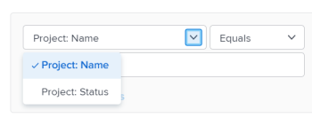
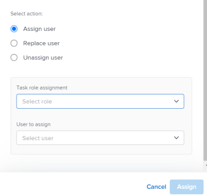
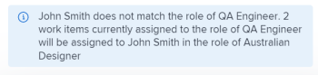
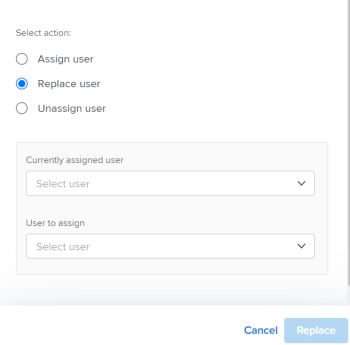
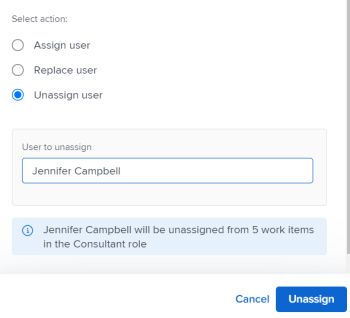

# Assign work in bulk using the *Adobe Workfront*<![CDATA[  ]]>*Workload Balancer*

You can manually assign work items to users using the *Adobe Workfront* *Workload Balancer*.

For general information about assigning work to users using the *Workload Balancer*, see [Overview of assigning work in the Adobe Workfront Workload Balancer](../../resource-mgmt/workload-balancer/assign-work-in-workload-balancer.md).

## Access requirements

You must have the following access to perform the steps in this article:

<table cellspacing="0"> 
 <col> 
 <col> 
 <tbody> 
  <tr> 
   <td role="rowheader"><em>Adobe Workfront</em> plan*</td> 
   <td> 
Any 
 </td> 
  </tr> 
  <tr> 
   <td role="rowheader"><em>Adobe Workfront</em> license*</td> 
   <td> 
<em>Plan</em> 
 </td> 
  </tr> 
  <tr> 
   <td role="rowheader">Access level*</td> 
   <td> 
Edit access to&nbsp;the following:
 
    <ul> 
     <li> 
Resource Management
 </li> 
     <li> 
Projects
 </li> 
     <li> 
Tasks
 </li> 
     <li> 
Issues
 </li> 
    </ul> 
Note: If you still don't have access, ask your <em>Workfront administrator</em> if they set additional restrictions in your access level. For information on how a <em>Workfront administrator</em> can change your access level, see <a href="../../administration-and-setup/add-users/configure-and-grant-access/create-modify-access-levels.md" class="MCXref xref">Create or modify custom access levels</a>.
 </td> 
  </tr> 
  <tr> 
   <td role="rowheader">Object permissions</td> 
   <td> 
Contribute permissions or higher to the projects, tasks, and issues 
 
For information on requesting additional access, see <a href="../../workfront-basics/grant-and-request-access-to-objects/request-access.md" class="MCXref xref">Request access to objects in Adobe Workfront</a>.
 </td> 
  </tr> 
 </tbody> 
</table>

&#42;To find out what plan, license type, or access you have, contact your *Workfront administrator*.

## Considerations for making bulk assignments in the *Workload Balancer*

* You can quickly manage user assignments for multiple tasks and issues across one or more projects. Changes in assignments are visible in the *Workload Balancer* immediately. 
* You cannot assign resources to work items that are completed, or to items that are on a completed project. 
* You can do the following when assigning users in bulk:

  * Assign a user to all work items currently assigned to a job role.
  * Replace user assignments between users.
  * Unassign a user from all their work items.

` `**Examples: **``

* You are responsible for making user assignments on several new projects. The projects were originally created from templates and job roles are already assigned to the various tasks within the projects. You want to assign a specific user, Jackie Simms, to all tasks that are currently assigned to a job role. You can use the Assign function to assign these tasks to Jackie Simms.
* 45 tasks across 3 different projects are assigned to Jackie Simms. Jackie leaves the organization, and now you need to reassign her tasks to another user. You can use the Replace function to assign these tasks to the new person. 
* 10 tasks across 2 different projects are assigned to another user, Rick Kuvec. You realize that&nbsp;Rick was assigned to these tasks in error, but you are not sure who the they need to be assigned to at this time. You need to unassign Rick to all the tasks at the same time. You can use the Unassign function to remove Rick from these tasks.

## Assign work in bulk in the *Workload Balancer*

<ol> 
 <li value="1"> 
Go to the <em>Workload Balancer</em> where you want to assign work.
 
You can assign work to users using the <em>Workload Balancer</em> in the Resourcing area, at the project, or at the team level. For more information about where the <em>Workload Balancer</em> is located in&nbsp;<em>Workfront</em>, see <a href="../../resource-mgmt/workload-balancer/locate-workload-balancer.md" class="MCXref xref">Locate the&nbsp;Workload Balancer</a>.
 <note type="important">
   You cannot view or assign issues from the Unassigned Work area. You can only reassign issues already assigned to users in the Assigned Work area. Otherwise, you can assign issues from a list or at the issue level. For information, see 
   <a href="../../manage-work/issues/manage-issues/assign-issues.md" class="MCXref xref">Assign issues</a>.
  </note> </li> 
 <li value="2"> 
Click Bulk Assignments at the top of the <em>Workload Balancer</em>. 
 
The Bulk Assignments panel opens to the right of the <em>Workload Balancer</em>. 
 </li> 
 <li value="3"> 
(Conditional)&nbsp;If you are accessing the <em>Workload Balancer</em> from the Resourcing area or for a team, expand the Project: Name drop-down menu to select the project or projects that you want to make assignments for. You can select projects by name (this is the default option) or by status. 
 <note type="note">
   The Project Name is selected by default when you access the 
   <em>Workload Balancer</em> for a project.
  </note> 
  
 </li> 
 <li value="4"> 
(Optional) Click Select project tasks to select the task or tasks that you want to make assignments for, then in the Task: Name drop-down menu, select tasks by name (this is the default option) or status. 
 <note type="note">
   You cannot select tasks in a Complete status.
  </note> 
  
 <note type="tip">
   Leave this selection blank if you want to make bulk assignments for issues as well as tasks.
   <draft-comment>
    
   </draft-comment>
    
  </note> </li> 
 <li value="5"> 
(Optional)&nbsp;Click the Delete icon  next to one of the selected criteria
 
Or
 
Click Clear all in the upper-right corner of the Bulk&nbsp;Assignments panel to remove all selections. 
 </li> 
 <li value="6"> 
Select one of the following options and continue with the steps described below:
 
  <ul> 
   <li> 
<a href="#assigning-a-user" class="MCXref xref">Assign user</a> 
 </li> 
   <li> 
<a href="#swapping-a-user" class="MCXref xref">Replace user</a> 
 </li> 
   <li> 
<a href="#unassigning-a-user" class="MCXref xref">Unassign user</a> 
 </li> 
  </ul> <note type="tip">
   If no items match the selected filters, these options are dimmed. 
  </note> </li> 
</ol>

### Assign user

When you assign a user using Bulk Assignments in the *Workload Balancer*, the following things occur:

* A user is assigned to all work items currently assigned to a specified role within the selected projects.
* The user is not assigned to the following types of work items:

  * Items that are already assigned to a user.
  * Completed items.

* If the user you selected is not associated with the specified role, the role is replaced by the user in the user's Primary Role.

To assign a user to work items previously assigned to job roles:

<ol> 
 <li value="1"> 
Start assigning work items using Bulk Assignments in the <em>Workload Balancer</em> as described above and select Assign. 
 </li> 
 <li value="2"> 
In the Task role assignment field, click the drop-down arrow to choose from a list of roles. Only roles currently assigned within the specified projects are displayed. This is a required field. 
 
  
 </li> 
 <li value="3"> 
In the User to assign field, click the drop-down arrow to choose from a list of suggested users or to type another user name. Users listed in the list by default match the criteria for Smart Assignments.&nbsp;For more information, see <a href="../../manage-work/tasks/assign-tasks/smart-assignments.md" class="MCXref xref">Smart assignments overview</a>.
 
<em>Workfront</em> displays a note about the number of items where the user you specified will be assigned and what job role they will replace. 
 
  
 </li> 
 <li value="4"> 
Click Assign.
 
The specified roles are replaced with the user you selected. 
 
You receive a confirmation about how many work items have had the selected role replaced with the selected user. 
 </li> 
</ol>

### Replace user

You can replace a user who is already assigned to work items with another user in the selected projects.

When you replace a user with another user using Bulk Assignments in the *Workload Balancer*, the following things occur:

* The replacement user is assigned to all work items currently assigned to an original user within the selected projects.

* The new user is not assigned to any work items that are already marked Complete.
* If the role associated with the first user does not match any of the roles of the second user, the second user is assigned in their Primary Role.

To replace a user with another user:

<ol> 
 <li value="1">Start assigning work items in the <em>Workload Balancer</em> as described above and select Replace. </li> 
 <li value="2"> 
In the Currently assigned user field, click the drop-down arrow to choose from a list of users. Only users currently assigned to incomplete work items within the specified projects are displayed. This is a required field. 
 
  
 </li> 
 <li value="3"> 
In the User to assign field, click the drop-down arrow to choose from a list of suggested users or to type another user name. Users listed in the list by default match the criteria for Smart Assignments.&nbsp;For more information, see <a href="../../manage-work/tasks/assign-tasks/smart-assignments.md" class="MCXref xref">Smart assignments overview</a>.
 
<em>Workfront</em> displays a note about the number of items where the currently assigned user will replace the second user and which roles they will replace. 
 
  
 </li> 
 <li value="4"> 
Click&nbsp;Replace. 
 
The first user selected is replaced by the second user in all work items from the selected project. 
 
You receive a confirmation about how many work items have had the original user assignment replaced with the selected second user. 
 </li> 
</ol>

### Unassign user

You can unassign a user from all work items that the user is assigned to in the selected projects.

When you unassign a user from all their assignments using Bulk Assignments in the *Workload Balancer*, the following things occur:

* The specified user is removed from all the work items they are assigned to.
* If the unassigned user is associated with job roles, the job roles remain assigned to the work items when the user is removed.

* If the specified user is assigned to work items that are completed, the user remains assigned to those work items.

For more information about user and job role assignments, see [Overview of assigning work in the Adobe Workfront Workload Balancer](../../resource-mgmt/workload-balancer/assign-work-in-workload-balancer.md).

To unassign a user from work items in the selected projects or for the selected tasks or issues where they are assigned:

<ol> 
 <li value="1"> Start assigning work items in the <em>Workload Balancer</em> as described above and select Unassign. </li> 
 <li value="2"> 
In the User to unassign field, click the drop-down arrow to choose from a list of users. Only users currently assigned to incomplete work items within the specified projects display. This is a required field. 
 
  
 
 <em>Workfront</em> displays a note about the number of items where the currently assigned user will be unassigned. 
 
  
 </li> 
 <li value="3">Click Unassign. You receive a confirmation about the number of work items where the specified user was removed. </li> 
</ol>

&nbsp;
