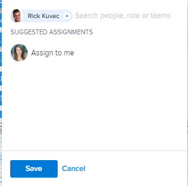

# Assign work manually using the *`Adobe Workfront`* *`Workload Balancer`* {#assign-work-manually-using-the-adobe-workfront-workload-balancer}

You can manually assign work items to users using the *`Adobe Workfront`* *`Workload Balancer`*. 

For general information about assigning work to users using the *`Workload Balancer`*, see [Overview of assigning work in the Adobe Workfront Workload Balancer](assign-work-in-workload-balancer.md). 

## Access requirements {#access-requirements}

You must have the following access to perform the steps in this article:

<table style="width: 100%;margin-left: 0;margin-right: auto;mc-table-style: url('../../Resources/TableStyles/TableStyle-List-options-in-steps.css');" class="TableStyle-TableStyle-List-options-in-steps" cellspacing="0"> 
 <col class="TableStyle-TableStyle-List-options-in-steps-Column-Column1"> 
 <col class="TableStyle-TableStyle-List-options-in-steps-Column-Column2"> 
 <tbody> 
  <tr class="TableStyle-TableStyle-List-options-in-steps-Body-LightGray"> 
   <td class="TableStyle-TableStyle-List-options-in-steps-BodyE-Column1-LightGray" role="rowheader">Adobe Workfront plan*</td> 
   <td class="TableStyle-TableStyle-List-options-in-steps-BodyD-Column2-LightGray"> 
Any 
 </td> 
  </tr> 
  <tr class="TableStyle-TableStyle-List-options-in-steps-Body-MediumGray"> 
   <td class="TableStyle-TableStyle-List-options-in-steps-BodyE-Column1-MediumGray" role="rowheader">Adobe Workfront license*</td> 
   <td class="TableStyle-TableStyle-List-options-in-steps-BodyD-Column2-MediumGray"> 
Plan 
 </td> 
  </tr> 
  <tr class="TableStyle-TableStyle-List-options-in-steps-Body-LightGray"> 
   <td class="TableStyle-TableStyle-List-options-in-steps-BodyE-Column1-LightGray" role="rowheader">Access level*</td> 
   <td class="TableStyle-TableStyle-List-options-in-steps-BodyD-Column2-LightGray"> 
Edit access to&nbsp;the following:
 
    <ul> 
     <li> 
Resource Management
 </li> 
     <li> 
Projects
 </li> 
     <li> 
Tasks
 </li> 
     <li> 
Issues
 </li> 
    </ul> 
Note: If you still don't have access, ask your Workfront administrator if they set additional restrictions in your access level. For information on how a Workfront administrator can change your access level, see <a href="create-modify-access-levels.md" class="MCXref xref">Create or modify custom access levels</a>.
 </td> 
  </tr> 
  <tr class="TableStyle-TableStyle-List-options-in-steps-Body-MediumGray"> 
   <td class="TableStyle-TableStyle-List-options-in-steps-BodyB-Column1-MediumGray" role="rowheader">Object permissions</td> 
   <td class="TableStyle-TableStyle-List-options-in-steps-BodyA-Column2-MediumGray"> 
Contribute permissions or higher to the projects, tasks, and issues 
 
For information on requesting additional access, see <a href="request-access.md" class="MCXref xref">Request access to objects in Adobe Workfront</a>.
 </td> 
  </tr> 
 </tbody> 
</table>

&#42;To find out what plan, license type, or access you have, contact your *`Workfront administrator`*.

## Manually assign work in the *`Workload Balancer`* {#manually-assign-work-in-the-workload-balancer}

You can assign work items that have not yet been assigned to a user or reassign items that have been assigned to users in the *`Workload Balancer`*.

1.  Go to the *`Workload Balancer`* where you want to assign work.

   You can assign work to users using the *`Workload Balancer`* in the Resourcing area, at the project, or at the team level. For more information about where the *`Workload Balancer`* is located in  *`Workfront`*, see [Locate the Workload Balancer](locate-workload-balancer.md).

1.  (Optional) Go to the `Unassigned Work` area and apply a filter to view work items

   Or

   Go to the `Assigned Work` area and expand the name of a user to view the work items assigned to them, if you want to reassign their items.

   >[!IMPORTANT] {type="important"}
   >
   >`You cannot view or assign issues from the Unassigned Work area. You can only reassign issues already assigned to users in the Assigned Work area. Otherwise,`you can assign issues from a list or at the issue level. For information, see [Assign issues](assign-issues.md).

1.  Click the `More menu`  on the bar of a work item, then click `Assign this to`. 

   

   ` `**Tip: **`` `You can also use the following shortcuts to assign tasks or issues:` 

    
    
    * `In Windows: CTRL+click the task or issue bar.` 
    * `In Mac: CMD+click the task or issue bar.` 
    
    

1.  Start typing the name of a user, job role, or team that you want to assign to the item in the `Search people, role or teams` field, select it when it displays in the list, then click  `Save`. 

   

   This assigns or reassigns the work item to the specified assignees.

   If you assign an item to just a team or a job role, the item displays only in the Unassigned Work area. You must assign work items to users in order to display them in the Assigned Work area of the *`Workload Balancer`*.

   ` `**Tip: **`` You can assign multiple users, or job roles, and you can assign only one team. `You can assign only active users, `job roles`, and teams.`

   `If a user, `job role`, or a team was assigned before they were deactivated, they remain assigned to the work item. In this case, we recommend the following:` 

    
    
    *  `Reassign the work item to active resources.` 
    *  `Associate the users in a deactivated team with an active team and reassign the work item to the active team.` 
    
    

1.  (Optional) Click the `Show allocations icon` , then click the `More menu`  > `Edit allocations`.

   Or

   Double-click a daily or weekly allocation to modify the amount of time the user is allocated to the work item.

   For information about modifying user allocations in the *`Workload Balancer`*, see the "Modify user allocations"&nbsp;section in the article [Manage user allocations in the Workload Balancer](manage-user-allocations-workload-balancer.md).

   For information about removing assignments from a work item using the *`Workload Balancer`*, see [Unassign work in the Adobe Workfront Workload Balancer](unassign-work-in-workload-balancer.md). 

   &nbsp;

