# Manage filters in the *`Workload Balancer`* {#manage-filters-in-the-workload-balancer}

As a resource manager, you can use the *`Workload Balancer`* to view and manage the workload of your users. For more general information about the *`Workload Balancer`*, see the following articles:

*  [Overview of the Workload Balancer](overview-workload-balancer.md)
* [Navigate the Workload Balancer](navigate-the-workload-balancer.md) 

To efficiently find work items and to focus on the users you manage, we strongly recommend that you use filters in the *`Workload Balancer`*. This allows you to display the correct information before you start managing the assignments of your resources. 

This article contains information about filters in the *`Workload Balancer`*. For information about filters in *`Workfront`*, see [Filters overview in Adobe Workfront](filters-overview.md). 

## Access requirements {#access-requirements}

You must have the following:

<table style="width: 100%;margin-left: 0;margin-right: auto;mc-table-style: url('../../Resources/TableStyles/TableStyle-List-options-in-steps.css');" class="TableStyle-TableStyle-List-options-in-steps" cellspacing="0"> 
 <col class="TableStyle-TableStyle-List-options-in-steps-Column-Column1"> 
 <col class="TableStyle-TableStyle-List-options-in-steps-Column-Column2"> 
 <tbody> 
  <tr class="TableStyle-TableStyle-List-options-in-steps-Body-LightGray"> 
   <td class="TableStyle-TableStyle-List-options-in-steps-BodyE-Column1-LightGray" role="rowheader">Adobe Workfront plan*</td> 
   <td class="TableStyle-TableStyle-List-options-in-steps-BodyD-Column2-LightGray"> 
Any plan
 </td> 
  </tr> 
  <tr class="TableStyle-TableStyle-List-options-in-steps-Body-MediumGray"> 
   <td class="TableStyle-TableStyle-List-options-in-steps-BodyE-Column1-MediumGray" role="rowheader">Adobe Workfront license*</td> 
   <td class="TableStyle-TableStyle-List-options-in-steps-BodyD-Column2-MediumGray"> 
Plan or higher
 </td> 
  </tr> 
  <tr class="TableStyle-TableStyle-List-options-in-steps-Body-LightGray"> 
   <td class="TableStyle-TableStyle-List-options-in-steps-BodyE-Column1-LightGray" role="rowheader">Access level*</td> 
   <td class="TableStyle-TableStyle-List-options-in-steps-BodyD-Column2-LightGray"> 
View or higher access to&nbsp;the following:
 
    <ul> 
     <li> 
Resource Management
 </li> 
     <li> 
Projects
 </li> 
     <li> 
Tasks
 </li> 
     <li> 
Issues
 </li> 
    </ul> 
View or higher access to Filters, Views, and Groupings when building filters 
 
Note: If you still don't have access, ask your Workfront administrator if they set additional restrictions in your access level. For information on how a Workfront administrator can change your access level, see <a href="create-modify-access-levels.md" class="MCXref xref">Create or modify custom access levels</a>.
 </td> 
  </tr> 
  <tr class="TableStyle-TableStyle-List-options-in-steps-Body-MediumGray"> 
   <td class="TableStyle-TableStyle-List-options-in-steps-BodyB-Column1-MediumGray" role="rowheader">Object permissions</td> 
   <td class="TableStyle-TableStyle-List-options-in-steps-BodyA-Column2-MediumGray"> 
View or higher permissions to the projects, tasks, issues, filters
 
Manage permissions to the filters you want to edit or delete
 
For information on requesting additional access, see <a href="request-access.md" class="MCXref xref">Request access to objects in Adobe Workfront</a>.
 </td> 
  </tr> 
 </tbody> 
</table>

&#42;To find out what plan, license type, or access you have, contact your *`Workfront administrator`*.

## Overview of filters in the *`Workload Balancer`*  {#overview-of-filters-in-the-workload-balancer}

The *`Workload Balancer`* displays information in two separate areas:

*  The Unassigned Work area: work items that are not yet assigned to users. 
*  The Assigned&nbsp;Work area: work items that are assigned to users. 

  For information about what displays in each of the areas, see [Navigate the Workload Balancer](navigate-the-workload-balancer.md).

>[!IMPORTANT] {type="important"}
>
>Each area of the *`Workload Balancer`* has its own set of filters which work independently from one another. You must configure both filters to indicate what information you want to see in each area. 

Consider the following when working with filters in the *`Workload Balancer`*:

*  You can create and apply a filter without saving it, or you can save a filter to reuse at a later time. 
*  When you apply a filter without saving it, you can revert to the original lists by refreshing your page. 
*  You can view filters you created or filters that other users created and shared with you. 
*  When you delete or edit a shared filter, the filter is also deleted or edited for everyone with whom it is shared. 
*  When you save and apply a new filter then navigate away from the *`Workload Balancer`*, the filter is preserved even after you log off and log back on. 
*  When you use filters in the different locations of the *`Workload Balancer`* the following scenarios exist: 

    
    
    *  `When you view the *`Workload Balancer`* within a team, the information is automatically filtered by the team.` 
    *  `When you view the *`Workload Balancer`* within a project, the information is automatically filtered by the project.` 
    *  When you create filters in the *`Workload Balancer`* in one area, they are not available in other areas. 
    
    
      For example, filters created in the Resourcing area are not available in the *`Workload Balancer`* of a project or a team. 
    
    
      For information about where to locate the *`Workload Balancer`* within a team, see [Locate the Workload Balancer](locate-workload-balancer.md). 
    
    
    

*   Even when your filtering criteria have matching results, the results must contain dates within the timeline displayed on the screen to display in the *`Workload Balancer`*. 

##  

## Types of filters in the *`Workload Balancer`*`<MadCap:conditionalText data-mc-conditions="QuicksilverOrClassic.Quicksilver"> </MadCap:conditionalText>` {#types-of-filters-in-the-workload-balancer}

By default, the *`Workload Balancer`* displays the following types of filters: 

*  [Editable filters](#editable) 
*  [Not editable filters](#built-in2) 

### Editable filters  {#editable-filters}

The following table contains a list of the available fields that you use to create or edit filters in the *`Workload Balancer`* as well as and their generic options. It also contains information about the predefined filter options and the areas in which they display. Predefined options help you customize your filter faster. 

<table style="width: 100%;mc-table-style: url('../../Resources/TableStyles/TableStyle-List-options-in-steps.css');" class="TableStyle-TableStyle-List-options-in-steps" cellspacing="0"> 
 <col class="TableStyle-TableStyle-List-options-in-steps-Column-Column1"> 
 <col class="TableStyle-TableStyle-List-options-in-steps-Column-Column2"> 
 <col class="TableStyle-TableStyle-List-options-in-steps-Column-Column2" style="width: 36px;"> 
 <col class="TableStyle-TableStyle-List-options-in-steps-Column-Column2" style="width: 36px;"> 
 <col class="TableStyle-TableStyle-List-options-in-steps-Column-Column2"> 
 <col class="TableStyle-TableStyle-List-options-in-steps-Column-Column2"> 
 <col class="TableStyle-TableStyle-List-options-in-steps-Column-Column2" data-mc-conditions=""> 
 <tbody> 
  <tr class="TableStyle-TableStyle-List-options-in-steps-Body-LightGray"> 
   <td class="TableStyle-TableStyle-List-options-in-steps-BodyE-Column1-LightGray" role="rowheader" style="font-weight: bold;" rowspan="2">Fields and predefined filters</td> 
   <td rowspan="2" class="TableStyle-TableStyle-List-options-in-steps-BodyE-Column2-LightGray" style="font-weight: bold;">What the filters display</td> 
   <td class="TableStyle-TableStyle-List-options-in-steps-BodyD-Column2-LightGray" colspan="5" style="font-weight: bold;">Areas where the fields and predefined filters are available</td> 
  </tr> 
  <tr class="TableStyle-TableStyle-List-options-in-steps-Body-MediumGray"> 
   <td class="TableStyle-TableStyle-List-options-in-steps-BodyE-Column2-MediumGray" style="font-weight: bold;">Unassigned Work</td> 
   <td class="TableStyle-TableStyle-List-options-in-steps-BodyE-Column2-MediumGray" style="font-weight: bold;">Assigned Work</td> 
   <td class="TableStyle-TableStyle-List-options-in-steps-BodyE-Column2-MediumGray" style="font-weight: bold;"> 
Resourcing
 </td> 
   <td class="TableStyle-TableStyle-List-options-in-steps-BodyE-Column2-MediumGray" style="font-weight: bold;">Team </td> 
   <td class="TableStyle-TableStyle-List-options-in-steps-BodyD-Column2-MediumGray" style="font-weight: bold;">Project </td> 
  </tr> 
  <tr class="TableStyle-TableStyle-List-options-in-steps-Body-LightGray"> 
   <td class="TableStyle-TableStyle-List-options-in-steps-BodyE-Column1-LightGray" role="rowheader"> 
&nbsp;
 
Portfolios 
 </td> 
   <td class="TableStyle-TableStyle-List-options-in-steps-BodyE-Column2-LightGray">Work items that are on projects associated with the specified portfolios.</td> 
   <td class="TableStyle-TableStyle-List-options-in-steps-BodyE-Column2-LightGray">✓</td> 
   <td class="TableStyle-TableStyle-List-options-in-steps-BodyE-Column2-LightGray">✓</td> 
   <td class="TableStyle-TableStyle-List-options-in-steps-BodyE-Column2-LightGray">✓</td> 
   <td class="TableStyle-TableStyle-List-options-in-steps-BodyE-Column2-LightGray">✓ </td> 
   <td class="TableStyle-TableStyle-List-options-in-steps-BodyD-Column2-LightGray">&nbsp;</td> 
  </tr> 
  <tr class="TableStyle-TableStyle-List-options-in-steps-Body-MediumGray"> 
   <td class="TableStyle-TableStyle-List-options-in-steps-BodyE-Column1-MediumGray" role="rowheader"> 
Project Statuses 
 </td> 
   <td class="TableStyle-TableStyle-List-options-in-steps-BodyE-Column2-MediumGray">Work items that are on projects that have the statuses specified in the Workload Balancer.</td> 
   <td class="TableStyle-TableStyle-List-options-in-steps-BodyE-Column2-MediumGray">✓</td> 
   <td class="TableStyle-TableStyle-List-options-in-steps-BodyE-Column2-MediumGray">✓</td> 
   <td class="TableStyle-TableStyle-List-options-in-steps-BodyE-Column2-MediumGray">✓</td> 
   <td class="TableStyle-TableStyle-List-options-in-steps-BodyE-Column2-MediumGray">✓ </td> 
   <td class="TableStyle-TableStyle-List-options-in-steps-BodyD-Column2-MediumGray">&nbsp;</td> 
  </tr> 
  <tr class="TableStyle-TableStyle-List-options-in-steps-Body-LightGray"> 
   <td class="TableStyle-TableStyle-List-options-in-steps-BodyE-Column1-LightGray" role="rowheader"> 
Projects 
 </td> 
   <td class="TableStyle-TableStyle-List-options-in-steps-BodyE-Column2-LightGray">Work items that are on the specified projects. </td> 
   <td class="TableStyle-TableStyle-List-options-in-steps-BodyE-Column2-LightGray">✓</td> 
   <td class="TableStyle-TableStyle-List-options-in-steps-BodyE-Column2-LightGray">✓</td> 
   <td class="TableStyle-TableStyle-List-options-in-steps-BodyE-Column2-LightGray">✓</td> 
   <td class="TableStyle-TableStyle-List-options-in-steps-BodyE-Column2-LightGray">✓ </td> 
   <td class="TableStyle-TableStyle-List-options-in-steps-BodyD-Column2-LightGray">&nbsp;</td> 
  </tr> 
  <tr class="TableStyle-TableStyle-List-options-in-steps-Body-MediumGray"> 
   <td class="TableStyle-TableStyle-List-options-in-steps-BodyE-Column1-MediumGray" role="rowheader"> 
Teams 
 </td> 
   <td class="TableStyle-TableStyle-List-options-in-steps-BodyE-Column2-MediumGray"> 
Work items assigned to the specified teams or the teams and a job role. 
 
Use the following generic values to refer to the user that is logged in: 
 
    <ul> 
     <li> 
My Home Team 
 
In the Unassigned Work area, it displays work items assigned to the Home Team of the user who is currently logged in. 
 
In the Assigned Work area, it displays users from the teams the currently logged in user belongs to. 
 </li> 
     <li> 
All My Teams 
 
In the Unassigned Work area, it displays work items assigned to any of the teams of the user who is currently logged in. 
 
In the Assigned Work area, it displays users that belong to any of the teams the currently logged in user belongs to. 
 </li> 
    </ul> </td> 
   <td class="TableStyle-TableStyle-List-options-in-steps-BodyE-Column2-MediumGray">✓</td> 
   <td class="TableStyle-TableStyle-List-options-in-steps-BodyE-Column2-MediumGray">✓</td> 
   <td class="TableStyle-TableStyle-List-options-in-steps-BodyE-Column2-MediumGray">✓</td> 
   <td class="TableStyle-TableStyle-List-options-in-steps-BodyE-Column2-MediumGray">&nbsp;</td> 
   <td class="TableStyle-TableStyle-List-options-in-steps-BodyD-Column2-MediumGray">✓ </td> 
  </tr> 
  <tr class="TableStyle-TableStyle-List-options-in-steps-Body-LightGray"> 
   <td class="TableStyle-TableStyle-List-options-in-steps-BodyE-Column1-LightGray" role="rowheader">Job Roles </td> 
   <td class="TableStyle-TableStyle-List-options-in-steps-BodyE-Column2-LightGray"> 
Work items assigned to the specified job roles or the job roles and a team. 
 
Use the following generic value to refer to the user that is logged in: 
 
    <ul> 
     <li> 
<b>My Primary&nbsp;Role</b> 
 
In the Unassigned Work area, this displays work items assigned to the Primary Role of the user who is currently logged in. 
 
In the Assigned Work area, this displays users that have the Primary Role of the user currently logged in assigned as any of their roles. 
 </li> 
    </ul> 
    
Tip: </b>">
     <b>Tip: </b> 
     
Filtering for one role displays only the hours associated with that role at the task level when the task is assigned to multiple roles. It does not display the total Planned Hours for the task.  
 
    
 </td> 
   <td class="TableStyle-TableStyle-List-options-in-steps-BodyE-Column2-LightGray">✓</td> 
   <td class="TableStyle-TableStyle-List-options-in-steps-BodyE-Column2-LightGray">✓</td> 
   <td class="TableStyle-TableStyle-List-options-in-steps-BodyE-Column2-LightGray">✓</td> 
   <td class="TableStyle-TableStyle-List-options-in-steps-BodyE-Column2-LightGray">✓ </td> 
   <td class="TableStyle-TableStyle-List-options-in-steps-BodyD-Column2-LightGray">✓ </td> 
  </tr> 
  <tr class="TableStyle-TableStyle-List-options-in-steps-Body-MediumGray"> 
   <td class="TableStyle-TableStyle-List-options-in-steps-BodyE-Column1-MediumGray" role="rowheader"> 
Users 
 </td> 
   <td class="TableStyle-TableStyle-List-options-in-steps-BodyE-Column2-MediumGray"> 
Users that you specify by name.
 
Use the following generic value to refer to the user that is logged in: 
 
    <ul> 
     <li> 
<b>Me</b> 
 
This displays the user who is currently logged in and their work items.
 </li> 
    </ul> </td> 
   <td class="TableStyle-TableStyle-List-options-in-steps-BodyE-Column2-MediumGray">&nbsp;</td> 
   <td class="TableStyle-TableStyle-List-options-in-steps-BodyE-Column2-MediumGray">✓</td> 
   <td class="TableStyle-TableStyle-List-options-in-steps-BodyE-Column2-MediumGray">✓</td> 
   <td class="TableStyle-TableStyle-List-options-in-steps-BodyE-Column2-MediumGray">✓</td> 
   <td class="TableStyle-TableStyle-List-options-in-steps-BodyD-Column2-MediumGray">✓</td> 
  </tr> 
  <tr class="TableStyle-TableStyle-List-options-in-steps-Body-LightGray"> 
   <td class="TableStyle-TableStyle-List-options-in-steps-BodyE-Column1-LightGray" role="rowheader"> 
Users on projects  
 </td> 
   <td class="TableStyle-TableStyle-List-options-in-steps-BodyE-Column2-LightGray">Users assigned to tasks or issue in the projects that you specify. </td> 
   <td class="TableStyle-TableStyle-List-options-in-steps-BodyE-Column2-LightGray">&nbsp;</td> 
   <td class="TableStyle-TableStyle-List-options-in-steps-BodyE-Column2-LightGray">✓</td> 
   <td class="TableStyle-TableStyle-List-options-in-steps-BodyE-Column2-LightGray">✓</td> 
   <td class="TableStyle-TableStyle-List-options-in-steps-BodyE-Column2-LightGray">✓</td> 
   <td class="TableStyle-TableStyle-List-options-in-steps-BodyD-Column2-LightGray">&nbsp;</td> 
  </tr> 
  <tr class="TableStyle-TableStyle-List-options-in-steps-Body-MediumGray"> 
   <td class="TableStyle-TableStyle-List-options-in-steps-BodyE-Column1-MediumGray" role="rowheader">All work items  </td> 
   <td class="TableStyle-TableStyle-List-options-in-steps-BodyE-Column2-MediumGray">This is a predefined filter that displays all work items assigned to the users of a project, regardless of what project the work items belong to. This is the default filter when you access the Workload Balancer from a project. You cannot edit this filter.  </td> 
   <td class="TableStyle-TableStyle-List-options-in-steps-BodyE-Column2-MediumGray">&nbsp;</td> 
   <td class="TableStyle-TableStyle-List-options-in-steps-BodyE-Column2-MediumGray">✓</td> 
   <td class="TableStyle-TableStyle-List-options-in-steps-BodyE-Column2-MediumGray">&nbsp;</td> 
   <td class="TableStyle-TableStyle-List-options-in-steps-BodyE-Column2-MediumGray">&nbsp;</td> 
   <td class="TableStyle-TableStyle-List-options-in-steps-BodyD-Column2-MediumGray">✓</td> 
  </tr> 
  <tr class="TableStyle-TableStyle-List-options-in-steps-Body-LightGray"> 
   <td class="TableStyle-TableStyle-List-options-in-steps-BodyB-Column1-LightGray" role="rowheader"> 
This project's work items 
 </td> 
   <td class="TableStyle-TableStyle-List-options-in-steps-BodyB-Column2-LightGray"> 
This is a predefined filter that displays work items assigned to the users in the project where you access the Workload Balancer. 
 
You can edit this filter to display information from other projects. 
 </td> 
   <td class="TableStyle-TableStyle-List-options-in-steps-BodyB-Column2-LightGray">&nbsp;</td> 
   <td class="TableStyle-TableStyle-List-options-in-steps-BodyB-Column2-LightGray">✓</td> 
   <td class="TableStyle-TableStyle-List-options-in-steps-BodyB-Column2-LightGray">&nbsp;</td> 
   <td class="TableStyle-TableStyle-List-options-in-steps-BodyB-Column2-LightGray">&nbsp;</td> 
   <td class="TableStyle-TableStyle-List-options-in-steps-BodyA-Column2-LightGray">✓</td> 
  </tr> 
 </tbody> 
</table>

###  

### Not editable filters {#not-editable-filters}

In certain cases, the information in the *`Workload Balancer`* displays according to a built-in filter, by default. You cannot edit this filter. 

These filters differ depending on where you access the *`Workload Balancer`* and which area of the *`Workload Balancer`* you view. 

*  [Built-in filters for the Workload Balancer in the Resourcing area](#default) 
*  [Built-in filters for the Workload Balancer of a team](#default2) 
*  [Built-in filters for the Workload Balancer of a project](#default3) 

#### Built-in filters for the *`Workload Balancer`* in the Resourcing area {#built-in-filters-for-the-workload-balancer-in-the-resourcing-area}

By default, the following information displays when accessing the *`Workload Balancer`* from the `<MadCap:conditionalText data-mc-conditions="QuicksilverOrClassic.Quicksilver"> Resourcing </MadCap:conditionalText>`area:

* `In the Unassigned Work area:` No items display in this area by default. You must use a filter to display the work items that are unassigned.

*  `In the Assigned Work area:` `The Default filter is applied in this area. Users who are members of any of your teams and their work items display in this area by default.` 

#### Built-in filters for the *`Workload Balancer`* of a team  {#built-in-filters-for-the-workload-balancer-of-a-team}

By default, the following information displays when accessing the *`Workload Balancer`* from a team: 

* `In the Unassigned Work area:` Work items that are assigned to the team or the team and a job role display in this section. You can use a filter to display the work items that are unassigned.

*  `In the Assigned Work area:` `Users who are members of the selected team and their work items display in this area by default. This is the default filter for this area`. 

#### Built-in filters for the *`Workload Balancer`* of a project {#built-in-filters-for-the-workload-balancer-of-a-project}

By default, the following information displays when accessing the *`Workload Balancer`* from a project: 

* `In the Unassigned Work area:` Unassigned work items on the selected project display in this area.

*  `In the Assigned Work area:` `The All work items filter is applied for this area by default. Users that are assigned to at least one work item in the selected project display here. If they are assigned to work items in other areas, those items also display in this area.` 

## Create *`Workload Balancer`* filters {#create-workload-balancer-filters}

The process for creating filters for the Unassigned Work and Assigned Work areas in the *`Workload Balancer`* is identical. 

You can create a filter from scratch or edit one of the predefined filters. For information about existing filters that you can edit, see the [Edit a filter in the Workload Balancer](#edit2) section in this article. 

1.  Go to the *`Workload Balancer`*.

   For information about accessing the *`Workload Balancer`*, see [Navigate the Workload Balancer](navigate-the-workload-balancer.md).

1.  Click the `Filter`icon  in the upper-right corner of either the `Unassigned Work` or the `Assigned Work` areas.

   The filter builder panel displays to the right. The name of the area you create the filter for displays in the header of the panel.

   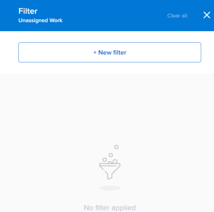

1.  Click `New filter`, then do the following: 

    
    
    1.  Select a field name in the first drop-down menu or click `Search All Fields` to select a field that does not display by default.
    1.  (Conditional) If you clicked `Search All Fields`, type the name of a field in the `Search` field and select it when it displays in the list. 
    
    
       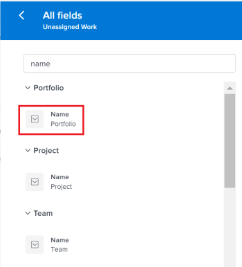    
    

    
       ` `**Tip: **`` You can select a field from the following sections:
    
        
        
        *  `Suggested fields`: the fields most commonly used.
        *  `Recent selections`: the fields you have recently filtered for. 
        
        
    
    1.  Select a modifier from the second drop-down menu.
    1.  Select or type a value for the field you are filtering for. 
    
       ` `**Example: **`` When you want to display work objects from a specific portfolio, you can apply the following filter: "Portfolio:&nbsp;name contains marketing." This displays work items that belong to any portfolio that contains "marketing" in the name.
    
    
       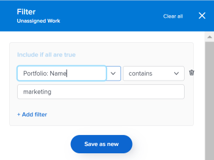    
    

    
    1.  (Optional) Click the `Delete` icon  to remove a filter criteria. 
    
    

1.  (Optional) Click `Add filter` to add another filter criteria, then repeat the actions from step 3. 
1.  Click  `Apply` to apply the results of the filter to the selected *`Workload Balancer`* area without saving it. 

   The list of work items updates on the left. 

   >[!IMPORTANT] {type="important"}
   >
   >Results display in the *`Workload Balancer`* when all the filter statements that you added are simultaneously true. 

   The filter is preserved until you refresh the page. 

   The `Apply` button is replaced with a `Save as new` button. 

1.  Click  `Save as new` to save the filter for future use. 

   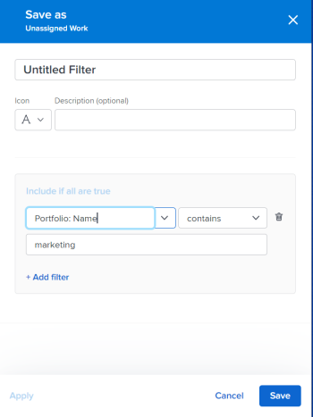

   >[!TIP] {type="tip"}
   >
   >Clicking `Cancel` at any time, takes you back to the filter building area. 

1.  Select `Untitled Filter` and enter the name of the new filter instead. 
1.  Select an icon for the new filter from the `Icon` drop-down menu. 

   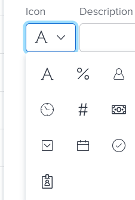

1.  (Optional) Add a description for the filter to indicate what is unique about it. The description displays under the filter name in the list of filters. 
1.  Click  `Save`. 

   Saved filters display in the My filters area of the filter panel. 

   For information about applying saved filters, see the section [Apply filters in the Workload Balancer](#apply9) in this article. 

## Duplicate a filter {#duplicate-a-filter}

You can duplicate and edit a filter to create a new one. 

1.  Go to the *`Workload Balancer`*.

   For information about accessing the *`Workload Balancer`*, see [Navigate the Workload Balancer](navigate-the-workload-balancer.md).

1.  Click the `Filter`icon  in the upper-right corner of either the `Unassigned Work` or the `Assigned Work` areas.

   The filter builder panel displays to the right. The name of the area you create the filter for displays in the header of the panel.

1.  Hover over an existing filter, click the `More` menu , then click  `Duplicate`. 

   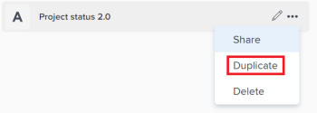

1.  Edit the following information for the duplicated filter:

    
    
    *  Name
    
    
      By default, the new filter name is "Original filter name Copy."
    
    *  Icon
    *  Description
    *  Any of the fields, modifiers, or values. 
    
    

1.  (Optional) Click  `Add filter` to add more statements to the duplicated filter. 
1.  Click `Save` to save the duplicated filter in the `My filters` area.

##  

## Edit a filter in the *`Workload Balancer`* {#edit-a-filter-in-the-workload-balancer}

You can edit a saved or predefined filter in the *`Workload Balancer`*.

>[!TIP] {type="tip"}
>
>When you edit a filter shared with others, they will also see the changes you make. 

1.  Go to the *`Workload Balancer`*. 

   For information about accessing the *`Workload Balancer`*, see [Navigate the Workload Balancer](navigate-the-workload-balancer.md).

1. Click the `Filter icon`  in the upper-right corner of the `Unassigned` or `Assigned Work` areas.   
   The filter builder displays on the right. 

1.  In the `My filters` area in the filter builder, hover over the filter you want to edit, then click the `Edit icon`  .

   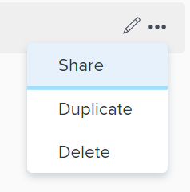

1.  Do one of the following:

    
    
    *  Modify any of the filter statements
    *  Click  `Add filter` to add new filter statements
    *  Click the `Delete` icon  to remove existing filter statements.
    
    

1.  Click  `Save` after applying the changes to the filter. 

   The results update in the *`Workload Balancer`* on the left. 

##  

## Apply filters in the *`Workload Balancer`* {#apply-filters-in-the-workload-balancer}

You can apply a customized filter that you created yourself and saved it, `or you can apply a previously defined filter that` already exists in  *`Workfront`*. 

1. Go to the *`Workload Balancer`*. 
1. Click the `Filter icon`  in the upper-right corner of the `Unassigned Work` or `Assigned Work` areas.   
   The filter builder panel displays on the right. 

1.  Select one or multiple filters from the `My filters` list. The results update dynamically in the *`Workload Balancer`* on the left. 

   There is no limit to the number of filters you can select.

   >[!IMPORTANT] {type="important"}
   >
   >When you select multiple filters all their conditions must be met simultaneously to display matching results in the *`Workload Balancer`*. 

   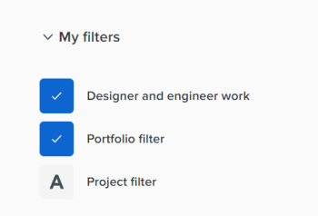

   The number of filters you selected displays next to the filter icon in the Assigned Work or Unassigned Work area.

   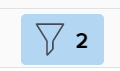

1.  (Optional) Click the `Clear all`at the top of the filter builder panel to remove all filtering criteria. The results in the *`Workload Balancer`* display according to the default filter or the filter that is currently selected. 

## Delete a saved filter in the *`Workload Balancer`* {#delete-a-saved-filter-in-the-workload-balancer}

Consider the following before deleting a filter:

* You cannot recover deleted filters.
* You cannot delete predefined filters. 
* You cannot delete an unsaved filter. They are removed automatically after logging out and logging back in to *`Workfront`*. 
* When you delete a shared filter, it is also deleted for all users that it is shared with. 
*  After you delete all saved filters, the *`Workload Balancer`* displays according to the original defaults. For information about the built-in filters of the *`Workload Balancer`* areas, see the [Not editable filters](#built-in2) section in this article. 

>[!NOTE]
>
>When you delete a filter shared with others, it will also be deleted for them. 

1. Go to the *`Workload Balancer`*
1. Click the `Filter icon`  in the upper-right corner of the `Unassigned Work` or `Assigned Work` areas.   
   The filter builder panel displays on the right. 

1.  Hover over a filter in the My filters area, then click the `More` menu , then click  `Delete`. 

   

1.  (Optional) Click  `Cancel` to avoid the deletion and return to the list of filters. 
1.  `Click `Delete` to confirm the deletion.` 

   The filter is deleted for you and all users who had permissions to it. 

## Share a filter in the *`Workload Balancer`*  {#share-a-filter-in-the-workload-balancer}

You can share a filter that you created or that was shared with you by other users.

Consider the following when sharing filters in the *`Workload Balancer`*:

*  `You can share filters with active users, teams, roles, and companies or you can make them visible for everyone in your *`Workfront`* instance.` 
*  Filters you share in the Resourcing area are not visible in the *`Workload Balancer`* of a project or a team. 
*  Filters you share from the team or project area are not visible in other areas of *`Workfront`*.

To share a filter: 

1. Go to the *`Workload Balancer`*
1. Click the `Filter icon`  in the upper-right corner of the `Unassigned Work` or `Assigned Work` areas.   
   The filter builder panel displays on the right. 

1.  Hover over a filter in the My filters area, then click the `More` menu , then click  `Share.`

   

   The Filter sharing box displays. 

1.  Enable the `View system wide` setting. This gives anyone in *`Workfront`* permission to view the filter. 

   Or

   Start typing the names of users, teams, roles, groups, or companies that you want to share the filter with in the `Give access to` field. 

   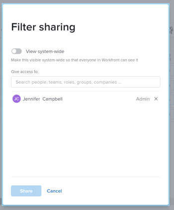

1.  (Optional) Click the right-pointing arrow next to the name of an entity to edit their permissions to the filter, then enable either the `View` or `Manage` option.

   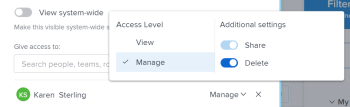

1.  (Optional) Enable or disable the additional permissions for an entity by doing one of the following:

    
    
    1. Click `View` and disable the `Share` option. It is enabled by default.
    
    1.  Click `Manage` and disable either the `Share` or the `Delete` option. They are enabled by default. 
    
    

   >[!TIP] {type="tip"}
   >
   >Users cannot receive a higher permission than their access level. If they don't have access to Edit filters in their access level, they cannot receive permissions to manage a filter. *`Workfront`* disables the Manage option for these users and the option is dimmed. 

1.  Click `Share`. The filter is shared with the entities you specified. 

   The filters you shared display in the `Shared with me`area of the filter panel. 

   

&nbsp;
