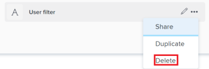
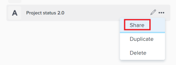

# Manage filters in the *Workload Balancer*

As a resource manager, you can use the *Workload Balancer* to view and manage the workload of your users. For more general information about the *Workload Balancer*, see the following articles:

* [Overview of the Workload Balancer](../../resource-mgmt/workload-balancer/overview-workload-balancer.md) 
* [Navigate the Workload Balancer](../../resource-mgmt/workload-balancer/navigate-the-workload-balancer.md)

To efficiently find work items and to focus on the users you manage, we strongly recommend that you use filters in the *Workload Balancer*. This allows you to display the correct information before you start managing the assignments of your resources.

This article contains information about filters in the *Workload Balancer*. For information about filters in *Workfront*, see [Filters overview in Adobe Workfront](../../reports-and-dashboards/reports/reporting-elements/filters-overview.md).

## Access requirements

You must have the following:

<table cellspacing="0"> 
 <col> 
 </col> 
 <col> 
 </col> 
 <tbody> 
  <tr> 
   <td role="rowheader"><em>Adobe Workfront</em> plan*</td> 
   <td> 
Any plan
 </td> 
  </tr> 
  <tr> 
   <td role="rowheader"><em>Adobe Workfront</em> license*</td> 
   <td> 
<em>Plan</em> or higher
 </td> 
  </tr> 
  <tr> 
   <td role="rowheader">Access level*</td> 
   <td> 
View or higher access to&nbsp;the following:
 
    <ul> 
     <li> 
Resource Management
 </li> 
     <li> 
Projects
 </li> 
     <li> 
Tasks
 </li> 
     <li> 
Issues
 </li> <draft-comment>
      <li xmlns:MadCap="http://www.madcapsoftware.com/Schemas/MadCap.xsd" data-mc-conditions="QuicksilverOrClassic.Quicksilver"> 
Filters, Views, and Groupings
 </li>
     </draft-comment>
     <li xmlns:MadCap="http://www.madcapsoftware.com/Schemas/MadCap.xsd" data-mc-conditions="QuicksilverOrClassic.Quicksilver"> 
Filters, Views, and Groupings
 </li> 
    </ul> <draft-comment>
     
Edit access to Filters, Views, and Groupings when building or editing filters 

    </draft-comment>
Edit access to Filters, Views, and Groupings when building or editing filters 
 
Note: If you still don't have access, ask your <em>Workfront administrator</em> if they set additional restrictions in your access level. For information on how a <em>Workfront administrator</em> can change your access level, see <a href="../../administration-and-setup/add-users/configure-and-grant-access/create-modify-access-levels.md" class="MCXref xref">Create or modify custom access levels</a>.
 </td> 
  </tr> 
  <tr> 
   <td role="rowheader">Object permissions</td> 
   <td> 
View or higher permissions to the projects, tasks, issues<draft-comment>
      ,filters
     </draft-comment>,filters
 <draft-comment>
     
Manage permissions to the filters you want to edit or delete

    </draft-comment>
Manage permissions to the filters you want to edit or delete
 
For information on requesting additional access, see <a href="../../workfront-basics/grant-and-request-access-to-objects/request-access.md" xmlns:MadCap="http://www.madcapsoftware.com/Schemas/MadCap.xsd" class="MCXref xref">Request access to objects in Adobe Workfront</a>.
 </td> 
  </tr> 
 </tbody> 
</table>

&#42;To find out what plan, license type, or access you have, contact your *Workfront administrator*.

## Overview of filters in the *Workload Balancer*

Consider the following when working with filters in the *Workload Balancer*:

* Depending on where you access the *Workload Balancer* from, *Workfront* might already be filtering the information for you.&nbsp;For information about pre-applied filters, see the section [Pre-applied filters in the Workload Balancer](#pre-appl) in this article. 
* You can create and apply a filter without saving it, or you can save a filter to reuse at a later time. 
* When you apply a filter without saving it, you can revert to the original lists by refreshing your page.

  <!--
  <li xmlns:MadCap="http://www.madcapsoftware.com/Schemas/MadCap.xsd" data-mc-conditions="QuicksilverOrClassic.Quicksilver"> 
You can view filters you created or filters that other users created and shared with you. 
 </li>
  -->

* You can view filters you created or filters that other users created and shared with you.

  <!--
  <li xmlns:MadCap="http://www.madcapsoftware.com/Schemas/MadCap.xsd" data-mc-conditions="QuicksilverOrClassic.Quicksilver"> 
When you delete or edit a shared filter, the filter is also deleted or edited for everyone with whom it is shared. 
 </li>
  -->

* When you delete or edit a shared filter, the filter is also deleted or edited for everyone with whom it is shared. 
* When you save and apply a new filter then navigate away from the *Workload Balancer*, the filter is preserved even after you log off and log back on. 
* When you create filters in the *Workload Balancer* in one area, they are not available in other areas. 

  ` `**Example: **`` Filters created in the 

  <!--
  <MadCap:conditionalText data-mc-conditions="QuicksilverOrClassic.Quicksilver">
  Resourcing
  </MadCap:conditionalText>
  -->

  `<MadCap:conditionalText data-mc-conditions="QuicksilverOrClassic.Quicksilver"> Resourcing </MadCap:conditionalText>`area are not available in the *Workload Balancer* of a project or a team.

  For information about where to locate the *Workload Balancer*, see [Locate the Workload Balancer](../../resource-mgmt/workload-balancer/locate-workload-balancer.md).

* You can view only the items that match the selected filters that also match the dates within the timeline displayed on the screen of the *Workload Balancer*.

## Pre-applied filters in the *Workload Balancer*

The *Workload Balancer* displays information in two separate areas:

* `The Unassigned Work area`: work items that are not yet assigned to users. 
* `The Assigned Work area`: work items that are assigned to users.

  For information about what displays in each of the areas, see [Navigate the Workload Balancer](../../resource-mgmt/workload-balancer/navigate-the-workload-balancer.md).

>[!IMPORTANT]
>
>Each area of the *Workload Balancer* has its own set of filters which work independently from one another. You must configure both filters to indicate what information you want to see in each area.

Depending on where you access the *Workload Balancer* from, the Unassigned and&nbsp;Assigned areas are already filtered by certain criteria, as described in the following table:

<table cellspacing="0"> 
 <col> 
 <col> 
 <col> 
 <tbody> 
  <tr> 
   <td role="rowheader"><em>Workfront</em> area where you access the <em>Workload Balancer</em> </td> 
   <td><b>Items that display in the Unassigned Work area by default</b> </td> 
   <td><b>Items that display in the Assigned Work area by default</b> </td> 
  </tr> 
  <tr> 
   <td role="rowheader">The <draft-comment>
     <MadCap:conditionalText xmlns:MadCap="http://www.madcapsoftware.com/Schemas/MadCap.xsd" data-mc-conditions="QuicksilverOrClassic.Quicksilver">
      Resourcing 
     </MadCap:conditionalText>
    </draft-comment><MadCap:conditionalText xmlns:MadCap="http://www.madcapsoftware.com/Schemas/MadCap.xsd" data-mc-conditions="QuicksilverOrClassic.Quicksilver">
     Resourcing 
    </MadCap:conditionalText>area</td> 
   <td>No items display here by default. You must customize filters to view work items in this area.</td> 
   <td>Users who are members of any of your teams and their work items.</td> 
  </tr> 
  <tr> 
   <td role="rowheader">A team</td> 
   <td>Work items that are assigned to the team or the team and a job role. </td> 
   <td> 
Users who are members of the selected team and their work items that match the timeline selected on the screen.
 </td> 
  </tr> 
  <tr> 
   <td role="rowheader">A project</td> 
   <td> 
Unassigned work items or items assigned to teams or job roles in the selected project display in this area.
 </td> 
   <td> 
Users that are assigned to at least one work item on the selected project and their work items on the selected project or on other projects that match the timeline selected on the screen.
 </td> 
  </tr> 
 </tbody> 
</table>

&nbsp;

## Create *Workload Balancer* filters

The process for creating filters for the Unassigned Work and Assigned Work areas in the *Workload Balancer* is identical, regardless of where you access the *Workload Balancer* from. For information about locating the *Workload Balancer*, see [Locate the Workload Balancer](../../resource-mgmt/workload-balancer/locate-workload-balancer.md).

You can create a filter from scratch or edit one of the predefined filters. For information about existing filters that you can edit, see the [Edit an existing filter in the Workload Balancer](#edit2) section in this article.

<!--

<ol>
<li value="1"> 
Go to the <em>Workload Balancer</em>.
 
For information about accessing the <em>Workload Balancer</em>, see <a href="../../resource-mgmt/workload-balancer/navigate-the-workload-balancer.md" class="MCXref xref">Navigate the Workload Balancer</a>.
 </li>
<li value="2"> 
Click the Filter icon  in the upper-right corner of either the Unassigned Work or the Assigned Work areas.
 
The filter builder box displays on the right. The name of the area you create the filter for displays in the header of the box.
 <draft-comment>

  

</draft-comment>
  
 
  
 </li>
<li value="3"> 
(Optional and conditional) If you access the <em>Workload Balancer</em> in the Resourcing area, the predefined Default filter might already be applied to the Assigned Work area. You can edit and save a copy of the Default filter. 
 <note type="tip">
The Default filter displays users that belong to any of your teams and their work items. You can edit a copy of this filter.
</note> </li>
<li value="4"> 
Click New filter, then do the following: 

<ol style="list-style-type: lower-alpha;">
<li value="1"> 
Select a field name in the first drop-down menu or click Search All&nbsp;Fields to start typing the name of a field that does not display by default and select it.
 <note type="important">
When referencing custom fields, you must type the field name and not the field label. The field label displays on a custom form attached to an object. For information about the difference between the label and the name of a custom field, see
<a href="../../administration-and-setup/customize-workfront/create-manage-custom-forms/create-or-edit-a-custom-form.md" class="MCXref xref">Create or edit a custom form</a>
.
</note> </li>
<li value="2"> 
(Conditional) If you clicked Search All&nbsp;Fields, type the name of a field in the Search field and select it when it displays in the list. 
 
  </img> 

Tip: </b>">
<b>Tip: </b>

You can select a field from the following sections:

<ul>
<li> 
Suggested fields: the fields most commonly used.
 </li>
<li> 
Recent selections: the fields you have recently filtered for. 
 </li>
</ul>

 </li>
<li value="3"> 
Select a modifier from the second drop-down menu.
 </li>
<li value="4"> 
Select or type a value for the field you are filtering for. 

Example: </b>">
<b>Example: </b>

When you want to display work objects from a specific portfolio, you can apply the following filter: "Portfolio:&nbsp;name contains marketing." This displays work items that belong to any portfolio that contains "marketing" in the name.

  </img> 

 </li>
<li value="5"> 
(Optional)&nbsp;Click the Delete icon  to remove a filter criteria. 
 </li>
</ol> </li>
<li value="5"> 
(Optional) Click Add filter to add another filter criteria, then repeat the actions from step 4. 
 </li>
<li value="6"> 
Click&nbsp;Apply to apply the results of the filter to the selected <em>Workload Balancer</em> area without saving it. 
 
The list of work items updates on the left. 
 <note type="important">
Results display in the
<em>Workload Balancer</em> when all the filter statements that you added are simultaneously true.
</note> 
The filter is preserved until you refresh the page. 
 
The Apply button is replaced with a Save as new button. 
 </li>
<li value="7"> 
Click&nbsp;Save as new to save the filter for future use. 
 
  </img> 
 <note type="tip">
Clicking
Cancel at any time, takes you back to the filter building area.
</note> </li>
<li value="8"> 
Select Untitled Filter and enter the name of the new filter instead. 
 </li>
<li value="9"> 
Select an icon for the new filter from the Icon drop-down menu. 
 
  </img> 
 </li>
<li value="10"> 
(Optional) Add a description for the filter to indicate what is unique about it. The description displays under the filter name in the list of filters. 
 </li>
<li value="11"> 
Click&nbsp;Save. 
 
Saved filters display in the My filters area of the filter box. 
 
For information about applying saved filters, see the section <a href="#apply9" class="MCXref xref">Delete a saved filter in the Workload Balancer</a> in this article. 
 </li>
<li value="12"> 
(Conditional) Hover over the Filter icon in the upper-right corner of the Unassigned Work or the Assigned Work areas to display a tooltip with the name or the number of filters that are currently applied. 
 
  
 </li>
</ol>
<h2>Duplicate a filter</h2>

You can duplicate and edit a filter to create a new one. 

<ol>
<li value="1"> 
Go to the <em>Workload Balancer</em>.
 
For information about accessing the <em>Workload Balancer</em>, see <a href="../../resource-mgmt/workload-balancer/navigate-the-workload-balancer.md" class="MCXref xref">Navigate the Workload Balancer</a>.
 </li>
<li value="2"> 
Click the Filter icon  in the upper-right corner of either the Unassigned Work or the Assigned Work areas.
 
The filter builder box displays to the right. The name of the area you create the filter for displays in the header of the box.
 </li>
<li value="3"> 
Hover over an existing filter, click the More menu , then click&nbsp;Duplicate. 
 
  </img> 
 </li>
<li value="4"> 
Edit the following information for the duplicated filter:

<ul>
<li> 
Name
 
By default, the new filter name is "<Original filter name> Copy."
 </li>
<li> 
Icon
 </li>
<li> 
Description
 </li>
<li> 
Any of the fields, modifiers, or values. 
 </li>
</ul> </li>
<li value="5"> 
(Optional)&nbsp;Click&nbsp;Add filter to add more statements to the duplicated filter. 
 </li>
<li value="6"> 
Click Save to save the duplicated filter in the My filters area.
 
The original filter remains unchanged and the duplicated filter is saved as a new filter. 
 </li>
</ol>

-->

<ol> 
 <li value="1"> 
Go to the <em>Workload Balancer</em>.
 
For information about accessing the <em>Workload Balancer</em>, see <a href="../../resource-mgmt/workload-balancer/navigate-the-workload-balancer.md" class="MCXref xref">Navigate the Workload Balancer</a>.
 </li> 
 <li value="2"> 
Click the Filter icon  in the upper-right corner of either the Unassigned Work or the Assigned Work areas.
 
The filter builder box displays on the right. The name of the area you create the filter for displays in the header of the box.
 
  
 
  
 </li> 
 <li value="3"> 
(Optional and conditional) If you access the <em>Workload Balancer</em> in the Resourcing area, the predefined Default filter might already be applied to the Assigned Work area. You can edit and save a copy of the Default filter. 
 <note type="tip">
   The Default filter displays users that belong to any of your teams and their work items. You can edit a copy of this filter. 
  </note> </li> 
 <li value="4"> 
Click New filter, then do the following: 
 
  <ol style="list-style-type: lower-alpha;"> 
   <li value="1"> 
Select a field name in the first drop-down menu or click Search All&nbsp;Fields to start typing the name of a field that does not display by default and select it.
 <note type="important">
     When referencing custom fields, you must type the field name and not the field label. The field label displays on a custom form attached to an object. For information about the difference between the label and the name of a custom field, see 
     <a href="../../administration-and-setup/customize-workfront/create-manage-custom-forms/create-or-edit-a-custom-form.md" class="MCXref xref">Create or edit a custom form</a>
     .
    </note> </li> 
   <li value="2"> 
(Conditional) If you clicked Search All&nbsp;Fields, type the name of a field in the Search field and select it when it displays in the list. 
 
  </img> 
 
    
Tip: </b>">
     <b>Tip: </b> 
     
You can select a field from the following sections:
 
     <ul> 
      <li> 
Suggested fields: the fields most commonly used.
 </li> 
      <li> 
Recent selections: the fields you have recently filtered for. 
 </li> 
     </ul> 
    
 </li> 
   <li value="3"> 
Select a modifier from the second drop-down menu.
 </li> 
   <li value="4"> 
Select or type a value for the field you are filtering for. 
 
    
Example: </b>">
     <b>Example: </b> 
     
When you want to display work objects from a specific portfolio, you can apply the following filter: "Portfolio:&nbsp;name contains marketing." This displays work items that belong to any portfolio that contains "marketing" in the name.
 
     
  </img> 
 
    
 </li> 
   <li value="5"> 
(Optional)&nbsp;Click the Delete icon  to remove a filter criteria. 
 </li> 
  </ol> </li> 
 <li value="5"> 
(Optional) Click Add filter to add another filter criteria, then repeat the actions from step 4. 
 </li> 
 <li value="6"> 
Click&nbsp;Apply to apply the results of the filter to the selected <em>Workload Balancer</em> area without saving it. 
 
The list of work items updates on the left. 
 <note type="important">
   Results display in the 
   <em>Workload Balancer</em> when all the filter statements that you added are simultaneously true. 
  </note> 
The filter is preserved until you refresh the page. 
 
The Apply button is replaced with a Save as new button. 
 </li> 
 <li value="7"> 
Click&nbsp;Save as new to save the filter for future use. 
 
  </img> 
 <note type="tip">
   Clicking 
   Cancel at any time, takes you back to the filter building area. 
  </note> </li> 
 <li value="8"> 
Select Untitled Filter and enter the name of the new filter instead. 
 </li> 
 <li value="9"> 
Select an icon for the new filter from the Icon drop-down menu. 
 
  </img> 
 </li> 
 <li value="10"> 
(Optional) Add a description for the filter to indicate what is unique about it. The description displays under the filter name in the list of filters. 
 </li> 
 <li value="11"> 
Click&nbsp;Save. 
 
Saved filters display in the My filters area of the filter box. 
 
For information about applying saved filters, see the section <a href="#apply9" class="MCXref xref">Delete a saved filter in the Workload Balancer</a> in this article. 
 </li> 
 <li value="12"> 
(Conditional) Hover over the Filter icon in the upper-right corner of the Unassigned Work or the Assigned Work areas to display a tooltip with the name or the number of filters that are currently applied. 
 
  
 </li> 
</ol>

## Duplicate a filter

You can duplicate and edit a filter to create a new one.

<ol> 
 <li value="1"> 
Go to the <em>Workload Balancer</em>.
 
For information about accessing the <em>Workload Balancer</em>, see <a href="../../resource-mgmt/workload-balancer/navigate-the-workload-balancer.md" class="MCXref xref">Navigate the Workload Balancer</a>.
 </li> 
 <li value="2"> 
Click the Filter icon  in the upper-right corner of either the Unassigned Work or the Assigned Work areas.
 
The filter builder box displays to the right. The name of the area you create the filter for displays in the header of the box.
 </li> 
 <li value="3"> 
Hover over an existing filter, click the More menu , then click&nbsp;Duplicate. 
 
  </img> 
 </li> 
 <li value="4"> 
Edit the following information for the duplicated filter:
 
  <ul> 
   <li> 
Name
 
By default, the new filter name is "<Original filter name> Copy."
 </li> 
   <li> 
Icon
 </li> 
   <li> 
Description
 </li> 
   <li> 
Any of the fields, modifiers, or values. 
 </li> 
  </ul> </li> 
 <li value="5"> 
(Optional)&nbsp;Click&nbsp;Add filter to add more statements to the duplicated filter. 
 </li> 
 <li value="6"> 
Click Save to save the duplicated filter in the My filters area.
 
The original filter remains unchanged and the duplicated filter is saved as a new filter. 
 </li> 
</ol>

##

## Edit an existing filter in the *Workload Balancer*

You can edit a saved filter in the *Workload Balancer*.

<!--

 <note type="tip">
When you edit a filter shared with others, they will also see the changes you make.
</note>
<ol>
<li value="1"> 
Go to the <em>Workload Balancer</em>. 
 
For information about accessing the <em>Workload Balancer</em>, see <a href="../../resource-mgmt/workload-balancer/navigate-the-workload-balancer.md" class="MCXref xref">Navigate the Workload Balancer</a>.
 </li>
<li value="2">Click the Filter icon  in the upper-right corner of the Unassigned or Assigned Work areas.  The filter builder displays on the right. </li>
<li value="3"> 
In the My filters area in the filter builder, hover over the filter you want to edit, then click the Edit icon  .
 
  </img> 
 </li>
<li value="4"> 
Do one of the following:

<ul>
<li> 
Modify any of the filter statements
 </li>
<li> 
Click&nbsp;Add filter to add new filter statements
 </li>
<li> 
Click the Delete icon  to remove existing filter statements.
 </li>
</ul> </li>
<li value="5"> 
(Optional)&nbsp;Click&nbsp;Apply. 
 
The results update in the <em>Workload Balancer</em> on the left to illustrate the changes you made to the filter.
 </li>
<li value="6"> 
Click&nbsp;Save. 
 
The results update in the <em>Workload Balancer</em> on the left and the filter is updated with the new information you selected. 
 </li>
</ol>

-->

>[!TIP]
>
>When you edit a filter shared with others, they will also see the changes you make.

<ol> 
 <li value="1"> 
Go to the <em>Workload Balancer</em>. 
 
For information about accessing the <em>Workload Balancer</em>, see <a href="../../resource-mgmt/workload-balancer/navigate-the-workload-balancer.md" class="MCXref xref">Navigate the Workload Balancer</a>.
 </li> 
 <li value="2">Click the Filter icon  in the upper-right corner of the Unassigned or Assigned Work areas.  The filter builder displays on the right. </li> 
 <li value="3"> 
In the My filters area in the filter builder, hover over the filter you want to edit, then click the Edit icon  .
 
  </img> 
 </li> 
 <li value="4"> 
Do one of the following:
 
  <ul> 
   <li> 
Modify any of the filter statements
 </li> 
   <li> 
Click&nbsp;Add filter to add new filter statements
 </li> 
   <li> 
Click the Delete icon  to remove existing filter statements.
 </li> 
  </ul> </li> 
 <li value="5"> 
(Optional)&nbsp;Click&nbsp;Apply. 
 
The results update in the <em>Workload Balancer</em> on the left to illustrate the changes you made to the filter.
 </li> 
 <li value="6"> 
Click&nbsp;Save. 
 
The results update in the <em>Workload Balancer</em> on the left and the filter is updated with the new information you selected. 
 </li> 
</ol>

##

## Delete a saved filter in the *Workload Balancer*

Consider the following before deleting a filter:

* You cannot recover deleted filters.
* You cannot delete predefined filters. 
* You cannot delete an unsaved filter. They are removed automatically after logging out and logging back in to *Workfront*.

  <!--
  <li xmlns:MadCap="http://www.madcapsoftware.com/Schemas/MadCap.xsd" data-mc-conditions="QuicksilverOrClassic.Quicksilver">When you delete a shared filter, it is also deleted for all users that it is shared with. </li>
  -->

* When you delete a shared filter, it is also deleted for all users that it is shared with. 
* After you delete all saved filters, the *Workload Balancer* displays according to the original defaults.&nbsp;

<!--

 <note type="note">
When you delete a filter shared with others, it will also be deleted for them.
</note>
<ol>
<li value="1">Go to the <em>Workload Balancer</em></li>
<li value="2">Click the Filter icon in the upper-right corner of the Unassigned Work or Assigned Work areas.  The filter builder box displays on the right. </li>
<li value="3"> 
Hover over a filter in the My filters area, then click the More menu , then click&nbsp;Delete. 
 
  </img> 
 </li>
<li style="color: #000000;" value="4"> 
(Optional)&nbsp;Click&nbsp;Cancel to avoid the deletion and return to the list of filters. 
 </li>
<li style="color: #000000;" value="5"> 
Click Delete to confirm the deletion. 
 
The filter is deleted for you and all users who had permissions to it. 
 </li>
</ol>

-->

>[!NOTE]
>
>When you delete a filter shared with others, it will also be deleted for them.

<ol> 
 <li value="1">Go to the <em>Workload Balancer</em></li> 
 <li value="2">Click the Filter icon in the upper-right corner of the Unassigned Work or Assigned Work areas.  The filter builder box displays on the right. </li> 
 <li value="3"> 
Hover over a filter in the My filters area, then click the More menu , then click&nbsp;Delete. 
 
  </img> 
 </li> 
 <li style="color: #000000;" value="4"> 
(Optional)&nbsp;Click&nbsp;Cancel to avoid the deletion and return to the list of filters. 
 </li> 
 <li style="color: #000000;" value="5"> 
Click Delete to confirm the deletion. 
 
The filter is deleted for you and all users who had permissions to it. 
 </li> 
</ol>

<!--

<h2>Share a filter in the <em>Workload Balancer</em></h2>

You can share a filter that you created or that was shared with you by other users.

Consider the following when sharing filters in the <em>Workload Balancer</em>:

<ul>
<li> 
You can share filters with active users, teams, roles, and companies or you can make them visible for everyone in your <em>Workfront</em> instance. 
 </li>
<li> 
Filters you share in the Resourcing area are not visible in the <em>Workload Balancer</em> of a project or a team. 
 </li>
<li> 
<em>Workload Balancer</em> filters that you share with others are not visible in other areas of <em>Workfront</em>.
 </li>
</ul>

To share a filter: 

<ol>
<li value="1">Go to the <em>Workload Balancer</em></li>
<li value="2">Click the Filter icon in the upper-right corner of the Unassigned Work or Assigned Work areas.  The filter builder box displays on the right. </li>
<li value="3"> 
Hover over a filter in the My filters area, then click the More menu , then click&nbsp;Share.
 
  </img> 
 
The Filter sharing box displays. 
 </li>
<li value="4"> 
Enable the View system wide setting.&nbsp;This gives anyone in <em>Workfront</em> permission to view the filter. 
 
Or
 
Start typing the names of users, teams, roles, groups, or companies that you want to share the filter with in the Give access to field. 
 
  </img> 
 </li>
<li value="5"> 
(Optional)&nbsp;Click the right-pointing arrow next to the name of an entity to edit their permissions to the filter, then enable either the View or Manage option.
 
  </img> 
 </li>
<li value="6"> 
(Optional) Enable or disable the additional permissions for an entity by doing one of the following:

<ol>
<li value="1">Click View and disable the Share option. It is enabled by default.</li>
<li value="2"> 
Click Manage and disable either the Share or the Delete option. They are enabled by default. 
 </li>
</ol> <note type="tip">
Users cannot receive a higher permission than their access level. If they don't have access to Edit filters in their access level, they cannot receive permissions to manage a filter.
<em>Workfront</em> disables the Manage option for these users and the option is dimmed.
</note> </li>
<li value="7"> 
Click Share. The filter is shared with the entities you specified. 
 
The filters you shared display in the Shared with me area of the filter box. 
 
  
 </li>
</ol>

-->

## Share a filter in the *Workload Balancer*

You can share a filter that you created or that was shared with you by other users.

Consider the following when sharing filters in the *Workload Balancer*:

* `You can share filters with active users, teams, roles, and companies or you can make them visible for everyone in your *Workfront* instance.` 
* Filters you share in the Resourcing area are not visible in the *Workload Balancer* of a project or a team. 
* *Workload Balancer* filters that you share with others are not visible in other areas of *Workfront*.

To share a filter:

<ol> 
 <li value="1">Go to the <em>Workload Balancer</em></li> 
 <li value="2">Click the Filter icon in the upper-right corner of the Unassigned Work or Assigned Work areas.  The filter builder box displays on the right. </li> 
 <li value="3"> 
Hover over a filter in the My filters area, then click the More menu , then click&nbsp;Share.
 
  </img> 
 
The Filter sharing box displays. 
 </li> 
 <li value="4"> 
Enable the View system wide setting.&nbsp;This gives anyone in <em>Workfront</em> permission to view the filter. 
 
Or
 
Start typing the names of users, teams, roles, groups, or companies that you want to share the filter with in the Give access to field. 
 
  </img> 
 </li> 
 <li value="5"> 
(Optional)&nbsp;Click the right-pointing arrow next to the name of an entity to edit their permissions to the filter, then enable either the View or Manage option.
 
  </img> 
 </li> 
 <li value="6"> 
(Optional) Enable or disable the additional permissions for an entity by doing one of the following:
 
  <ol> 
   <li value="1">Click View and disable the Share option. It is enabled by default.</li> 
   <li value="2"> 
Click Manage and disable either the Share or the Delete option. They are enabled by default. 
 </li> 
  </ol> <note type="tip">
   Users cannot receive a higher permission than their access level. If they don't have access to Edit filters in their access level, they cannot receive permissions to manage a filter. 
   <em>Workfront</em> disables the Manage option for these users and the option is dimmed. 
  </note> </li> 
 <li value="7"> 
Click Share. The filter is shared with the entities you specified. 
 
The filters you shared display in the Shared with me area of the filter box. 
 
  
 </li> 
</ol>

