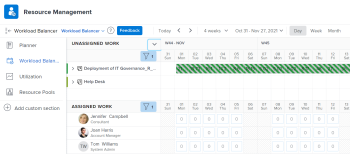
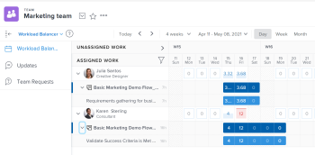
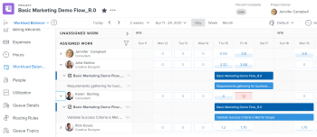

# Locate the  *`Workload Balancer`* {#locate-the-workload-balancer}

You can use the *`Workload Balancer`* to schedule resources for work or review their availability and current allocations. 

You can access the  *`Workload Balancer`* in the following ways:

*  From several areas predefined by *`Adobe Workfront`* 
*  By adding it to a custom `<MadCap:conditionalText data-mc-conditions="QuicksilverOrClassic.Quicksilver"> section </MadCap:conditionalText>`

>[!NOTE]
>
>Regardless of the method you use to access the *`Workload Balancer`*, navigating it and managing resources is identical. 
>
>
>For information about the  *`Workload Balancer`* and how to use it for managing and scheduling your resources for work, see the following articles: 
>
>
>
>*  [Overview of the Workload Balancer](overview-workload-balancer.md) 
>*  [Navigate the Workload Balancer](navigate-the-workload-balancer.md) 
>*  [Overview of assigning work in the Adobe Workfront Workload Balancer](assign-work-in-workload-balancer.md) 
>*  [Manage user allocations in the Workload Balancer](manage-user-allocations-workload-balancer.md) 
>
>

## Access requirements {#access-requirements}

You must have the following access to perform the steps in this article:

<table style="width: 100%;margin-left: 0;margin-right: auto;mc-table-style: url('../../Resources/TableStyles/TableStyle-List-options-in-steps.css');" class="TableStyle-TableStyle-List-options-in-steps" cellspacing="0"> 
 <col class="TableStyle-TableStyle-List-options-in-steps-Column-Column1"> 
 <col class="TableStyle-TableStyle-List-options-in-steps-Column-Column2"> 
 <tbody> 
  <tr class="TableStyle-TableStyle-List-options-in-steps-Body-LightGray"> 
   <td class="TableStyle-TableStyle-List-options-in-steps-BodyE-Column1-LightGray" role="rowheader">Adobe Workfront plan*</td> 
   <td class="TableStyle-TableStyle-List-options-in-steps-BodyD-Column2-LightGray"> 
Any 
 </td> 
  </tr> 
  <tr class="TableStyle-TableStyle-List-options-in-steps-Body-MediumGray"> 
   <td class="TableStyle-TableStyle-List-options-in-steps-BodyE-Column1-MediumGray" role="rowheader">Adobe Workfront license*</td> 
   <td class="TableStyle-TableStyle-List-options-in-steps-BodyD-Column2-MediumGray"> 
Plan 
 </td> 
  </tr> 
  <tr class="TableStyle-TableStyle-List-options-in-steps-Body-LightGray"> 
   <td class="TableStyle-TableStyle-List-options-in-steps-BodyE-Column1-LightGray" role="rowheader">Access level*</td> 
   <td class="TableStyle-TableStyle-List-options-in-steps-BodyD-Column2-LightGray"> 
View or higher access to&nbsp;the following:
 
    <ul> 
     <li> 
Resource Management
 </li> 
     <li> 
Projects
 </li> 
     <li> 
Tasks
 </li> 
     <li> 
Issues
 </li> 
    </ul> 
Note: If you still don't have access, ask your Workfront administrator if they set additional restrictions in your access level. For information on how a Workfront administrator can change your access level, see <a href="create-modify-access-levels.md" class="MCXref xref">Create or modify custom access levels</a>.
 </td> 
  </tr> 
  <tr class="TableStyle-TableStyle-List-options-in-steps-Body-MediumGray"> 
   <td class="TableStyle-TableStyle-List-options-in-steps-BodyB-Column1-MediumGray" role="rowheader">Object permissions</td> 
   <td class="TableStyle-TableStyle-List-options-in-steps-BodyA-Column2-MediumGray"> 
View permissions or higher to the projects, tasks, and issues 
 
For information on requesting additional access, see <a href="request-access.md" class="MCXref xref">Request access to objects in Adobe Workfront</a>.
 </td> 
  </tr> 
 </tbody> 
</table>

&#42;To find out what plan, license type, or access you have, contact your *`Workfront administrator`*.

## Locate the *`Workload Balancer`* in predefined areas {#locate-the-workload-balancer-in-predefined-areas}

The following sections illustrate where you can access the *`Workload Balancer`* within *`Workfront`*, as well as the functionality available in each area. 

You can manage resources in the following predefined areas in *`Workfront`*:

For multiple projects: 

*  In the *`Workload Balancer`* section the Resourcing area. The *`Workload Balancer`* is the default setting. 

  You can make resourcing assignments and adjust allocations across multiple projects that you have permissions to edit.

  

For a team: 

*  From the *`Workload Balancer`* section of a team. 

  You can adjust allocations and review or assign work from multiple projects to individual team members.

  

For a project: 

*  In the *`Workload Balancer`* section of a project. The *`Workload Balancer`* is the default setting. 

  You can do the following when you use the  *`Workload Balancer`* within a project:

    
    
    *  Assign work on the project to users already assigned other work on the project.
    *  Assign work to any user that might not be on the project.
    
    

    
    
    *  View additional work that users are assigned to on other projects.
    *  Adjust user allocations to work items. 
    
    
  

## Add the  *`Workload Balancer`* to a custom section {#add-the-workload-balancer-to-a-custom-section}

You can add the *`Workload Balancer`* to any custom `<MadCap:conditionalText data-mc-conditions="QuicksilverOrClassic.Quicksilver">  section</MadCap:conditionalText>`.

1.  Access the *`Workload Balancer`* by going to any of the following areas:

    
    
    *  The `<MadCap:conditionalText data-mc-conditions="QuicksilverOrClassic.Quicksilver">  Resourcing </MadCap:conditionalText>`area
    *  A team 
    *  A project
    
    

1.  Obtain a shareable link and copy it to your clipboard as described in [Share the Workload Balancer with a link](share-link-for-workload-balancer.md).
1.  Create a dashboard with an external page as described in [Embed an external web page in a dashboard](embed-external-web-page-dashboard.md). Use the shareable link you obtained in Step 2 for the external page. 
1.  Create a custom tab as described in [Create custom tabs or sections](create-custom-tabs.md) to place the dashboard on the custom tab.

   When accessing the *`Workload Balancer`* from the custom tab, you can view it as if you were accessing it directly from one of its original areas listed in Step 1. 

1.  (Optional) Share the custom tab in a Layout Template as described in `<MadCap:conditionalText data-mc-conditions="QuicksilverOrClassic.Quicksilver"> <a href="customize-left-panel.md" class="MCXref xref">Customize the left panel using a layout template</a></MadCap:conditionalText>`. 

