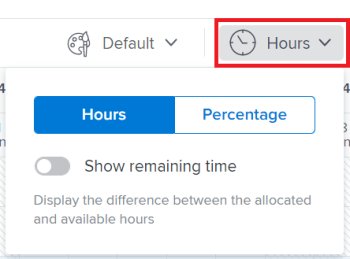

# Navigate the *`Workload Balancer`* {#navigate-the-workload-balancer}

The highlighted information on this page refers to functionality not yet generally available. It is available only in the Preview Sandbox environment.


Use the *`Workload Balancer`* to understand the availability of your resources as well as to assign work to your users. This article walks you through using the icons and settings available to update the view for and navigate the *`Workload Balancer`*. 


>[!NOTE]
>
>The *`Workload Balancer`* is a resource scheduling tool that will eventually replace the current resource scheduling tools which are currently deprecated. 
>
>
>For more information about removing the resource scheduling tools and replacing them with the *`Workload Balancer`*, see [Deprecation of Resource Scheduling tools in Adobe Workfront](deprecate-resource-scheduling.md).
>
>
>We recommend that you use the *`Workload Balancer`* for scheduling your resources. 


The *`Workload Balancer`* is available in multiple areas of *`Adobe Workfront`*. Navigating it is similar in all areas. This article describes how to navigate the *`Workload Balancer`* for multiple projects in the Resourcing area. For more information about where the *`Workload Balancer`* is located, see [Locate the Workload Balancer](locate-workload-balancer.md). 


Also consider reading the following articles:


* For information about assigning work using the *`Workload Balancer`*, see ` [Overview of assigning work in the Adobe Workfront Workload Balancer](assign-work-in-workload-balancer.md)`. 

* For information about managing user allocations, see [Manage user allocations in the Workload Balancer](manage-user-allocations-workload-balancer.md). 


## Access requirements {#access-requirements}

You must have the following access to perform the steps in this article:

<table style="width: 100%;margin-left: 0;margin-right: auto;mc-table-style: url('../../Resources/TableStyles/TableStyle-List-options-in-steps.css');" class="TableStyle-TableStyle-List-options-in-steps" cellspacing="0"> 
 <col class="TableStyle-TableStyle-List-options-in-steps-Column-Column1"> 
 <col class="TableStyle-TableStyle-List-options-in-steps-Column-Column2"> 
 <tbody> 
  <tr class="TableStyle-TableStyle-List-options-in-steps-Body-LightGray"> 
   <td class="TableStyle-TableStyle-List-options-in-steps-BodyE-Column1-LightGray" role="rowheader"><span class="mc-variable WFVariables.FullProdNameWF variable varname">Adobe Workfront</span> plan*</td> 
   <td class="TableStyle-TableStyle-List-options-in-steps-BodyD-Column2-LightGray"> <p>Any </p> </td> 
  </tr> 
  <tr class="TableStyle-TableStyle-List-options-in-steps-Body-MediumGray"> 
   <td class="TableStyle-TableStyle-List-options-in-steps-BodyE-Column1-MediumGray" role="rowheader"><span class="mc-variable WFVariables.FullProdNameWF variable varname">Adobe Workfront</span> license*</td> 
   <td class="TableStyle-TableStyle-List-options-in-steps-BodyD-Column2-MediumGray"> <p><span class="mc-variable WFVariables.WFLicense-Plan variable varname">Plan</span> </p> </td> 
  </tr> 
  <tr class="TableStyle-TableStyle-List-options-in-steps-Body-LightGray"> 
   <td class="TableStyle-TableStyle-List-options-in-steps-BodyE-Column1-LightGray" role="rowheader">Access level configurations*</td> 
   <td class="TableStyle-TableStyle-List-options-in-steps-BodyD-Column2-LightGray"> <p>View or higher access to&nbsp;the following:</p> 
    <ul> 
     <li> <p>Resource Management</p> </li> 
     <li> <p>Projects</p> </li> 
     <li> <p>Tasks</p> </li> 
     <li> <p>Issues</p> </li> 
    </ul> <p>Note: If you still don't have access, ask your <span class="mc-variable WFVariables.AdminWF variable varname">Workfront administrator</span> if they set additional restrictions in your access level. For information on how a <span class="mc-variable WFVariables.AdminWF variable varname">Workfront administrator</span> can change your access level, see <a href="create-modify-access-levels.md" class="MCXref xref">Create or modify custom access levels</a>.</p> </td> 
  </tr> 
  <tr class="TableStyle-TableStyle-List-options-in-steps-Body-MediumGray"> 
   <td class="TableStyle-TableStyle-List-options-in-steps-BodyB-Column1-MediumGray" role="rowheader">Object permissions</td> 
   <td class="TableStyle-TableStyle-List-options-in-steps-BodyA-Column2-MediumGray"> <p>View or higher permissions to the projects, tasks, and issues </p> <p>For information on requesting additional access, see <a href="request-access.md" class="MCXref xref">Request access to objects in Adobe Workfront</a>.</p> </td> 
  </tr> 
 </tbody> 
</table>

&#42;To find out what plan, license type, or access you have, contact your *`Workfront administrator`*.


## Considerations for viewing items in the *`Workload Balancer`* {#considerations-for-viewing-items-in-the-workload-balancer}

Consider the following when viewing the *`Workload Balancer`*: 


* Projects display in the Workload Balancer only when the Group by Project setting is enabled. This setting is enabled by default.
*  When a project has no tasks during a period of time, the bar at the project level becomes a dimmed color. 


  


*  When you don't have permissions to see certain items, they display as `Inaccessible work items` or `Inaccessible projects`. 


  


* The names of the work items display on the left and within the timeline selected on the right. 
* The total of Planned Hours for each work item displays to the right of the name of the work items on the left. 
*  The total of the Planned Hours for each project displays to the right of the name of the project on the left. 


  The Planned Hours information for the project is a total of Planned Hours from all items listed in the Workload Balancer, and not a total of Planned Hours on the project. 


##  Overview of the Unassigned Work and Assigned Work areas {#overview-of-the-unassigned-work-and-assigned-work-areas}

The *`Workload Balancer`* displays work items in two separate areas, depending on their assignments. 


The two areas of the *`Workload Balancer`* display the following information:

<table style="width: 100%;mc-table-style: url('../../Resources/TableStyles/TableStyle-List-options-in-steps.css');" class="TableStyle-TableStyle-List-options-in-steps" cellspacing="0"> 
 <col class="TableStyle-TableStyle-List-options-in-steps-Column-Column1" style="width: 153px;"> 
 <col class="TableStyle-TableStyle-List-options-in-steps-Column-Column2"> 
 <tbody> 
  <tr class="TableStyle-TableStyle-List-options-in-steps-Body-LightGray"> 
   <td class="TableStyle-TableStyle-List-options-in-steps-BodyE-Column1-LightGray" role="rowheader">Unassigned Work</td> 
   <td class="TableStyle-TableStyle-List-options-in-steps-BodyD-Column2-LightGray"> <p>This area displays tasks unassigned to users. It does not display issues. </p> <p>This area does not display any work items by default. We recommend using filters to display relevant information for you in this area.</p> <p>After you apply a filter, this area displays the following work items:</p> 
    <ul> 
     <li>unassigned</li> 
     <li>assigned to a team </li> 
     <li>assigned to a job role</li> 
     <li> <p>assigned to a team and a role at the same time</p> </li> 
    </ul> <p>Tip: Items assigned to a user as the primary assignee do not display in the Unassigned Work area. </p> </td> 
  </tr> 
  <tr class="TableStyle-TableStyle-List-options-in-steps-Body-MediumGray"> 
   <td class="TableStyle-TableStyle-List-options-in-steps-BodyB-Column1-MediumGray" role="rowheader">Assigned Work</td> 
   <td class="TableStyle-TableStyle-List-options-in-steps-BodyA-Column2-MediumGray"> <p> <MadCap:conditionalText data-mc-conditions="QuicksilverOrClassic.Quicksilver">
      All active users in the system display in this area by default.&nbsp;We recommend using filters to limit the amount of information in this area. 
     </MadCap:conditionalText> </p> <p>Both tasks and issues display in the Assigned Work area. </p> <p>The work items that the users are assigned to display under their names. </p> <p>If a work item is assigned to multiple users, the item displays under each assigned user. </p> </td> 
  </tr> 
 </tbody> 
</table>

For information about applying a filter in the *`Workload Balancer`*, see [Manage filters in the Workload Balancer](filter-information-workload-balancer.md).


## Navigate the *`Workload Balancer`* {#navigate-the-workload-balancer-1}

You can update the view in the *`Workload Balancer`* to display exactly the information you need to focus on in the time frame that makes the most sense to you. 


After selecting the settings you want to apply to your view, the *`Workload Balancer`* remembers these settings every time you access it from any browser or device. 


1.  Click the `Main Menu` icon  in the upper-right corner of *`Workfront`*, then click `Resourcing`.
1.   `<MadCap:conditionalText data-mc-conditions="QuicksilverOrClassic.Quicksilver"> <span>Click <span class="bold mc-variable WFVariables.Workload_Balancer variable varname">Workload Balancer</span> in the left panel.</span></MadCap:conditionalText>` ``


   You might need to click `Scheduling`, then select *`Workload Balancer`* in the upper-left corner. 

   The *`Workload Balancer`* displays work assignment information starting with the current week. The names of work items are listed on the left side as well as represented by bars on the right side of the of the *`Workload Balancer`* within their respective timelines. `Blue bars represent the timelines of projects and tasks and maroon bars represent issues.`

   The work items that display under the name of users in the *`Workload Balancer`* are sorted by the following criteria, in this order: 

    
    
    1. Planned Start Date (oldest first)
    1. Planned Completion Date (oldest first)
    1. Alphabetical by project (only when the first two criteria are identical for multiple work items)
    
    

1.  Click the `Filter icon`  in the upper-right corner of the `Unassigned Work` or the `Assigned Work` areas to select the type of information to display in the Workload Balancer.


   For information about filtering information in the *`Workload Balancer`*, see [Manage filters in the Workload Balancer](filter-information-workload-balancer.md). 

1. Click the right-pointing arrow next to `Unassigned Work` to expand this area or the down-pointing arrow to collapse it. 
1.  Drag and drop the separation line between the `Unassigned Work` and `Assigned Work` areas to adjust their size.


   


1. Click the back or forward icons  to navigate the timeline, then click `Today` to return to the current week. 

1.  Click the `time frame drop-down menu` on the toolbar, then click the beginning date of the period selected in step 8 on the calendar that displays. By default, the first week selected on the calendar is the week you navigated to.


   


   ` `**Tips: **`` 
    
    
    *  When you view the *`Workload Balancer`* on smaller screens the time frame drop-down menu is replaced by the calendar icon . 
    *  A dual calendar displays only when you select to view 12 weeks at a time. 
    
    

1.  Click one of the following to display information by different time frames:

<table style="width: 100%;mc-table-style: url('../../Resources/TableStyles/TableStyle-List-options-in-steps.css');" class="TableStyle-TableStyle-List-options-in-steps" cellspacing="0"> 
 <col class="TableStyle-TableStyle-List-options-in-steps-Column-Column1"> 
 <col class="TableStyle-TableStyle-List-options-in-steps-Column-Column2"> 
 <tbody> 
  <tr class="TableStyle-TableStyle-List-options-in-steps-Body-LightGray"> 
   <td class="TableStyle-TableStyle-List-options-in-steps-BodyE-Column1-LightGray" role="rowheader">Day</td> 
   <td class="TableStyle-TableStyle-List-options-in-steps-BodyD-Column2-LightGray">Displays information by day for four weeks starting with today's date, by default. </td> 
  </tr> 
  <tr class="TableStyle-TableStyle-List-options-in-steps-Body-MediumGray"> 
   <td class="TableStyle-TableStyle-List-options-in-steps-BodyE-Column1-MediumGray" role="rowheader">Week</td> 
   <td class="TableStyle-TableStyle-List-options-in-steps-BodyD-Column2-MediumGray">Displays information by week for four weeks. </td> 
  </tr> 
  <tr class="TableStyle-TableStyle-List-options-in-steps-Body-LightGray" data-mc-conditions=""> 
   <td class="TableStyle-TableStyle-List-options-in-steps-BodyB-Column1-LightGray" role="rowheader">Month</td> 
   <td class="TableStyle-TableStyle-List-options-in-steps-BodyA-Column2-LightGray"> <p><span>Displays information by month for three months. </span> </p> </td> 
  </tr> 
 </tbody> 
</table>


1.  Select the number of weeks you want to display at one time in the Workload Balancer from the following options:

    
    
    * 2 weeks
    * 4 weeks.&nbsp;This is the default setting.
    * 6 weeks
    *  12 weeks
    
      ` `**Tip: **``     
        
        
        *  `When you display the *`Workload Balancer`* by month, the option for 12 weeks becomes 3 months.` 
        
        
                  
        

        
        *  `When you display the *`Workload Balancer`* by a time frame shorter than 3 months or 12 weeks, the time frame switches automatically from Month to Week.` 
        
        
    
    
    

1.   Click the `Change color theme icon` , then select one of the options below. 


   This option displays in the Settings panel in the Preview environment.


   Select from the following: 

    
    
    *  `Default`: The bars for all projects and their work items display in blue. 
    
    

    
    
    *  `Project Status`: The bars associated with each project and its work items change to the color of the status of the project. 
    
    
      >[!TIP] {type="tip"}
      >
      >The project status is that associated with the Group of the project. If the Group does not have group-specific statuses, the color of the work item bars is that of the system-level project status. Both system as well as custom statuses display. For information about group statuses, see [Create or edit a group status](create-or-edit-a-group-status.md).
    
    
    
    
    

1.  (Optional and conditional) If you changed the color theme to Project&nbsp;Status, hover over the name of a project on the left to view the status of the project. 


   


1.  `Click the `Hours`or `Percentage icon` then select from the following`:

<table style="width: 100%;mc-table-style: url('../../Resources/TableStyles/TableStyle-List-options-in-steps.css');" class="TableStyle-TableStyle-List-options-in-steps" cellspacing="0"> 
 <col class="TableStyle-TableStyle-List-options-in-steps-Column-Column1"> 
 <col class="TableStyle-TableStyle-List-options-in-steps-Column-Column2"> 
 <tbody> 
  <tr class="TableStyle-TableStyle-List-options-in-steps-Body-LightGray"> 
   <td class="TableStyle-TableStyle-List-options-in-steps-BodyE-Column1-LightGray" role="rowheader"><span>Hours</span> </td> 
   <td class="TableStyle-TableStyle-List-options-in-steps-BodyD-Column2-LightGray"><span>Displays allocated time as hours. This is the default. </span> </td> 
  </tr> 
  <tr class="TableStyle-TableStyle-List-options-in-steps-Body-MediumGray"> 
   <td class="TableStyle-TableStyle-List-options-in-steps-BodyB-Column1-MediumGray" role="rowheader"><span>Percentage</span> </td> 
   <td class="TableStyle-TableStyle-List-options-in-steps-BodyA-Column2-MediumGray"> <p><span>Displays allocated time as a percentage of the total available time. </span> </p> </td> 
  </tr> 
 </tbody> 
</table>

   This option displays in the Settings panel in the Preview environment.


   


1.  Enable the `Show remaining time` setting to display the difference between the daily time for which the user is available to work based on their schedules and the hours for which they are allocated in the Assigned Work area for the users. This is disabled by default and allocated time displays by default.


   This option displays in the Settings panel in the Preview environment.

1.  Click the `Chart icon`  to display the user allocation in a chart format. Days where the user is overallocated display as red blocks, and days where the user is underallocated or at capacity display as blue blocks. The size of the blocks indicates the amount of the allocation: the larger the box, the more time the user is allocated to work items for that day or week. 


   


1.  Click the `Settings`icon . 


   The Settings panel displays.


   The Settings panel `contains different options, depending on whether you access the *`Workload Balancer`* from the Preview or from the Production environment`.

    
    
    1.   `<MadCap:conditionalText data-mc-conditions="QuicksilverOrClassic.Quicksilver"> (Conditional) If you access the  <span class="mc-variable WFVariables.Workload_Balancer variable varname">Workload Balancer</span> from the Production environment, select from the options listed below, then click&nbsp; <span class="bold">Save</span>: </MadCap:conditionalText>` 
    
    
           
    

    
        
        
        *  `Group by Project`: When this is selected, the items in the Unassigned and Assigned Work areas are grouped by project. This is selected by default. 
        
        
                  
        

        
        *  `Include hours from issues`: When this is selected, issues assigned to users display under the user's name in the Assigned Work area and the Planned Hours from the issues also display for the issues, the project, and the user. 
        
        
                  
        

        
        
          >[!TIP] {type="tip"}
          >
          >Issues don't display in the Unassigned Work area of the *`Workload Balancer`*.
        
        
        
        *  `Show Projected Dates`: When this is selected, the projected timeline of work items displays in addition to the planned timeline. Notice the following:
        
            
            
            * The projected timeline of tasks and projects displays in light blue bars with a line underneath. 
            * The projected timeline of issues displays in light maroon bars with a line underneath. 
            * The projected timeline for the items that you have no access to view displays in light gray with a line underneath.
            * When a task or issue completes before the due Planned Completion Date the allocation numbers for the remaining days are struck through and do not count towards the user's allocation. This displays only when both the Show Projected Dates setting and the Show allocation icon are enabled. 
            
            
                  
        

        
        
          >[!TIP] {type="tip"}
          >
          >Notice that work items display in the *`Workload Balancer`* when either their planned or the projected timelines (not necessarily both at the same time) occur during the timeframe selected. 
        
        
        
        *  `Show completed work`:&nbsp;When this is enabled, tasks and issues that are completed display in the Assigned Work area. This is enabled by default. 
        
        
          A green checkmark icon  displays to the upper-right corner of a task or issue bar when they are completed. The same icon displays for a project when the tasks or issues for the selected time frame of the project are completed. 
        
        
        
    
    1.      
       (Conditional) If you access the *`Workload Balancer`* from the Preview environment, select from the options listed below, then click the `X icon` in the upper-right of the Settings box to close it.
    
    
           
    

    
        
        
        *  `Group by Project`: When this is selected, the items in the Unassigned and Assigned Work areas are grouped by project. This is selected by default. 
        
        
                  
        

        
        *  `Include hours from issues`: When this is selected, issues assigned to users display under the user's name in the Assigned Work area and the Planned Hours from the issues also display for the issues, the project, and the user. 
        
        
                  
        

        
        
          >[!TIP] {type="tip"}
          >
          >Issues don't display in the Unassigned Work area of the *`Workload Balancer`*.
        
        
        
        *  `Show Projected Dates`: When this is selected, the projected timeline of work items displays in addition to the planned timeline. Notice the following:
        
            
            
            * The projected timeline of tasks and projects displays in light blue bars with a line underneath. 
            * The projected timeline of issues displays in light maroon bars with a line underneath. 
            * The projected timeline for the items that you have no access to view displays in light gray with a line underneath.
            * When a task or issue completes before the due Planned Completion Date the allocation numbers for the remaining days are struck through and do not count towards the user's allocation. This displays only when both the Show Projected Dates setting and the Show allocation icon are enabled. 
            
            
                  
        

        
        
          >[!TIP] {type="tip"}
          >
          >Notice that work items display in the *`Workload Balancer`* when either their planned or the projected timelines (not necessarily both at the same time) occur during the timeframe selected. 
        
        
        
        *  `Show completed work`:&nbsp;When this is enabled, tasks and issues that are completed display in the Assigned Work area. This is enabled by default. 
        
        
          A green checkmark icon  displays to the upper-right corner of a task or issue bar when they are completed. The same icon displays for a project when the tasks or issues for the selected time frame of the project are completed. 
        
        *  `Show remaining time`: When this is enabled, *`Workfront`* displays the difference between the daily time for which the user is available to work based on their schedules and the hours for which they are allocated in the Assigned Work area for the users. This is disabled by default and allocated time displays by default.
        *  In the `Select color theme section`, select from the following: 
        
            
            
            *  `Default`: The bars for all projects and their work items display in blue. 
            *  `Project`: The bars associated with each project and its work items change according to the name of the project. All tasks that belong to the project display in bars that match the color of the project.
            *  `Project Status`: The bars associated with each project and its work items change to the color of the status of the project. 
            
            
              >[!TIP] {type="tip"}
              >
              >The project status is that associated with the Group of the project. If the Group does not have group-specific statuses, the color of the work item bars is that of the system-level project status. Both system as well as custom statuses display. For information about group statuses, see [Create or edit a group status](create-or-edit-a-group-status.md).
            
            
            
            
            
        
        *  In the `Display user allocation in` section, select from the following:
        
            
            
            *  `Hours`: Displays allocated time as hours. This is the default. 
            *  `Percentage`: Displays allocated time as a percentage of the total available time
            
            
        
        
        
       &nbsp;
    
    

1.  Click the `Show allocations icon`  to view the daily or weekly Planned Hours for work items.


   This replaces the name in the bars of the work items with the amount of daily or weekly Planned Hours in the Unassigned and Assigned Work areas. This setting is disabled by default. 

   ` `**Tip: **`` 
    
    
    * The Show allocations setting only affects what displays for projects, tasks, `issues` and inaccessible items. Daily Planned Hours for users display by default and cannot be hidden.
    * You must enable the Group by Project setting to display daily Planned Hours for projects. 
    * When you view the *`Workload Balancer`* by week, the hours displayed are the weekly Planned Hours. 
    
    

1.  (Optional) Click the `Hide allocations icon`  to display the name of the tasks in the bars of the work items. 
1. `Click the `More menu` icon  to the right of a task or issue name,` then click one of the following:
    
    
    * `Assign this to`, then start typing the name of a user, role, or team you want to assign the work item to. 
    
    
          
    

    
      ` `**Tip: **```You can also use the following shortcuts to assign tasks or issues:`
    
        
        
        * `In Windows: CTRL+click the task or issue bar.`
        * `In Mac: CMD+click the task or issue bar.`
        
        
      For more information about assigning work items to users in the *`Workload Balancer`*, see [Overview of assigning work in the Adobe Workfront Workload Balancer](assign-work-in-workload-balancer.md). 
    
    * `Edit allocations`, then edit the daily or weekly allocations for the user. 
    * For information about managing user allocations, see [Manage user allocations in the Workload Balancer](manage-user-allocations-workload-balancer.md). 
    * `Click the `Open Summary` icon , then click the bar of a task or issue to open the Summary panel.`This option is available for tasks in the Unassigned Work area and for tasks and `issues` in the Assigned Work area. 
    
    * For information about updating task information in the Summary in the *`Workload Balancer`*, see [Update work items in the Workload Balancer using the Summary in the new Adobe Workfront experience](update-items-in-summary-panel-in-workload-balancer.md).
    
    
    

1. (Optional) Double-click a daily or weekly allocation for a user inside the work item bar to edit the number of allocated hours. For information about managing user allocations, see [Manage user allocations in the Workload Balancer](manage-user-allocations-workload-balancer.md). 
1. Click the name of a work item to access it. 
1.  Click the `Shareable link icon`  to copy the direct URL for the *`Workload Balancer`* to your clipboard. 
1.  (Optional) Share the link with any user who does not have direct access to the *`Workload Balancer`*.


   For information about sharing the *`Workload Balancer`* with a link, see [Share the Workload Balancer with a link](share-link-for-workload-balancer.md). 

1. Double-click a work item to update the users' daily or weekly allocations to the item. For information about managing user allocations in the *`Workload Balancer`*, see [Manage user allocations in the Workload Balancer](manage-user-allocations-workload-balancer.md). 

1.  (Conditional) From the *`Workload Balancer`* of a project, click the `Show role allocations` icon . 


   The Role Allocation panel displays. You can view information about Planned Hours associated with job roles on the project and job roles associated with initiatives from the *`Scenario Planner`*. For more information, see [Overview of reconciling resource allocations between projects and initiatives](overview-reconcile-allocations-between-projects-initiatives.md). 


   >[!TIP] {type="tip"}
   >
   >You cannot view initiative job role information if your organization has not purchased a license for the *`Workfront Scenario Planner`*. In this case, you can only view the planned hours associated with job roles on the project. For more information, see [Access needed to use the Adobe Workfront Scenario Planner](access-needed-to-use-sp.md). 


1.  (Optional) Select `Scheduling` from the drop-down menu in the upper-left corner to access the scheduling area. 


