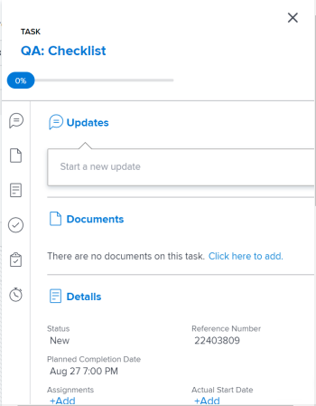

# Update work items in the `Workload Balancer` using the Summary in `the new Adobe Workfront experience`

The information on this page refers to functionality available only in `the new Adobe Workfront experience` and after your `Adobe Workfront administrator` has enabled this experience for you.

You can use the Summary panel of a task `or an issue` to update important information for that item. in the `Workload Balancer`.

>[!TIP]
>
>The Summary panel is available for tasks in both areas of the `Workload Balancer` `and for issues in the Assigned Work area. Issues do not display in the Unassigned Work area.`

## Access requirements

You must have the following:

<table cellspacing="0"> 
 <col> 
 <col> 
 <tbody> 
  <tr> 
   <td role="rowheader">Adobe Workfront plan*</td> 
   <td> 
Any 
 </td> 
  </tr> 
  <tr> 
   <td role="rowheader">Adobe Workfront license*</td> 
   <td> 
Plan 
 </td> 
  </tr> 
  <tr> 
   <td role="rowheader">Access level configurations*</td> 
   <td> 
Edit access to&nbsp;the following:
 
    <ul> 
     <li> 
Resource Management
 </li> 
     <li> 
Projects
 </li> 
     <li> 
Tasks
 </li> 
     <li> 
Issues
 </li> 
    </ul> 
Note: If you still don't have access, ask your Workfront administrator if they set additional restrictions in your access level. For information on how a Workfront administrator can change your access level, see <a href="../../administration-and-setup/add-users/configure-and-grant-access/create-modify-access-levels.md" class="MCXref xref">Create or modify custom access levels</a>.
 </td> 
  </tr> 
  <tr> 
   <td role="rowheader">Object permissions</td> 
   <td> 
Contribute permissions or higher to the projects, tasks, and issues 
 
For information on requesting additional access, see <a href="../../workfront-basics/grant-and-request-access-to-objects/request-access.md" class="MCXref xref">Request access to objects in Adobe Workfront</a>.
 </td> 
  </tr> 
 </tbody> 
</table>

&#42;To find out what plan, license type, or access you have, contact your `Workfront administrator`.

## Update tasks and issues in the `Workload Balancer` Summary panel

<ol> 
 <li value="1"> 
Go to the Workload Balancer. 
 
The Workload Balancer displays work assignment information starting with the current week. 
 </li> 
 <li value="2"> 
Go to the Unassigned Work area and find a work item.
 
Or
 
Go to the Assigned Work area, expand a user, and find a work item.
 </li> 
 <li value="3"> 
Click the Summary icon, then click the bar of a task or issue. 
 <note type="tip">
   You cannot access the Summary of a project. 
  </note> 
The Summary opens on the right. 
 
  
 </li> 
 <li value="4"> 
Modify a number of fields for the work item, enter an update, or you navigate from here to other areas of Workfront to add documents or other information to the work item. 
 
Warning: </b>"><b>Warning: </b>Navigating from the Summary to the Substasks section to add subtasks removes the original task, because parent tasks do not display in the Workload Balancer.
 
For more information about updating information using the Summary, see <a href="../../workfront-basics/the-new-workfront-experience/summary-overview.md" class="MCXref xref">Summary overview in the new Adobe Workfront experience</a>.
 </li> 
 <li value="5">(Conditional) If you opened any of the sections of the work item, click your browser's Back button to return to the Workload Balancer.</li> 
 <li value="6">Click the Close icon in the upper-right corner of the Summary, to close it. </li> 
</ol>

