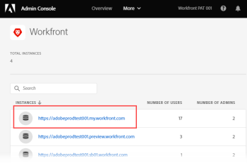

# Create *Workfront* users and administrators

As an Adobe administrator, you can create *Adobe Workfront* users and system administrators using the Adobe Admin Console. The console is a central location for managing the Adobe entitlements across your organization. For more information, see the [Admin Console Overview](https://helpx.adobe.com/enterprise/using/admin-console.html).

## Access requirements

You must have the following access to perform the steps in this article:

<table cellspacing="0"> 
 <col> 
 <col> 
 <tbody> 
  <tr> 
   <td role="rowheader"><em>Adobe Workfront</em> plan</td> 
   <td> 
<em>[Any, Pro, Business, Enterprise]</em> <draft-comment>
      Any?
     </draft-comment>Any?
 </td> 
  </tr> 
  <tr> 
   <td role="rowheader">Adobe administrator rights</td> 
   <td> 
You must be a Product Configuration Administrator of Adobe products for your organization
 </td> 
  </tr> 
 </tbody> 
</table>

## Prerequisites

Before using the Admin Console for Workfront, you should receive a receive an email inviting you to the console.

1. If you are new to Adobe and you have received an email telling you that you now have administer rights to manage Adobe software and services for your organization, click the button in the email to create an Adobe account and open the Admin Console.

   Or

   If you already have an Adobe account, go to the [Adobe Admin Console page](https://adminconsole.adobe.com/).

## Access the user and admin area for your Production instance of Workfront

<ol> 
 <li value="1"> 
From the <a href="https://adminconsole.adobe.com/">Adobe Admin Console page</a>, select the <b>Products</b> tab in the top navigation bar, and then select the <b>Workfront</b> product tile.
 
  
 </li> 
 <li value="2"> 
In the list that displays, select the link at the top.
 
This is your Production instance where your users work. 
 
  
 
  
Tip: </b>">
   <b>Tip: </b> 
   
Your Preview instance, the second link in the list, is a testing environment that replicates your live Production environment. For more information, see <a href="../../administration-and-setup/set-up-workfront/workfront-testing-environments/wf-preview-sandbox-environment.md" class="MCXref xref">The Adobe Workfront Preview Sandbox Environment</a>.
 
   
You might also see links to sandbox environments in the list. For more information, see <a href="../../administration-and-setup/set-up-workfront/workfront-testing-environments/wf-preview-sandbox-environment.md" class="MCXref xref">The Adobe Workfront Preview Sandbox Environment</a>.
 
  
 </li> 
 <li value="3"> 
In the list that displays, with the Product Profiles tab selected, click the name of the <em>Workfront</em> Product Profile link. 
 
  
 
This lis includes all users that are already assigned to your Production instance of <em>Workfront</em>. 
 
If you need information about product profiles, see <a href="../../administration-and-setup/add-users/access-levels-and-object-permissions/access-levels-overview.md#manage-product-profiles.html">Manage product profiles for enterprise users</a>.
 </li> 
 <li value="4"> 
Continue on to one of the following sections in this article:
 
  <ul> 
   <li><a href="#create" class="MCXref xref">Create users in Workfront</a> </li> 
   <li><a href="#create2" class="MCXref xref">Create system administrators in Workfront</a> </li> 
  </ul> </li> 
</ol>

## Create users in *Workfront*

1. Go to the user and admin area in the Admin Console, as described in [Access the user and admin area for your Production instance of Workfront](#access) in this article.
1. With the `Users`tab selected above the list, select **Add User**.
1. In the **Add users to this product profile** box, enter the email address or name of a user you want to add, then select **Save**.

   The user is created in *Workfront* with the Requestor access level. For instructions on how a *Workfront administrator* can change the user's access level, see [Edit a user's profile](../../administration-and-setup/add-users/create-and-manage-users/edit-a-users-profile.md).

1. Repeat steps 4 and 5 to add more users.

## Create system administrators in *Workfront*

The System Administrator access level is granted only on the Adobe Admin Console. You cannot grant or remove admin access from within *Workfront*.

You must add a user to your Production instance of *Workfront* before you can make the user a *Workfront* system administrator. For instructions, see [Create users in Workfront](#create) in this article.

<ol> 
 <li value="1">Go to the user and admin area in the Admin Console, as described in <a href="#access" class="MCXref xref">Access the user and admin area for your Production instance of Workfront</a> in this article.</li> 
 <li value="2"> 
Select the <b>Admins</b> tab above the list of users. 
 </li> 
 <li value="3"> 
Select <b>Add Admin</b>.
 </li> 
 <li value="4"> 
In the <b>Add product profile administrators</b> box, enter the email addresses or names of the administrators you want to add, then select <b>Save</b>. 
 
  
 
The system administrators are created in <em>Workfront</em>.
 </li> 
</ol>

## Additional details about the Admin Console:

* Workfront System Administrators can deactivate a Workfront user from within *Workfront*, but this does not deactivate the user in the Admin Console.

  <!--
  
For information about deactivating a user in <em>Workfront</em>, see 

  -->

  For information about deactivating a user in *Workfront*, see 

* The user **Home Group** is determined based on the user who created them. This is currently not customizable from within the Admin Console.
* The Workfront System Administrator access level can only be edited from within the Adobe Admin Console.
* Editing a user who is a system admin to any other access level must be done through the Admin Console first. 
* To remove System Administrator access from a user in *Workfront*, you need to use the Adobe Admin Console to remove the user as Product Profile Administrator. This changes the user's *Workfront* access level from System Administrator to Requestor.

