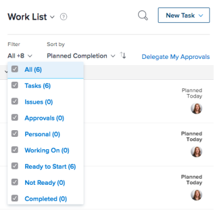

# Approving work {#approving-work}

If you are set&nbsp;as an approver, you&nbsp;should regularly review what work is awaiting your approval. 

For information about creating approval processes, see [Create an approval process](create-approval-processes.md). 

For information about associating approvals with work in *`Workfront`*, see [Associate a new or existing approval process with work](associate-approval-with-work.md). 

## Access requirements {#access-requirements}

You must have the following access to perform the steps in this article:

<table style="width: 100%;margin-left: 0;margin-right: auto;mc-table-style: url('../../Resources/TableStyles/TableStyle-List-options-in-steps.css');" class="TableStyle-TableStyle-List-options-in-steps" cellspacing="0"> 
 <col class="TableStyle-TableStyle-List-options-in-steps-Column-Column1"> 
 <col class="TableStyle-TableStyle-List-options-in-steps-Column-Column2"> 
 <tbody> 
  <tr class="TableStyle-TableStyle-List-options-in-steps-Body-LightGray"> 
   <td class="TableStyle-TableStyle-List-options-in-steps-BodyE-Column1-LightGray" role="rowheader">Adobe Workfront plan*</td> 
   <td class="TableStyle-TableStyle-List-options-in-steps-BodyD-Column2-LightGray"> 
Any
 </td> 
  </tr> 
  <tr class="TableStyle-TableStyle-List-options-in-steps-Body-MediumGray"> 
   <td class="TableStyle-TableStyle-List-options-in-steps-BodyE-Column1-MediumGray" role="rowheader">Adobe Workfront license*</td> 
   <td class="TableStyle-TableStyle-List-options-in-steps-BodyD-Column2-MediumGray"> 
Review or higher
 </td> 
  </tr> 
  <tr class="TableStyle-TableStyle-List-options-in-steps-Body-LightGray"> 
   <td class="TableStyle-TableStyle-List-options-in-steps-BodyE-Column1-LightGray" role="rowheader">Access level configurations*</td> 
   <td class="TableStyle-TableStyle-List-options-in-steps-BodyD-Column2-LightGray"> 
View or higher access to the objects associated with approvals
 
Note: If you still don't have access, ask your Workfront administrator if they set additional restrictions in your access level. For information on how a Workfront administrator can modify your access level, see <a href="create-modify-access-levels.md" class="MCXref xref">Create or modify custom access levels</a>.
 </td> 
  </tr> 
  <tr class="TableStyle-TableStyle-List-options-in-steps-Body-MediumGray"> 
   <td class="TableStyle-TableStyle-List-options-in-steps-BodyB-Column1-MediumGray" role="rowheader">Object permissions</td> 
   <td class="TableStyle-TableStyle-List-options-in-steps-BodyA-Column2-MediumGray"> 
View or higher permissions to the objects associated with approvals
 
For information on requesting additional access, see <a href="request-access.md" class="MCXref xref">Request access to objects in Adobe Workfront</a>.
 </td> 
  </tr> 
 </tbody> 
</table>

&#42;To find out what plan, license type, or access you have, contact your *`Workfront administrator`*.

## Locate approvals in *`Adobe Workfront`* {#locate-approvals-in-adobe-workfront}

You can view and manage approvals in various areas of *`Workfront`*. 

For more information about viewing items awaiting approvals or items that you have submitted for approval yourself, see [View approvals](view-approvals.md).

## Approve work from the Home area {#approve-work-from-the-home-area}

1.  Click the `Home` icon  in the upper-left corner of *`Adobe Workfront`*.
1.  Click the `Show` drop-down menu.

   

1.  Click `Approvals`.  
   All work items that require your approval are displayed.&nbsp;

   >[!NOTE]
   >
   >Approvals assigned to Job Roles or Groups don't display in Home. Approvals assigned to Teams display in the Team Request grouping in the Work List. 

1. (Optional) Change the order in which approvals are displayed, as described in "Filtering by Date, Project, or Priority" in [Display items in the Work List in the Home area](display-items-in-home-work-list.md).
1. Select the item where you want to make an approval decision.  
  
     

1. Click one of the available options when making an approval decision (the available options differ depending on the type of item you are approving:

* `Projects:` Click `Approve` or `Reject`&nbsp;next to the&nbsp;work item.

* `Tasks:` Click `<MadCap:conditionalText data-mc-conditions="QuicksilverOrClassic.Quicksilver"> the </MadCap:conditionalText>` `Approve` or `Reject`&nbsp;`<MadCap:conditionalText data-mc-conditions="QuicksilverOrClassic.Quicksilver"> icon </MadCap:conditionalText>`next to the&nbsp;work item.

* `Issues:` Click `<MadCap:conditionalText data-mc-conditions="QuicksilverOrClassic.Quicksilver"> the </MadCap:conditionalText>` `Approve` or `Reject` `<MadCap:conditionalText data-mc-conditions="QuicksilverOrClassic.Quicksilver"> icon&nbsp;</MadCap:conditionalText>`next to the&nbsp;work item.

* `Timesheets:` Click `Approve` or `Reject`&nbsp;next to the&nbsp;work item.

* `Documents:` Click `Approve`,  `Reject`, or `Changes`&nbsp;next to the&nbsp;work item.  
  Consider the following when viewing  *`proof`* approvals: ( *`Proof`* approvals are displayed here when a user shares a *`proof`* with you, as described in the section [Share a proof within Adobe Workfront](share-a-proof-in-workfront.md) in the article [Share a proof within Adobe Workfront](share-a-proof-in-workfront.md).)  

    
    
    * Proofing approvals are displayed in the Home area only if your *`Workfront`* environment is integrated with a *`Workfront Proof`* Premium account. If you cannot use *`proofing`* as discussed here, contact your *`Workfront administrator`*.
    
    * You receive an in-app notification, notifying you of the *`proofing`* approval.  
      For more information about in-app notifications, see [View and manage in-app notifications](view-and-manage-in-app-notifications.md).
    
    * The name of the user who requested the approval&nbsp;is displayed next to the thumbnail image in the Home area, with the following text:  
      "*User A* would like your approval on..."  
      If the user name is not available, the following text is displayed:  
      "A new version of a *`proof`* is ready to view"
    
    * To make an approval decision on the *`proof`*, click `Go to Proof`, click `Finish review`, then click one of the available options. The available options when approving a *`proof`* are:  `Approved`, `Approved with changes`, `Changes required`, and `Not relevant`.  
      After a decision is made on the *`proof`*, the *`proof`* remains in the My Approvals tab with the text "Decision Made" until you click the `Refresh` button, or until you refresh the browser page.
    
    
      For information about reviewing a *`proof`*, see [Review proofs within Adobe Workfront](_review-proofs-in-wf.md).
    
    
    

* `Access:` Select the level of access to grant in the `Change access` drop-down menu, then click `Grant Access`. Or, click `Ignore`.

## Approve work directly from a project, task, or issue {#approve-work-directly-from-a-project-task-or-issue}

When a project, task, or issue is pending approval, you can approve or reject the approval directly from the project, task, or issue. You can also view details regarding the approval process.

To approve work directly from a project, task, or issue:

1.  Go to the project, task, or issue that requires your approval.  

   Approval information regarding the current approval process of a project, task, or issue displays in the item's header. 

   

   The following approval information is available:

<table style="width: 100%;mc-table-style: url('../../Resources/TableStyles/TableStyle-List-options-in-steps.css');" class="TableStyle-TableStyle-List-options-in-steps" cellspacing="0"> 
 <col class="TableStyle-TableStyle-List-options-in-steps-Column-Column1"> 
 <col class="TableStyle-TableStyle-List-options-in-steps-Column-Column2"> 
 <tbody> 
  <tr class="TableStyle-TableStyle-List-options-in-steps-Body-LightGray"> 
   <td class="TableStyle-TableStyle-List-options-in-steps-BodyE-Column1-LightGray" role="rowheader">Status</td> 
   <td class="TableStyle-TableStyle-List-options-in-steps-BodyD-Column2-LightGray">The current status of the project, task, or issue. This is the current status of the item that is pending the approval. The status is approved after each stage in the approval process is approved.</td> 
  </tr> 
  <tr class="TableStyle-TableStyle-List-options-in-steps-Body-MediumGray"> 
   <td class="TableStyle-TableStyle-List-options-in-steps-BodyB-Column1-MediumGray" role="rowheader">Approval stages</td> 
   <td class="TableStyle-TableStyle-List-options-in-steps-BodyA-Column2-MediumGray">The stages of the approval process.  The current stage that is pending approval is displayed as <MadCap:conditionalText data-mc-conditions="QuicksilverOrClassic.Quicksilver">
     Pending
    </MadCap:conditionalText>. Stages that have already been approved are displayed as <MadCap:conditionalText data-mc-conditions="QuicksilverOrClassic.Quicksilver">
     Approved
    </MadCap:conditionalText>; stages that have not yet been approved are displayed as <MadCap:conditionalText data-mc-conditions="QuicksilverOrClassic.Quicksilver">
     Not Started
    </MadCap:conditionalText>.</td> 
  </tr> 
 </tbody> 
</table>

1. Click `Approve` or `Reject`, depending on whether you want to approve or reject the approval process.  
   The approval stage that was pending approval is now approved, and the approval process moves to the next stage. The status is approved after all stages have been approved.

## Approve a document directly from a document&nbsp; {#approve-a-document-directly-from-a-document}

1. Go to the documents area that contains the document that requires your approval.
1. Select the document, then click `Approve`,  `Changes`, or `Reject`.  
     
     

1. (Optional) If a *`proof`* has been generated for the document, you can approve the document within the *`proofing`* interface, as described in [Approve a document from a proof](#approving-a-document-from-a-proof).

## Approve a document from an approval notification email {#approve-a-document-from-an-approval-notification-email}

Depending on your notification settings, you may receive emails notifying you about documents for which other users need you to make an approval decision. When you receive an email containing a `Make Approval Decision` button, you can can start the approval process directly from the email:

1. From the email, click `Make Approval Decision``<MadCap:conditionalText data-mc-conditions="QuicksilverOrClassic.Quicksilver">  to open the Document Details page for the  proof</MadCap:conditionalText>`. 

1.   Do any of the following to review the document:

    
    
    * View the metadata about the document.
    *  If a *`proof`* has been created for reviewing the document with markup and comments, click `Open proof`  near the upper right corner and review the *`proof`*. 
    
    
      For information about reviewing *`proofs`*, see [Review proofs within Adobe Workfront](_review-proofs-in-wf.md).
    
    
    

1. Click a `Decision` option in the `<MadCap:conditionalText data-mc-conditions="QuicksilverOrClassic.Quicksilver"> upper right corner</MadCap:conditionalText>` to approve, approve with changes, or reject the document.

## Approve a document from a proof {#approve-a-document-from-a-proof}

You can approve a document within the *`proofing viewer`*. For more information, see [Make decisions on a proof](make-decisions-on-proof.md) in the article [Make decisions on a proof](make-decisions-on-proof.md).
