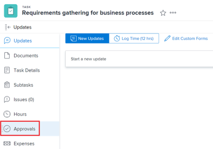

# Associate a new or existing approval process with work {#associate-a-new-or-existing-approval-process-with-work}

You can associate a global or single-use approval process with a work item in  *`Adobe Workfront`*. The following scenarios exist:

*  Associate an existing global approval process with a project, task, issue, template, or template task. Some global approval processes are available to all groups in the system. Group-level global approval processes are available only to certain groups.
*  Create a single-use approval process and associate it with an existing project, task, issue, template, or template task.

>[!NOTE]
>
>This article uses the term "global approval process" to differentiate from "single-use approval process." A global approval process can be used repeatedly. 
>
>
>At the group level, a global approval process is restricted to work items and statuses that belong to the group.

For more general information about approval processes, see [Approval process overview](approval-process-in-workfront.md).

For information about creating a global approval process, see [Create an approval process](create-approval-processes.md). 

## Access requirements {#access-requirements}

You must have the following access to perform the steps in this article:

<table style="width: 100%;margin-left: 0;margin-right: auto;mc-table-style: url('../../Resources/TableStyles/TableStyle-List-options-in-steps.css');" class="TableStyle-TableStyle-List-options-in-steps" cellspacing="0"> 
 <col class="TableStyle-TableStyle-List-options-in-steps-Column-Column1"> 
 <col class="TableStyle-TableStyle-List-options-in-steps-Column-Column2"> 
 <tbody> 
  <tr class="TableStyle-TableStyle-List-options-in-steps-Body-LightGray"> 
   <td class="TableStyle-TableStyle-List-options-in-steps-BodyE-Column1-LightGray" role="rowheader">Adobe Workfront plan*</td> 
   <td class="TableStyle-TableStyle-List-options-in-steps-BodyD-Column2-LightGray"> 
Any 
 </td> 
  </tr> 
  <tr class="TableStyle-TableStyle-List-options-in-steps-Body-MediumGray"> 
   <td class="TableStyle-TableStyle-List-options-in-steps-BodyE-Column1-MediumGray" role="rowheader">Adobe Workfront license*</td> 
   <td class="TableStyle-TableStyle-List-options-in-steps-BodyD-Column2-MediumGray"> 
Work or higher
 </td> 
  </tr> 
  <tr class="TableStyle-TableStyle-List-options-in-steps-Body-LightGray"> 
   <td class="TableStyle-TableStyle-List-options-in-steps-BodyE-Column1-LightGray" role="rowheader">Access level*</td> 
   <td class="TableStyle-TableStyle-List-options-in-steps-BodyD-Column2-LightGray"> 
Edit access or higher to Projects, Tasks, Issues, or Templates
 
Note: If you still don't have access, ask your Workfront administrator if they set additional restrictions in your access level. For information on how a Workfront administrator can change your access level, see <a href="create-modify-access-levels.md" class="MCXref xref">Create or modify custom access levels</a>.
 </td> 
  </tr> 
  <tr class="TableStyle-TableStyle-List-options-in-steps-Body-MediumGray"> 
   <td class="TableStyle-TableStyle-List-options-in-steps-BodyB-Column1-MediumGray" role="rowheader">Object permissions</td> 
   <td class="TableStyle-TableStyle-List-options-in-steps-BodyA-Column2-MediumGray"> 
Manage permissions to the project, task, issue, or template
 
For information on requesting additional access, see <a href="request-access.md" class="MCXref xref">Request access to objects in Adobe Workfront</a>.
 </td> 
  </tr> 
 </tbody> 
</table>

&#42;To find out what plan, license type, or access you have, contact your *`Workfront administrator`*.

## Considerations about associating approval processes with work items {#considerations-about-associating-approval-processes-with-work-items}

* You must create the project, task, issue, template, or template task before the approval process can be associated with it.
*  When you attach an approval process to an item for a status that has passed and in which the item currently is, the approval process will not be triggered and no notifications are sent to the approvers.

  ` `**Example: **``If a task is in the status of&nbsp;Complete and you attach an approval process associated with the&nbsp;Complete status, the approval does not trigger. 

*  When you attach an approval process to the first status of an item (by using a template for tasks and projects and by using the Queue Setup settings for issues), the approval process are bypassed if the submitted approval is recalled. In this case, the approvers do not receive any notifications.

  For more information about recalling approvals, see [View approvals](view-approvals.md).

  >[!TIP] {type="tip"}
  >
  >The first status for a task or issue is New. The first status for a project is the status selected by your *`Workfront administrator`* in the Project&nbsp;Preferences in your system. 

*  The association of approval processes with an object is not recorded in the Updates area for the object.
*  Adding a user, team, or role as an approver does not automatically give them permissions to the object associated with that approval. They receive permissions to the object when the approval step is triggered. Otherwise, the objects must be shared with them before they can make an approval decision. 

The following sections describe the different methods of associating an approval process to a project, task, or issue. 

## Associate a global approval process with a work item {#associate-a-global-approval-process-with-a-work-item}

You can associate a global approval process with a work item (project, task, issue, template, template task).

The global approval process must be available to the group associated with the work item or to all groups in the system. 

>[!NOTE]
>
>You can attach project approval processes to a template, and task approval processes to a template task. After you do this, when someone uses the template to create a project, the approval process becomes a project or task approval process respectively. A single-use approval process attached to a template or template task remains a single-use approval process for projects and tasks.

For information about how *`Workfront administrators`* can configure a global approval process for all groups in the system, and how *`group administrators`* can create approvals for a group, see [Create an approval process](create-approval-processes.md). 

>[!NOTE]
>
>
>
>
>* You can also modify a global approval process to meet your specific needs. For more information, see the section [Modify a global approval process for use on a specific object](#modifying-a-global-approval-process) in this article.
>* You cannot associate an approval process with a parent task.
>
>

To associate an existing global approval process with a project, task, issue, template, or template task: 

1. Go to the work item where you want to associate an approval process.
1.   `<MadCap:conditionalText data-mc-conditions="QuicksilverOrClassic.Quicksilver"> Click  Approvals in the left panel.</MadCap:conditionalText>` 

   `<MadCap:conditionalText data-mc-conditions="QuicksilverOrClassic.Quicksilver"> You might need to click  Show More, then click  Approvals.</MadCap:conditionalText>`   

   

1.  In the `Use an existing approval process` drop-down menu, select the global or group-level approval process you want to associate with the work item.

   The approval process you select displays.

   

1. Click `Save`.
1.  (Optional) Click Edit Approval Process if you want to modify the existing approval you attached to the item. This changes the global approval process to a single-use approval process. For more information, see the section [Modify a global approval process for use on a specific object](#modifying-a-global-approval-process) in this article.

## Modify a global approval process for use on a specific object {#modify-a-global-approval-process-for-use-on-a-specific-object}

Your *`Workfront administrator`* or *`group administrator`* creates global approval processes for you to use, as described in [Create an approval process](create-approval-processes.md). You can modify a global approval process to suit any specific needs of the project, task, or issue where you are associating it. 

>[!IMPORTANT] {type="important"}
>
>When you modify a global approval process, it becomes a single-use approval process that can be used only on the object where you modified it. The global approval process remains unchanged.
>
>
>Consider the following limitations when modifying a global approval process:
>
>
>
>*  The approval process is modified only for the project, task, or issue you are associating the approval process with.
>*  Any future changes made by an administrator to the original global approval process do not reflect on the global approval process that you modified.
>
>

To modify an existing global approval process:

1.  Add a global approval process to the project, task, or issue.

   For instructions, see the section [Associate a global approval process with a work item](#associating-an-existing-global-approval-process) in this article.

   >[!IMPORTANT] {type="important"}
   >
   >Ensure that you click `Save` when adding the approval.

1.  After the global approval process is added, click `Edit Approval Process`. This action turns the global or group-level approval process into a single-use approval process. 

   

1.  Make any changes to the existing approval process. For more information, see the section [Associate a single-use approval process with a project, task, issue, template, or template task](#creating-a-single-use-approval-process) in this article. 
1. Click `Save`, then click `Save` again to confirm that you want to convert the global approval process to a single-use approval process that is available only on this object.

## Associate a single-use approval process with a project, task, issue, template, or template task {#associate-a-single-use-approval-process-with-a-project-task-issue-template-or-template-task}

You can create a single-use approval process for use only on a specific project, task, or issue. 

You can also associate a single-use approval process with a template or template task so that it is available on projects and tasks that are created from the template. 

>[!NOTE]
>
>You can associate a single-use approval process with any system-level or `group-level status` for a project, task, issue, `template, or template task`. For information about *`Workfront`* statuses, see [Create or edit a status](create-or-edit-a-status.md). 

Creating an approval process in this way enables you to create a custom approval process to meet your needs. However, the approval process cannot be associated with other work items in the future. 

Alternatively, you can modify a global approval process for a specific item and that also becomes a single-use approval process. For information, see the section [Modify a global approval process for use on a specific object](#modifying-a-global-approval-process) in this article.

To create a single-use approval process:

1. Go to the project, task, issue, template, or template task where you want to associate an approval process. 
1.   `<MadCap:conditionalText data-mc-conditions="QuicksilverOrClassic.Quicksilver"> Click  Approvals in the left panel.</MadCap:conditionalText>` 

   `<MadCap:conditionalText data-mc-conditions="QuicksilverOrClassic.Quicksilver"> You might need to click  Show More >  Approvals.</MadCap:conditionalText>`   

   

1. Click `Create a single-use approval process`.
1.  Complete the steps beginning with step 5 in the section [Create an approval process](create-approval-processes.md#create) in the article [Create an approval process](create-approval-processes.md). 

   ` `**Tip: **`` The single-use approval process displays as "<Custom>" in the Approval Process field inside the Edit box of templates and template tasks. For information about editing templates or template tasks, see the following articles:

    
    
    *  [Edit project templates](edit-templates.md) 
    *  [Edit a template task](edit-template-task.md) 
    
    

## Automatically associate an approval process with work items {#automatically-associate-an-approval-process-with-work-items}

You can associate an approval process automatically with work items using the following workflows:

* For projects and tasks, you can associate an approval process using a template. You can attach an existing approval process to the Template Approvals tab or the Template Task Approvals tab. For information about associating an existing approval with a work item, see [Associate a global approval process with a work item](#associating-an-existing-global-approval-process) in this article.
* For issues, you can associate an approval with every new issue that is added to a project by associating an existing approval process with a request queue. For information about configuring request queues, see [Create a Request Queue](create-request-queue.md).

