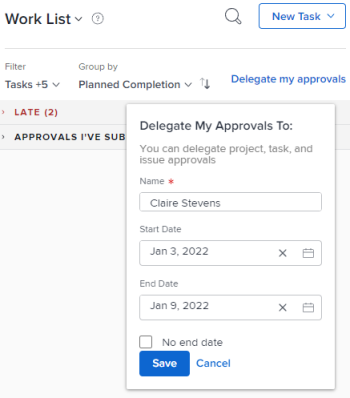
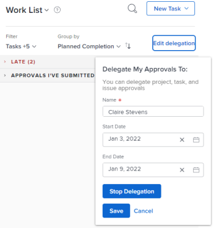
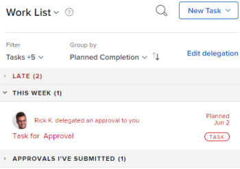

# Delegate approval request

Delegating approval requests allows you to assign another user to approve your requests for a period of time, for example, if you will be out of the office on vacation.

## Access requirements

You must have the following access to perform the steps in this article:

<table cellspacing="0"> 
 <col> 
 </col> 
 <col> 
 </col> 
 <tbody> 
  <tr> 
   <td role="rowheader">Adobe Workfront plan*</td> 
   <td> 
Any
 </td> 
  </tr> 
  <tr> 
   <td role="rowheader">Adobe Workfront license*</td> 
   <td> 
Review or higher
 </td> 
  </tr> 
 </tbody> 
</table>

&#42;To find out what plan or license type you have, contact your Workfront administrator.

## Understand user access for delegated approvals

During the designated approval period, the user to whom you delegate an approval request has the following abilities:

<ul> 
 <li>Can approve or reject existing approval requests where no decision has been made</li> 
 <li>Can approve and reject&nbsp;new approval requests that are received during a specified time period</li> 
 <li>Is granted View access to objects that are awaiting approval <note type="note">
   &nbsp;The Adobe Workfront administrator can restrict users from accessing certain object types.&nbsp;When a user does not have access to an object type and an approval of that type is delegated to the user, the user does not have View access to the object. However, the user can still approve or reject approval requests from the 
   Home page, as described in 
   <a href="../../review-and-approve-work/manage-approvals/approving-work.md" class="MCXref xref">Approving work in Adobe Workfront</a>.
    For example, User A belongs to Group A. The Workfront administrator has restricted the access rights of Group A so that users in this group cannot view tasks within Workfront. If a task approval request is delegated to User A, User A cannot view the task that the approval is associated with. However, User A can approve or reject the approval request from the Home page.
  </note> For information about how the Workfront administrator can restrict access to object types within Setup, see&nbsp;<a href="../../administration-and-setup/add-users/configure-and-grant-access/create-modify-access-levels.md" class="MCXref xref">Create or modify custom access levels</a>.&nbsp;</li> 
</ul>

After the approval delegation stops or is canceled, the user designated as the approver:

* No longer has access to&nbsp;approve work for items that require approval
* Continues to have View access to work items  
  Users who have been granted View access&nbsp;to objects via an approval delegation retain that View access even after the approval delegation stops or is recalled. To remove View access to any objects that the user had access to during the time that approvals were being delegated, you must go to the object and remove access rights directly from the object.

## Delegate approval requests in the Home area

* [Delegate your approvals to another user](#delegating-your-approvals-to-another-user-home) 
* [Update or stop an approval delegation](#updating-or-stopping-an-approval-delegation-home) 
* [View delegated approvals](#viewing-delegated-approvals-home)

### Delegate your approvals to another user

You can delegate the following types of approvals, regardless of how&nbsp;the approval was assigned to you (whether assigned directly to you, to a team you are a member of, or to your job role):

* Project approvals
* Task approvals
* Issue approvals

You cannot delegate timesheet and document approvals.&nbsp;

Consider the following when delegating approvals:

* When you delegate approvals, all your approvals are delegated. You cannot delegate individual approval requests.
* You can delegate approvals to only one user; you cannot delegate approvals to multiple users at the same time.  
  All approvals for all projects, tasks, and issues are delegated to the user who you designate.
* A maximum of 5 users can delegate approvals to the same user at the same time. In other words, a single user cannot be designated as a temporary approver for more than 5 users at the same time.
* Activity regarding approvals displays on the Updates tab. You must have Show System Updates togged on. Both the user delegating the approval and the user to whom approvals are being delegated receive an email notification regarding approval activity.

To delegate approvals to another user:

<ol> Click the Home icon in the upper-left corner of Adobe Workfront. Note: Your Workfront administrator might make the following changes to the Home icon in your environment: Replace it with an image customized to illustrate your organization. In this case, the icon will look different that shown in this article. Replace the page linked to it with a different page. In this case, click the Main Menu in the upper-right corner of the page, then click Home. 
 <li value="2">Click the Filter drop-down menu, then click Approvals.</li> 
 <li value="3">Click Delegate My Approvals. </li> 
 <li value="4">Specify the following information: Delegate My Approvals To: Begin typing the name of the user who you want to forward approvals to, then click the name when it appears in the drop-down menu. Start Date: Select the date for approvals to begin being forwarded. Forwarding begins at 12:00 A.M. on the date that you select. The Start Date must be the current date or a future date. End:&nbsp;Do one of the following:  
  <ul> 
   <li>Select the date for approvals to stop being forwarded. Forwarding ends at 11:59 P.M. on the date that you select.</li> 
   <li>Select&nbsp;No end date&nbsp;to configure Workfront to forward approvals indefinitely.</li> 
  </ul></li> 
 <li value="5">Click Save.</li> 
</ol>

### Update or stop an approval delegation

<ol> Click the Home icon in the upper-left corner of Adobe Workfront. Note: Your Workfront administrator might make the following changes to the Home icon in your environment: Replace it with an image customized to illustrate your organization. In this case, the icon will look different that shown in this article. Replace the page linked to it with a different page. In this case, click the Main Menu in the upper-right corner of the page, then click Home. 
 <li value="2">Click the Filter drop-down menu, then click Approvals.</li> 
 <li value="3">Click Edit delegation.</li> 
 <li value="4">Do either of the following: 
  <ul> 
   <li>To update the existing approval delegation: Change the information displayed, then click Save.</li> 
   <li>To stop the existing delegation: Click Stop Delegation, then click Confirm. </li> 
  </ul></li> 
</ol>

### View delegated approvals

You can view only the following types of approval delegations in the Work List:

* Project approvals
* Task approvals
* Issue approvals

To view delegated approvals:

<ol> Click the Home icon in the upper-left corner of Adobe Workfront. Note: Your Workfront administrator might make the following changes to the Home icon in your environment: Replace it with an image customized to illustrate your organization. In this case, the icon will look different that shown in this article. Replace the page linked to it with a different page. In this case, click the Main Menu in the upper-right corner of the page, then click Home. 
 <li value="2">Click the&nbsp;Filter&nbsp;drop-down menu, then click&nbsp;Approvals. All approvals display in the list by default, including approvals assigned to you and approvals delegated to you. </li> 
</ol>

