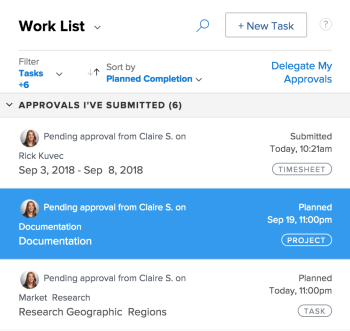
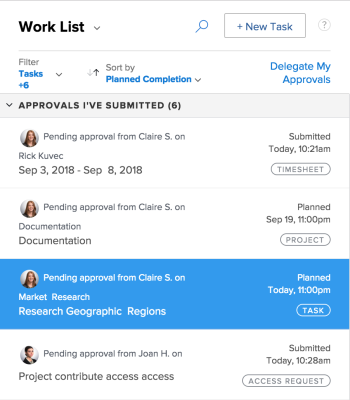
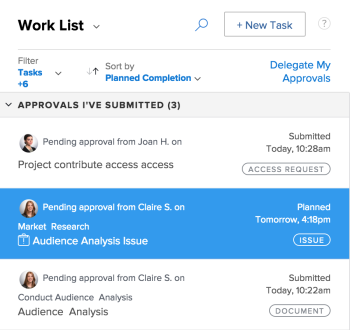
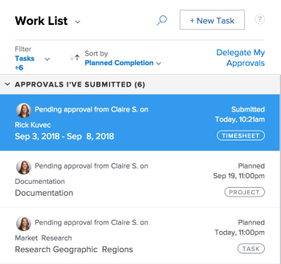

# Recalling Submitted Approvals {#recalling-submitted-approvals}

You can recall any of the following objects submitted for approval:

* Projects
* Tasks
* Issues
* Timesheets
* Documents
* Access Requests

## Access requirements {#access-requirements}

You must have the following access to perform the steps in this article:

<table style="width: 100%;margin-left: 0;margin-right: auto;mc-table-style: url('../../Resources/TableStyles/TableStyle-List-options-in-steps.css');" class="TableStyle-TableStyle-List-options-in-steps" cellspacing="0"> 
 <col class="TableStyle-TableStyle-List-options-in-steps-Column-Column1"> 
 <col class="TableStyle-TableStyle-List-options-in-steps-Column-Column2"> 
 <tbody> 
  <tr class="TableStyle-TableStyle-List-options-in-steps-Body-LightGray"> 
   <td class="TableStyle-TableStyle-List-options-in-steps-BodyE-Column1-LightGray" role="rowheader">Adobe Workfront plan*</td> 
   <td class="TableStyle-TableStyle-List-options-in-steps-BodyD-Column2-LightGray"> 
Any
 </td> 
  </tr> 
  <tr class="TableStyle-TableStyle-List-options-in-steps-Body-MediumGray"> 
   <td class="TableStyle-TableStyle-List-options-in-steps-BodyE-Column1-MediumGray" role="rowheader">Adobe Workfront license*</td> 
   <td class="TableStyle-TableStyle-List-options-in-steps-BodyD-Column2-MediumGray"> 
Request or higher
 </td> 
  </tr> 
  <tr class="TableStyle-TableStyle-List-options-in-steps-Body-LightGray"> 
   <td class="TableStyle-TableStyle-List-options-in-steps-BodyE-Column1-LightGray" role="rowheader">Access level configurations*</td> 
   <td class="TableStyle-TableStyle-List-options-in-steps-BodyD-Column2-LightGray"> 
View or higher access to Projects, Tasks, Issues, Timesheets, Documents
 
Note: If you still don't have access, ask your Workfront administrator if they set additional restrictions in your access level. For information on how a Workfront administrator can modify your access level, see <a href="create-modify-access-levels.md" class="MCXref xref">Create or modify custom access levels</a>.
 </td> 
  </tr> 
  <tr class="TableStyle-TableStyle-List-options-in-steps-Body-MediumGray"> 
   <td class="TableStyle-TableStyle-List-options-in-steps-BodyB-Column1-MediumGray" role="rowheader">Object permissions</td> 
   <td class="TableStyle-TableStyle-List-options-in-steps-BodyA-Column2-MediumGray"> 
View or higher access to the object associated with the approval 
 
For information on requesting additional access, see <a href="request-access.md" class="MCXref xref">Request access to objects in Adobe Workfront</a>.
 </td> 
  </tr> 
 </tbody> 
</table>

&#42;To find out what plan, license type, or access you have, contact your *`Workfront administrator`*.

## Projects {#projects}

When you recall a project approval, the project returns to the status it was in prior to the initiation of the approval process.

If you recall an approval that is associated with the beginning status of the project, the approval process is bypassed and the project remains in the beginning status.

>[!NOTE]
>
>You can associate the first status of a project or task with an approval process by using a template.&nbsp;For more information about adding approvals to a template, see&nbsp; [Edit project templates](edit-templates.md).

To recall a project approval you submitted:

1.  Click the `Home` icon  in the upper-left corner of *`Adobe Workfront`*.
1. In the `Work List` area, navigate to the `Approvals I've Submitted` grouping.

1.  Select a `Project` approval.

   

1. Click `Recall` in the upper-right corner of the right panel.

## Tasks {#tasks}

When you recall a task approval, the task returns to the status it was in prior to the initiation of the approval process.

If you recall an approval that is associated with the beginning status of the task, the approval process is bypassed and the task remains in the beginning status.

>[!NOTE]
>
>You can associate the first status of a project or task with an approval process by using a template. For more information about adding approvals to a template, see [Edit project templates](edit-templates.md).

To recall a task approval you submitted:

1.  Click the `Home` icon  in the upper-left corner of *`Adobe Workfront`*.
1. In the `Work List` area, navigate to the `Approvals I've Submitted` grouping.

1.  Select a `Task` approval.

   

1. Click `Recall` in the upper-right corner of the right panel.

## Issues {#issues}

When you recall an issue approval, the issue returns to the status it was in prior to the initiation of the approval process.

If you recall an approval that is associated with the beginning status of the issue, the approval process is bypassed and the issue remains in the beginning status.

>[!NOTE]
>
>You can associate the first status of an issue with an approval process by using a template. For more information about creating a request queue, see [Create a Request Queue](create-request-queue.md).

1.  Click the `Home` icon  in the upper-left corner of *`Adobe Workfront`*.
1. In the `Work List` area, navigate to the `Approvals I've Submitted` grouping.

1. Select an `Issue` approval.  
   

1. Click `Recall` in the upper-right corner of the right panel.  

## Timesheets {#timesheets}

When you recall a timesheet approval, the timesheet returns to the status it was in before it was submitted for approval.

1.  Click the `Home` icon  in the upper-left corner of *`Adobe Workfront`*.
1. In the `Work List` area, navigate to the `Approvals I've Submitted` grouping.

1. Select a `Timesheet` approval.  
   

1. Click `Recall` in the upper-right corner of the right panel.

## Documents {#documents}

To recall a document approval, you must manually remove one or all users from the approval.

1.  Click the `Home` icon  in the upper-left corner of *`Adobe Workfront`*.
1. In the `Work List` area, navigate to the `Approvals I've Submitted` grouping.

1.  Select a `Document` approval.

   

1. Click `Manage Approvals` in the upper-right corner of the right panel.
1.  Click the `Remove` icon inline with the name of a user. Remove all users to completely recall the document&nbsp;approval.

   

## Access Requests {#access-requests}

1.  Click the `Home` icon  in the upper-left corner of *`Adobe Workfront`*.
1. In the `Work List` area, navigate to the `Approvals I've Submitted` grouping.

1. Select an `Access Request` approval.  
   

1. Click `Recall` in the upper-right corner of the right panel.

