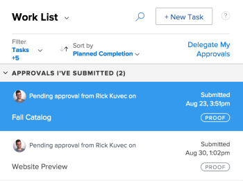

# Viewing submitted proof approvals

Proofing approvals display in the Home area&nbsp;only if your *Adobe Workfront* environment is integrated with a *Workfront Proof* Premium account. If you cannot use *proofing* as discussed here, contact your *Workfront administrator*.

## Access requirements

You must have the following access to perform the steps in this article:

<table cellspacing="0"> 
 <col> 
 <col> 
 <tbody> 
  <tr> 
   <td role="rowheader"><em>Adobe Workfront</em> plan*</td> 
   <td> 
Any
 </td> 
  </tr> 
  <tr> 
   <td role="rowheader"><em>Adobe Workfront</em> license*</td> 
   <td> 
<em>Review</em> or higher
 </td> 
  </tr> 
  <tr> 
   <td role="rowheader">Access level configurations*</td> 
   <td> 
View or higher access to Projects, Tasks, Issues, Templates, Portfolios, Programs, Reports, Dashboards, and Calendars, Documents
 
Note: If you still don't have access, ask your <em>Workfront administrator</em> if they set additional restrictions in your access level. For information on how a <em>Workfront administrator</em> can modify your access level, see <a href="../../administration-and-setup/add-users/configure-and-grant-access/create-modify-access-levels.md" class="MCXref xref">Create or modify custom access levels</a>.
 </td> 
  </tr> 
  <tr> 
   <td role="rowheader">Object permissions</td> 
   <td> 
View or higher access to the object associated with the request access or approval 
 
For information on requesting additional access, see <a href="../../workfront-basics/grant-and-request-access-to-objects/request-access.md" class="MCXref xref">Request access to objects in Adobe Workfront</a>.
 </td> 
  </tr> 
 </tbody> 
</table>

&#42;To find out what plan, license type, or access you have, contact your *Workfront administrator*.

## Viewing submitted proof approvals

<ol> <draft-comment>
  <li value="1" data-mc-conditions="QuicksilverOrClassic.Quicksilver"> 
   
 
    
Click the Home icon  in the upper-left corner of <em>Adobe Workfront</em>.
 <note type="note"> 
     
Your <em>Workfront administrator</em> might make the following changes to the Home icon in your environment:
 
     <ul> 
      <li> 
Replace it with an image customized to illustrate your organization. In this case, the icon will look different that shown in this article. 
 </li> 
      <li> 
Replace the page linked to it with a different page. In this case, click the Main Menu  in the upper-right corner of the page, then click Home.
 </li> 
     </ul> 
    </note> 
   
 </li>
 </draft-comment>
 <li value="1" data-mc-conditions="QuicksilverOrClassic.Quicksilver"> 
  
 
   
Click the Home icon  in the upper-left corner of <em>Adobe Workfront</em>.
 <note type="note"> 
    
Your <em>Workfront administrator</em> might make the following changes to the Home icon in your environment:
 
    <ul> 
     <li> 
Replace it with an image customized to illustrate your organization. In this case, the icon will look different that shown in this article. 
 </li> 
     <li> 
Replace the page linked to it with a different page. In this case, click the Main Menu  in the upper-right corner of the page, then click Home.
 </li> 
    </ul> 
   </note> 
  
 </li> 
 <li value="2">In the Work List area, Go to the Approvals I've Submitted grouping.</li> 
 <li value="3">Select a Proof approval. <note type="note">
   &nbsp;If you submit an approval to a guest 
   <em>proofing</em> user, the approval doesn't display in Home.
  </note> </li> 
 <li value="4"> 
(Optional) Click Go to Proof in the upper-right corner of the right panel to launch the <em>proofing</em> viewer.
 <note type="note">
   You must have View or Edit access to Documents in your Access Level to launch the 
   <em>proofing</em> viewer.
  </note> </li> 
</ol>

