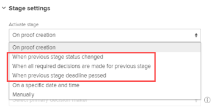

# Configure a *`proof`* {#configure-a-proof}

After you generate a *`proof`*, as described in the [Generate a proof](generate-proof.md) articles, the New Proof page displays. The following sections of the New proof page let you configure the *`proof`* so that it's ready for review. 

## Add files {#add-files}

1.  Begin creating the *`proof`*, as described in the [Generate a proof](generate-proof.md) articles.

   The `New Proof` page appears.  

1. To *`proof`* one or more documents, add documents to be proofed in either of the following ways (repeat this process to add multiple documents to be proofed): 
    
    
    * Drag a document from your file system into the drag-and-drop area in the `Add Files` area.
    * Click `browse`, then find and select the document you want to upload from the file system on your workstation.
    
    
          
    

    
    
      The filename appears below the box where you added it. By default, the filename is also the name of the *`proof`*. You can upload up to 100 files at a given time.  

    
    
    

1. (Optional) If you want to change the name of the *`proof`*, type a new `Proof name`, then click `Done`.

1. Continue with [Single proof](#single-proof) below.

## Single proof {#single-proof}

When the `Single proof` is enabled, all static files and websites are available in a single *`proof`*, and you can upload up to 500 files at a given time.

>[!NOTE]
>
>Interactive files, including videos and interactive websites, cannot be combined into a single *`proof`*.

1. Ensure that you have first added documents or the URL for a website or other web content to the *`proof`*, as described above in [Add files](#add-files).

1. (Optional) Enable  `Combine all compatible files into single proof`, then type a `Proof name` for the resulting *`proof`*.

1. (Optional) In the `Add Files` area on the left, drag the files or websites you have specified to change the order in which they appear as pages in the combined *`proof`*.&nbsp;

1. Continue with [Workflow](#workflow) below.

## Workflow {#workflow}

The workflow is where you add users and specify how you want them to review the *`proof`*. You can create either a basic workflow or an Automated Workflow for a *`proof`*. 

With a basic workflow, you can add as many reviewers as you want to a *`proof`*, but they are not organized into stages. All of the reviewers you add can access the *`proof`* immediately after you create it.

An Automated Workflow makes it easier to manage the review process if your process is complex, or if you send content for review to the same people regularly. The *`proof`* moves from stage to stage and *`Adobe Workfront`* notifies each user when it is their turn to review it.

For more information, see [Automated Workflow overview](automated-workflow.md).

>[!NOTE]
>
>
>
>
>* You can add an Automated Workflow to a *`proof`* only if your *`Adobe Workfront`* environment is integrated with a *`Workfront Proof`* Premium account. If you cannot use *`proofing`* as discussed in this section, contact your *`Workfront administrator`*.
>
>* You can add an Automated Workflow to a *`proof`* when you are uploading the document or after the document is uploaded.
>
>

* [Create a basic workflow for the proof](#create) 
* [Create an Automated Workflow for the proof](#create2) 
* [Configure settings for users added to the proof](#configuring-share-settings) 

### Create a basic workflow for the *`proof`* {#create-a-basic-workflow-for-the-proof}

1. In the `Workflow` section, click `Basic`.

1.  Continue with [Configure settings for users added to the proof](#configuring-share-settings) below.

>[!TIP] {type="tip"}
>
>If you decide later than you would rather use an Automated Workflow for the *`proof`*, can do so. For more information, see [Convert a basic workflow to an Automated Workflow on a proof](convert-basic-automatic-workflow.md)

### Create an Automated Workflow for the *`proof`* {#create-an-automated-workflow-for-the-proof}

1.  In the `Workflow` section, click `Automated`. 
1.  (Optional) If you want to use an Automated Workflow template that your *`Workfront administrator`* created and shared with you, click `Add template`, select the template in the box that appears, then click `Add template`.

   Consider the following when you use an Automated Workflow template:

    
    
    1.  `<li style="font-style: normal;">An Automated Workflow template's settings determine&nbsp;what you can do with the Automated Workflow for a proof. For example, if the Add a stage button disabled in the template, it is not visible as you work with the Automated Workflow settings for the proof. </li>` `<li style="font-style: normal;">When a person is added to a sage in an Automated Workflow template, but also already present as a reviewer on the proof, applying the template removes the reviewer from the stage. If you don't add another reviewer to the stage, a message will prompt you to add one. </li>` `<li style="font-style: normal;">Your ability to modify an Automated Workflow template depends on the template settings configured by the Workfront administrator, as described in <a href="create-manage-automated-workflow-templates.md" class="MCXref xref">Create and manage Automated Workflow templates</a>. If the ability to modify the template is disabled, only the owner of the template can modify&nbsp;it.</li>` 
    
    
    

1. Configure the first stage of the Automated Workflow:
    
    
    1. (Optional) If you want to create a name for the first stage, click `Stage 1`, then type the name.
    1. In the `Recipients` section for the stage, add reviewers to the stage.
    
    
       Consider the following when&nbsp;adding reviewers to a stage:
    
        
        
        * After you add a user to a stage, you can configure settings for that user on the *`proof`*, such as the proof role and any additional permissions they should have and the type of email alerts they will receive when people make comments and decisions on the proof.. For more information, see [Configure settings for users added to the proof](#configuring-share-settings) in the article [Configure a proof](#).
        
        * You can drag one or more users from one stage to another. You can drag users directly to another stage, or you can drag users to a stage on the `Stages` diagram. To select multiple users, press Shift+Ctrl (on Windows) or Shift+Command (on Mac).
        
        
                  
        

        
        * You can add a reviewer to a *`proof`* only once, which means that you cannot add the same person to more than one stage on the *`proof`*.
        
        * Reviewers who are not added to a private stage cannot see that stage on the *`proof`* or comments made in that stage.
        * You can use an email address to add external users as reviewers.
        * By default, adding a user to a stage grants that user access to view the *`proof`* from the moment the *`proof`* is created.  

        
        
          Your *`Workfront administrator`* can restrict users from accessing the *`proof`* until the workflow enters the stage where the user was added. For more information, see&nbsp; [Configure sharing settings for your users](configure-sharing-settings-users.md)&nbsp;in&nbsp; [Configure sharing settings for your users](configure-sharing-settings-users.md).
        
        
        
    
    1. Click `Stage settings`.
    1. Click an `Activate stage` option to indicate how you want the stage to activate.
    
    
       For the first stage, you can select only `On proof creation`, `On a specific date and time`, or `Manually`. 
    
    1. (Conditional) If you selected `On a specific date and time` in the previous step, select the date and time when you want to activate the stage in the `Activate on` box that appears.
    
    1. Use any of the options below to further configure the stage.
    
    
    <table style="width: 100%;margin-left: 0;margin-right: auto;mc-table-style: url('../../../Resources/TableStyles/TableStyle-List-options-in-steps.css');" class="TableStyle-TableStyle-List-options-in-steps" cellspacing="0">
 <col class="TableStyle-TableStyle-List-options-in-steps-Column-Column1">
 <col class="TableStyle-TableStyle-List-options-in-steps-Column-Column2">
 <tbody>
  <tr class="TableStyle-TableStyle-List-options-in-steps-Body-LightGray">
   <td class="TableStyle-TableStyle-List-options-in-steps-BodyE-Column1-LightGray" role="rowheader">Set stage deadline</td>
   <td class="TableStyle-TableStyle-List-options-in-steps-BodyD-Column2-LightGray">
To set a deadline for the stage, click an option in the Deadline options drop-down list. Then, under Deadline, do one of the following:

    <ul>
     <li>If you chose Set specific date: Select the deadline date and time you want.</li>
     <li>If you chose Calculate from stage activation date: Select the number of business days you want to add to the stage activation date to determine the deadline.</li>
    </ul></td>
  </tr>
  <tr class="TableStyle-TableStyle-List-options-in-steps-Body-MediumGray">
   <td class="TableStyle-TableStyle-List-options-in-steps-BodyE-Column1-MediumGray" role="rowheader">Lock stage</td>
   <td class="TableStyle-TableStyle-List-options-in-steps-BodyD-Column2-MediumGray">Specify when the stage can be locked. </td>
  </tr>
  <tr class="TableStyle-TableStyle-List-options-in-steps-Body-LightGray">
   <td class="TableStyle-TableStyle-List-options-in-steps-BodyE-Column1-LightGray" role="rowheader">Transfer primary decision rights to</td>
   <td class="TableStyle-TableStyle-List-options-in-steps-BodyD-Column2-LightGray">
Select the Primary decision maker on the stage (available only after you add&nbsp;at least one person to the stage who has a Proof role of Approver or higher). If you select a Primary decision maker, the Only one decision required option is disabled on this stage.
</td>
  </tr>
  <tr class="TableStyle-TableStyle-List-options-in-steps-Body-MediumGray">
   <td class="TableStyle-TableStyle-List-options-in-steps-BodyE-Column1-MediumGray" role="rowheader">Require only one decision for this stage</td>
   <td class="TableStyle-TableStyle-List-options-in-steps-BodyD-Column2-MediumGray">Ends the entire review process when one of the decision makers makes a decision.
This option is not available if you designated a user in the&nbsp;Primary decision maker&nbsp;drop-down menu.
</td>
  </tr>
  <tr class="TableStyle-TableStyle-List-options-in-steps-Body-LightGray">
   <td class="TableStyle-TableStyle-List-options-in-steps-BodyB-Column1-LightGray" role="rowheader">Make this stage private</td>
   <td class="TableStyle-TableStyle-List-options-in-steps-BodyA-Column2-LightGray">Allows only the following people to view comments and decisions made during this stage: Supervisors, Workfront administrators, and Workfront Proof administrators</td>
  </tr>
 </tbody>
</table>    
    
    
    
    
1. To add and configure another stage:
    
    
    1. Click `New stage`.
    1. (Optional) If you want to create a name for the first stage, click `Stage 2` (or `Stage 3`, `Stage 4`, and so on), then type the name.
    
    1. Click the `Activate stage`, then select an option to specify whether the stage is activated automatically or manually.
    
    
       In addition to the options `On proof creation`, `On a specific date and time`, or `Manually`, you can select an option that is dependent on what occurred in the previous step: 
    
    
           
    

    
    1. If you selected an Activate stage option that is dependent on what occurred in the previous step, use the options that appear to configure the activation setting. 
    
    
       For example, if you selected `When previous stage status changes`, select the `Previous stage`, then select the status in the `Status changed to` box.
    
    
    
1.  Repeat the previous step as needed to add more stages.

   As you add stages to the Automated Workflow, a diagram forms on the screen to represent them:

   

1. Continue the process of generating a new proof, as described in the [Generate a proof](generate-proof.md) articles.
1. Continue with [Configure settings for users added to the proof](#configuring-share-settings) below. 

### Configure settings for users added to the *`proof`* {#configure-settings-for-users-added-to-the-proof}

1.  In the `Workflow` section, in the row of a user you have added, click the drop-down menu in the `Proof role` column, then click the role you want to assign to the user. 

   

1.  The following table lists each role and the rights associated with it. 

<table border="1" cellspacing="15" cellpadding="1" style="mc-table-style: url('../../../Resources/TableStyles/TableStyle-HeaderRow.css');margin-left: 0;margin-right: auto;width: 100%;" class="TableStyle-TableStyle-HeaderRow"> 
 <col class="TableStyle-TableStyle-HeaderRow-Column-Column1"> 
 <col class="TableStyle-TableStyle-HeaderRow-Column-Column1"> 
 <col class="TableStyle-TableStyle-HeaderRow-Column-Column1"> 
 <col class="TableStyle-TableStyle-HeaderRow-Column-Column1"> 
 <col class="TableStyle-TableStyle-HeaderRow-Column-Column1"> 
 <col class="TableStyle-TableStyle-HeaderRow-Column-Column1"> 
 <col class="TableStyle-TableStyle-HeaderRow-Column-Column1"> 
 <col class="TableStyle-TableStyle-HeaderRow-Column-Column1"> 
 <col class="TableStyle-TableStyle-HeaderRow-Column-Column1"> 
 <thead> 
  <tr class="TableStyle-TableStyle-HeaderRow-Head-Header1"> 
   <th class="TableStyle-TableStyle-HeaderRow-HeadE-Column1-Header1"> 
&nbsp;
 </th> 
   <th class="TableStyle-TableStyle-HeaderRow-HeadE-Column1-Header1"> 
View a proof 
 </th> 
   <th class="TableStyle-TableStyle-HeaderRow-HeadE-Column1-Header1"> 
Add markups 
 </th> 
   <th class="TableStyle-TableStyle-HeaderRow-HeadE-Column1-Header1"> 
Add comments 
 </th> 
   <th class="TableStyle-TableStyle-HeaderRow-HeadE-Column1-Header1"> 
Edit own comments if there are no replies 
 </th> 
   <th class="TableStyle-TableStyle-HeaderRow-HeadE-Column1-Header1"> 
Make a decision 
 </th> 
   <th class="TableStyle-TableStyle-HeaderRow-HeadE-Column1-Header1"> 
Edit or delete comments made by others 
 </th> 
   <th class="TableStyle-TableStyle-HeaderRow-HeadE-Column1-Header1"> 
Edit the proof 
 </th> 
   <th class="TableStyle-TableStyle-HeaderRow-HeadD-Column1-Header1"> 
View approval requests in the Home area 
 </th> 
  </tr> 
 </thead> 
 <tbody> 
  <tr class="TableStyle-TableStyle-HeaderRow-Body-LightGray"> 
   <td class="TableStyle-TableStyle-HeaderRow-BodyE-Column1-LightGray"> 
Read Only*
 </td> 
   <td class="TableStyle-TableStyle-HeaderRow-BodyE-Column1-LightGray"> 
✓
 </td> 
   <td class="TableStyle-TableStyle-HeaderRow-BodyE-Column1-LightGray"> 
&nbsp;
 </td> 
   <td class="TableStyle-TableStyle-HeaderRow-BodyE-Column1-LightGray"> 
&nbsp;
 </td> 
   <td class="TableStyle-TableStyle-HeaderRow-BodyE-Column1-LightGray"> 
&nbsp;
 </td> 
   <td class="TableStyle-TableStyle-HeaderRow-BodyE-Column1-LightGray"> 
&nbsp;
 </td> 
   <td class="TableStyle-TableStyle-HeaderRow-BodyE-Column1-LightGray"> 
&nbsp;
 </td> 
   <td class="TableStyle-TableStyle-HeaderRow-BodyE-Column1-LightGray"> 
&nbsp;
 </td> 
   <td class="TableStyle-TableStyle-HeaderRow-BodyD-Column1-LightGray">&nbsp;</td> 
  </tr> 
  <tr class="TableStyle-TableStyle-HeaderRow-Body-MediumGray"> 
   <td class="TableStyle-TableStyle-HeaderRow-BodyE-Column1-MediumGray"> 
Reviewer*
 </td> 
   <td class="TableStyle-TableStyle-HeaderRow-BodyE-Column1-MediumGray"> 
✓
 </td> 
   <td class="TableStyle-TableStyle-HeaderRow-BodyE-Column1-MediumGray"> 
✓
 </td> 
   <td class="TableStyle-TableStyle-HeaderRow-BodyE-Column1-MediumGray"> 
✓
 </td> 
   <td class="TableStyle-TableStyle-HeaderRow-BodyE-Column1-MediumGray"> 
✓
 </td> 
   <td class="TableStyle-TableStyle-HeaderRow-BodyE-Column1-MediumGray"> 
&nbsp;
 </td> 
   <td class="TableStyle-TableStyle-HeaderRow-BodyE-Column1-MediumGray"> 
&nbsp;
 </td> 
   <td class="TableStyle-TableStyle-HeaderRow-BodyE-Column1-MediumGray"> 
&nbsp;
 </td> 
   <td class="TableStyle-TableStyle-HeaderRow-BodyD-Column1-MediumGray">&nbsp;</td> 
  </tr> 
  <tr class="TableStyle-TableStyle-HeaderRow-Body-LightGray"> 
   <td class="TableStyle-TableStyle-HeaderRow-BodyE-Column1-LightGray"> 
Approver 
 </td> 
   <td class="TableStyle-TableStyle-HeaderRow-BodyE-Column1-LightGray"> 
✓
 </td> 
   <td class="TableStyle-TableStyle-HeaderRow-BodyE-Column1-LightGray"> 
&nbsp;
 </td> 
   <td class="TableStyle-TableStyle-HeaderRow-BodyE-Column1-LightGray"> 
&nbsp;
 </td> 
   <td class="TableStyle-TableStyle-HeaderRow-BodyE-Column1-LightGray"> 
&nbsp;
 </td> 
   <td class="TableStyle-TableStyle-HeaderRow-BodyE-Column1-LightGray"> 
✓
 </td> 
   <td class="TableStyle-TableStyle-HeaderRow-BodyE-Column1-LightGray"> 
&nbsp;
 </td> 
   <td class="TableStyle-TableStyle-HeaderRow-BodyE-Column1-LightGray"> 
&nbsp;
 </td> 
   <td class="TableStyle-TableStyle-HeaderRow-BodyD-Column1-LightGray"> 
✓
 </td> 
  </tr> 
  <tr class="TableStyle-TableStyle-HeaderRow-Body-MediumGray"> 
   <td class="TableStyle-TableStyle-HeaderRow-BodyE-Column1-MediumGray"> 
Reviewer &amp; Approver 
 </td> 
   <td class="TableStyle-TableStyle-HeaderRow-BodyE-Column1-MediumGray"> 
✓
 </td> 
   <td class="TableStyle-TableStyle-HeaderRow-BodyE-Column1-MediumGray"> 
✓
 </td> 
   <td class="TableStyle-TableStyle-HeaderRow-BodyE-Column1-MediumGray"> 
✓
 </td> 
   <td class="TableStyle-TableStyle-HeaderRow-BodyE-Column1-MediumGray"> 
✓
 </td> 
   <td class="TableStyle-TableStyle-HeaderRow-BodyE-Column1-MediumGray"> 
✓
 </td> 
   <td class="TableStyle-TableStyle-HeaderRow-BodyE-Column1-MediumGray"> 
&nbsp;
 </td> 
   <td class="TableStyle-TableStyle-HeaderRow-BodyE-Column1-MediumGray"> 
&nbsp;
 </td> 
   <td class="TableStyle-TableStyle-HeaderRow-BodyD-Column1-MediumGray"> 
✓
 </td> 
  </tr> 
  <tr class="TableStyle-TableStyle-HeaderRow-Body-LightGray"> 
   <td class="TableStyle-TableStyle-HeaderRow-BodyE-Column1-LightGray"> 
Author 
 
(Not available when sharing with non-proofing users)
 </td> 
   <td class="TableStyle-TableStyle-HeaderRow-BodyE-Column1-LightGray"> 
✓
 </td> 
   <td class="TableStyle-TableStyle-HeaderRow-BodyE-Column1-LightGray"> 
✓
 </td> 
   <td class="TableStyle-TableStyle-HeaderRow-BodyE-Column1-LightGray"> 
✓
 </td> 
   <td class="TableStyle-TableStyle-HeaderRow-BodyE-Column1-LightGray"> 
✓
 </td> 
   <td class="TableStyle-TableStyle-HeaderRow-BodyE-Column1-LightGray"> 
✓
 </td> 
   <td class="TableStyle-TableStyle-HeaderRow-BodyE-Column1-LightGray"> 
&nbsp;
 </td> 
   <td class="TableStyle-TableStyle-HeaderRow-BodyE-Column1-LightGray"> 
✓
 </td> 
   <td class="TableStyle-TableStyle-HeaderRow-BodyD-Column1-LightGray">&nbsp;</td> 
  </tr> 
  <tr class="TableStyle-TableStyle-HeaderRow-Body-MediumGray"> 
   <td class="TableStyle-TableStyle-HeaderRow-BodyB-Column1-MediumGray"> 
Moderator 
 
(Not available when sharing with non-proofing users)
 </td> 
   <td class="TableStyle-TableStyle-HeaderRow-BodyB-Column1-MediumGray"> 
&nbsp;
 </td> 
   <td class="TableStyle-TableStyle-HeaderRow-BodyB-Column1-MediumGray"> 
✓
 </td> 
   <td class="TableStyle-TableStyle-HeaderRow-BodyB-Column1-MediumGray"> 
✓ 
 </td> 
   <td class="TableStyle-TableStyle-HeaderRow-BodyB-Column1-MediumGray"> 
✓
 </td> 
   <td class="TableStyle-TableStyle-HeaderRow-BodyB-Column1-MediumGray"> 
✓
 </td> 
   <td class="TableStyle-TableStyle-HeaderRow-BodyB-Column1-MediumGray"> 
&nbsp;
 
✓
 
&nbsp;
 </td> 
   <td class="TableStyle-TableStyle-HeaderRow-BodyB-Column1-MediumGray"> 
&nbsp;
 </td> 
   <td class="TableStyle-TableStyle-HeaderRow-BodyA-Column1-MediumGray">&nbsp;</td> 
  </tr> 
 </tbody> 
</table>

1. &#42;Read-only and Reviewer roles are automatically granted View access on the document if they had none previously.
1.   In addition to what is shown in this table, a Moderator can also submit new versions, add new reviewers, apply actions on comments, resolve comments, and delete comments and replies. (Deleting the first comment in a comment thread deletes the entire thread. Deleting a reply in the comment thread deletes only that reply.)
1.  (Optional) With the drop-down menu still open, select any additional permissions available at the bottom of the menu:

   

   >[!NOTE]
   >
   >These additional permissions are available only if you are using an integrated *`proofing`* account ( *`Workfront`* integrated with *`Workfront Proof`*).

<table style="width: 100%;margin-left: 0;margin-right: auto;mc-table-style: url('../../../Resources/TableStyles/TableStyle-List-options-in-steps.css');" class="TableStyle-TableStyle-List-options-in-steps" cellspacing="0"> 
 <col class="TableStyle-TableStyle-List-options-in-steps-Column-Column1"> 
 <col class="TableStyle-TableStyle-List-options-in-steps-Column-Column2"> 
 <tbody> 
  <tr class="TableStyle-TableStyle-List-options-in-steps-Body-LightGray"> 
   <td class="TableStyle-TableStyle-List-options-in-steps-BodyE-Column1-LightGray" role="rowheader">Resolve comments and apply actions </td> 
   <td class="TableStyle-TableStyle-List-options-in-steps-BodyD-Column2-LightGray"> 
Allows the Workfront user to do the following:
 
    <ul> 
     <li>Resolve a comment after it has been addressed, as explained in the section <a href="create-manage-proof-comments.md#resolving-a-comment" class="MCXref xref">Resolve a comment</a> in the article <a href="create-manage-proof-comments.md" class="MCXref xref">Create and manage proof comments</a>.</li> 
     <li>Apply actions to comments, as explained in <a href="use-actions-on-comments-in-viewer.md" class="MCXref xref">Use actions on comments</a>. </li> 
    </ul> </td> 
  </tr> 
  <tr class="TableStyle-TableStyle-List-options-in-steps-Body-MediumGray"> 
   <td class="TableStyle-TableStyle-List-options-in-steps-BodyB-Column1-MediumGray" role="rowheader">Share proof by tagging </td> 
   <td class="TableStyle-TableStyle-List-options-in-steps-BodyA-Column2-MediumGray"> 
Allows the reviewer to add any Workfront user to the proof as explained in <a href="tag-users-to-share-proof.md" class="MCXref xref">Tag users to share a proof</a>.
 
Note:  
If these two options are unavailable (dimmed), the user already has a permission profile that allows resolving comments, applying actions to comments, and tagging any user. 
 
If the options do not display, the person you added is not a Workfront license holder.
 
 </td> 
  </tr> 
 </tbody> 
</table>

1. Repeat steps 1-3 for any other users you have added to the *`proof`*.
1.  For each user you are sharing with, in the `Email alerts`&nbsp;drop-down list, select the type of email alerts this user will receive when people make comments and decisions on the proof.

   For more information about these options, see [Notifications for proof comments and decisions overview](notifications-proof-comments-decisions.md).

<table style="width: 100%;mc-table-style: url('../../../Resources/TableStyles/TableStyle-List-options-in-steps.css');" class="TableStyle-TableStyle-List-options-in-steps" cellspacing="0"> 
 <col class="TableStyle-TableStyle-List-options-in-steps-Column-Column1" style="width: 175px;"> 
 <col class="TableStyle-TableStyle-List-options-in-steps-Column-Column2"> 
 <tbody> 
  <tr class="TableStyle-TableStyle-List-options-in-steps-Body-LightGray"> 
   <td class="TableStyle-TableStyle-List-options-in-steps-BodyE-Column1-LightGray" role="rowheader">All activity</td> 
   <td class="TableStyle-TableStyle-List-options-in-steps-BodyD-Column2-LightGray">Workfront sends an email to the reviewer every time there is any activity on the proof, such as&nbsp;a new&nbsp;comment, reply, or&nbsp;decision. 
This is a great option for the person who is managing the proofing process because&nbsp;it allows them to see the activity as it happens. 

Users do not receive an email alert about their own activity.
</td> 
  </tr> 
  <tr class="TableStyle-TableStyle-List-options-in-steps-Body-MediumGray"> 
   <td class="TableStyle-TableStyle-List-options-in-steps-BodyE-Column1-MediumGray" role="rowheader">Replies to my comments</td> 
   <td class="TableStyle-TableStyle-List-options-in-steps-BodyD-Column2-MediumGray">An email is sent to the reviewer only if someone replies explicitly to their&nbsp;comment&nbsp;(this excludes their own replies on their own comments). This means that if somebody on the proof makes a new comment, the reviewer is not notified.
This&nbsp;setting is recommended for your clients on the proof so that they are not&nbsp;notified of any other comments&nbsp;on the proof, and are&nbsp;notified only&nbsp;of replies to their own comments.

Although reviewers with this email alert setting are not notified of other new&nbsp;comments, they can still view&nbsp;all&nbsp;comments&nbsp;on the proof in&nbsp;the proofing viewer.

For information about comments, see <a href="create-manage-proof-comments.md" class="MCXref xref">Create and manage proof comments</a>.
</td> 
  </tr> 
  <tr class="TableStyle-TableStyle-List-options-in-steps-Body-LightGray"> 
   <td class="TableStyle-TableStyle-List-options-in-steps-BodyE-Column1-LightGray" role="rowheader">Decisions</td> 
   <td class="TableStyle-TableStyle-List-options-in-steps-BodyD-Column2-LightGray">Workfront sends an email to the reviewer only when someone makes a&nbsp;decision.
This can be useful for the person who is managing the approval process&nbsp;(such as a project manager) and&nbsp;needs to monitor progress on the proof and see which users have&nbsp;made their&nbsp;decision.

You are not notified of your own decision unless you select an email confirmation option when submitting your decision.
</td> 
  </tr> 
  <tr class="TableStyle-TableStyle-List-options-in-steps-Body-MediumGray"> 
   <td class="TableStyle-TableStyle-List-options-in-steps-BodyE-Column1-MediumGray" role="rowheader">Final decision</td> 
   <td class="TableStyle-TableStyle-List-options-in-steps-BodyD-Column2-MediumGray">Workfront sends an email when the last approver on the proof has made their&nbsp;decision.
This alert is often used by the designer, who does not usually need to take part in the actual review discussion. When the final decision is made, the designer is&nbsp;notified and&nbsp;can then take&nbsp;action on any necessary changes.

This alert can also be useful&nbsp;for a department leader&nbsp;who needs to be notified only when the review process is finished.
</td> 
  </tr> 
  <tr class="TableStyle-TableStyle-List-options-in-steps-Body-LightGray"> 
   <td class="TableStyle-TableStyle-List-options-in-steps-BodyE-Column1-LightGray" role="rowheader">Hourly Summary</td> 
   <td class="TableStyle-TableStyle-List-options-in-steps-BodyD-Column2-LightGray">Workfront sends an email to the reviewer every hour with a summary of all the&nbsp;comments, replies, and&nbsp;decisions&nbsp;that have occurred in the hour.
The email is sent only when&nbsp;activity besides your own&nbsp;occurs within the past&nbsp;hour. 

This alert is a good way of seeing an overview of the project.

An example use case for this summary is a&nbsp;senior reviewer&nbsp;who needs an overview of the project but does not need to be notified immediately of all activity on the proof.
</td> 
  </tr> 
  <tr class="TableStyle-TableStyle-List-options-in-steps-Body-MediumGray"> 
   <td class="TableStyle-TableStyle-List-options-in-steps-BodyE-Column1-MediumGray" role="rowheader">Daily Summary</td> 
   <td class="TableStyle-TableStyle-List-options-in-steps-BodyD-Column2-MediumGray">Workfront sends one email with all&nbsp;comments, replies, and decisions listed only on days when there is activity besides your own.
This alert is a good way of seeing a summary of the project&nbsp;without being overwhelmed with multiple&nbsp;updates throughout the day.

An example use case for this summary is a department leader&nbsp;who wants to monitor the overall progress of the project.

For more information, see <a href="create-manage-proof-comments.md" class="MCXref xref">Create and manage proof comments</a> and <a href="make-decisions-on-proof.md" class="MCXref xref">Make decisions on a proof</a>.
</td> 
  </tr> 
  <tr class="TableStyle-TableStyle-List-options-in-steps-Body-LightGray" data-mc-conditions=""> 
   <td class="TableStyle-TableStyle-List-options-in-steps-BodyB-Column1-LightGray" role="rowheader">No email</td> 
   <td class="TableStyle-TableStyle-List-options-in-steps-BodyA-Column2-LightGray">Workfront does not send any email alerts. This is useful&nbsp;for a person who is added to a proof only for reference purposes and does not need to be notified of any changes.
The system default is Daily summary (also seen as Not Set). If you or your reviewers do not make any other changes, all your proofs have this setting.
</td> 
  </tr> 
 </tbody> 
</table>

1. Continue with [Email notification](#email-notification) in this article.

## Email notification {#email-notification}

1.  In the `Email notification` section, select whether to send email notifications and a custom message to&nbsp;the users you selected in [Workflow](#workflow) earlier in this article:

1. Continue with [Proof settings](#proof-settings) below.

## Proof settings {#proof-settings}

1.  In the `Proof settings` section, select any of the following options: 

<table style="width: 100%;margin-left: 0;margin-right: auto;mc-table-style: url('../../../Resources/TableStyles/TableStyle-List-options-in-steps.css');" class="TableStyle-TableStyle-List-options-in-steps" cellspacing="0"> 
 <col class="TableStyle-TableStyle-List-options-in-steps-Column-Column1"> 
 <col class="TableStyle-TableStyle-List-options-in-steps-Column-Column2"> 
 <tbody> 
  <tr class="TableStyle-TableStyle-List-options-in-steps-Body-LightGray"> 
   <td class="TableStyle-TableStyle-List-options-in-steps-BodyE-Column1-LightGray" role="rowheader">Require login - proof can only be shared with other users</td> 
   <td class="TableStyle-TableStyle-List-options-in-steps-BodyD-Column2-LightGray">When this option is disabled (default), anyone with the URL is able to view the proof.  When this option is selected:
    <ul>
     <li>Only Workfront Proof&nbsp;users are able to view the proof.</li>
     <li>Users cannot sign in to the proof unless they have been added to the proof.</li>
     <li>Subscriptions cannot be enabled.</li>
    </ul></td> 
  </tr> 
  <tr class="TableStyle-TableStyle-List-options-in-steps-Body-MediumGray"> 
   <td class="TableStyle-TableStyle-List-options-in-steps-BodyE-Column1-MediumGray" role="rowheader">Only one decision required for this proof</td> 
   <td class="TableStyle-TableStyle-List-options-in-steps-BodyD-Column2-MediumGray">When this option is selected, the review is completed after one of the decision makers makes their decision. This option is disabled by default.</td> 
  </tr> 
  <tr class="TableStyle-TableStyle-List-options-in-steps-Body-LightGray"> 
   <td class="TableStyle-TableStyle-List-options-in-steps-BodyE-Column1-LightGray" role="rowheader">Require decisions to be electronically signed</td> 
   <td class="TableStyle-TableStyle-List-options-in-steps-BodyD-Column2-LightGray">Users are required to specify their user name and password at the time that they make a decision on&nbsp;a proof.</td> 
  </tr> 
  <tr class="TableStyle-TableStyle-List-options-in-steps-Body-MediumGray"> 
   <td class="TableStyle-TableStyle-List-options-in-steps-BodyE-Column1-MediumGray" role="rowheader">Lock proof when all required decisions are made</td> 
   <td class="TableStyle-TableStyle-List-options-in-steps-BodyD-Column2-MediumGray">When this setting is enabled, the proof state is locked after all decisions have been made. The state is automatically changed from unlocked to locked when the final approver makes their decision. This option is disabled by default.</td> 
  </tr> 
  <tr class="TableStyle-TableStyle-List-options-in-steps-Body-LightGray"> 
   <td class="TableStyle-TableStyle-List-options-in-steps-BodyE-Column1-LightGray" role="rowheader">Download original file</td> 
   <td class="TableStyle-TableStyle-List-options-in-steps-BodyD-Column2-LightGray">When this option is selected, reviewers are able to download the original file from which the proof was created. When this option is deselected, the Download icon is no longer visible. This option is enabled by default.</td> 
  </tr> 
  <tr class="TableStyle-TableStyle-List-options-in-steps-Body-MediumGray"> 
   <td class="TableStyle-TableStyle-List-options-in-steps-BodyE-Column1-MediumGray" role="rowheader">Share proof via public URL or embed code</td> 
   <td class="TableStyle-TableStyle-List-options-in-steps-BodyD-Column2-MediumGray">When this option is selected, the proof can be shared via a public URL or embed code.</td> 
  </tr> 
  <tr class="TableStyle-TableStyle-List-options-in-steps-Body-LightGray"> 
   <td class="TableStyle-TableStyle-List-options-in-steps-BodyB-Column1-LightGray" role="rowheader">Subscribe to proof via public URL or embed code</td> 
   <td class="TableStyle-TableStyle-List-options-in-steps-BodyA-Column2-LightGray">When this option is selected, people who have not been added explicitly to the proof can subscribe to the proof. The person subscribing to the proof is granted the role and email that you define in the following settings:
    <ul>
     <li>Subscriber role:&nbsp;The default proof role that is&nbsp;assigned to all reviewers that subscribe to the proof.&nbsp;</li>
     <li>Email alert settings for subscribers:&nbsp;The default email alert that is assigned to all reviewers that subscribe to the proof.</li>
    </ul>

     <ul>
      <li>Proof access via email link required for:&nbsp;Configure whether the subscriber receives an email with a link to the proof. You can select No email (email link is not required to access the proof), Proof notification email only (subscriber receives a link to the proof via email without any verification), or Validation and proof notification emails (subscriber receives a link to the proof via email and must click the link to access a proof, the purpose of this option is to ensure that the person has entered a correct email address to which they have access).</li>
     </ul>
Note: &nbsp;If the proofs have Automated Workflow attached all subscriptions will generate confirmation emails to the proof Owners, so they could decide which stage the person should be added to. 

</td> 
  </tr> 
 </tbody> 
</table>

1.  Click `Create Proof`.

   *`Workfront`* begins generating a *`proof`* of the selected documents or websites. Depending on the file size and type, the lag time on a document upload can vary. Be patient as bigger files take longer to generate. You can navigate away from the page and *`Workfront`*&nbsp;continues to generate your file.&nbsp;The maximum file upload size is 4GB.  

1.  After the *`proof`* is generated, click  `Open proof` to launch the *`proofing viewer`*.

   

   Users who do not have *`proofing`* enabled on their account&nbsp;are still able to view the document and make comments to the proof [.](config-time-logged-hrs-days.md)  

