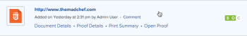

# Create a static proof for a website or other web content

You can generate a new static proof or a new version of an existing static proof for web content. Web content can include things like ads with streaming video, HTML animations, or interactive banners, but it will be cut into multiple screenshots to allow for static proofing.

Consider the following when creating static proofs for a website or other web content:

## Access requirements

You must have the following access to perform the steps in this article:

<table cellspacing="0"> 
 <col> 
 <col> 
 <tbody> 
  <tr> 
   <td role="rowheader">Adobe Workfront plan*</td> 
   <td> 
Current plan: Pro or Higher
 
or
 
Legacy plan: Select or Premium
 
For more information about proofing access with the different plans, see <a href="../../../administration-and-setup/manage-workfront/configure-proofing/access-to-proofing-functionality.md" class="MCXref xref">Access to proofing functionality in Workfront</a>.
 </td> 
  </tr> 
  <tr> 
   <td role="rowheader">Adobe Workfront license*</td> 
   <td> 
Current plan: Work or Plan
 
Legacy plan: Any (You must have proofing enabled for the user)
 </td> 
  </tr> 
  <tr> 
   <td role="rowheader">Proof Permission Profile </td> 
   <td>Manager or higher</td> 
  </tr> 
  <tr> 
   <td role="rowheader">Access level configurations*</td> 
   <td> 
Edit access to Documents
 
Note: If you still don't have access, ask your Workfront administrator if they set additional restrictions in your access level. For information on how a Workfront administrator can modify your access level, see <a href="../../../administration-and-setup/add-users/configure-and-grant-access/create-modify-access-levels.md" class="MCXref xref">Create or modify custom access levels</a>.
 </td> 
  </tr> 
 </tbody> 
</table>

&#42;To find out what plan, role, or Proof Permission Profile you have, contact your Workfront or Workfront Proof administrator.

## Create a static proof for a website or other web content

To create a static proof, the website needs to be publicly accessible (not behind a firewall), or your organization's allowlist must include the Workfront domain. Workfront cannot capture a password-protected website as a static proof.

>[!TIP]
>
>We recommend interactive proofing rather than static proofing for internal pages requiring authorization and password-protected pages. For more information, see [Interactive content proofs overview](../../../review-and-approve-work/proofing/proofing-overview/interactive-content-proofs.md).

<ol> 
 <li value="1">Go to the project, task, or issue where you want to create a new website proof or a new version of an existing one.</li> 
 <li value="2">Click Documentsin the left panel.</li> 
 <li value="3"> 
(Conditional) If you are creating a new proof, click&nbsp;Add New, then click Proof in the menu that appears.
 </li> 
 <li value="4">(Conditional) If you are creating a new version of an existing proof: 
  <ol style="list-style-type: lower-alpha;">
   <li value="1">
Mouse over the URL proof&nbsp;for which you want to create a new version, then select it by clicking in the light blue background surrounding it.

 
</li>
   <li value="2">Click Add new > Version > Proof.</li>
  </ol></li> 
 <li value="5"> 
Type the URL of the website you want to proof in the Add Files area, then press Enter.
 
The URL appears below the box where you typed it.
 
  
 </li> 
 <li value="6"> 
Click the URL you have added.
 
Options for configuring the website proof appear.
 
  
 </li> 
 <li value="7"> 
(Optional) If you want to change the name of the proof from the website URL to something else, type a&nbsp;Proof name.
 </li> 
 <li value="8"> 
Make sure&nbsp;Capture screenshot&nbsp;is selected and use any of the following options:
 
  <table cellspacing="0"> 
   <col> 
   <col> 
   <tbody> 
    <tr> 
     <td role="rowheader">Screenshot resolution </td> 
     <td> 
Adjust the resolution of your content when reviewers view the proof, allowing them to see how it appears on devices of varying sizes, such as phones, tablets, and monitors.
 
If you select multiple resolutions, a separate proof is created for each resolution you select.
 <note type="note">
       When a reviewer comments on the proof, the comment includes the resolution showing when the comment was made so that other reviewers know which resolution is associated with the comment.&nbsp;
      </note> </td> 
    </tr> 
    <tr> 
     <td role="rowheader">Look for subpages </td> 
     <td> 
Capture the website's subpages as well as its main pages. You can click&nbsp;Select all&nbsp;to include all the pages, or you can click only certain pages you want to be included. The plus and minus buttons let you expand and close the subpage areas in the website.
 </td> 
    </tr> 
   </tbody> 
  </table> <note type="important">
   You cannot change the Capture screenshot setting for any subsequent versions of the proof that you create.
  </note> </li> 
 <li value="9"> 
Click Done.
 
If you selected multiple screenshot resolutions in step 8, the list includes a set of screenshots for each resolution. You can generate these screenshots as separate proofs or combine them into a single proof (see&nbsp;<a href="../../../review-and-approve-work/proofing/creating-proofs-within-workfront/configure-proof.md#single-proof" class="MCXref xref">Single proof</a> in <a href="../../../review-and-approve-work/proofing/creating-proofs-within-workfront/configure-proof.md" class="MCXref xref">Configure a proof</a>.). We recommend that you combine them, especially if you are creating a static website proof.
 <note type="note">
   If you are adding a new version to an existing URL proof, any options that were configured on the original proof or previous version are maintained in this version.
  </note> </li> 
 <li value="10">Click Create proof to create a simple proof with no review process. or Continue by configuring an advanced proof: 
  <ul>
   <li>
<a href="../../../review-and-approve-work/proofing/creating-proofs-within-workfront/configure-basic-proof-workflow.md" class="MCXref xref">Create an advanced proof with a Basic workflow</a>
</li>
   <li>
<a href="../../../review-and-approve-work/proofing/creating-proofs-within-workfront/create-automated-proof-workflow.md" class="MCXref xref">Create an advanced proof with an Automated workflow</a>
</li>
  </ul></li> 
</ol>

