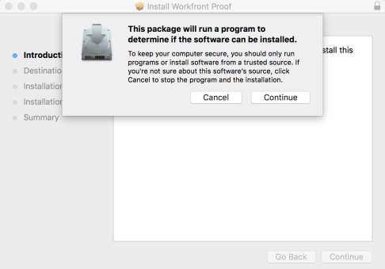
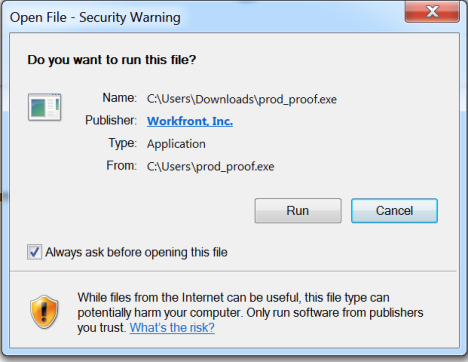

# Install the `Desktop Proofing Viewer` {#install-the-desktop-proofing-viewer}

The `Desktop Proofing Viewer`, which is designed primarily for `proofing` interactive content, is an application that must be installed on your local machine. This application&nbsp;is supported on the following operating systems:

* Windows 7 and later, 32-bit and 64-bit
* Mac OS X 10.9 and later, 64-bit

If you need information about the various `proofing` viewers,&nbsp;see&nbsp; [Differences between the Web Proofing Viewer and the Desktop Proofing Viewer](understand-differences-between-web-viewer.md)&nbsp;

If you need information about the transition from the Legacy `proofing viewer` to the `Desktop Proofing Viewer` (for interactive `proofs`), see [Legacy proofing viewer removed in 2018.3](lpv-removed-2018.md)&nbsp;

>[!NOTE]
>
>(You might not have access to the Legacy `proofing viewer` because it is supported by Flash, which has been deprecated in most environments.) Only the `Desktop Proofing Viewer` supports interactive `proofing` of websites that are iframe-protected or non-secure. If your organization is using the Legacy `proofing viewer` for interactive `proofs` and you are creating or opening an interactive `proof` with either of these properties, the steps below will not work. However, you can use the `Web Proofing Viewer` or the Legacy `proofing viewer` to `proof` the website as a static (non-interactive) `proof`.

## Install the `Desktop Proofing Viewer` on Mac {#install-the-desktop-proofing-viewer-on-mac}

If your `Workfront administrator` or `Workfront Proof administrator` has downloaded the app on your workstation and configured the `Desktop Proofing Viewer` as the default viewer for interactive `proofs`, you can finish the installation simply by opening an interactive `proof`, as described in [Review an interactive proof](review-and-managing-interactive-proofs.md).

If this is not the case, you can follow the steps below. 

1.  Do one of the following to download the app:   

    
    
    * If you are using the Production environment, click  [Mac Production Download for the `Desktop Proofing Viewer`.](https://cdn.proofhq.com/nativeviewer/desktop_viewer/Workfront+Proof.pkg)
    *  If you are using the Preview environment, click  [Mac Preview Download for the `Desktop Proofing Viewer`.](https://cdn.preview.proofhq.com/nativeviewer/desktop_viewer/Workfront+Proof+Preview.pkg)
    
    

1. Open the file you have just downloaded to start the installation.
1.  On the installation box that appears, click **Continue**, then click **Install**.  

   

1.  Open an interactive `proof` as described in [Review an interactive proof](review-and-managing-interactive-proofs.md).

After the `Desktop Proofing Viewer` is installed, all interactive `proofs` open in the `Desktop Proofing Viewer`, as described in [Review an interactive proof](review-and-managing-interactive-proofs.md). If the `Desktop Proofing Viewer` does not launch when you open an interactive `proof`, this probably means that your `Workfront` or `Workfront Proof administrator` needs to configure the `Desktop Proofing Viewer` as the default viewer for interactive `proofs`, as described in&nbsp; [Install the Desktop Proofing Viewer for your organization](install-desktop-proofing-viewer-org.md).

## Install the `Desktop Proofing Viewer` on Windows {#install-the-desktop-proofing-viewer-on-windows}

If your `Workfront` or `Workfront Proof administrator` has downloaded the app on your workstation and configured the `Desktop Proofing Viewer` as the default viewer for interactive `proofs`, you can finish the installation simply by opening an interactive `proof`, as described in [Review an interactive proof](review-and-managing-interactive-proofs.md).

1.  Do one of the following to download the app: 
    
    
    * In the Production environment, click  [Windows Production download for the `Desktop Proofing Viewer`.](https://cdn.proofhq.com/nativeviewer/desktop_viewer/Workfront+Proof.exe)
    * In the Preview environment, click  [Windows Preview download for the `Desktop Proofing Viewer`](https://cdn.preview.proofhq.com/nativeviewer/desktop_viewer/Workfront+Proof+Preview.exe).
    
    
1. Open the file you have just downloaded to start the installation.
1.  In the installation box that appears, open the file you have just downloaded to start the installation.  

   

1.  In the security warning box that appears, click&nbsp;**Run.  
   **

   The `Desktop Proofing Viewer` automatically installs and runs.&nbsp;

1. (Conditional) If you install the application using Internet Explorer, refresh the launching page in the browser after the application installs.
1.  Open an interactive `proof` as described in [Review an interactive proof](review-and-managing-interactive-proofs.md).

After the `Desktop Proofing Viewer` is installed, all interactive `proofs` open in the `Desktop Proofing Viewer`, as described in  [Review an interactive proof](review-and-managing-interactive-proofs.md). If the `Desktop Proofing Viewer` does not launch when you open an interactive `proof`, this probably means that your `Workfront` or `Workfront Proof administrator` needs to configure the `Desktop Proofing Viewer` as the default viewer for interactive `proofs`, as described in&nbsp; [Install the Desktop Proofing Viewer for your organization](install-desktop-proofing-viewer-org.md).
