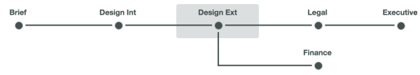
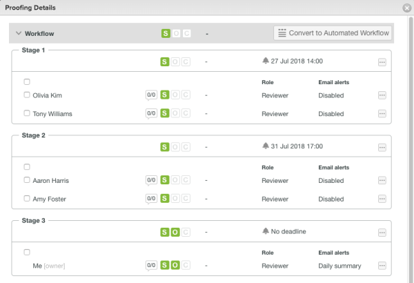

# Automated Workflow Stages overview {#automated-workflow-stages-overview}

Proof stages are segments of time in which different users review a `proof`. As the `proof` moves from one stage to the next, `Workfront` notifies the reviewers to tell them when it's time to work on it.

Stages occur in two different situations:

* When you create a `proof` with an automated workflow. In this case, you manually assign people to work on the `proof` during review stages that you define. This is the most common use for stages.

* When you assign deadlines for different reviewers on a `proof`. In this case, the system assigns a stage to each deadline.

Both uses of stages are explained below.

## Stages in an Automated Workflow {#stages-in-an-automated-workflow}

When you add an automated workflow to a `proof`, you set up the stages of review work you want to occur.&nbsp;For more information, see&nbsp; [Automated Workflow overview](automated-workflow.md).&nbsp;

When you set up stages for a `proof` with an automatic workflow:

* You can configure the stages to run consecutively or simultaneously.
* You can configure some stages to become active only after a previous stage is completed.
* You can make some stages private. This is useful, for example, for an agency that reviews a `proof` before it is shared with a client and does not want the resulting comments visible to the client.

For instructions on creating stages for a `proof` with an automated workflow, see [Workflow](configure-proof.md#workflow) in [Configure a proof](configure-proof.md).

## Stages that correspond with deadlines {#stages-that-correspond-with-deadlines}

When you assign different `proofing` deadlines to reviewers on a proof, the system creates a stage for each deadline and groups&nbsp;the reviewers for each deadline in the corresponding stage.&nbsp;

For example, suppose you create a `proof` with four reviewers:

* For reviewers Olivia and Tony, you specify a deadline for 14:00 a few days from now.
* For Aaron and Amy, you specify a deadline for 17:00 a few days later.
* You don't specify a deadline for yourself.

The system creates a stage for each of these three "groups" of reviewers:

Then, suppose you share the `proof` with another reviewer, Claire, not specifying a deadline. `Workfront` adds her to Stage 3, where there is no deadline.&nbsp;

For more information about adding deadlines to a `proof`, see the&nbsp; [Create an Automated Workflow for the proof](configure-proof.md#create2)&nbsp;section in&nbsp; [Configure a proof](configure-proof.md).
