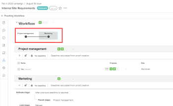

# Create or edit an Automated Workflow for an existing *proof*

Automated Workflows make it easier to manage the review process if your process is complex or if you regularly send content for review to the same groups of people.&nbsp;When you create a *proof* with an Automated Workflow, the *proof* moves from stage to stage&nbsp;until final approval. Participants are notified when it's their turn to review the document.

For information about creating an Automated Workflow for a new proof, see [Create an advanced proof with an Automated workflow](../../../review-and-approve-work/proofing/creating-proofs-within-workfront/create-automated-proof-workflow.md).

## Access requirements

You must have the following access to perform the steps in this article:

<table cellspacing="0"> 
 <col> 
 <col> 
 <tbody> 
  <tr> 
   <td role="rowheader"><em>Adobe Workfront</em> plan*</td> 
   <td> 
Current plan: Pro or Higher
 
or
 
Legacy plan: Premium
 
For more information about proofing access with the different plans, see <a href="../../../administration-and-setup/manage-workfront/configure-proofing/access-to-proofing-functionality.md" class="MCXref xref">Access to proofing functionality in Workfront</a>.
 </td> 
  </tr> 
  <tr> 
   <td role="rowheader"><em>Adobe Workfront</em> license*</td> 
   <td> 
Current plan: Work or Plan
 
Legacy plan: Any (You must have proofing enabled for the user)
 </td> 
  </tr> 
  <tr> 
   <td role="rowheader"><em>Proof Permission Profile</em> </td> 
   <td>Manager or higher</td> 
  </tr> 
  <tr> 
   <td role="rowheader">Access level configurations*</td> 
   <td> 
Edit access to Documents
 
Note: If you still don't have access, ask your <em>Workfront administrator</em> if they set additional restrictions in your access level. For information on how a <em>Workfront administrator</em> can modify your access level, see <a href="../../../administration-and-setup/add-users/configure-and-grant-access/create-modify-access-levels.md" class="MCXref xref">Create or modify custom access levels</a>.
 </td> 
  </tr> 
 </tbody> 
</table>

&#42;To find out what plan, role, or *Proof Permission Profile* you have, contact your *Workfront* or *Workfront Proof administrator*.

## Create or edit an Automated Workflow for an existing proof:

<ol> 
 <li value="1"> 
Hover over the document in the Documents area, then click <draft-comment>
    <MadCap:conditionalText data-mc-conditions="QuicksilverOrClassic.Quicksilver">
     Proofing Workflow
    </MadCap:conditionalText>
   </draft-comment><MadCap:conditionalText data-mc-conditions="QuicksilverOrClassic.Quicksilver">
    Proofing Workflow
   </MadCap:conditionalText>.
 
Or
 
If you are reviewing the proof in the proofing viewer, click Workflow  in the left panel, then click the Edit icon  to open the Automated Workflow settings for the <em>proof</em>.
 </li> 
 <li value="2"> 
(Conditional) If the proof currently is currently using a basic workflow (without stages), click Convert to Automated Workflow in the <draft-comment>
    <MadCap:conditionalText data-mc-conditions="QuicksilverOrClassic.Quicksilver">
     screen
    </MadCap:conditionalText>
   </draft-comment><MadCap:conditionalText data-mc-conditions="QuicksilverOrClassic.Quicksilver">
    screen
   </MadCap:conditionalText> that appears.
 <note type="note">
   You cannot edit the first stage when you convert from a basic workflow to an Automated Workflow, but you can add and configure new stages.
  </note> </li> 
 <li value="3"> 
Conditional)&nbsp;To use an Automated Workflow template that your <em>Adobe Workfront administrator</em> created and shared with you, click Add template, select the template in the box that appears, then click Add template.
 
For more information, see <a href="#adding-additional-template-to-existing-workflow" class="MCXref xref">About using Automated Workflow templates</a> in this article.
 </li> 
 <li value="4">Add a stage to the Automated Worfklow:
  <ol>
   <li value="1">Click New stage near the upper-right corner.</li>
   <li value="2">In the box that appears, type a&nbsp;Name for the stage.</li>
   <li value="3">(Optional) Set a deadline for the stage. </li>
   <li value="4">
In the Activate stage section, choose how you want the stage to activate:

    <table cellspacing="0">
     <col>
     <col>
     <tbody>
      <tr>
       <td role="rowheader">On proof creation</td>
       <td>The stage becomes active automatically because the proof has already been created. </td>
      </tr>
      <tr>
       <td role="rowheader">When previous stage deadline passes</td>
       <td>Click the previous stage in the Parent stage drop-down list .</td>
      </tr>
      <tr>
       <td role="rowheader">On a specific date & time</td>
       <td>Click the On box to select the date, then click the box to the right to select the time.</td>
      </tr>
      <tr>
       <td role="rowheader">All decisions are Approved or Approved with changes on parent stage</td>
       <td>Click the parent stage in the Parent stage drop-down list.</td>
      </tr>
      <tr>
       <td role="rowheader">All decisions are Approved on parent stage</td>
       <td>Click the parent stage in the Parent stage drop-down list.</td>
      </tr>
      <tr>
       <td role="rowheader">All decisions are made</td>
       <td>Click the parent stage in the Parent stage drop-down list.</td>
      </tr>
     </tbody>
    </table></li>
   <li value="5">
Enter a contact name or email address, and configure settings for reviewers for the stage.

For information about adding reviewers, see <a href="#about" class="MCXref xref">About adding reviewers to a stage</a> in this article.
</li>
   <li value="6">
Use any of the following options to further configure the stage: 

    <table cellspacing="0">
     <col>
     <col>
     <tbody>
      <tr>
       <td role="rowheader">Deadline options </td>
       <td>
To set a deadline for the stage, click an option in the Deadline options drop-down list. Then, under Deadline, do one of the following:

        <ul>
         <li>If you chose Set specific date: Select the deadline date and time you want.</li>
         <li>If you chose Calculate from stage activation date: Select the number of business days you want to add to the stage activation date to determine the deadline.</li>
        </ul></td>
      </tr>
      <tr>
       <td role="rowheader">Lock stage</td>
       <td>Specify when the stage can be locked. </td>
      </tr>
      <tr>
       <td role="rowheader">Primary decision maker</td>
       <td>
Select the Primary decision maker on the stage (available only after you add&nbsp;at least one person to the stage who has a Proof role of Approver or higher). If you select a Primary decision maker, the Only one decision required option is disabled on this stage.
</td>
      </tr>
      <tr>
       <td role="rowheader">Only one decision required</td>
       <td>Ends the entire review process when one of the decision makers makes a decision.
This option is not available if you designated a user in the&nbsp;Primary decision maker&nbsp;drop-down menu.
</td>
      </tr>
      <tr>
       <td role="rowheader">Private stage</td>
       <td>Allows only the following people to view comments and decisions made during this stage: Supervisors, <em>Adobe Workfront administrators</em>, and <em>Workfront Proof administrator</em>s</td>
      </tr>
      <tr>
       <td role="rowheader">Notify people by email</td>
       <td>Alerts reviewers with an email notification when it's their turn to work on the <em>proof</em>.</td>
      </tr>
     </tbody>
    </table></li>
   <li value="7">Click Add stage.</li>
  </ol></li> 
 <li value="5"> 
Repeat the previous step as needed to add more stages.
 
As you add stages to the Automated Workflow, a diagram forms on the screen to represent them:
 <draft-comment>
   
  

  </draft-comment>
  
 </li> 
 <li value="6">When you are finished adding stages, click Done.</li> 
</ol>

## About using Automated Workflow templates

Consider the following when you use an Automated Workflow template:

1. `<li style="font-style: normal;">An Automated Workflow template's settings determine&nbsp;what you can do with the Automated Workflow for a <em>proof</em>. For example, if the Add a stage button disabled in the template, it is not visible as you work with the Automated Workflow settings for the <em>proof</em>. </li>` `<li style="font-style: normal;">When a person is added to a sage in an Automated Workflow template, but also already present as a reviewer on the <em>proof</em>, applying the template removes the reviewer from the stage. If you don't add another reviewer to the stage, a message will prompt you to add one. </li>` `<li style="font-style: normal;">Your ability to modify an Automated Workflow template depends on the template settings configured by the <em>Workfront administrator</em>, as described in <a href="../../../administration-and-setup/manage-workfront/configure-proofing/create-manage-automated-workflow-templates.md" class="MCXref xref">Create and manage Automated Workflow templates</a>. If the ability to modify the template is disabled, only the owner of the template can modify&nbsp;it.</li>`

## About adding reviewers to a stage

Consider the following when&nbsp;adding reviewers to a stage:

* After you add a user to a stage, you can configure settings for that user on the *proof*, such as the proof role and any additional permissions they should have and the type of email alerts they will receive when people make comments and decisions on the proof. 
* You can drag one or more users from one stage to another. You can drag users directly to another stage, or you can drag users to a stage on the `Stages` diagram. To select multiple users, press Shift+Ctrl (on Windows) or Shift+Command (on Mac).
* You&nbsp;can add a reviewer to a *proof* only once, which means that you cannot add the same person to more than one stage on the *proof*.

* Reviewers who are not added to a private stage cannot see that stage on the *proof* or comments made in that stage.
* By default, adding a user&nbsp;to a stage grants&nbsp;that user access to view the *proof* from the moment the *proof* is created.

  Your *Workfront administrator* can restrict users from accessing the *proof* until the workflow enters the stage where the user was added. For more information, see&nbsp; [Configure sharing settings for your users](../../../administration-and-setup/manage-workfront/configure-proofing/configure-sharing-settings-users.md)&nbsp;in&nbsp; [Configure sharing settings for your users](../../../administration-and-setup/manage-workfront/configure-proofing/configure-sharing-settings-users.md).

