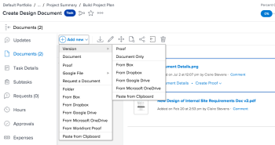

# Create a new version of a *`proof`* {#create-a-new-version-of-a-proof}

Managing feedback across multiple versions or revisions of a piece of work can be a huge challenge. *`Workfront Proof`* simplifies this process by letting you create and compare multiple versions of a *`proof`*. 

Consider the following information when you are creating a new version of a *`proof`*:

* There is no limit to the number of versions of a *`proof`* you can create. 
* You can give a user permission to see one version but not another. Conversely, if you share a later version with a user, that user cannot see earlier versions unless you go back and explicitly grant the user access to those previous versions. 
*  To create a new version of a *`proof`* you must have Edit rights on the *`proof`*.

  See [Manage Proof Roles in Workfront Proof](manage-proof-roles.md) and [Proof Permissions Profiles in Workfront Proof](proof-perm-profiles-in-wp.md) to get more information on who has edit rights on a *`proof`*.

  For information about sharing *`proof`* versions, see&nbsp; [Share a Proof in Workfront Proof](share-proof.md).

>[!IMPORTANT] {type="important"}
>
>If a *`proof`* is created within *`Adobe Workfront`*, any new versions created for that *`proof`* must also be created within *`Workfront`*. You cannot create a new version of a *`proof`* within *`Workfront Proof`* if that *`proof`* was created within *`Workfront`*. For information about how to create *`proof`* versions within *`Workfront`*, see [Create a new version of a proof](#).

## Access requirements {#access-requirements}

You must have the following access to perform the steps in this article:

<table style="width: 100%;margin-left: 0;margin-right: auto;mc-table-style: url('../../../Resources/TableStyles/TableStyle-List-options-in-steps.css');" class="TableStyle-TableStyle-List-options-in-steps" cellspacing="0"> 
 <col class="TableStyle-TableStyle-List-options-in-steps-Column-Column1"> 
 <col class="TableStyle-TableStyle-List-options-in-steps-Column-Column2"> 
 <tbody> 
  <tr class="TableStyle-TableStyle-List-options-in-steps-Body-LightGray"> 
   <td class="TableStyle-TableStyle-List-options-in-steps-BodyE-Column1-LightGray" role="rowheader">Adobe Workfront plan*</td> 
   <td class="TableStyle-TableStyle-List-options-in-steps-BodyD-Column2-LightGray"> 
Current plan: Pro or Higher
 
or
 
Legacy plan: Select or Premium
 
For more information about proofing access with the different plans, see <a href="access-to-proofing-functionality.md" class="MCXref xref">Access to proofing functionality in Workfront</a>.
 </td> 
  </tr> 
  <tr class="TableStyle-TableStyle-List-options-in-steps-Body-MediumGray"> 
   <td class="TableStyle-TableStyle-List-options-in-steps-BodyE-Column1-MediumGray" role="rowheader">Adobe Workfront license*</td> 
   <td class="TableStyle-TableStyle-List-options-in-steps-BodyD-Column2-MediumGray"> 
Current plan: Work or Plan
 
Legacy plan: Any (You must have proofing enabled for the user)
 </td> 
  </tr> 
  <tr class="TableStyle-TableStyle-List-options-in-steps-Body-LightGray"> 
   <td class="TableStyle-TableStyle-List-options-in-steps-BodyE-Column1-LightGray" role="rowheader">Proof Permission Profile </td> 
   <td class="TableStyle-TableStyle-List-options-in-steps-BodyD-Column2-LightGray">Manager or higher</td> 
  </tr> 
  <tr class="TableStyle-TableStyle-List-options-in-steps-Body-MediumGray"> 
   <td class="TableStyle-TableStyle-List-options-in-steps-BodyB-Column1-MediumGray" role="rowheader">Access level configurations*</td> 
   <td class="TableStyle-TableStyle-List-options-in-steps-BodyA-Column2-MediumGray"> 
Edit access to Documents
 
For information on requesting additional access, see <a href="request-access.md" class="MCXref xref">Request access to objects in Adobe Workfront</a>.
 </td> 
  </tr> 
 </tbody> 
</table>

&#42;To find out what plan, role, or *`Proof Permission Profile`* you have, contact your *`Workfront`* or *`Workfront Proof administrator`*.

## Create a new version of a proof in *`Workfront`* {#create-a-new-version-of-a-proof-in-workfront}

There are several ways to upload a new proof version in *`Workfront`*. Default proof settings may or may not carry over from the previous version depending on the method you choose:

1. Open the document list that contains the *`proof`*.
1.  From your computer's file system, drag and drop a new file over the *`proof`*.

   Or 

   Select the row where the proof is listed, click `Add new` > `Version`, then click the option you want to use to add the new version of the proof.

   

## Create a new version of a proof from the *`proofing viewer`* ( *`Workfront Proof`* only) {#create-a-new-version-of-a-proof-from-the-proofing-viewer-workfront-proof-only}

If you are using the standalone *`Workfront Proof`*, you can create a new version of a *`proof`* containing a single file or web capture.&nbsp;

>[!NOTE]
>
>If your account is on an Enterprise plan and you upload multiple files or web captures, they will be automatically combined into a single new version. Please see [Create a multi-page proof](create-multi-page-proof.md) for more information.

To create a new version of a *`proof`* in *`Workfront Proof`*:

1. Open the *`proof`*.
1.  Click the `Version` drop-down menu in the upper-left corner, then click `+ New version` in the box that appears.

   On the `New *`proof`* version of` page that appears, you can see all the reviewers from the previous version, including their roles and email notification settings. You can easily edit the roles and notifications of existing reviewers or remove existing reviewers from the new version on this page.

1.  Under `Add files`, upload a file as a new version of the *`proof`* by dragging and dropping from your computer or by clicking `browse` and selecting the file you want. You can type a  `Proof name`&nbsp;for the version or leave this box blank to&nbsp;use the same filename with a version number added on the end.

   Or  

   Capture a web page as a new version of the *`proof`* by typing a URL

   >[!NOTE]
   >
   >Drag and drop is available only with browsers that fully support HTML5. This excludes Internet Explorer 7 through 9 and Safari.  

1.  Under `Workflow`, make any of the following changes to specify the reviewers for this version of the *`proof`*.

   Reviewers from the previous version are replaced by the reviewers you add.

    
    
    * Change the `Owner` of the version to another user in your account.  
      For information about owner permissions, see [Proof Permissions Profiles in Workfront Proof](proof-perm-profiles-in-wp.md).
    
    *  Using the `Type contact name or email address to add a recipient box`, add reviewers to the version. You can specify a `Proof role` and an `Email alerts` type for each recipient.
    
    
      For information about adding groups to the *`proof`*, see&nbsp; [Add Groups to a Proof](add-groups.md).&nbsp;For information about roles, see [Manage Proof Roles in Workfront Proof](manage-proof-roles.md).
    
    
      >[!NOTE]
      >
      >If the creator or owner of  the *`proof`* has [The Proof Made email](proof-made-email.md) disabled by default (in their personal settings), they won't receive any Proof made or New *`proof`* emails even if the Notify people by email box is checked on the New *`proof`* page. For information about email notifications, see [Configure email notification settings in Workfront Proof](config-email-notification-settings-wp.md).&nbsp;See also [The Proof Made email](proof-made-email.md) and [New proof email](new-proof-email.md).  

    
    
    
    * Set a *`proof`* deadline for the version.  
      For information about deadlines, see [Manage deadlines for a proof](set-deadlines-proof.md).
    
    * Hover over a reviewer's name to see any decisions he or she made on a previous version.
    
    

1. Under `Email notification`, do any of the following: 
    
    
    * Specify whether you want to notify the reviewers of the new version.  
      Your selection will be logged in the Activity section of the Proof details page. For more information, see [Manage Proof Details in Workfront Proof](manage-proof-details.md).
    
    * Add a custom subject and message.
    
    

1. In the `Organization` section, do any of the following:&nbsp; 
    
    
    * Apply one or more tags to the *`proof`*. For more information, see [Create and Manage Tags in Workfront Proof](create-and-manage-tags.md).  
      Note that tags are inherited from the previous version of the *`proof`*, as well. If you add a new tag&nbsp;to the new version, previous versions are also tagged.
    
    * Add the version to a folder. See [Manage Folders in Workfront Proof](manage-folders.md) for more information. `  
      `The folder will be copied from the previous version of the *`proof`*. If you select a different folder, the whole *`proof`* (all versions) will be moved.
    
    * Billing administrators and Administrators can make the folder field mandatory across the whole account on the Settings tab. See [Configure proof settings for your organization](configure-proofing-organization.md) for more information. 
    
    

1. Under Proof settings, make any of the changes below: 
    
    
    * Require login on the *`proof`*
    * Require electronic signatures on the *`proof`* (Enterprise plan only)
    * Lock the *`proof`* when all decisions are made
    * Allow or block download of original file
    * Public sharing of the *`proof`*,&nbsp;including public sharing settings
    * Subscription to the *`proof`*  
      The selections made in this section will be shown in the Proof details page (where some fields can be edited). For more information, see [Manage Proof Details in Workfront Proof](manage-proof-details.md).
    
    
    

## About the New Version message {#about-the-new-version-message}

If there was a custom subject/message included in the previous version of the *`proof`*, it will show by default on the New version page. You can:

* Edit the subject and message.
*  Unselect the Notify people by email box, meaning no email will be sent to your reviewers to notify them that they have a new version to review.

  >[!NOTE]
  >
  >&nbsp;This is not impacted by any default custom subject/message saved in your personal settings.

If you have a default subject and message saved in your personal settings, this will impact on what message is shown by default on the New version page:

* If you chose to notify your reviewers by email for the previous version of the *`proof`* using the standard email (for example, no custom subject/message), your default custom subject/message (your personal settings) will be shown on the New version page. You can then edit the custom subject and message or unselect the Notify people by email box (meaning no email will be sent to your reviewers to notify them that they have a new version to review).
* If you chose not to notify your reviewers by email for the previous version of the *`proof`* (for example, no standard or custom email), the New version page will not include any message by default. To notify your reviewers of the new version, click the Send a Message link, which will show your default custom subject/message (per your personal settings). You can then edit the custom subject and message if needed.

If you do not have a default subject and message saved in your personal settings, the following will show on the New version page:

* If you chose to notify your reviewers by email for the previous version of the *`proof`* using the standard email (for example, no custom subject/message), the Notify people by email option will be selected by default on the New version page. To add a custom message click the link.
* If you chose not to notify your reviewers by email for the previous version of the *`proof`* (for example, no standard or custom email), the New version page will not include any message by default. To notify your reviewers of the new version, click the Send a Message link. You can then add a custom subject and message by clicking the Add Custom Message link.

