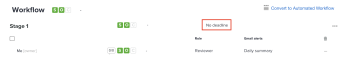

# Set a deadline for an existing basic proof

You can set a single deadline for a basic `proof` after it's been created.

## Access requirements

You must have the following access to perform the steps in this article:

<table cellspacing="0"> 
 <col> 
 <col> 
 <tbody> 
  <tr> 
   <td role="rowheader">Adobe Workfront plan*</td> 
   <td> 
Current plan: Pro or Higher
 
or
 
Legacy plan: Select or Premium
 
For more information about proofing access with the different plans, see <a href="../../../../administration-and-setup/manage-workfront/configure-proofing/access-to-proofing-functionality.md" class="MCXref xref">Access to proofing functionality in Workfront</a>.
 </td> 
  </tr> 
  <tr> 
   <td role="rowheader">Adobe Workfront license*</td> 
   <td> 
Current plan: Work or Plan
 
Legacy plan: Any (You must have proofing enabled for the user)
 </td> 
  </tr> 
  <tr> 
   <td role="rowheader">Proof Permission Profile </td> 
   <td>Manager or higher</td> 
  </tr> 
  <tr> 
   <td role="rowheader">Proof Role</td> 
   <td>Author or Manager</td> 
  </tr> 
  <tr> 
   <td role="rowheader">Access level configurations*</td> 
   <td> 
Edit access to Documents
 
For information on requesting additional access, see <a href="../../../../workfront-basics/grant-and-request-access-to-objects/request-access.md" class="MCXref xref">Request access to objects in Adobe Workfront</a>.
 </td> 
  </tr> 
 </tbody> 
</table>

&#42;To find out what plan, role, or `Proof Permission Profile` you have, contact your `Workfront` or `Workfront Proof administrator`.

## Set a deadline for an existing basic proof

<ol> 
 <li value="1"> 
  <ol> 
   <li value="1"> 
Go to the project, task, or issue that contains the document, then select Documents.
 </li> 
   <li value="2"> 
Find the proof you need. 
 </li> 
  </ol> </li> 
 <li value="2"> 
Click Proofing Workflow.
 </li> 
 <li value="3"> 
In the Workflow area, select No Deadline.
 
  
 </li> 
 <li value="4"> 
Choose a date, and specify a time, then click anywhere on the screen. 
 </li> 
 <li value="5"> 
Choose if you want to notify reviewers of the new deadline.
 </li> 
</ol>

