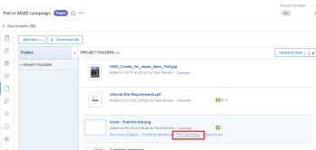

# Print a *`proof`* summary within *`Adobe Workfront`* {#print-a-proof-summary-within-adobe-workfront}

You can print a *`proof`* summary, save it as a PDF, or export it as an XLS file or PDF file that is optimized for Adobe Reader.

## Access requirements {#access-requirements}

You must have the following access to perform the steps in this article:

<table style="width: 100%;margin-left: 0;margin-right: auto;mc-table-style: url('../../../Resources/TableStyles/TableStyle-List-options-in-steps.css');" class="TableStyle-TableStyle-List-options-in-steps" cellspacing="0"> 
 <col class="TableStyle-TableStyle-List-options-in-steps-Column-Column1"> 
 <col class="TableStyle-TableStyle-List-options-in-steps-Column-Column2"> 
 <tbody> 
  <tr class="TableStyle-TableStyle-List-options-in-steps-Body-LightGray"> 
   <td class="TableStyle-TableStyle-List-options-in-steps-BodyE-Column1-LightGray" role="rowheader">Adobe Workfront plan*</td> 
   <td class="TableStyle-TableStyle-List-options-in-steps-BodyD-Column2-LightGray"> 
Current plan: Pro or Higher
 
or
 
Legacy plan: Select or Premium
 
For more information about proofing access with the different plans, see <a href="access-to-proofing-functionality.md" class="MCXref xref">Access to proofing functionality in Workfront</a>.
 </td> 
  </tr> 
  <tr class="TableStyle-TableStyle-List-options-in-steps-Body-MediumGray"> 
   <td class="TableStyle-TableStyle-List-options-in-steps-BodyE-Column1-MediumGray" role="rowheader">Adobe Workfront license*</td> 
   <td class="TableStyle-TableStyle-List-options-in-steps-BodyD-Column2-MediumGray"> 
Current plan: Work or Plan
 
Legacy plan: Any (You must have proofing enabled for the user)
 </td> 
  </tr> 
  <tr class="TableStyle-TableStyle-List-options-in-steps-Body-LightGray"> 
   <td class="TableStyle-TableStyle-List-options-in-steps-BodyE-Column1-LightGray" role="rowheader">Proof Permission Profile </td> 
   <td class="TableStyle-TableStyle-List-options-in-steps-BodyD-Column2-LightGray">Manager or higher</td> 
  </tr> 
  <tr class="TableStyle-TableStyle-List-options-in-steps-Body-MediumGray"> 
   <td class="TableStyle-TableStyle-List-options-in-steps-BodyB-Column1-MediumGray" role="rowheader">Access level configurations*</td> 
   <td class="TableStyle-TableStyle-List-options-in-steps-BodyA-Column2-MediumGray"> 
Edit access to Documents
 
Note: If you still don't have access, ask your Workfront administrator if they set additional restrictions in your access level. For information on how a Workfront administrator can modify your access level, see <a href="create-modify-access-levels.md" class="MCXref xref">Create or modify custom access levels</a>.
 </td> 
  </tr> 
 </tbody> 
</table>

&#42;To find out what plan, role, or *`Proof Permission Profile`* you have, contact your *`Workfront`* or *`Workfront Proof administrator`*.

## Print a *`proof`* summary or save it as a PDF file {#print-a-proof-summary-or-save-it-as-a-pdf-file}

You can print a *`proof`* summary directly from the document list.

>[!NOTE]
>
>You cannot print multiple *`proof`* summaries from the document list at the same time.

1.  From the document list that contains the *`proof`*, hover over the row containing the document, then click `Print Summary`.

   

   Or

   While viewing the *`proof`* in the the *`proofing viewer`*, click the `Print`icon  in the left toolbar. (If the left toolbar is not visible, click the Menu icon  in the upper-left corner of the *`proofing viewer`*.)

1.  Use any of the following options:

<table style="width: 100%;mc-table-style: url('../../../Resources/TableStyles/TableStyle-List-options-in-steps.css');" class="TableStyle-TableStyle-List-options-in-steps" cellspacing="0"> 
 <col class="TableStyle-TableStyle-List-options-in-steps-Column-Column1"> 
 <col class="TableStyle-TableStyle-List-options-in-steps-Column-Column2"> 
 <tbody> 
  <tr class="TableStyle-TableStyle-List-options-in-steps-Body-LightGray"> 
   <td class="TableStyle-TableStyle-List-options-in-steps-BodyE-Column1-LightGray" role="rowheader">Show</td> 
   <td class="TableStyle-TableStyle-List-options-in-steps-BodyD-Column2-LightGray"> 
Specify what you want to print:
 
    <ul> 
     <li>The Current version or All versions of the proof</li> 
     <li>Only the Pages with comments or All pages</li> 
     <li>Only the Page thumbnails (a small rendering of each page)&nbsp;or Full pages (a full rendering of the proof) </li> 
     
Note:  In order to see pin numbers on markup in your printed output, you need to select Full pages, not Page thumbnails.&nbsp;
 
    </ul> </td> 
  </tr> 
  <tr class="TableStyle-TableStyle-List-options-in-steps-Body-MediumGray"> 
   <td class="TableStyle-TableStyle-List-options-in-steps-BodyE-Column1-MediumGray" role="rowheader">Sort comments by</td> 
   <td class="TableStyle-TableStyle-List-options-in-steps-BodyD-Column2-MediumGray"> 
(Available only if you selected Page Thumbnails above) Specify the order in which you want the proof's comments to print:
 
    <ul> 
     <li>Oldest: From first comment made to last</li> 
     <li>Latest: From last comment made to first</li> 
     <li>Page: By page, from the first page to the last or from the last page to the first</li> 
     <li>Creator: By the names of the users who added them, from A-Z or from Z-A</li> 
    </ul> 
These options do not affect output you export as an XLS or PDF file.
 </td> 
  </tr> 
  <tr class="TableStyle-TableStyle-List-options-in-steps-Body-LightGray"> 
   <td class="TableStyle-TableStyle-List-options-in-steps-BodyE-Column1-LightGray" role="rowheader">Filter comments by</td> 
   <td class="TableStyle-TableStyle-List-options-in-steps-BodyD-Column2-LightGray"> 
You can use any combination of these options to include only certain comments in the output you print or export as an XLS or PDF file:
 
    <ul> 
     <li>Authors you select (default)</li> 
     <li>Actions you select</li> 
     <li>Unresolved status</li> 
    </ul> </td> 
  </tr> 
  <tr class="TableStyle-TableStyle-List-options-in-steps-Body-MediumGray"> 
   <td class="TableStyle-TableStyle-List-options-in-steps-BodyB-Column1-MediumGray" role="rowheader">Workflow</td> 
   <td class="TableStyle-TableStyle-List-options-in-steps-BodyA-Column2-MediumGray"> 
(Available only if the proof has an Automated Workflow) You can click Show diagram to include a diagram in printed output showing the stages on the proof and decisions made on each stage. In the diagram that appears, the colors represent decisions made on a stage:
 
Green: Approved
 
Blue: Pending a decision
 
Red: Changes required decision
 
Grey: Not started yet
 
Yellow: Approved with changes
 </td> 
  </tr> 
 </tbody> 
</table>

1. Click `Print`.
1.  In the right panel in the window that appears, if you want to print the summary, click the `Destination` menu, then click `See more`. Click the printer you want to use in the list that appears, then click `Print`.

   Or

   If you want to save the summary as a PDF file, click the `Destination` menu, click `Save as PDF`, then click `Save`.  

## Export a *`proof`* summary as an XLS or PDF {#export-a-proof-summary-as-an-xls-or-pdf}

You can export a *`proof`* summary for static content as an XLS file or as a PDF file. Proof exports include only the content of the proof.

1.  From the document list that contains the *`proof`*, hover over the row containing the document, then click `Print Summary`.

   

1.  Click the XLS icon or PDF icon near the upper-right corner of the page. 

   

When the exported file is ready, you receive an email from which you can download the file.

If you exported the summary as a PDF file, comments on the *`proof`* appear in the PDF reader. If a comment has multiple markups associated with it, the comment will appear multiple times in the comments list (once for each markup).
