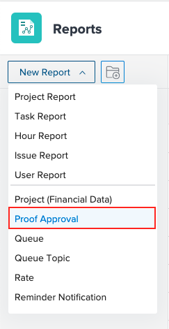

# Use the proof approval report {#use-the-proof-approval-report}

You can use the *`proof`* approval report to view information about proofs in your environment.

## Access requirements {#access-requirements}

You must have the following:

<table class="TableStyle-TableStyle-List-options-in-steps" style="margin-left: 0;margin-right: auto;mc-table-style: url('../../../Resources/TableStyles/TableStyle-List-options-in-steps.css');" cellspacing="0"> 
 <col class="TableStyle-TableStyle-List-options-in-steps-Column-Column1" style="width: 300px;"> 
 <col class="TableStyle-TableStyle-List-options-in-steps-Column-Column2"> 
 <tbody> 
  <tr class="TableStyle-TableStyle-List-options-in-steps-Body-LightGray"> 
   <td class="TableStyle-TableStyle-List-options-in-steps-BodyE-Column1-LightGray" role="rowheader"> 
Workfront plan*
 </td> 
   <td class="TableStyle-TableStyle-List-options-in-steps-BodyD-Column2-LightGray">Any</td> 
  </tr> 
  <tr class="TableStyle-TableStyle-List-options-in-steps-Body-MediumGray"> 
   <td class="TableStyle-TableStyle-List-options-in-steps-BodyE-Column1-MediumGray" role="rowheader"> 
Adobe Workfront licenses overview*
 </td> 
   <td class="TableStyle-TableStyle-List-options-in-steps-BodyD-Column2-MediumGray"> 
Plan
 </td> 
  </tr> 
  <tr class="TableStyle-TableStyle-List-options-in-steps-Body-LightGray" data-mc-conditions=""> 
   <td class="TableStyle-TableStyle-List-options-in-steps-BodyB-Column1-LightGray" role="rowheader">Access level* </td> 
   <td class="TableStyle-TableStyle-List-options-in-steps-BodyA-Column2-LightGray"> 
Edit access to:
 
    <ul> 
     <li> 
Create Reports, Dashboards, and Calendars
 </li> 
     <li> 
Create Filters, Views, and Groupings
 </li> 
    </ul> 
Note: If you still don't have access, ask your Workfront administrator if they set additional restrictions in your access level. For information on how a Workfront administrator can change your access level, see <a href="create-modify-access-levels.md" class="MCXref xref">Create or modify custom access levels</a>.
 </td> 
  </tr> 
 </tbody> 
</table>

&#42;To find out what plan, license type, or access you have, contact your *`Workfront administrator`*.

## Use the proof approval report {#use-the-proof-approval-report-1}

1.  Click the `Main Menu` icon  in the upper-right corner of *`Adobe Workfront`*, then click **Reports**. 
1.  Click **New Report**, then scroll to select **Proof Approval**.

      

1.  (Optional) Add any additional fields. 
1.  Click `Save + Close`.

## Additional fields {#additional-fields}

You can add the following fields to the proof approval report:

*  **Decision Date**: Displays the date an approver makes a decision on a proof. You can also find this date on the Print Summary of the proof.
*  **Approver Stage**: Displays the current stage information.
*  **Workflow Template**: Displays any workflow templates attached to the proof. If there is no template attached, the column is blank.
*  `Awaiting decision`: Displays true to signal a decision has not been met when the following are true:

    
    
    *  The proof has not been archived
    *  The stage the approver is on is active
    *  The proof is pending approval
    
    

* `Proof deadline`: Displays the deadline of the proof. Every stage must have a deadline assigned in order for this field to populate. The field displays the deadline for the most recently activated stage.

&nbsp;
