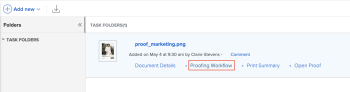
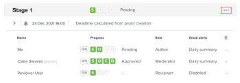

# Send email messages to reviewers on a *proof*

During the review and approval process, you can send a message to one or all of the reviewers on a *proof*. Messages are an easy way to remind reviewers to complete their review of a *proof* or to provide other information related to the *proof*.

You can choose between sending a generic reminder email or sending a customized message to one or all of the users associated with a given stage.

## Access requirements

You must have the following access to perform the steps in this article:

<table cellspacing="0"> 
 <col> 
 <col> 
 <tbody> 
  <tr> 
   <td role="rowheader"><em>Adobe Workfront</em> plan*</td> 
   <td> 
Current plan: Pro or Higher
 
or
 
Legacy plan: Select or Premium
 
For more information about proofing access with the different plans, see <a href="../../../administration-and-setup/manage-workfront/configure-proofing/access-to-proofing-functionality.md" class="MCXref xref">Access to proofing functionality in Workfront</a>.
 </td> 
  </tr> 
  <tr> 
   <td role="rowheader"><em>Adobe Workfront</em> license*</td> 
   <td> 
Current plan: <em>Work</em> or <em>Plan</em>
 
Legacy plan: Any (You must have proofing enabled for the user)
 </td> 
  </tr> 
  <tr> 
   <td role="rowheader"><em>Proof Permission Profile</em> </td> 
   <td>Manager or higher</td> 
  </tr> 
  <tr> 
   <td role="rowheader">Proof role</td> 
   <td>Author or Moderator</td> 
  </tr> 
  <tr> 
   <td role="rowheader">Access level configurations*</td> 
   <td> 
Edit access to Documents
 
Note: If you still don't have access, ask your <em>Workfront administrator</em> if they set additional restrictions in your access level. For information on how a <em>Workfront administrator</em> can modify your access level, see <a href="../../../administration-and-setup/add-users/configure-and-grant-access/create-modify-access-levels.md" class="MCXref xref">Create or modify custom access levels</a>.
 </td> 
  </tr> 
 </tbody> 
</table>

&#42;To find out what plan, role, or *Proof Permission Profile* you have, contact your *Workfront* or *Workfront Proof administrator*.

## Send email messages to users on a *proof*

<ol style="font-size: 10pt;"> 
 <li value="1"> <draft-comment>
   <MadCap:conditionalText data-mc-conditions="QuicksilverOrClassic.Quicksilver">
    Find 
   </MadCap:conditionalText>
  </draft-comment><MadCap:conditionalText data-mc-conditions="QuicksilverOrClassic.Quicksilver">
   Find 
  </MadCap:conditionalText>the document for the <em>proof</em> that contains the users you want to message.</li> <draft-comment>
  <li value="2" data-mc-conditions="QuicksilverOrClassic.Quicksilver"> 
Hover over the document, then click Proofing Workflow.
 
  
 </li>
 </draft-comment>
 <li value="2" data-mc-conditions="QuicksilverOrClassic.Quicksilver"> 
Hover over the document, then click Proofing Workflow.
 
  
 </li> <draft-comment>
  <li value="3" data-mc-conditions="QuicksilverOrClassic.Quicksilver"> 
To send a message to all users on the stage, click the More menu on the stage and choose Message All.
 
  
 </li>
 </draft-comment>
 <li value="3" data-mc-conditions="QuicksilverOrClassic.Quicksilver"> 
To send a message to all users on the stage, click the More menu on the stage and choose Message All.
 
  
 </li> <draft-comment>
  <li value="4" data-mc-conditions="QuicksilverOrClassic.Quicksilver"> 
To send a message to an individual user, click the More menu next to the user and choose Message.
 
  
 </li>
 </draft-comment>
 <li value="4" data-mc-conditions="QuicksilverOrClassic.Quicksilver"> 
To send a message to an individual user, click the More menu next to the user and choose Message.
 
  
 </li> 
 <li value="5"> 
In the Message details section, specify the following information:
 
  <table cellspacing="0"> 
   <col> 
   <col> 
   <tbody> 
    <tr> 
     <td role="rowheader">Notify people by email</td> 
     <td>This option cannot be deselected. All users receive the message via email.</td> 
    </tr> 
    <tr> 
     <td role="rowheader">Discard custom message</td> 
     <td> 
Click Discard custom message if you want to include only the default email content.
 
The default reminder email includes the following information:
 
      <ul> 
       <li>Personal link to the <em>proof</em> Thumbnail of the <em>proof</em> image </li> 
       <li>The following <em>proof</em> details: Proof name, version number, folder name (if applicable), and a list of the reviewers and their progress on the <em>proof</em>.</li> 
      </ul> </td> 
    </tr> 
    <tr> 
     <td role="rowheader">Subject</td> 
     <td>Type a message subject.</td> 
    </tr> 
    <tr> 
     <td role="rowheader">Message</td> 
     <td>Type your message content.</td> 
    </tr> 
   </tbody> 
  </table> </li> 
 <li value="6">Click Send.</li> 
</ol>

