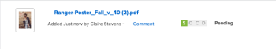

# *Proof* progress and status overview

You can view information about how a *proof* is progressing through the review process and see an overall summary of the proof's decision status from the Documents area.

## *Proof* progress overview

Proof progress indicates the work done on a *proof* from the time you send the *proof* to recipients to the time they make a decision on the *proof*. The progress icons, S, O, C, and D, appear next to the *proof* name and provide information about the proof's progress.

<table cellspacing="15"> 
 <col> 
 <col> 
 <thead> 
  <tr> 
   <td> 
Progress icon 
 </td> 
   <td> 
Description 
 </td> 
  </tr> 
 </thead> 
 <tbody> 
  <tr> 
   <td> 
  
 
Sent 
 </td> 
   <td> 
The <em>proof</em> has been sent to assigned recipients.
 </td> 
  </tr> 
  <tr> 
   <td> 
 
 
Opened&nbsp; 
 </td> 
   <td> 
All assigned recipients open&nbsp;the <em>proof</em> or Proof details page.
 </td> 
  </tr> 
  <tr> 
   <td> 
 
 
Comments made 
 </td> 
   <td> 
All assigned recipients make at least one comment on the <em>proof</em>.
 
If there are no reviewers&nbsp;assigned to the <em>proof</em>, the C&nbsp;icon does not appear in the progress bar.
 </td> 
  </tr> 
  <tr> 
   <td> 
  
 
Decision made 
 </td> 
   <td> 
All assigned approvers make a decision on the <em>proof</em>, All assigned approvers make a decision on the proof, unless the proof creator specifies only one decision is needed.
 
If there are no approvers (decision makers) designated for&nbsp;the <em>proof</em>,&nbsp;the D&nbsp;icon does not appear in the progress bar.&nbsp;
 </td> 
  </tr> 
 </tbody> 
</table>

The progress icons can appear in the following colors to indicate certain information about the *proof*'s progress:

* `Green`: Complete.
* `White`: Not complete.
* `Orange`:&nbsp;Not&nbsp;complete and deadline is less than 24 hours. 
* `Red`: Not&nbsp;complete and past the deadline.

<!--
<h3 data-mc-conditions="QuicksilverOrClassic.Draft mode">Levels of <em>proof</em> progress</h3>
-->

### Levels of *proof* progress

<!--

<em>Workfront Proof</em> uses the progress icons to track a <em>proof</em>'s progress at each of the following levels:

-->

*Workfront Proof* uses the progress icons to track a *proof*'s progress at each of the following levels:

  <!--
  <li data-mc-conditions="QuicksilverOrClassic.Draft mode">For each reviewer, based on that person's activity on the <em>proof</em>.&nbsp;</li>
  -->

* For each reviewer, based on that person's activity on the *proof*.&nbsp;

  <!--
  <li data-mc-conditions="QuicksilverOrClassic.Draft mode">For each stage, based on the progress the reviewer on the stage who is most behind in the <em>proofing</em> process.&nbsp;To learn more about stages, see <a href="../../../review-and-approve-work/proofing/proofing-overview/stages.md" class="MCXref xref">Automated Workflow Stages overview</a>.</li>
  -->

* For each stage, based on the progress the reviewer on the stage who is most behind in the *proofing* process.&nbsp;To learn more about stages, see [Automated Workflow Stages overview](../../../review-and-approve-work/proofing/proofing-overview/stages.md).

  <!--
  <li data-mc-conditions="QuicksilverOrClassic.Draft mode">For the <em>proof</em>, based on the progress of the stage (group of reviewers) who is the most behind in the <em>proofing</em> process.</li>
  -->

* For the *proof*, based on the progress of the stage (group of reviewers) who is the most behind in the *proofing* process.

<!--

For an example of how <em>Workfront Proof</em> determines progress using the reviewer or stage that is most behind,&nbsp;suppose three reviewers on a <em>proof</em> need to make a&nbsp;decision. If two of them have made their&nbsp;decision&nbsp;but the third has not, the progress bar for the <em>proof</em> does not show&nbsp;the D in green because of the outstanding&nbsp;decision.

-->

For an example of how *Workfront Proof* determines progress using the reviewer or stage that is most behind,&nbsp;suppose three reviewers on a *proof* need to make a&nbsp;decision. If two of them have made their&nbsp;decision&nbsp;but the third has not, the progress bar for the *proof* does not show&nbsp;the D in green because of the outstanding&nbsp;decision.

<!--

If the Primary Decision Maker setting is selected on a <em>proof</em> and the primary decision maker submits a decision, the D in the <em>proof</em> progress bar turns&nbsp;green for all reviewers because no other decisions are required.

-->

If the Primary Decision Maker setting is selected on a *proof* and the primary decision maker submits a decision, the D in the *proof* progress bar turns&nbsp;green for all reviewers because no other decisions are required.

<!--

Similarly, if the Only One Decision Required setting is selected on a <em>proof</em> and any reviewer submits a decision, the D in the <em>proof</em> progress bar turns&nbsp;green for all reviewers because no other decisions are required.

-->

Similarly, if the Only One Decision Required setting is selected on a *proof* and any reviewer submits a decision, the D in the *proof* progress bar turns&nbsp;green for all reviewers because no other decisions are required.

## Proof status overview

The *proof* status displays the status of decisions that are required for the *proof*. The status of the *proof* is driven by the “worst case” participant. For example, suppose there are three decisions on the *proof*: two have the status of `Accepted` and one has the status of `Rejected`. The "worst case" decision of `Rejected` over-rules the other decisions and the overall status of the *proof* is shown as `Rejected`.&nbsp;

The standard status options are as follows:

* Pending
* Approved
* Approved with Changes
* Changes Required
* Not Relevant

If custom decisions are configured in your account, the status options reflect your&nbsp;custom decision&nbsp;settings.

<!--
<h2 data-mc-conditions="QuicksilverOrClassic.Draft mode">Viewing <em>proof</em> progress and status</h2>
-->

## Viewing *proof* progress and status

<!--

 You can view the progress and status of <em>proofs</em> for individual documents. <![CDATA[
]]>

-->

You can view the progress and status of *proofs* for individual documents. <![CDATA[    ]]>

  <!--
  <li data-mc-conditions="QuicksilverOrClassic.Draft mode"><a href="#viewing-proof-progress-and-status-for-an-individual-document" class="MCXref xref">View proof progress and status&nbsp;for a document</a> </li>
  -->

* [View proof progress and status for a document](#viewing-proof-progress-and-status-for-an-individual-document)

  <!--
  <li data-mc-conditions="QuicksilverOrClassic.Draft mode"><a href="#viewing-proof-approval-information-for-all-documents-you-submit-for-approval" class="MCXref xref">View proof approval information&nbsp;in Home</a> </li>
  -->

* [View proof approval information in Home](#viewing-proof-approval-information-for-all-documents-you-submit-for-approval)

<!--
<h3 data-mc-conditions="QuicksilverOrClassic.Draft mode">View <em>proof</em> progress and status&nbsp;for a document</h3>
-->

### View *proof* progress and status&nbsp;for a document

<ol> <draft-comment>
  <li value="1" data-mc-conditions="QuicksilverOrClassic.Draft mode">If a <em>proof</em> has not already been generated for the document in <em>Adobe Workfront</em>, generate it, as described in the <a href="../../../review-and-approve-work/proofing/creating-proofs-within-workfront/generate-proof.md" class="MCXref xref">Generate a proof</a> articles.</li>
 </draft-comment>
 <li value="1" data-mc-conditions="QuicksilverOrClassic.Draft mode">If a <em>proof</em> has not already been generated for the document in <em>Adobe Workfront</em>, generate it, as described in the <a href="../../../review-and-approve-work/proofing/creating-proofs-within-workfront/generate-proof.md" class="MCXref xref">Generate a proof</a> articles.</li> <draft-comment>
  <li value="2" data-mc-conditions="QuicksilverOrClassic.Draft mode">In the Documents area, under the <em>proof</em>'s name, click Proof Details.</li>
 </draft-comment>
 <li value="2" data-mc-conditions="QuicksilverOrClassic.Draft mode">In the Documents area, under the <em>proof</em>'s name, click Proof Details.</li> <draft-comment>
  <li value="3" data-mc-conditions="QuicksilverOrClassic.Draft mode">In the Proofing Details box that appears, the <em>proof</em>'s progress for each stage, then click Done.</li>
 </draft-comment>
 <li value="3" data-mc-conditions="QuicksilverOrClassic.Draft mode">In the Proofing Details box that appears, the <em>proof</em>'s progress for each stage, then click Done.</li> <draft-comment>
  <li value="4" data-mc-conditions="QuicksilverOrClassic.Quicksilver"> <draft-comment>
    
Under the proof's name, click Proofing Workflow.

   </draft-comment>
Under the proof's name, click Proofing Workflow.
 <draft-comment>
    
 <draft-comment>
      
     </draft-comment> <draft-comment>
      <MadCap:conditionalText data-mc-conditions="QuicksilverOrClassic.Draft mode">
       These screenshots will need to change with new terminology ("Review Workflow" for this one?)
      </MadCap:conditionalText>
     </draft-comment><MadCap:conditionalText data-mc-conditions="QuicksilverOrClassic.Draft mode">
      These screenshots will need to change with new terminology ("Review Workflow" for this one?)
     </MadCap:conditionalText>   

   </draft-comment>
  <MadCap:conditionalText data-mc-conditions="QuicksilverOrClassic.Draft mode">
     These screenshots will need to change with new terminology ("Review Workflow" for this one?)
    </MadCap:conditionalText>   
 </li>
 </draft-comment>
 <li value="4" data-mc-conditions="QuicksilverOrClassic.Quicksilver"> 
Under the proof's name, click Proofing Workflow.
 
  <MadCap:conditionalText data-mc-conditions="QuicksilverOrClassic.Draft mode">
    These screenshots will need to change with new terminology ("Review Workflow" for this one?)
   </MadCap:conditionalText>   
 </li> <draft-comment>
  <li value="5" data-mc-conditions="QuicksilverOrClassic.Quicksilver"> <draft-comment>
    
In the Workflow information that appears, scroll down to see the proof's progress for each stage:

   </draft-comment>
In the Workflow information that appears, scroll down to see the proof's progress for each stage:
 <draft-comment>
    
  

   </draft-comment>
  
 </li>
 </draft-comment>
 <li value="5" data-mc-conditions="QuicksilverOrClassic.Quicksilver"> 
In the Workflow information that appears, scroll down to see the proof's progress for each stage:
 
  
 </li> 
</ol>

<!--
<h3 data-mc-conditions="QuicksilverOrClassic.Draft mode">View <em>proof</em> approval information&nbsp;in Home</h3>
-->

### View *proof* approval information&nbsp;in Home

<!--

You can view information about <em>proofs</em> that you have submitted for approval. Proof approval information is displayed in the Home area only while the <em>proof</em> is pending approval.&nbsp;For information about how to view information about <em>proof</em> approvals in the Home area, see&nbsp;<a href="../../../review-and-approve-work/manage-approvals/view-approvals.md" class="MCXref xref">View approvals in Adobe Workfront</a>.

-->

You can view information about *proofs* that you have submitted for approval. Proof approval information is displayed in the Home area only while the *proof* is pending approval.&nbsp;For information about how to view information about *proof* approvals in the Home area, see&nbsp; [View approvals in Adobe Workfront](../../../review-and-approve-work/manage-approvals/view-approvals.md).
