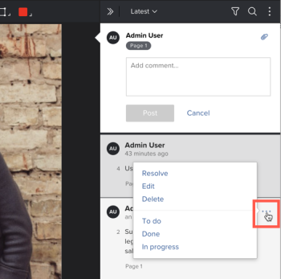

# Use actions on `proof` comments

You can use actions to keep track of what needs to happen on each comment thread on a `proof`. An action is a word or phrase such as "To do," "Done," or "In progress" that your `Adobe Workfront administrator` configures in the system for your organization. Reviewers can add an action to a comment to provide information about what has been done or what still needs to be done in response to the comment.

For information about how your `Workfront administrator` enables and configures actions, see&nbsp; [Configure proof settings for your organization](../../../../administration-and-setup/manage-workfront/configure-proofing/configure-proofing-organization.md).

## Access requirements

You must have the following access to perform the steps in this article:

<table cellspacing="0"> 
 <col> 
 <col> 
 <tbody> 
  <tr> 
   <td role="rowheader">Adobe Workfront plan*</td> 
   <td> 
Current plan: Pro or Higher
 
or
 
Legacy plan: Select or Premium
 
For more information about proofing access with the different plans, see <a href="../../../../administration-and-setup/manage-workfront/configure-proofing/access-to-proofing-functionality.md" class="MCXref xref">Access to proofing functionality in Workfront</a>.
 </td> 
  </tr> 
  <tr> 
   <td role="rowheader">Adobe Workfront license*</td> 
   <td> 
Current plan: Work or Plan
 
Legacy plan: Any (You must have proofing enabled for the user)
 </td> 
  </tr> 
  <tr> 
   <td role="rowheader">Proof Permission Profile </td> 
   <td>Manager or higher</td> 
  </tr> 
  <tr> 
   <td role="rowheader">Proof Role</td> 
   <td>Author or Moderator</td> 
  </tr> 
  <tr> 
   <td role="rowheader">Access level configurations*</td> 
   <td> 
Edit access to Documents
 
For information on requesting additional access, see <a href="../../../../workfront-basics/grant-and-request-access-to-objects/request-access.md" class="MCXref xref">Request access to objects in Adobe Workfront</a>.
 </td> 
  </tr> 
 </tbody> 
</table>

&#42;To find out what plan, role, or `Proof Permission Profile` you have, contact your `Workfront` or `Workfront Proof administrator`.

## Use actions on comments

To apply an action to an existing comment in the `proofing viewer`:

1. Go to the project, task, or issue that contains the document, then select `Documents`.
1. Find the `proof` you need, then click `Open `proof``.

<ol start="3"> 
 <li value="3">Do one of the following: 
  <ul>
   <li>
Click the flag icon in the lower-right corner of the comment,&nbsp;then click the action you want in the drop-down menu.

</li>
   <li>
Click the More icon (three horizontal dots on the comment),&nbsp;then click the action you want in the lower section of the drop-down menu that appears.

</li>
  </ul></li> 
 <li value="4"> 
(Optional) If you change your mind, you can do either of the followinng:
 
  <ul> 
   <li>Click the flag icon or the More icon again,&nbsp;then click Remove action.</li> 
   <li> 
Repeat step 1 to apply a different action. 
 </li> 
  </ul> </li> 
</ol>

>[!TIP]
>
>You can filter comments by a certain action. For more information, see [Search, filter, and sort proof comments](../../../../review-and-approve-work/proofing/reviewing-proofs-within-workfront/comment-on-a-proof/search-filter-sort-comments.md).

