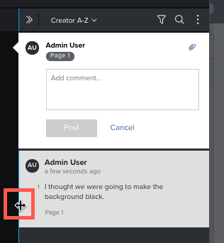

# View and reply to proof comments

You can view and reply to *proof* comments made by other reviewers.

## Access requirements

You must have the following access to perform the steps in this article:

<table cellspacing="0"> 
 <col> 
 <col> 
 <tbody> 
  <tr> 
   <td role="rowheader"><em>Adobe Workfront</em> plan*</td> 
   <td> 
Current plan: Pro or Higher
 
or
 
Legacy plan: Select or Premium
 
For more information about proofing access with the different plans, see <a href="../../../../administration-and-setup/manage-workfront/configure-proofing/access-to-proofing-functionality.md" class="MCXref xref">Access to proofing functionality in Workfront</a>.
 </td> 
  </tr> 
  <tr> 
   <td role="rowheader"><em>Adobe Workfront</em> license*</td> 
   <td> 
Current plan: <em>Work</em> or <em>Plan</em>
 
Legacy plan: Any (You must have proofing enabled for the user)
 </td> 
  </tr> 
  <tr> 
   <td role="rowheader"><em>Proof Permission Profile</em> </td> 
   <td>Manager or higher</td> 
  </tr> 
  <tr> 
   <td role="rowheader">Access level configurations*</td> 
   <td> 
Edit access to Documents
 
For information on requesting additional access, see <a href="../../../../workfront-basics/grant-and-request-access-to-objects/request-access.md" class="MCXref xref">Request access to objects in Adobe Workfront</a>.
 </td> 
  </tr> 
 </tbody> 
</table>

&#42;To find out what plan, role, or *Proof Permission Profile* you have, contact your *Workfront* or *Workfront Proof administrator*.

## View comments in the *proofing viewer*

Each comment displays the following information:

* Name of the user who made the comment
* The page number where the comment was made (in static *proofs* containing more than one page)
* The frame number or range of footage where the comment was made (in video *proofs*)

  If the comment you are viewing was applied to a range of video footage, you can click the Play button to review the range.

* Text included with the comment
* Any attachments that were uploaded to the comment

To view comments in the *proofing viewer*:

1. Go to the project, task, or issue that contains the document, then select `Documents`.
1. Find the *proof* you need, then click `Open *proof*`.

<ol start="3"> 
 <li value="3"> 
(Conditional) If the comments area is not open, click&nbsp;View comments&nbsp;in the upper-right corner.
 </li> 
 <li value="4"> Click any comment to view the comment marks on the <em>proof</em>.</li> 
 
&nbsp;Or
 
 
&nbsp;In a video <em>proof</em>, hover over the point in the timeline where a comment was made, then click the numbered balloon that appears. 
 
 
  
 
 <li value="5">(Optional) To adjust the size of the comment list, hover over the left edge of the comment area (not on the comment that is currently open) until the mouse pointer changes for horizontal resizing, then drag the edge where you want it.</li> 
 
    
 
</ol>

## View proof comments in the Updates tab

In *Workfront*, you can view *proof* comments without launching the *proofing viewer*.

<ol> 
 <li value="1"> 
Go to the project, task, or issue that contains the document, then select Documents.
 </li> <draft-comment>
  <li value="2" data-mc-conditions="QuicksilverOrClassic.Quicksilver"> 
Click the row containing the document, then click the Summary icon  on the right-side of the page. The comments display in the Updates section of the Document Summary.
 </li>
 </draft-comment>
 <li value="2" data-mc-conditions="QuicksilverOrClassic.Quicksilver"> 
Click the row containing the document, then click the Summary icon  on the right-side of the page. The comments display in the Updates section of the Document Summary.
 </li> 
</ol>

## Mark all comments as read

As a reviewer of a *proof*, you can quickly mark all comments as Read.

1. Go to the project, task, or issue that contains the document, then select `Documents`.
1. Find the *proof* you need, then click `Open *proof*`.

<ol start="3"> 
 <li value="3">(Conditional) If the comments area is not open, click&nbsp;View comments&nbsp;in the upper-right corner. </li> 
 <li value="4">Above the comment list, click the More icon, then click Mark all as read.</li> 
 
  
 
</ol>

## Reply to proof comments from the *proofing viewer*

1. Go to the project, task, or issue that contains the document, then select `Documents`.
1. Find the *proof* you need, then click `Open *proof*`.

<ol start="3"> 
 <li value="3"> 
(Conditional) If the comments area is not open, click&nbsp;View comments&nbsp;in the upper-right corner.
 </li> 
 <li value="4"> 
 Click any comment to view the comment marks on the <em>proof</em>.
 <note type="tip">
   Use the 
   Previous comment and 
   Next comment buttons on the right edge of the screen to navigate forward and back through comments.
  </note> </li> 
 <li value="5"> 
Type your reply in the Add a reply box.
 </li> 
 <li value="6"> 
 (Optional) To notify another reviewer&nbsp;about your reply, type @ in the comment box, then type the user's name or email address. For more information, see <a href="../../../../review-and-approve-work/proofing/reviewing-proofs-within-workfront/comment-on-a-proof/tag-users-to-share-proof.md" class="MCXref xref">Tag users to share a proof</a>.
 </li> 
 <li value="7"> (Optional) To add a file to a comment, do either of the following: 
  <ul>
   <li>Click the paper clip icon, then browse to and select the file you want to upload.</li>
   <li>Drag a file from a&nbsp;location on your computer and drop it into the comment area.</li>
  </ul></li> 
 <li value="8">Click Reply.</li> 
</ol>

