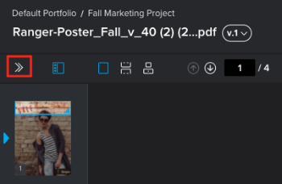

# Configure *`proofing viewer`* settings {#configure-proofing-viewer-settings}

You can configure the following settings for both the *`Web Proofing Viewer`* and the *`Desktop Proofing Viewer`*: 

* Whether comment markups and pins display on *`proofs`*.
* Whether the markup tools display across the top of the *`proofing viewer`* or in a drop-down menu.
* Which email notifications you receive as a reviewer on the *`proof`* you have open.

You can configure the following settings for the *`Desktop Proofing Viewer`*:

* How you want links within website content to open in the Viewer.
* What happens when you click a link that is set to open in a new browser tab or window.
* Clear the cache data that might be saved with the *`proof`* you are viewing in order to enable content such as pop-ups (that can be blocked by browser cache data) to display in the Viewer.

## Access requirements {#access-requirements}

You must have the following access to perform the steps in this article:

<table style="width: 100%;margin-left: 0;margin-right: auto;mc-table-style: url('../../../Resources/TableStyles/TableStyle-List-options-in-steps.css');" class="TableStyle-TableStyle-List-options-in-steps" cellspacing="0"> 
 <col class="TableStyle-TableStyle-List-options-in-steps-Column-Column1"> 
 <col class="TableStyle-TableStyle-List-options-in-steps-Column-Column2"> 
 <tbody> 
  <tr class="TableStyle-TableStyle-List-options-in-steps-Body-LightGray"> 
   <td class="TableStyle-TableStyle-List-options-in-steps-BodyE-Column1-LightGray" role="rowheader">Adobe Workfront plan*</td> 
   <td class="TableStyle-TableStyle-List-options-in-steps-BodyD-Column2-LightGray"> 
Current plan: Pro or Higher
 
or
 
Legacy plan: Select or Premium
 
For more information about proofing access with the different plans, see <a href="access-to-proofing-functionality.md" class="MCXref xref">Access to proofing functionality in Workfront</a>.
 </td> 
  </tr> 
  <tr class="TableStyle-TableStyle-List-options-in-steps-Body-MediumGray"> 
   <td class="TableStyle-TableStyle-List-options-in-steps-BodyE-Column1-MediumGray" role="rowheader">Adobe Workfront license*</td> 
   <td class="TableStyle-TableStyle-List-options-in-steps-BodyD-Column2-MediumGray"> 
Current plan: Work or Plan
 
Legacy plan: Any (You must have proofing enabled for the user)
 </td> 
  </tr> 
  <tr class="TableStyle-TableStyle-List-options-in-steps-Body-LightGray"> 
   <td class="TableStyle-TableStyle-List-options-in-steps-BodyE-Column1-LightGray" role="rowheader">Proof Permission Profile </td> 
   <td class="TableStyle-TableStyle-List-options-in-steps-BodyD-Column2-LightGray">Manager or higher</td> 
  </tr> 
  <tr class="TableStyle-TableStyle-List-options-in-steps-Body-MediumGray"> 
   <td class="TableStyle-TableStyle-List-options-in-steps-BodyB-Column1-MediumGray" role="rowheader">Access level configurations*</td> 
   <td class="TableStyle-TableStyle-List-options-in-steps-BodyA-Column2-MediumGray"> 
Edit access to Documents
 
For information on requesting additional access, see <a href="request-access.md" class="MCXref xref">Request access to objects in Adobe Workfront</a>.
 </td> 
  </tr> 
 </tbody> 
</table>

&#42;To find out what plan, role, or *`Proof Permission Profile`* you have, contact your *`Workfront`* or *`Workfront Proof administrator`*.

## Configure *`proofing viewer`* settings {#configure-proofing-viewer-settings-1}

To configure *`proofing viewer`* settings:

1. Open the *`Web Proofing Viewer`* or the *`Desktop Proofing Viewer`* in one of the following ways: 
    
    
    * If you *`proof`* within *`Adobe Workfront`*, go to a document list containing a *`proof`* you want to view, hover over the document, then click  `Open *`proof`*`.
    
    * If you use *`Workfront Proof`*, click the `Go to Proof` icon for the *`proof`* in the Dashboard or a Views list.   
    
    
    

1.  If the left toolbar is not showing, click the  `Menu` icon, located in the upper-left corner of the *`Web Proofing Viewer`*.

   

1.  In the left toolbar, click the `Settings` icon .   

1.   Configure any of the following `Settings` that display.

   The settings available might vary depending on the type of *`proof`* you have open.

    
    
    *  `Show markups` (always available in the *`Web Proofing Viewer`* and the *`Desktop Proofing Viewer`*): These are the comment marks that reviewers add to *`proofs`* when they use the markup tools. If you disable them, you can still see them when you click a comment in the comment list.
    
    
      This setting affects all *`proofs`* you open.
    
    *  `Show pins` (always available in the *`Web Proofing Viewer`* and the *`Desktop Proofing Viewer`*): These are the numbered pins that reviewers add to *`proofs`* when they use the markup tools. They indicate where and in what order the reviewer added comments. If you disable them, you can still see them when you click a comment in the comment list.
    
    
      This setting affects all *`proofs`* you open.
    
    *  `Use expanded markup tools` (always available in the *`Web Proofing Viewer`* and the *`Desktop Proofing Viewer`*): By default, the markup tool options display across the top of the *`proofing`* viewer.&nbsp;You can configure them to display in a vertical menu that opens only when you click it.
    
    
      This setting is in effect for all *`proofs`* you open.
    
    *  `Send me email notifications about` (always available in the *`Web Proofing Viewer`* and the *`Desktop Proofing Viewer`*): Click one of the options below. This setting affects only the *`proof`* you have open. For more information, see [Notifications for proof comments and decisions overview](notifications-proof-comments-decisions.md).
    
    
    <table style="width: 100%;mc-table-style: url('../../../Resources/TableStyles/TableStyle-List-options-in-steps.css');" class="TableStyle-TableStyle-List-options-in-steps" cellspacing="0"> 
 <col class="TableStyle-TableStyle-List-options-in-steps-Column-Column1" style="width: 175px;"> 
 <col class="TableStyle-TableStyle-List-options-in-steps-Column-Column2"> 
 <tbody> 
  <tr class="TableStyle-TableStyle-List-options-in-steps-Body-LightGray"> 
   <td class="TableStyle-TableStyle-List-options-in-steps-BodyE-Column1-LightGray" role="rowheader">All activity</td> 
   <td class="TableStyle-TableStyle-List-options-in-steps-BodyD-Column2-LightGray">Workfront sends an email to the reviewer every time there is any activity on the proof, such as&nbsp;a new&nbsp;comment, reply, or&nbsp;decision. 
This is a great option for the person who is managing the proofing process because&nbsp;it allows them to see the activity as it happens. 

Users do not receive an email alert about their own activity.
</td> 
  </tr> 
  <tr class="TableStyle-TableStyle-List-options-in-steps-Body-MediumGray"> 
   <td class="TableStyle-TableStyle-List-options-in-steps-BodyE-Column1-MediumGray" role="rowheader">Replies to my comments</td> 
   <td class="TableStyle-TableStyle-List-options-in-steps-BodyD-Column2-MediumGray">An email is sent to the reviewer only if someone replies explicitly to their&nbsp;comment&nbsp;(this excludes their own replies on their own comments). This means that if somebody on the proof makes a new comment, the reviewer is not notified.
This&nbsp;setting is recommended for your clients on the proof so that they are not&nbsp;notified of any other comments&nbsp;on the proof, and are&nbsp;notified only&nbsp;of replies to their own comments.

Although reviewers with this email alert setting are not notified of other new&nbsp;comments, they can still view&nbsp;all&nbsp;comments&nbsp;on the proof in&nbsp;the proofing viewer.

For information about comments, see <a href="create-manage-proof-comments.md" class="MCXref xref">Create and manage proof comments</a>.
</td> 
  </tr> 
  <tr class="TableStyle-TableStyle-List-options-in-steps-Body-LightGray"> 
   <td class="TableStyle-TableStyle-List-options-in-steps-BodyE-Column1-LightGray" role="rowheader">Decisions</td> 
   <td class="TableStyle-TableStyle-List-options-in-steps-BodyD-Column2-LightGray">Workfront sends an email to the reviewer only when someone makes a&nbsp;decision.
This can be useful for the person who is managing the approval process&nbsp;(such as a project manager) and&nbsp;needs to monitor progress on the proof and see which users have&nbsp;made their&nbsp;decision.

You are not notified of your own decision unless you select an email confirmation option when submitting your decision.
</td> 
  </tr> 
  <tr class="TableStyle-TableStyle-List-options-in-steps-Body-MediumGray"> 
   <td class="TableStyle-TableStyle-List-options-in-steps-BodyE-Column1-MediumGray" role="rowheader">Final decision</td> 
   <td class="TableStyle-TableStyle-List-options-in-steps-BodyD-Column2-MediumGray">Workfront sends an email when the last approver on the proof has made their&nbsp;decision.
This alert is often used by the designer, who does not usually need to take part in the actual review discussion. When the final decision is made, the designer is&nbsp;notified and&nbsp;can then take&nbsp;action on any necessary changes.

This alert can also be useful&nbsp;for a department leader&nbsp;who needs to be notified only when the review process is finished.
</td> 
  </tr> 
  <tr class="TableStyle-TableStyle-List-options-in-steps-Body-LightGray"> 
   <td class="TableStyle-TableStyle-List-options-in-steps-BodyE-Column1-LightGray" role="rowheader">Hourly Summary</td> 
   <td class="TableStyle-TableStyle-List-options-in-steps-BodyD-Column2-LightGray">Workfront sends an email to the reviewer every hour with a summary of all the&nbsp;comments, replies, and&nbsp;decisions&nbsp;that have occurred in the hour.
The email is sent only when&nbsp;activity besides your own&nbsp;occurs within the past&nbsp;hour. 

This alert is a good way of seeing an overview of the project.

An example use case for this summary is a&nbsp;senior reviewer&nbsp;who needs an overview of the project but does not need to be notified immediately of all activity on the proof.
</td> 
  </tr> 
  <tr class="TableStyle-TableStyle-List-options-in-steps-Body-MediumGray"> 
   <td class="TableStyle-TableStyle-List-options-in-steps-BodyE-Column1-MediumGray" role="rowheader">Daily Summary</td> 
   <td class="TableStyle-TableStyle-List-options-in-steps-BodyD-Column2-MediumGray">Workfront sends one email with all&nbsp;comments, replies, and decisions listed only on days when there is activity besides your own.
This alert is a good way of seeing a summary of the project&nbsp;without being overwhelmed with multiple&nbsp;updates throughout the day.

An example use case for this summary is a department leader&nbsp;who wants to monitor the overall progress of the project.

For more information, see <a href="create-manage-proof-comments.md" class="MCXref xref">Create and manage proof comments</a> and <a href="make-decisions-on-proof.md" class="MCXref xref">Make decisions on a proof</a>.
</td> 
  </tr> 
  <tr class="TableStyle-TableStyle-List-options-in-steps-Body-LightGray" data-mc-conditions=""> 
   <td class="TableStyle-TableStyle-List-options-in-steps-BodyB-Column1-LightGray" role="rowheader">No email</td> 
   <td class="TableStyle-TableStyle-List-options-in-steps-BodyA-Column2-LightGray">Workfront does not send any email alerts. This is useful&nbsp;for a person who is added to a proof only for reference purposes and does not need to be notified of any changes.
The system default is Daily summary (also seen as Not Set). If you or your reviewers do not make any other changes, all your proofs have this setting.
</td> 
  </tr> 
 </tbody> 
</table>    
    
    
    *  `When clicking hyperlinks in a *`proof`*` (available only in the *`Desktop Proofing Viewer`*): Select an option to specify what happens in the *`Desktop Proofing Viewer`* when you click a link that is set to open in a new browser tab or window.
    
    
      This setting is in effect for all interactive *`proofs`* you open.
    
    
    <table style="width: 100%;mc-table-style: url('../../../Resources/TableStyles/TableStyle-List-options-in-steps.css');" class="TableStyle-TableStyle-List-options-in-steps" cellspacing="0"> 
 <col class="TableStyle-TableStyle-List-options-in-steps-Column-Column1"> 
 <col class="TableStyle-TableStyle-List-options-in-steps-Column-Column2"> 
 <tbody> 
  <tr class="TableStyle-TableStyle-List-options-in-steps-Body-LightGray"> 
   <td class="TableStyle-TableStyle-List-options-in-steps-BodyE-Column1-LightGray" role="rowheader">Open within the proofing viewer</td> 
   <td class="TableStyle-TableStyle-List-options-in-steps-BodyD-Column2-LightGray">Links always open within the Desktop Proofing Viewer and you can proof the linked content. </td> 
  </tr> 
  <tr class="TableStyle-TableStyle-List-options-in-steps-Body-MediumGray"> 
   <td class="TableStyle-TableStyle-List-options-in-steps-BodyE-Column1-MediumGray" role="rowheader">Open in the browser</td> 
   <td class="TableStyle-TableStyle-List-options-in-steps-BodyD-Column2-MediumGray">Links always open within the browser, not in a proofing viewer. You are not able to proof the linked content.</td> 
  </tr> 
  <tr class="TableStyle-TableStyle-List-options-in-steps-Body-LightGray"> 
   <td class="TableStyle-TableStyle-List-options-in-steps-BodyB-Column1-LightGray" role="rowheader">Ask me every time</td> 
   <td class="TableStyle-TableStyle-List-options-in-steps-BodyA-Column2-LightGray"> 
You are prompted each time whether you want to open the link within the Desktop Proofing Viewer or in the browser. If you open the link within the Desktop Proofing Viewer, you can proof the linked content. If you open the link in the browser, you are not able to proof the linked content.
 
  
 
This setting affects only the proof you have open.
 </td> 
  </tr> 
 </tbody> 
</table>    
    
    
    *  `Clear cache`: Clears the browser cache data that might be saved with an interactive *`proof`* you are viewing. This enables content such as pop-ups (that can be blocked by browser cache data) to display in the *`Desktop Proofing Viewer`*.
    
    
      The data that is cleared includes the HTTP cache (such as images to be reused after the next page refresh) and the web storage data cache (such as cookies and data that identifies users).
    
    
      This setting affects only the *`proof`* you have open.
    
    
    

