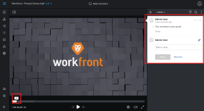

# Create and manage *proof* comments

Comments enable you&nbsp;to provide feedback on work and collaborate with other users in the *proofing viewer*. When tagging users in comments on a proof, the users you are able to tag might differ depending on various factors, such as individual user permissions and your membership in the organization:

* If you are the proof creator, owner, or have specific permissions enabled, you can tag users outside of the proof workflow and share the proof with them.
* If you were added to the proof as an outside user and you are a member of another environment with a different proof account, you can tag only those users from your original environment. For more information, see [Proofing collaboration limitations with people outside of your organization](../../../review-and-approve-work/proofing/tips-tricks-and-troubleshooting/collaboration-with-members-outside-of-your-organization.md)

## Access requirements

You must have the following access to perform the steps in this article:

<table cellspacing="0"> 
 <col> 
 <col> 
 <tbody> 
  <tr> 
   <td role="rowheader"><em>Adobe Workfront</em> plan*</td> 
   <td> 
Current plan: Pro or Higher
 
or
 
Legacy plan: Select or Premium
 
For more information about proofing access with the different plans, see <a href="../../../administration-and-setup/manage-workfront/configure-proofing/access-to-proofing-functionality.md" class="MCXref xref">Access to proofing functionality in Workfront</a>.
 </td> 
  </tr> 
  <tr> 
   <td role="rowheader"><em>Adobe Workfront</em> license*</td> 
   <td> 
Current plan: <em>Work</em> or <em>Plan</em>
 
Legacy plan: Any (You must have proofing enabled for the user)
 </td> 
  </tr> 
  <tr> 
   <td role="rowheader"><em>Proof Permission Profile</em> </td> 
   <td>Manager or higher</td> 
  </tr> 
  <tr> 
   <td role="rowheader">Access level configurations*</td> 
   <td> 
Edit access to Documents
 
For information on requesting additional access, see <a href="../../../workfront-basics/grant-and-request-access-to-objects/request-access.md" class="MCXref xref">Request access to objects in Adobe Workfront</a>.
 </td> 
  </tr> 
 </tbody> 
</table>

&#42;To find out what plan, role, or *Proof Permission Profile* you have, contact your *Workfront* or *Workfront Proof administrator*.

## Comment on a *proof*

1. Go to the project, task, or issue that contains the document, then select `Documents`.
1. Find the *proof* you need, then click `Open *proof*`.

<ol start="3"> 
 <li value="3">(Conditional) If this is a video <em>proof</em>, play the video <em>proof</em>, then click Add comment at the point in the video where you want the comment. (You can also pause the video, click in the time line where you want the comment, then click Add comment.)</li> 
 
Or
 
 
If you want to comment on a range of video footage, drag the playheads left and right in the timeline to indicate a range of footage you want to comment on. 
 
 
  
 
 
For better precision, you can click the values above the playheads and type new values. 
 
 
 
 
 <li value="4"> 
Click Add comment.  
 
  
 </li> 
 <li value="5"> 
To draw attention to a specific location on the <em>proof</em>, click the markup tool you want in the toolbar that appears above the <em>proof</em>. 
 
  
 
You can hover over the tools to see the following descriptions:
 
  <table cellspacing="0"> 
   <col> 
   <col> 
   <tbody> 
    <tr> 
     <td role="rowheader">Draw a freehand line </td> 
     <td>Lets you add a line on the selected area on the <em>proof</em>.</td> 
    </tr> 
    <tr> 
     <td role="rowheader">Draw an arrow </td> 
     <td>Lets you add an arrow to an area you select.</td> 
    </tr> 
    <tr> 
     <td role="rowheader">Highlight an area </td> 
     <td>Highlights the area you select.</td> 
    </tr> 
    <tr> 
     <td role="rowheader">Draw a rectangle </td> 
     <td>Lets you draw a rectangle around an area.</td> 
    </tr> 
    <tr> 
     <td role="rowheader">Polyline </td> 
     <td> 
Draws a connected sequence of line segments that you can leave open or close as a shape. You can move or delete any of the points you add. 
 
This tool is especially useful for working with technical and architectural images.
 </td> 
    </tr> 
    <tr> 
     <td role="rowheader">Text</td> 
     <td> 
This tool appears on the left of the other tools when you open a <em>proof</em> containing text. 
 
  
 
It provides markup tools for commenting on text in <em>proofs</em>. (For a list of text file types supported for this tool, see <a href="../../../review-and-approve-work/proofing/proofing-overview/supported-proofing-file-types.md" class="MCXref xref">Supported proofing file types and size limits overview</a> in <a href="../../../review-and-approve-work/proofing/proofing-overview/supported-proofing-file-types.md" class="MCXref xref">Supported proofing file types and size limits overview</a>.) 
 
When you click this tool and then select text on your <em>proof</em>, annotation options appear beneath the selected text: 
 
You can hover over the options to see descriptions for them.
 </td> 
    </tr> 
   </tbody> 
  </table> </li> 
 <li value="6"> 
(Optional) Click the square of color at the top of the viewer to display the markup color options, then use the options listed below to specify how the markup will look.
 
  
 
  <table cellspacing="0"> 
   <col> 
   <col> 
   <tbody> 
    <tr> 
     <td role="rowheader">Set as default </td> 
     <td>(Available only for <em>proofing</em> license holders.) Sets the color, Opacity, and Thickness you select as the defaults for comment markup on all <em>proofs</em>, and marks the color&nbsp;with a star.</td> 
    </tr> 
    <tr> 
     <td role="rowheader">Opacity </td> 
     <td>Select the opacity level you want for your comment marks. A lower opacity level is more transparent; a higher opacity level is more opaque.</td> 
    </tr> 
    <tr> 
     <td role="rowheader">Thickness </td> 
     <td>Select the thickness of the comment marks, from 1 to 20 pixels.</td> 
    </tr> 
   </tbody> 
  </table> </li> 
 <li value="7">Mark the area of the <em>proof</em> that you want to comment on.</li> 
 
In static <em>proofs</em>, you can mark multiple areas on multiple pages for one comment. For example, if you want to make the same comment on multiple pages, select an area on one page, then go to the next page where you want to make the same comment and select an area there. (This applies only to the regular annotation markup tools, not the text markup tools.)
 
 
You can also mark multiple areas of an interactive proof as long as the areas are all on the same page. 
 
 <li value="8">Type your comment in the Add comment box on the right.</li> 
 <li value="9"> 
(Optional) To tag another user in your comment and add them to the <em>proof</em>'s workflow, type @ in the comment box, then type the user's name or email address and select the user in the menu that appears.&nbsp;
 
For more information, see <a href="../../../review-and-approve-work/proofing/reviewing-proofs-within-workfront/comment-on-a-proof/tag-users-to-share-proof.md" class="MCXref xref">Tag users to share a proof</a>.
 </li> 
 <li value="10"> (Optional) To attach&nbsp;a file to a comment, do either of the following: 
  <ul> 
   <li>Click the paper clip icon in the lower-right corner of the comment, then find and select the file you want to upload.</li> 
   <li>Drag a file from a&nbsp;location on your computer and drop it into the comment area.</li> 
  </ul></li> 
 <li value="11">Click Post.</li> 
 
<em>Adobe Workfront</em> drops a pin in the center of the area you marked for the comment. In the screenshot below, the markup (red box) was drawn with the Box tool and the pin marked number 2 in the center identifies the markup. 
 
 
    
 
</ol>

## View comments

<ol> 
 <li value="1">Open the <em>proof</em> where you want to view comments.</li> 
 <li value="2">(Conditional) If the comments area is not open, click&nbsp;View comments&nbsp;in the upper-right corner.</li> 
 <li value="3"> 
(Optional) Use the Previous comment and Next comment buttons on the right edge of the screen to navigate forward and back through comments.
 
    
 </li> 
 <li value="4"> Click any comment to view the comment marks on the <em>proof</em>.</li> 
 
&nbsp;Or
 
 
&nbsp;In a video <em>proof</em>, hover over the point in the timeline where a comment was made, then click the numbered balloon that appears.  
 
 
  
 
 
Each comment displays the following information: 
  <ul> 
   <li>Name of the user who made the comment</li> 
   <li>The page number where the comment was made (in static <em>proofs</em> containing more than one page)</li> 
   <li>
The frame number or range of footage where the comment was made (in video <em>proofs</em>)

If the comment you are viewing was applied to a range of video footage, you can click the Play button to review the range.
</li> 
   <li>Text included with the comment</li> 
   <li>Any attachments that were uploaded to the comment</li> 
  </ul>
 
 <li value="5">(Optional) To adjust the size of the comment list, hover over the left edge of the comment area (not on the comment that is currently open) until the mouse pointer changes for horizontal resizing, then drag the edge where you want it.</li> 
 
    
 
</ol>

## View comments on the Updates tab in *Workfront*

In *Workfront*, you can view *proof* comments without launching your *proofing viewer*.

>[!NOTE]
>
>This feature is not available in *Workfront Proof*.

<ol> 
 <li value="1"> On the Documents tab of a work item, locate the document you want to view.</li> <draft-comment>
  <li value="2" data-mc-conditions="QuicksilverOrClassic.Quicksilver">Click the row containing the document, then click the Summary icon  on the right-side of the page. The comments display in the Updates section of the Document Summary.</li>
 </draft-comment>
 <li value="2" data-mc-conditions="QuicksilverOrClassic.Quicksilver">Click the row containing the document, then click the Summary icon  on the right-side of the page. The comments display in the Updates section of the Document Summary.</li> 
</ol>

## Reply to comments

1. View the comment, as described in [View comments](#viewing-comments) in this article.
1. Type your reply in the `Add a reply` box.
1. (Optional) To notify another reviewer&nbsp;about your reply, type @ in the comment box, then type the user's name or email address.

   For more information, see [Tag users to share a proof](../../../review-and-approve-work/proofing/reviewing-proofs-within-workfront/comment-on-a-proof/tag-users-to-share-proof.md).

1. (Optional) To add a file to a comment, do either of the following:

  * Click the paper clip icon, then browse to and select the file you want to upload.
  * Drag a file from a&nbsp;location on your computer and drop it into the comment area.

1. Click `Reply`.

You can also reply to a proof comment from the Updates area for the document.

## Search the comment list

1. Open the *proof* where you want to search comments.
1. (Conditional) If the comments area is not open, click  `View comments`&nbsp;in the upper-right corner.
1. Click the `Search` icon to display the search box.  

1. Begin typing either of the following:

  * The text you want to search for. The comment list filters as you type, beginning with the first character&nbsp;you enter.
  * The number of the comment you want to display.

1. (Optional) Click the comment to display a line connecting the comment to the related area on the *proof*.
1. When you are finished searching and you want to display all the comments, click the X at the end of the search box.

## Filter the comment list

You can filter the comments that display by defining filter parameter such as user, actions, unread status, and more.

<ol> 
 <li value="1">Open the <em>proof</em> where you want to filter comments.</li> 
 <li value="2">(Conditional) If the comments area is not open, click&nbsp;View comments&nbsp;in the upper-right corner.</li> 
 <li value="3"> 
In the comments area, click the Filter icon. 
 
  
 </li> 
 <li value="4"> 
Use the options that appear below the Filter icon to filter the comments by any of the following criteria:
 
  <table cellspacing="0"> 
   <col> 
   <col> 
   <tbody> 
    <tr> 
     <td role="rowheader">Authors </td> 
     <td>Displays only comments and comment replies made by users you specify. Begin typing the name of any user, then select the user you want from the list that appears. The number of comments added by the users you specify displays next to their names.</td> 
    </tr> 
    <tr> 
     <td role="rowheader">Actions </td> 
     <td>(if Actions are enabled in your system): Displays only comments that match the action you select. A number displayed to the right of an action indicates how many comments are associated with that action. The option Unactioned allows you to display only comments that contain no action.</td> 
    </tr> 
    <tr> 
     <td role="rowheader">General filtering options </td> 
     <td> 
      <ul> 
       <li>Unresolved:&nbsp;Displays only comments that are not yet resolved.&nbsp;</li> 
       <li>Unread:&nbsp;Displays only comments that you have not yet read.&nbsp;</li> 
       <li>With attachments:&nbsp;Displays only comments that contain an attachment, or comments that include a reply that contain an attachment.</li> 
       <li>Current page only:&nbsp;(Available only for static and interactive <em>proofs</em>.) Displays only comments from the page you are currently viewing. The comment list refreshes when you change the visible page.</li> 
      </ul> </td> 
    </tr> 
   </tbody> 
  </table> </li> 
 <li value="5">Click Apply&nbsp;or click the Filter icon to view the comment list with your filter criteria applied.</li> 
 
The list is filtered, and the Filter icon displays swith a blue dot to indicate that a filter is applied.
 
 
  
 
 <li value="6">When you are finished filtering and you want to see all the comments, click the Filter icon, click Reset, then click the Filter icon again.</li> 
</ol>

## Sort the comment list

When you sort the comment list, the sort option you choose is remembered the next time you open a *proof* in the *proofing viewer* you are using.

<ol> 
 <li value="1">Open the <em>proof</em> where you want to sort comments.</li> 
 <li value="2">If the comments area is not open, click&nbsp;View comments&nbsp;in the upper-right corner. </li> 
 <li value="3">Click the sorting&nbsp;menu to open it.</li> 
 
    
 
 <li value="4"> 
 Select one of the following sort options:
 
  <table cellspacing="0"> 
   <col> 
   <col> 
   <tbody> 
    <tr> 
     <td role="rowheader">Latest</td> 
     <td>Displays the most recent comments at the top of the comment list.</td> 
    </tr> 
    <tr> 
     <td role="rowheader">Oldest</td> 
     <td>Displays the oldest comments at the top of the comment list (default).</td> 
    </tr> 
    <tr> 
     <td role="rowheader">Creator A-Z</td> 
     <td>Displays comments grouped by the user who created the comment, listed in alphabetical order.</td> 
    </tr> 
    <tr> 
     <td role="rowheader">Creator Z-A</td> 
     <td>Displays comments grouped by the user who created the comment, listed in reverse alphabetical order.</td> 
    </tr> 
    <tr> 
     <td role="rowheader">Page (down, up)</td> 
     <td>(Available only for static <em>proofs</em>.) Displays comments in order of when they appear in relation to the page number or video timeline.</td> 
    </tr> 
    <tr> 
     <td role="rowheader">Timestamp (down)</td> 
     <td>(Available only for video <em>proofs</em>.) Displays comments in order of when they appear in relation to the video timeline. Comments made later in the timeline display&nbsp;first.</td> 
    </tr> 
    <tr> 
     <td role="rowheader">Timestamp (up)</td> 
     <td>(Available only for video <em>proofs</em>.) Displays comments in order of when they appear in relation to the video timeline.&nbsp;Comments made earlier in the timeline display first.</td> 
    </tr> 
    <tr> 
     <td role="rowheader">Device (up) </td> 
     <td>(Available only for interactive <em>proofs</em>.) Displays comments in order according to the device selected when the comment was made. Comments made on lower resolutions display first.</td> 
    </tr> 
    <tr> 
     <td role="rowheader">Device (down)</td> 
     <td> 
(Available only for interactive <em>proofs</em>.) Displays comments in order according to the resolution selected when the comment was made. Comments made on higher resolutions display first.
 
For information about changing the resolution in an interactive <em>proof</em>, see&nbsp;<a href="../../../review-and-approve-work/proofing/reviewing-proofs-within-workfront/review-a-proof/view-interactive-content-as-it-appears-in-device.md" class="MCXref xref">Change interactive proof resolution in the proofing viewer</a>.
 </td> 
    </tr> 
   </tbody> 
  </table> </li> 
</ol>

## Edit a comment

You can edit any comment you make on a *proof*. Additionally, the following users&nbsp;can edit comments made by other users:

* The *proof* Owner
* The *proof* Creator
* Users with Supervisor profile permissions
* Users with a proof role of Author or Moderator

Comments cannot be edited after a reply is added to the comment. This restriction maintains the integrity of the comment thread.

When you edit a comment, the time the comment was made is not affected.

To edit a comment:

<ol> 
 <li value="1">Open the <em>proof</em> containing the comment that you want to edit.</li> 
 <li value="2">(Conditional) If the comments area is not open, click&nbsp;View comments&nbsp;in the upper-right corner.</li> 
 <li value="3">Hover over the comment you want to edit, click the More (three dots) icon that appears, then click Edit in the drop-down menu.</li> 
 
  
 
 <li value="4"> 
Make any changes in the comment, then click Post.
 
  
 
   
The label "Edited" appears on the comment. When a reviewer mouses over this, your name and the date and time of the changes appear. If you edit the comment more than once, this information appears only for the most recent change.
 
   
  
 
   
This label also appears above the comment when you select the document in the Documents area and view the Updates tab<draft-comment>
     <MadCap:conditionalText data-mc-conditions="QuicksilverOrClassic.Quicksilver">
       in the Summary 
     </MadCap:conditionalText>
    </draft-comment><MadCap:conditionalText data-mc-conditions="QuicksilverOrClassic.Quicksilver">
      in the Summary 
    </MadCap:conditionalText>.
 <draft-comment>
    
  

   </draft-comment>
   
  
 
  
 </li> 
</ol>

## Resolve a comment

If you have the Author or Moderator role on a *proof*, you can resolve a comment after it has been addressed.

1. Open the *proof* containing the comment that you want to resolve.
1. (Conditional) If the comments area is not open, click  `View comments`&nbsp;in the upper-right corner.
1. Click the check mark icon in the lower-right corner of the comment (to the right of the `Reply` button).

   A green check mark appears in the upper-left corner of the comment and a "Thread resolved" label and message appear below it. The user who submitted the comment receives a notification that the comment was resolved.

   <!--
   
A "Thread resolved" label also appears above the Updates comment in the Summary. For information about the Summary, see <a href="../../../documents/managing-documents/summary-for-documents.md" class="MCXref xref">Summary for documents overview</a>.

   -->

   A "Thread resolved" label also appears above the `Updates` comment in the Summary. For information about the Summary, see [Summary for documents overview](../../../documents/managing-documents/summary-for-documents.md).

## Reopen a resolved comment

If you have the Author or Moderator role on a *proof*, you can re-open a comment that you or another reviewer has resolved.

1. Open the *proof* containing the comment that you want to reopen.
1. (Conditional) If the comments area is not open, click  `View comments`&nbsp;in the upper-right corner.
1. Click the green check mark icon in the lower-right corner of the comment (to the right of the `Reply` button).

   The check mark in the upper-left corner of the comment disappears and a "Thread reopened" label and message appear below it. The user who submitted the comment receives a notification that the comment was reopened.

   <!--
   
Also, the "Thread resolved" label above the Updates comment in the Summary is removed. For information about the Summary, see <a href="../../../documents/managing-documents/summary-for-documents.md" class="MCXref xref">Summary for documents overview</a>.

   -->

   Also, the "Thread resolved" label above the `Updates` comment in the Summary is removed. For information about the Summary, see [Summary for documents overview](../../../documents/managing-documents/summary-for-documents.md).

## About applying an action to a comment

You can use actions to keep track of what needs to happen on each comment thread on a *proof*. An action is simply a word or phrase you select and add to a comment to provide information about what has been done or what still needs to be done in response to the comment.

Your *Workfront administrator* enables and configures your organization's actions to meet the needs of *proof* reviewers in your organization.

For example, your reviewers may need actions such as "To Do," "Done," and "In Progress":

Other typical actions include Make Changes, Disregard, and Clarification Needed.

For more information, see [Use actions on proof comments](../../../review-and-approve-work/proofing/reviewing-proofs-within-workfront/comment-on-a-proof/use-actions-on-comments-in-viewer.md).

## Mark all comments as read

As a reviewer of a *proof*, you can quickly mark all comments as Read.

<ol> 
 <li value="1">Open the <em>proof</em> containing the comments you want to mark as Read.</li> 
 <li value="2">(Conditional) If the comments area is not open, click&nbsp;View comments&nbsp;in the upper-right corner. </li> 
 <li value="3">Above the comment list, click the More (three dots) icon, then click Mark all as read.</li> 
 
  
 
</ol>

## Delete a comment or reply

You can delete a comment or a reply to a comment as long as no one has already replied to it.

It is usually better to resolve a&nbsp;comment rather than delete it. For more informaton, see&nbsp; [Resolve a comment](#resolving-a-comment) in this article.

Additionally, the following users can delete comments or replies made by other users:

* The *proof* Moderator
* Users with Supervisor profile permissions

After a comment is deleted, the system logs an&nbsp;entry in the *proof* activity section, showing that the comment was deleted.

To delete a comment or reply:

<ol> 
 <li value="1">Open the <em>proof</em> containing the comment or reply that you want to delete.</li> 
 <li value="2">(Conditional) If the comments area is not open, click&nbsp;View comments&nbsp;in the upper-right corner.</li> 
 <li value="3"> 
Select the comment or reply, then click the More (three dots) icon. 
 
  
 </li> 
 <li value="4">Click Delete > Yes, delete it.</li> 
</ol>

## Receive email notifications about comments

The email notifications you receive about comment activity are determined by the option you select in the `Email alerts`&nbsp;menu on the *proof*.&nbsp; For more information, see in [Manage notifications for proof comments and decisions](../../../review-and-approve-work/proofing/reviewing-proofs-within-workfront/manage-notifications-for-proof-comments.md).
