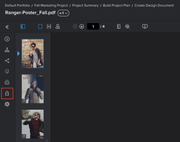

# Lock or unlock a proof {#lock-or-unlock-a-proof}

You can manually lock and unlock a *`proof`* any time in the review process.

## Access requirements {#access-requirements}

You must have the following access to perform the steps in this article:

<table style="width: 100%;margin-left: 0;margin-right: auto;mc-table-style: url('../../../Resources/TableStyles/TableStyle-List-options-in-steps.css');" class="TableStyle-TableStyle-List-options-in-steps" cellspacing="0"> 
 <col class="TableStyle-TableStyle-List-options-in-steps-Column-Column1"> 
 <col class="TableStyle-TableStyle-List-options-in-steps-Column-Column2"> 
 <tbody> 
  <tr class="TableStyle-TableStyle-List-options-in-steps-Body-LightGray"> 
   <td class="TableStyle-TableStyle-List-options-in-steps-BodyE-Column1-LightGray" role="rowheader">Adobe Workfront plan*</td> 
   <td class="TableStyle-TableStyle-List-options-in-steps-BodyD-Column2-LightGray"> 
Current plan: Pro or Higher
 
or
 
Legacy plan: Premium
 
For more information about proofing access with the different plans, see <a href="access-to-proofing-functionality.md" class="MCXref xref">Access to proofing functionality in Workfront</a>.
 </td> 
  </tr> 
  <tr class="TableStyle-TableStyle-List-options-in-steps-Body-MediumGray"> 
   <td class="TableStyle-TableStyle-List-options-in-steps-BodyE-Column1-MediumGray" role="rowheader">Adobe Workfront license*</td> 
   <td class="TableStyle-TableStyle-List-options-in-steps-BodyD-Column2-MediumGray"> 
Current plan: Work or Plan
 
Legacy plan: Any (You must have proofing enabled for the user)
 </td> 
  </tr> 
  <tr class="TableStyle-TableStyle-List-options-in-steps-Body-LightGray"> 
   <td class="TableStyle-TableStyle-List-options-in-steps-BodyE-Column1-LightGray" role="rowheader">Proof role</td> 
   <td class="TableStyle-TableStyle-List-options-in-steps-BodyD-Column2-LightGray">Owner, Author, Moderator</td> 
  </tr> 
  <tr class="TableStyle-TableStyle-List-options-in-steps-Body-MediumGray"> 
   <td class="TableStyle-TableStyle-List-options-in-steps-BodyB-Column1-MediumGray" role="rowheader">Proof Permission Profile </td> 
   <td class="TableStyle-TableStyle-List-options-in-steps-BodyA-Column2-MediumGray">Supervisor or Administrator</td> 
  </tr> 
 </tbody> 
</table>

&#42;To find out what plan, role, or *`Proof Permission Profile`* you have, contact your *`Workfront`* or *`Workfront Proof administrator`*.

## Lock a *`proof`* {#lock-a-proof}

You can manually lock a *`proof`* to prevent or allow commenting by reviewers. This is different from locking a proof stage.

To lock a *`proof`*:

1. Go to the document list that contains the *`proof`* you want to open.
1.  Hover over the document, then click the `Open proof` link that appears. 

   Or

   If you want to open a *`proof`* for an earlier version of the document, click the More icon  for that version in the Summary, then click `Open proof`.

   For information about the Summary, see [Summary for documents overview](summary-for-documents.md).

1.  In the In the left panel, click the `Lock` icon .

   

## Unlock a *`proof`* {#unlock-a-proof}

Unlocking a proof is useful when you need reviewers to add comments to a previous version of a proof. (A previous version is always locked until the *`proof`* owner manually unlocks it.) When the reviewers have finished adding comments to the previous version, you can lock it again. For information about viewing a previous version of a proof, see [View previous proof versions in the Web Proofing Viewer](view-previous-proof-versions.md).

To unlock a proof:

1.  Hover over the document, then click the `Open proof` link that appears. 

   Or

   If you want to open a *`proof`* for an earlier version of the document, click the More icon  for that version in the Summary, then click `Open proof`.

   For information about the Summary, see [Summary for documents overview](summary-for-documents.md).

1.  In the left panel, click the `Unlock` icon , then click `Yes, unlock`. 

   

