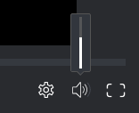

# Control playback in a video *proof*

## Access requirements

You must have the following access to perform the steps in this article:

<table cellspacing="0"> 
 <col> 
 <col> 
 <tbody> 
  <tr> 
   <td role="rowheader"><em>Adobe Workfront</em> plan*</td> 
   <td> 
Current plan: Pro or Higher
 
or
 
Legacy plan: Select or Premium
 
For more information about proofing access with the different plans, see <a href="../../../../administration-and-setup/manage-workfront/configure-proofing/access-to-proofing-functionality.md" class="MCXref xref">Access to proofing functionality in Workfront</a>.
 </td> 
  </tr> 
  <tr> 
   <td role="rowheader"><em>Adobe Workfront</em> license*</td> 
   <td> 
Current plan: <em>Work</em> or <em>Plan</em>
 
Legacy plan: Any (You must have proofing enabled for the user)
 </td> 
  </tr> 
  <tr> 
   <td role="rowheader"><em>Proof Permission Profile</em> </td> 
   <td>Manager or higher</td> 
  </tr> 
  <tr> 
   <td role="rowheader">Access level configurations*</td> 
   <td> 
Edit access to Documents
 
For information on requesting additional access, see <a href="../../../../workfront-basics/grant-and-request-access-to-objects/request-access.md" class="MCXref xref">Request access to objects in Adobe Workfront</a>.
 </td> 
  </tr> 
 </tbody> 
</table>

&#42;To find out what plan, role, or *Proof Permission Profile* you have, contact your *Workfront* or *Workfront Proof administrator*.

## Adjust video playback speed

You can adjust the playback speed of the video *proof*. You can select to view the video between a quarter speed, to double speed.

1. Go to the project, task, or issue that contains the document, then select `Documents`.
1. Find the *proof* you need, then click `Open *proof*`.

<ol start="3"> 
 <li value="3"> 
In the lower-right corner of the <em>proofing viewer</em>, click the Settings icon.
 
    
 </li> 
 <li value="4">Click the current speed, then select a new playback speed. </li> 
 <li value="5">Click the Play button on the video to test the new speed.</li> 
</ol>

## View video frame-by-frame

For a more detailed look at the video *proof*, you can manually review&nbsp;the video frame-by-frame.

1. Go to the project, task, or issue that contains the document, then select `Documents`.
1. Find the *proof* you need, then click `Open *proof*`.

<ol start="3"> 
 <li value="3"> 
At the bottom of the <em>proofing viewer</em>, click the Forward&nbsp;and Back arrows to review the video frame-by-frame.
 
  
 </li> 
</ol>

## Change playback volume

You can control the volume in the video playback.

1. Go to the project, task, or issue that contains the document, then select `Documents`.
1. Find the *proof* you need, then click `Open *proof*`.

<ol start="3"> 
 <li value="3"> 
In the lower-right corner of the <em>proofing viewer</em>, mouse over the Volume icon, then drag the slider to select a new volume.
 
  
 
Or
 
 Click the Volume icon to mute and unmute the volume. 
 </li> 
</ol>

