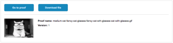

# Share a proof from the proofing viewer

You can share a proof from the proofing viewer if sharing is enabled by the proof owner or creator.

>[!IMPORTANT]
>
>The Allow sharing proof via public URL or embed code setting must be enabled.

## Access requirements

You must have the following access to perform the steps in this article:

<table cellspacing="0"> 
 <col> 
 <col> 
 <tbody> 
  <tr> 
   <td role="rowheader">Adobe Workfront plan*</td> 
   <td> 
Current plan: Pro or Higher
 
or
 
Legacy plan: Select or Premium
 
For more information about proofing access with the different plans, see <a href="../../../../administration-and-setup/manage-workfront/configure-proofing/access-to-proofing-functionality.md" class="MCXref xref">Access to proofing functionality in Workfront</a>.
 </td> 
  </tr> 
  <tr> 
   <td role="rowheader">Adobe Workfront license*</td> 
   <td> 
Current plan: Work or Plan
 
Legacy plan: Any (You must have proofing enabled for the user)
 </td> 
  </tr> 
  <tr> 
   <td role="rowheader">Proof Permission Profile </td> 
   <td>Manager or higher</td> 
  </tr> 
  <tr> 
   <td role="rowheader">Access level configurations*</td> 
   <td> 
Edit access to Documents
 
For information on requesting additional access, see <a href="../../../../workfront-basics/grant-and-request-access-to-objects/request-access.md" class="MCXref xref">Request access to objects in Adobe Workfront</a>.
 </td> 
  </tr> 
 </tbody> 
</table>

&#42;To find out what plan, role, or Proof Permission Profile you have, contact your Workfront or Workfront Proof administrator.

## Share the URL

You can share a proof via a URL if the owner has configured the proof for sharing. Proof owners can update sharing settings any time. For more information, see [Edit proof settings](../../../../review-and-approve-work/proofing/managing-proofs-within-workfront/edit-proof-settings.md).

<ol> 
 <li value="1"> 
If the left icon menu is not displayed, click the Menu icon on the upper-left corner of the proofing viewer.
 
  
 </li> 
 <li value="2"> 
In the left icon menu of the proofing viewer, click the Share&nbsp;icon.
 
  
 </li> 
 <li value="3">In the Share proof options that appear, make sure Get shareable link is selected.</li> 
 <li value="4"> 
&nbsp;Do either of the following:
 
  <ul> 
   <li> 
To copy the link to your clipboard, click Copy link.
 
You can now distribute the link via a third-party tool, such as a chat or an email application.
 </li> 
   <li>To email the link directly from Adobe Workfront, do the following:
    <ol>
     <li value="1">
In the Or email link to field, begin typing and select the name of your recipient. Or specify the email address of an external user who you want to share with.
</li>
     <li value="2">
Select from the following options:

      <table cellspacing="0">
       <col>
       <col>
       <tbody>
        <tr>
         <td role="rowheader">Send public link</td>
         <td>
Includes a button in the email notification that directs users to the proof within the proofing viewer they are using and grants View access.

If Subscribe to proof via public URL or embed code is turned off for the proof, users can sign in with their Workfront login credentials to add comments to the proof. If it is turned on, anyone providing their email address and name (no password required) can sign and add comments to the proof.
</td>
        </tr>
        <tr>
         <td role="rowheader">Send download link</td>
         <td>Includes a button in the email notification that directs users to a download page, which provides file details, file name, and file size, with the file displayed inline. Users can click the Download link from the download page to download the file.</td>
        </tr>
        <tr>
         <td role="rowheader">Add custom message</td>
         <td>Allows you to specify a custom subject and body for the email notification.</td>
        </tr>
       </tbody>
      </table></li>
     <li value="3">
Click Send.

Your recipients receive an email notification containing information about the proof and the buttons you chose to include.

</li>
    </ol></li> 
  </ul> </li> 
</ol>

## Share the embed code

You can share a proof via embed code if the proof owner has configured it for this.

For information about configuring a prof with an embedded code, see [Configure a proof](../../../../review-and-approve-work/proofing/creating-proofs-within-workfront/configure-proof.md) in [Configure a proof](../../../../review-and-approve-work/proofing/creating-proofs-within-workfront/configure-proof.md).

To share a proof via the embed code:

<ol> 
 <li value="1"> 
In the toolbar on the left of the proofing viewer, click the Share&nbsp;icon. 
 
  
 </li> 
 <li value="2">In the Share proof options that appear, click Get embed code, then click Copy.</li> 
</ol>

## Share a proof by adding users to it

You can add users to a proof while reviewing a proof if you have any of the following permissions:<![CDATA[    ]]>

* Supervisor or Administrator permissions
* Manager permissions and you are the proof creator or owner
* Manager permissions with the Author or Moderator proof role

If the proof has an Automated Workflow, you can add the user to an individual stage. For more information, see [Automated Workflow overview](../../../../review-and-approve-work/proofing/proofing-overview/automated-workflow.md).

By default, users you add to the proof:

* Receive an email notification with a link to the proof.
* Can make approval decisions on the proof from the Home or My Work area, as described in [Approving work in Adobe Workfront](../../../../review-and-approve-work/manage-approvals/approving-work.md).
* Do not need to have proofing enabled in order to review the proof.

When Automated Workflow is enabled and you add a user to the proof who does not have proofing enabled in Workfront, a new stage is created within the Automated Workflow. The user who you are adding is automatically added to this new stage when they view the proof for the first time. For more information, see [Automated Workflow overview](../../../../review-and-approve-work/proofing/proofing-overview/automated-workflow.md).

To share a proof with individual users:

<ol> 
 <li value="1"> 
In the toolbar on the left of the proofing viewer, click the Share&nbsp;icon. 
 
  
 </li> 
 <li value="2">Click Add recipients in the list on the left.</li> 
 <li value="3">Under&nbsp;New proof recipients, begin typing the name of a user who you want to share the proof with, then click the name when it appears in the drop-down list.</li> 
 <li value="4"> 
(Optional) Change any reviewer options to the right of the person's name:
 
  <ul> 
   <li>Proof role: For more information, see <a href="../../../../workfront-proof/wp-work-proofsfiles/share-proofs-and-files/manage-proof-roles.md" class="MCXref xref">Manage Proof Roles in Workfront Proof</a>.</li> 
   <li>Stage: (Available only if the proof has an Automated Workflow). For more information, see&nbsp;<a href="../../../../review-and-approve-work/proofing/proofing-overview/stages.md" class="MCXref xref">Automated Workflow Stages overview</a>.</li> 
   <li> 
Email alerts:&nbsp;Select one of the following options to specify how the person will be notified about activity on the proof.
 
    <table cellspacing="0"> 
     <col> 
     <col> 
     <tbody> 
      <tr> 
       <td role="rowheader">All activity</td> 
       <td>Workfront sends an email to the reviewer every time there is any activity on the proof, such as&nbsp;a new&nbsp;comment, reply, or&nbsp;decision. 
This is a great option for the person who is managing the proofing process because&nbsp;it allows them to see the activity as it happens. 

Users do not receive an email alert about their own activity.
</td> 
      </tr> 
      <tr> 
       <td role="rowheader">Replies to my comments</td> 
       <td>An email is sent to the reviewer only if someone replies explicitly to their&nbsp;comment&nbsp;(this excludes their own replies on their own comments). This means that if somebody on the proof makes a new comment, the reviewer is not notified.
This&nbsp;setting is recommended for your clients on the proof so that they are not&nbsp;notified of any other comments&nbsp;on the proof, and are&nbsp;notified only&nbsp;of replies to their own comments.

Although reviewers with this email alert setting are not notified of other new&nbsp;comments, they can still view&nbsp;all&nbsp;comments&nbsp;on the proof in&nbsp;the proofing viewer.

For information about comments, see <a href="../../../../review-and-approve-work/proofing/reviewing-proofs-within-workfront/comment-on-a-proof/view-proof-comments.md" class="MCXref xref">View and reply to proof comments</a>.
</td> 
      </tr> 
      <tr> 
       <td role="rowheader">Decisions</td> 
       <td>Workfront sends an email to the reviewer only when someone makes a&nbsp;decision.
This can be useful for the person who is managing the approval process&nbsp;(such as a project manager) and&nbsp;needs to monitor progress on the proof and see which users have&nbsp;made their&nbsp;decision.

You are not notified of your own decision unless you select an email confirmation option when submitting your decision.
</td> 
      </tr> 
      <tr> 
       <td role="rowheader">Final decision</td> 
       <td>Workfront sends an email when the last approver on the proof has made their&nbsp;decision.
This alert is often used by the designer, who does not usually need to take part in the actual review discussion. When the final decision is made, the designer is&nbsp;notified and&nbsp;can then take&nbsp;action on any necessary changes.

This alert can also be useful&nbsp;for a department leader&nbsp;who needs to be notified only when the review process is finished.
</td> 
      </tr> 
      <tr> 
       <td role="rowheader">Hourly Summary</td> 
       <td>Workfront sends an email to the reviewer every hour with a summary of all the&nbsp;comments, replies, and&nbsp;decisions&nbsp;that have occurred in the hour.
The email is sent only when&nbsp;activity besides your own&nbsp;occurs within the past&nbsp;hour. 

This alert is a good way of seeing an overview of the project.

An example use case for this summary is a&nbsp;senior reviewer&nbsp;who needs an overview of the project but does not need to be notified immediately of all activity on the proof.
</td> 
      </tr> 
      <tr> 
       <td role="rowheader">Daily Summary</td> 
       <td>Workfront sends one email with all&nbsp;comments, replies, and decisions listed only on days when there is activity besides your own.
This alert is a good way of seeing a summary of the project&nbsp;without being overwhelmed with multiple&nbsp;updates throughout the day.

An example use case for this summary is a department leader&nbsp;who wants to monitor the overall progress of the project.

For more information, see <a href="../../../../review-and-approve-work/proofing/reviewing-proofs-within-workfront/manage-notifications-for-proof-comments.md" class="MCXref xref">Manage notifications for proof comments and decisions</a>.
</td> 
      </tr> No email Workfront does not send any email alerts. This is useful for a person who is added to a proof only for reference purposes and does not need to be notified of any changes. The system default is Daily summary (also seen as Not Set). If you or your reviewers do not make any other changes, all your proofs have this setting. <!--
       Set a deadline Select the day and time when users must take action on the proof. If you are adding users to a proof for a document that already exists in Workfront, you should have already set a deadline.
      --> <!--
       Notify people by email Select this option to send an email to the users, notifying them of the proof. Click Add a custom message to specify a message to include in the email notification.
      --> 
     </tbody> 
    </table> </li> 
  </ul> </li> 
 <li value="5">(Optional) Repeat the two previous steps to add multiple users to the proof.&nbsp;</li> 
 <li value="6"> 
(Optional) Set a Deadline for the reviewers (available only if the proof does not have automated workflow). 
 </li> 
 <li value="7">(Optional) Select Send email notification to new recipients to let them know you have added them to the proof.</li> 
 <li value="8">When you are finished adding users to the proof, click Done.</li> 
</ol>

