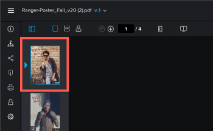

# View content in a *proof*

## Access requirements

You must have the following access to perform the steps in this article:

<table cellspacing="0"> 
 <col> 
 <col> 
 <tbody> 
  <tr> 
   <td role="rowheader"><em>Adobe Workfront</em> plan*</td> 
   <td> 
Current plan: Pro or Higher
 
or
 
Legacy plan: Select or Premium
 
For more information about proofing access with the different plans, see <a href="../../../../administration-and-setup/manage-workfront/configure-proofing/access-to-proofing-functionality.md" class="MCXref xref">Access to proofing functionality in Workfront</a>.
 </td> 
  </tr> 
  <tr> 
   <td role="rowheader"><em>Adobe Workfront</em> license*</td> 
   <td> 
Current plan: <em>Work</em> or <em>Plan</em>
 
Legacy plan: Any (You must have proofing enabled for the user)
 </td> 
  </tr> 
  <tr> 
   <td role="rowheader"><em>Proof Permission Profile</em> </td> 
   <td>Manager or higher</td> 
  </tr> 
  <tr> 
   <td role="rowheader">Access level configurations*</td> 
   <td> 
Edit access to Documents
 
For information on requesting additional access, see <a href="../../../../workfront-basics/grant-and-request-access-to-objects/request-access.md" class="MCXref xref">Request access to objects in Adobe Workfront</a>.
 </td> 
  </tr> 
 </tbody> 
</table>

&#42;To find out what plan, role, or *Proof Permission Profile* you have, contact your *Workfront* or *Workfront Proof administrator*.

## Change the view of your *proof*

You can view a static *proof* that contains multiple pages in a single view, in a continues view, or in a magazine view.

1. Go to the project, task, or issue that contains the document, then select `Documents`.
1. Find the *proof* you need, then click `Open *proof*`.

<ol start="3"> 
 <li value="3">In the upper-left area of the <em>proofing viewer</em>, locate the viewing options.  </li> 
 <li value="4"> 
Click any of the following options:
 
  <table cellspacing="0"> 
   <col> 
   <col> 
   <tbody> 
    <tr> 
     <td role="rowheader">Single view</td> 
     <td>Displays only a single page at a time. Click the thumbnail of the page you want to view, or press the Left and Right arrow keys to navigate between pages. </td> 
    </tr> 
    <tr> 
     <td role="rowheader">Continuous view</td> 
     <td>Displays all pages in a single, stacked view.&nbsp;Click the thumbnail of the page you want to view, or press the Left and Right arrow keys to scroll up or down all pages in a continuous view. </td> 
    </tr> 
    <tr> 
     <td role="rowheader">Magazine view</td> 
     <td>Displays all pages in a single, magazine view (side-by-side and stacked).&nbsp;Click the thumbnail of the page you want to view, or press the Left and Right arrow keys to scroll among all pages. </td> 
    </tr> 
   </tbody> 
  </table> </li> 
</ol>

## Use thumbnails

The thumbails panel displays on the left side of the *proofing viewer*. You can use the thumbnails area to navigate throughout the *proof*. Thumbnails are especially useful when a *proof* contains multiple pages.

* [Hide and display the thumbnails panel](#hiding-and-displaying-the-thumbnails-panel) 
* [Zoom and pan in the thumbnail view](#zooming-and-panning-in-the-thumbnails-panel)

### Hide and display the thumbnails panel

The thumbnails panel displays by default. You can hide or adjust the size of the panel.

1. Go to the project, task, or issue that contains the document, then select `Documents`.
1. Find the *proof* you need, then click `Open *proof*`.

<ol start="3"> 
 <li value="3">Click the Thumbnail icon in the upper-left corner of the <em>proofing viewer</em>. </li> 
 <li value="4"> 
(Optional) Click the Thumbnail icon again to display the thumbnails panel.
 <note type="tip">
   You can mouse over the right edge of the thumbnails panel to resize the panel. 
  </note> </li> 
</ol>

### Zoom and pan in the thumbnail view

The zoom area in the thumbnails panel displays the area of the *proof* you are currently viewing. You can adjust the zoom within the thumbnail area or you can pan the area to view a different part of the *proof*.

To zoom and pan in the thumbnail view:

1. Go to the project, task, or issue that contains the document, then select `Documents`.
1. Find the *proof* you need, then click `Open *proof*`.

<ol start="3"> 
 <li value="3"> 
Locate the current zoom area in the thumbnails panel. The zoom area displays as a blue frame around the edges of the thumbnail.
 
  
 </li> 
 <li value="4">To adjust the size of the zoom area, drag the lower-right corner of the zoom area until it is the desired size.</li> 
 <li value="5">To move the zoom area to another part of the <em>proof</em>, drag the zoom area until it covers the part of the <em>proof</em> you want to view.</li> 
</ol>

## Rotate a *proof*

You can rotate the *proof* within the *proofing viewer*. When you rotate a *proof* that contains multiple pages, all pages are rotated simultaneously.

1. Go to the project, task, or issue that contains the document, then select `Documents`.
1. Find the *proof* you need, then click `Open *proof*`.

<ol start="3"> 
 <li value="3"> 
Click the Rotate icon at the bottom of the <em>proofing viewer</em>.
 
  
 
The <em>proof</em> is rotated 90 degrees each time you click the Rotate icon. 
 </li> 
</ol>

## Zoom and pan a *proof*

You can adjust the zoom percentage when viewing the *proof*. When viewing a *proof* at a larger zoom percentage, the Pan option allows you to use the cursor to navigate to different areas of the *proof*.

1. Go to the project, task, or issue that contains the document, then select `Documents`.
1. Find the *proof* you need, then click `Open *proof*`.

<ol start="3"> 
 <li value="3">Do any of the following to adjust the zoom percentage of the <em>proof</em>: 
  <ul>
   <li>
Click the Zoom icon, then either click on the <em>proof</em> to view the <em>proof</em> at a higher zoom level, or drag across an area of the <em>proof</em> to view only that area.

</li>
   <li>
Click the current zoom percentage, the click a new zoom percentage or click&nbsp;Fit to width, Fit to height, or Fit to page.

</li>
   <li>
Click the Plus or Minus icons to increase or decrease the zoom percentage.

</li>
  </ul></li> 
 <li value="4"> 
If you need to pan to a certain area on the video <em>proof</em>, click the Pan icon, then drag the <em>proof</em> as needed.
 
  
 <note type="tip">
   To easily switch between the Zoom and Pan tools, hold down the spacebar when using the Zoom icon to pan.
  </note> </li> 
</ol>

