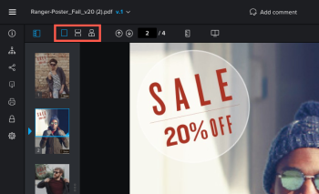
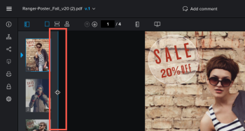
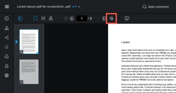
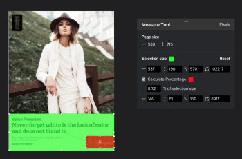
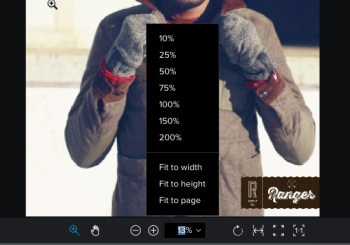

# Review a static `proof`

You can review a `proof` that has been shared with you or a `proof` you have created.

## Access requirements

You must have the following access to perform the steps in this article:

<table cellspacing="0"> 
 <col> 
 <col> 
 <tbody> 
  <tr> 
   <td role="rowheader">Adobe Workfront plan*</td> 
   <td> 
Current plan: Pro or Higher
 
or
 
Legacy plan: Select or Premium
 
For more information about proofing access with the different plans, see <a href="../../../administration-and-setup/manage-workfront/configure-proofing/access-to-proofing-functionality.md" class="MCXref xref">Access to proofing functionality in Workfront</a>.
 </td> 
  </tr> 
  <tr> 
   <td role="rowheader">Adobe Workfront license*</td> 
   <td> 
Current plan: Work or Plan
 
Legacy plan: Any (You must have proofing enabled for the user)
 </td> 
  </tr> 
  <tr> 
   <td role="rowheader">Proof Permission Profile </td> 
   <td>Manager or higher</td> 
  </tr> 
  <tr> 
   <td role="rowheader">Access level configurations*</td> 
   <td> 
Edit access to Documents
 
For information on requesting additional access, see <a href="../../../workfront-basics/grant-and-request-access-to-objects/request-access.md" class="MCXref xref">Request access to objects in Adobe Workfront</a>.
 </td> 
  </tr> 
 </tbody> 
</table>

&#42;To find out what plan, role, or `Proof Permission Profile` you have, contact your `Workfront` or `Workfront Proof administrator`.

## Open and work with a proof

1. Go to the document list that contains the `proof` you want to open.
1. Hover over the document, then click  `Open proof`.

   You can `proof` static content in the `Web Proofing Viewer` or the `Desktop Proofing Viewer`. The viewer that opens depends on how your `Adobe Workfront administrator` has configured your organization's `proofing viewer`s.

1. Do any of the following:

* Comment on the `proof`, as explained in [Create and manage proof comments](../../../review-and-approve-work/proofing/reviewing-proofs-within-workfront/create-manage-proof-comments.md).

* Use `proofing viewer` functionality described in the remaining sections below.

For information about creating a `proof`, see [Generate a proof](../../../review-and-approve-work/proofing/creating-proofs-within-workfront/generate-proof.md).

For general information that relates to reviewing `proofs`, see [Review proofs within Adobe Workfront](../../../review-and-approve-work/proofing/reviewing-proofs-within-workfront/review-proofs-in-wf.md).

If you cannot use a Proofing Viewer as described in this section, consult your `Workfront administrator`.

## Change the view of your `proof`

You can view a static `proof` that contains multiple pages in a single view, in a continues view, or in a magazine view.

<ol> 
 <li value="1">Locate the various view options in the upper-left section of the proofing viewer. </li> 
 <li value="2"> 
Click any of the following options:
 
  <table cellspacing="0"> 
   <col> 
   <col> 
   <tbody> 
    <tr> 
     <td role="rowheader">Single view</td> 
     <td>Displays only a single page at a time. Click the thumbnail of the page you want to view, or press the Left and Right arrow keys to navigate between pages. </td> 
    </tr> 
    <tr> 
     <td role="rowheader">Continuous view</td> 
     <td>Displays all pages in a single, stacked view.&nbsp;Click the thumbnail of the page you want to view, or press the Left and Right arrow keys to scroll up or down all pages in a continuous view. </td> 
    </tr> 
    <tr> 
     <td role="rowheader">Magazine view</td> 
     <td>Displays all pages in a single, magazine view (side-by-side and stacked).&nbsp;Click the thumbnail of the page you want to view, or press the Left and Right arrow keys to scroll among all pages. </td> 
    </tr> 
   </tbody> 
  </table> </li> 
</ol>

## Use thumbnails

The thumbails panel displays on the left side of the `proofing viewer`. You can use the thumbnails area to navigate throughout the `proof`. Thumbnails are especially useful when a `proof` contains multiple pages.

* [Hide and display the thumbnails panel](#hiding-and-displaying-the-thumbnails-panel) 
* [Zoom and pan in the thumbnail view](#zooming-and-panning-in-the-thumbnails-panel)

### Hide and display the thumbnails panel

The thumbnails panel displays by default. You can hide or adjust the size of the panel.

* [Hide the thumbnails panel](#hiding-the-thumbnails-panel) 
* [Adjust the size of the thumbnails panel](#adjusting-the-size-of-the-thumbnails-panel)

#### `Hide the thumbnails panel`

<ol> 
 <li value="1">Click the Thumbnail icon in the upper-left corner of the proofing viewer. </li> 
 <li value="2">(Optional) Click the Thumbnail icon again to display the thumbnails panel.</li> 
</ol>

#### `Adjust the size of the thumbnails panel`

<ol> 
 <li value="1"> 
Mouse over the right edge of the thumbnails panel until the edge is highlighted and your mouse pointer changes.
 
  
 </li> 
 <li value="2">Drag the edge to resize the panel.</li> 
</ol>

### Zoom and pan in the thumbnail view

The zoom area in the thumbnails panel displays the area of the `proof` you are currently viewing. You can adjust the zoom within the thumbnail area or you can pan the area to view a different part of the `proof`.

You can also zoom and pan in the main area of the `proof`, as described in [Zoom and pan a proof](#zooming-and-panning-a-proof).

To zoom and pan in the thumbnail view:

<ol> 
 <li value="1"> 
Locate the current zoom area in the thumbnails panel. The zoom area displays as a blue frame around the edges of the thumbnail.
 
  
 </li> 
 <li value="2">To adjust the size of the zoom area, drag the lower-right corner of the zoom area until it is the desired size.</li> 
 <li value="3">To move the zoom area to another part of the proof, drag the zoom area until it covers the part of the proof you want to view.</li> 
</ol>

## Search text within a `proof`

You can search text within any `proof`&nbsp;that is created from any of the following file types:

* PDF
* Office
* PSD
* Illustrator

To search text within `proof`:

<ol> 
 <li value="1"> 
Click the Search document icon above the proof.
 
    
 </li> 
 <li value="2">In the search field that appears, type the text you want to search for. The proofing viewer highlights the text you type within the proof.</li> 
 <li value="3">Click the Up Arrow and Down Arrow icons to the right of the Search documents box to cycle through the search results.</li> 
</ol>

For information about searching the comment list, see [Search the comment list](../../../review-and-approve-work/proofing/reviewing-proofs-within-workfront/create-manage-proof-comments.md#searching-the-comment-list) in&nbsp; [Create and manage proof comments](../../../review-and-approve-work/proofing/reviewing-proofs-within-workfront/create-manage-proof-comments.md).

## Measure an area within a `proof`

You can measure an area within a `proof`.

<ol> 
 <li value="1"> 
Click the Measure an area icon at the top of the proofing viewer.
 
  
 </li> 
 <li value="2"> 
(Optional) Click&nbsp;Measurement markup color&nbsp;to expand the color options, then click a color and Opacity that is easy to see on your proof. 
 
The default measurement tool color is red.
 
The proofing viewer remembers your color and opacity selections on all proofs you open until you clear your browser cache. 
 </li> 
 <li style="font-weight: bold;" value="3"> 
(Optional) Select a different&nbsp;Unit of Measurement.
 <note type="note">
   The Unit of Measurement options are available only for 
   proofs created from a PDF.
  </note> </li> 
 <li value="4"> 
Drag the measurement window to the area of the proof you need to measure.
 
  
 </li> 
 <li value="5"> 
Drag the corners or edges of the measurement window to resize it.
 </li> 
 <li value="6">(Optional) If you need the measurement area to be an exact size, type Selection size values.</li> 
 <li value="7">(Optional) If you need to measure a certain percentage within an area, check the calculate percentage box. A new box appears allowing you to adjust it </li> 
</ol>

## Rotate a `proof`

You can rotate the `proof` within the `proofing viewer`. When you rotate a `proof` that contains multiple pages, all pages are rotated simultaneously.

<ol> 
 <li value="1"> 
Click the Rotate icon at the bottom of the proofing viewer.
 
  
 
The proof is rotated 90 degrees each time you click the Rotate icon. 
 </li> 
</ol>

## Zoom and pan a `proof`

You can adjust the zoom percentage when viewing the `proof`. When viewing a `proof` at a larger zoom percentage, the Pan option allows you to use the cursor to navigate to different areas of the `proof`.

Alternatively, you can use the thumbnail area to zoom and pan within the `proof`, as described in [Zoom and pan a proof](#zooming-and-panning-a-proof).

<ol> 
 <li value="1">Do any of the following to adjust the zoom percentage of the proof: 
  <ul>
   <li>
Click the Zoom icon, then either click on the proof to view the proof at a higher zoom level, or drag across an area of the proof to view only that area.

</li>
   <li>
Click the current zoom percentage, the click a new zoom percentage or click&nbsp;Fit to width, Fit to height, or Fit to page.

</li>
   <li>
Click the Plus or Minus icons to increase or decrease the zoom percentage.

</li>
  </ul></li> 
 <li value="2"> 
If you need to pan to a certain area on the video proof, click the Pan icon, then drag the proof as needed.
 
  
 </li> 
</ol>

## Print a `proof` summary

For information about printing a `proof` summary, see&nbsp; [Print a proof summary within Adobe Workfront](../../../review-and-approve-work/proofing/managing-proofs-within-workfront/print-proof-summary-in-wf.md).

## Viewing activity on a `proof`

For information about viewing activity in a video `proof`, see&nbsp; [View activity on a proof in the proofing viewer](../../../workfront-proof/wp-work-proofsfiles/review-proofs-wpv/view-activity-on-a-proof.md).

## Share a `proof`

For information about sharing a video `proof`, see&nbsp; [Share a proof from the proofing viewer](../../../review-and-approve-work/proofing/reviewing-proofs-within-workfront/review-a-proof/share-a-proof-in-proofing-viewer.md).

## Download a `proof`

For information about downloading a video `proof`, see&nbsp; [Downloading a Proof in the proofing viewer](../../../workfront-proof/wp-work-proofsfiles/review-proofs-wpv/download-proof.md).

## View previous `proof` versions

For information about viewing previous versions of a video `proof`, see [View previous proof versions in the Web Proofing Viewer](../../../workfront-proof/wp-work-proofsfiles/review-proofs-wpv/view-previous-proof-versions.md).

## Keyboard shortcuts

For information about the keyboard shortcuts available when reviewing a `proof` in the `Web Proofing Viewer`, see [Keyboard shortcuts in the Workfront Proof proofing viewer](../../../workfront-proof/wp-work-proofsfiles/review-proofs-wpv/keyboard-shortcuts.md).

## Enable and disable the `Web Proofing Viewer`

Depending on settings configured by your `Workfront administrator`, you might see the `Web Proofing Viewer` when viewing static  `proofs`, or you might see the Legacy `proofing viewer`. If your system is configured to use the `Web Proofing Viewer` and you need to switch to the Legacy `proofing viewer`, you can do so by disabling the `Web Proofing Viewer`.&nbsp;

You might not have access to the Legacy `proofing viewer` because it is supported by Flash, which has been deprecated in most environments.

### Enable the `Web Proofing Viewer`

To enable the `Web Proofing Viewer`:

1. Click  `Open new `proofing` viewer` near the lower-left corner of the Legacy `proofing viewer`.

   The system remembers this setting until you clear your browser cache.

### Disable the `Web Proofing Viewer`

Depending on your organization's configuration, you may be able to disable the `Web Proofing Viewer` and use the Legacy `proofing viewer`:

<ol> 
 <li value="1">Click the Legacy viewer&nbsp;icon near the lower-left corner of the Web Proofing Viewer. </li> 
</ol>

