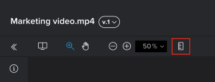
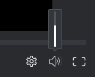
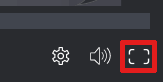

# Review a video `proof`

You can review a video `proof` that someone shared with you or that you created.

## Access requirements

You must have the following access to perform the steps in this article:

<table cellspacing="0"> 
 <col> 
 <col> 
 <tbody> 
  <tr> 
   <td role="rowheader">Adobe Workfront plan*</td> 
   <td> 
Current plan: Pro or Higher
 
or
 
Legacy plan: Select or Premium
 
For more information about proofing access with the different plans, see <a href="../../../administration-and-setup/manage-workfront/configure-proofing/access-to-proofing-functionality.md" class="MCXref xref">Access to proofing functionality in Workfront</a>.
 </td> 
  </tr> 
  <tr> 
   <td role="rowheader">Adobe Workfront license*</td> 
   <td> 
Current plan: Work or Plan
 
Legacy plan: Any (You must have proofing enabled for the user)
 </td> 
  </tr> 
  <tr> 
   <td role="rowheader">Proof Permission Profile </td> 
   <td>Manager or higher</td> 
  </tr> 
  <tr> 
   <td role="rowheader">Access level configurations*</td> 
   <td> 
Edit access to Documents
 
For information on requesting additional access, see <a href="../../../workfront-basics/grant-and-request-access-to-objects/request-access.md" class="MCXref xref">Request access to objects in Adobe Workfront</a>.
 </td> 
  </tr> 
 </tbody> 
</table>

&#42;To find out what plan, role, or `Proof Permission Profile` you have, contact your `Workfront` or `Workfront Proof administrator`.

## Open and work with a video proof

1. Go to the document list that contains the video `proof` you want to open.
1. Hover over the document, then click  `Open proof`.

   You can `proof` video content in the `Web Proofing Viewer` or the `Desktop Proofing Viewer`. The viewer that opens depends on how your `Adobe Workfront administrator` has configured your organization's `proofing viewer`s.

1. Do any of the following:

* Comment on the proof, as explained in [Comment on a proof](../../../review-and-approve-work/proofing/reviewing-proofs-within-workfront/comment-on-a-proof/comment-on-proof.md).
* Use `proofing viewer` functionality described in the remaining sections below.

For information about creating a video `proof`, see .

For general information that relates to reviewing `proofs`, see [Review proofs within Adobe Workfront](../../../review-and-approve-work/proofing/reviewing-proofs-within-workfront/review-proofs-in-wf.md).

If you cannot use a `proofing viewer` as described in this section, consult your `Workfront administrator`.

## Change the unit of measurement of the timeline

You can adjust the unit of measurement that is used in the video timeline. You can view the timeline in Time, Frame, or Timecode.

<ol> 
 <li value="1"> 
In the lower-left corner of the proofing viewer, click the current unit of measurement.
 
  
 </li> 
 <li value="2"> 
Select from the following options:
 
  <table cellspacing="0"> 
   <col> 
   <col> 
   <tbody> 
    <tr> 
     <td role="rowheader">Time</td> 
     <td>Displays the video timeline in minutes/seconds.
This option is selected by default.
</td> 
    </tr> 
    <tr> 
     <td role="rowheader">Frame</td> 
     <td>Displays the video timeline in frames.
The proofing viewer uses the information on&nbsp;the original file to determine the number of frames per second that is displayed.
</td> 
    </tr> 
    <tr> 
     <td role="rowheader">Timecode</td> 
     <td>Displays the video timeline in timecode. The numbers of the timecode represent hours, minutes, seconds, and frames. 
For example, a timecode of 1:48:36:18 represents 1 hour, 48 minutes, 36 seconds, and 18 frames into the video.
</td> 
    </tr> 
   </tbody> 
  </table> </li> 
</ol>

## Measure an area within a `proof`

<ol> 
 <li value="1"> 
Click the Measure an area icon at the top of the proofing viewer.
 
  
 </li> 
 <li value="2"> 
(Optional) Click&nbsp;Measurement markup color&nbsp;to expand the color options, then click a color and Opacity that is easy to see on your proof.
 
   <!--
   --> 
 
The default measurement tool color is red.
 
The proofing viewer remembers your color and opacity selections on all proofs you open until you clear your browser cache. 
 </li> 
 <li value="3"> 
Drag the measurement window to the area of the proof you need to measure.
 </li> 
 <li value="4"> 
Drag the corners or edges of the measurement window to resize it.
 </li> 
 <li value="5">(Optional) If you need the measurement area to be an exact size, type Selection size values.</li> 
 <li value="6">(Optional) If you need to measure a certain percentage within an area, check the calculate percentage box. A new box appears allowing you to adjust it </li> 
</ol>

## Control video playback

* [Adjust video playback speed](#adjusting-video-playback-speed) 
* [View video frame-by-frame](#viewing-video-frame-by-frame) 
* [Change playback volume](#changing-playback-volume)

### Adjust video playback speed

You can adjust the playback speed of the video `proof`. You can select to view the video between a quarter speed, to double speed.

<ol> 
 <li value="1"> 
In the lower-right corner of the proofing viewer, click the Settings icon.
 
    
 </li> 
 <li value="2">Click the current speed, then select a new playback speed. </li> 
 <li value="3">Click the Play button on the video to test the new speed.</li> 
</ol>

### View video frame-by-frame

For a more detailed look at the video `proof`, you can manually review&nbsp;the video frame-by-frame.

1. At the bottom of the `proofing viewer`, click the `Forward` and `Back` arrows to review the video frame-by-frame.

1. (Optional) Change the timeline to measure by frame, as described in&nbsp; [Change the unit of measurement of the timeline](#changing-the-unit-of-measurement-of-the-timeline).&nbsp;

### Change playback volume

You can control the volume in the video playback.

<ol> 
 <li value="1"> 
In the lower-right corner of the proofing viewer, mouse over the Volume icon, then drag the slider to select a new volume.
 
  
 
Or
 
 Click the Volume icon to mute and unmute the volume. 
 </li> 
</ol>

## Enable video loop

You can configure the video to continuously loop (the video begins playing again after it finishes).&nbsp;

<ol> 
 <li value="1"> 
In the lower-right corner of the proofing viewer, click the Settings icon.
 
  
 </li> 
 <li value="2">Enable the Loop option.</li> 
</ol>

## Use full-screen mode

You can configure videos to occupy more space on the screen and eliminate other distractions such as the header and comment area.

<ol> 
 <li value="1"> 
In the lower-right corner of the proofing viewer, click the Full Screen icon.
 
  
 </li> 
 <li value="2"> 
To exit full-screen mode, click the Exit Full Screen icon.
 
  
 </li> 
</ol>

## Zoom and pan on a video `proof`

You can adjust the zoom percentage when viewing a video `proof`. When viewing a `proof` at a larger zoom percentage, the Pan option allows you to use your mouse to navigate to different areas of the `proof`. This is especially useful when you are reviewing small GIF videos, content in a small area, and virtual reality video content, which displays wide in the Proofing Viewer.

<ol> 
 <li value="1">While viewing a video proof in the proofing viewer, do any of the following to adjust the zoom percentage of the proof (see also the shortcuts for these actions in <a href="../../../workfront-proof/wp-work-proofsfiles/review-proofs-wpv/keyboard-shortcuts.md" class="MCXref xref">Keyboard shortcuts in the Workfront Proof proofing viewer</a>):
  <ul>
   <li>Click the Zoom icon, then either click on the proof to zoom in, or drag across an area of the proof to zoom in only on that area. You can click the proof multiple times to continue zooming in. </li>
   <li>Click the current zoom percentage, the click the zoom percentage or click&nbsp;Fit to page. </li>
   <li>Click the Plus or Minus icons to increase or decrease the zoom percentage. </li>
  </ul></li> 
 <li value="2">If you need to pan the proof, click the Pan icon, then drag the proof as needed. </li> 
</ol>

## Print a `proof` summary

For information about printing the summary for a video `proof`, see [Print a proof summary within Adobe Workfront](../../../review-and-approve-work/proofing/managing-proofs-within-workfront/print-proof-summary-in-wf.md).

## View activity on a `proof`

For information about viewing activity in a video `proof`, see [View activity on a proof in the proofing viewer](../../../workfront-proof/wp-work-proofsfiles/review-proofs-wpv/view-activity-on-a-proof.md).

## Share a `proof`

For information about sharing a video `proof`, see&nbsp; [Share a proof from the proofing viewer](../../../review-and-approve-work/proofing/reviewing-proofs-within-workfront/review-a-proof/share-a-proof-in-proofing-viewer.md).

## Download a `proof`

For information about downloading a video `proof`, see [Downloading a Proof in the proofing viewer](../../../workfront-proof/wp-work-proofsfiles/review-proofs-wpv/download-proof.md).

## View previous `proof` versions

For information about viewing previous versions of a video `proof`, see [View previous proof versions in the Web Proofing Viewer](../../../workfront-proof/wp-work-proofsfiles/review-proofs-wpv/view-previous-proof-versions.md).

## Keyboard shortcuts

For information about the keyboard shortcuts available when reviewing a `proof` in the `proofing viewer`, see [Keyboard shortcuts in the Workfront Proof proofing viewer](../../../workfront-proof/wp-work-proofsfiles/review-proofs-wpv/keyboard-shortcuts.md).
