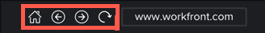
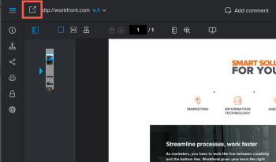

# Review an interactive *`proof`* {#review-an-interactive-proof}

You can review an interactive *`proof`* that has been shared with you or that you have created.

## Access requirements {#access-requirements}

You must have the following access to perform the steps in this article:

<table style="width: 100%;margin-left: 0;margin-right: auto;mc-table-style: url('../../../Resources/TableStyles/TableStyle-List-options-in-steps.css');" class="TableStyle-TableStyle-List-options-in-steps" cellspacing="0"> 
 <col class="TableStyle-TableStyle-List-options-in-steps-Column-Column1"> 
 <col class="TableStyle-TableStyle-List-options-in-steps-Column-Column2"> 
 <tbody> 
  <tr class="TableStyle-TableStyle-List-options-in-steps-Body-LightGray"> 
   <td class="TableStyle-TableStyle-List-options-in-steps-BodyE-Column1-LightGray" role="rowheader">Adobe Workfront plan*</td> 
   <td class="TableStyle-TableStyle-List-options-in-steps-BodyD-Column2-LightGray"> 
Current plan: Pro or Higher
 
or
 
Legacy plan: Select or Premium
 
For more information about proofing access with the different plans, see <a href="access-to-proofing-functionality.md" class="MCXref xref">Access to proofing functionality in Workfront</a>.
 </td> 
  </tr> 
  <tr class="TableStyle-TableStyle-List-options-in-steps-Body-MediumGray"> 
   <td class="TableStyle-TableStyle-List-options-in-steps-BodyE-Column1-MediumGray" role="rowheader">Adobe Workfront license*</td> 
   <td class="TableStyle-TableStyle-List-options-in-steps-BodyD-Column2-MediumGray"> 
Current plan: Work or Plan
 
Legacy plan: Any (You must have proofing enabled for the user)
 </td> 
  </tr> 
  <tr class="TableStyle-TableStyle-List-options-in-steps-Body-LightGray"> 
   <td class="TableStyle-TableStyle-List-options-in-steps-BodyE-Column1-LightGray" role="rowheader">Proof Permission Profile </td> 
   <td class="TableStyle-TableStyle-List-options-in-steps-BodyD-Column2-LightGray">Manager or higher</td> 
  </tr> 
  <tr class="TableStyle-TableStyle-List-options-in-steps-Body-MediumGray"> 
   <td class="TableStyle-TableStyle-List-options-in-steps-BodyB-Column1-MediumGray" role="rowheader">Access level configurations*</td> 
   <td class="TableStyle-TableStyle-List-options-in-steps-BodyA-Column2-MediumGray"> 
Edit access to Documents
 
For information on requesting additional access, see <a href="request-access.md" class="MCXref xref">Request access to objects in Adobe Workfront</a>.
 </td> 
  </tr> 
 </tbody> 
</table>

&#42;To find out what plan, role, or *`Proof Permission Profile`* you have, contact your *`Workfront`* or *`Workfront Proof administrator`*.

## Open and work with an interactive *`proof`* {#open-and-work-with-an-interactive-proof}

1.  Go to the document list that contains the interactive *`proof`* you want to open.
1.  Hover over the document, then click  `Open proof`.

   Depending on which *`proofing viewer`* your *`Adobe Workfront administrator`* has configured for *`proofing`* interactive content, the *`Desktop Proofing Viewer`* or *`Web Proofing Viewer`* launches automatically. For information about these two viewers, see [Differences between the Web Proofing Viewer and the Desktop Proofing Viewer overview](understand-differences-between-web-viewer.md).

   >[!NOTE]
   >
   >The *`Desktop Proofing Viewer`* does not support websites that require you to log in.

1. Do any of the following:
    
    
    * Comment on the *`proof`*, as explained in [Create and manage proof comments](create-manage-proof-comments.md).;
    
    
      >[!NOTE]
      >
      >The *`Desktop Proofing Viewer`*, takes a static screenshot of your content every time you click `Add comment` so users can see what part of the content you are commenting on. This screenshot is where you can add comments with markups.
    
    
    
    * Use *`proofing viewer`* functionality described in the remaining sections below.
    
    

For information about creating a *`proof`*, see [Generate a proof](generate-proof.md#generating-a-proof-on-a-document).

For general information that relates to reviewing *`proofs`*, see [Review proofs within Adobe Workfront](_review-proofs-in-wf.md).

If you cannot use a Proofing Viewer as described in this section, consult your *`Workfront administrator`*. 

## Set up interactive content *`proofing`* in *`Web Proofing Viewer`* {#set-up-interactive-content-proofing-in-web-proofing-viewer}

We recommend that you review all interactive content using the *`Desktop Proofing Viewer`*. However, if your organization's policies prevent this, your *`Workfront administrator`* can configure your system to use the *`Web Proofing Viewer`* for interactive *`proofing`*. For comparative information about these two viewers, see [Differences between the Web Proofing Viewer and the Desktop Proofing Viewer overview](understand-differences-between-web-viewer.md).

>[!NOTE]
>
>The *`Web Proofing Viewer`* has the following limitations:
>
>
>
>* Does not support URL *`proofs`* (supports only ZIP archive files).
>* Does not support Safari and Internet Explorer.
>*  Does not emulate content using interface specifications on mobile devices, such as button color, though it does let you view interactive content as it appears in the resolutions for the various devices.
>
>

After your *`Workfront administrator`* configures your system for interactive *`proofing`* in the *`Web Proofing Viewer`*, you need to download an extension in order to add comments and markups to interactive *`proofs`*:

1.  Open a *`proof`* created from a ZIP file containing interactive content.

   For more information, see [About preparing interactive content in a ZIP file for proofing](interactive-content-proofs.md#howtoprepareaninteractiveziparchive) in [Interactive content proofs overview](interactive-content-proofs.md). 

   See also [Create a proof for interactive content in a ZIP file](generate-proof-interactive-content-.md).

1.  Click `Add comment`.

   A message prompts you to download the browser extension for interactive content.

1. Click `Add to browser` to go to the extension download page in your browser's store, then download the extension.
1. In the *`Web Proofing Viewer`*, click `Reload the *`proof`*`.

With the extension installed on your browser, the *`proofing viewer`* takes a static screenshot of your content every time you click `Add comment`. This screenshot is where you can add comments with markups.

## Use browser navigation within an interactive *`proof`* {#use-browser-navigation-within-an-interactive-proof}

You can interact with the interactive *`proof`* like you would normally interact with the content in a browser. Navigation controls like those found in your browser are available to the left of the URL.

## Open the associated website from an interactive or static website *`proof`* {#open-the-associated-website-from-an-interactive-or-static-website-proof}

While you are reviewing a *`proof`* containing interactive or static web content, you can easily open the associated website in a new browser tab from the *`proofing viewer`*.

1.  Click the icon to the left of the URL in the upper left corner of the *`proofing viewer`*.&nbsp;

      

## Change *`proof`* resolution {#change-proof-resolution}

You can preview how an interactive *`proof`* looks with different resolutions, allowing you and the *`proof`*'s reviewers to see how content displays and responds on various devices and monitors. For more information, see [Change interactive proof resolution in the proofing viewer](view-interactive-content-as-it-appears-in-device.md).

## View the Workflow {#view-the-workflow}

You can view the Workflow of your *`proof`* as it appears on the Proof Details page and in your email notifications. Workflow information includes progress and status of the *`proof`*, stages, and reviewers. For more information, see [Review a Workflow in the proofing viewer](review-workflow.md).

## Print a *`proof`* summary {#print-a-proof-summary}

You can print a *`proof`* summary or save it in an XLS or PDF format. You can specify what information you want to include and how you want comments sorted in the output. For more information, see&nbsp; [Print a proof summary within Adobe Workfront](print-proof-summary-in-wf.md).&nbsp;

## View activity on a *`proof`* {#view-activity-on-a-proof}

You can view the recent activity for a given *`proof`*. This includes all activity and decisions made by any user assigned to the *`proof`*. For more information, see&nbsp; [View activity on a proof in the proofing viewer](view-activity-on-a-proof.md).

## Share a *`proof`* {#share-a-proof}

You can share the URL and the embed code for a *`proof`* with other users. For more information see&nbsp; [Share a proof from the proofing viewer](share-a-proof-in-proofing-viewer.md).

## Download a *`proof`* {#download-a-proof}

You can download files from an existing *`proof`*. Comments and other information associated with the *`proof`* are not included in the download. For more information, see&nbsp; [Downloading a Proof in the proofing viewer](download-proof.md).

## Make decisions on a *`proof`* {#make-decisions-on-a-proof}

If you have the rights to do so, you can make an approval decision on a *`proof`*. For more information, see [Make decisions on a proof](make-decisions-on-proof.md).
