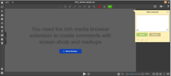
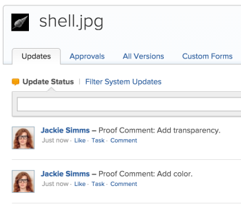
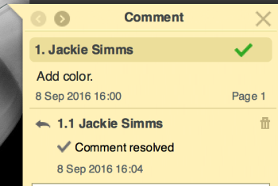
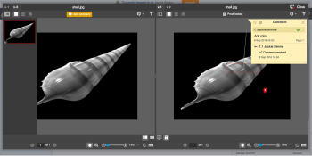
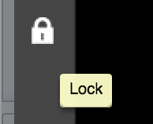

# Reviewing a Proof in the Legacy Proofing Viewer

>[!IMPORTANT]
>
>The information in this article refers to functionality that is currently deprecated and will be removed from `Adobe Workfront` in 2018.&nbsp;For more information, see [Legacy proofing viewer removed in 2018.3](../../../workfront-proof/wp-work-proofsfiles/review-proofs-lpv/lpv-removed-2018.md).

For information about reviewing a `proof` in the `Web Proofing Viewer`, see [Review a proof](../../../review-and-approve-work/proofing/reviewing-proofs-within-workfront/review-a-proof/review-a-proof.md).

## Proofing Interactive Content

Interactive  `proofs` can be viewed in all supported browsers. However, to add comments with markups and screen captures, you must have the `Workfront Proof` Rich Media Review extension&nbsp;installed in your&nbsp;browser. Without the extension, you can only add comments without the markups.

The extension&nbsp;is available for the following browsers:

* [Chrome 46+](https://chrome.google.com/webstore/detail/proofhq-rich-media-review/hfmcibckpnfcbehahbmfhojlahkenfed) 
* [Firefox 47+](https://addons.mozilla.org/en-US/firefox/addon/proofhq-rich-media-review/?src=cb-dl-created) 
* [Safari 9+](https://safari-extensions.apple.com/details/?id=com.proofhq.safari.screenshot-7WEDVS2S75)

The extension installation can be triggered from the `Workfront Proof` Viewer directly after clicking the `Add Comment` button (browser restart may be required) via the alert screen.&nbsp;

* When viewing interactive content, you cannot use the Navigation tools (i.e. Zoom, Rotation, Measurement tool, Pan, or Fit to). However, all these functions are available in  `Add Comment` mode if&nbsp;the content is captured as a static image, as described in [Proofing Static Content](#proofing-static-content).

When `proofing` interactive URLs:

* Be&nbsp;wary of version management whenever the actual creative content is changed on the server.
* It is not possible to review the live interactive content for older versions unless each version is placed under a different URL. In cases of the same URLs, the live content displayed in the `proofing` tool&nbsp;updates for older proof versions as well.&nbsp;
* When  `proofing` HTTP interactive&nbsp;content, make sure that Mixed Content is allowed in your browser.  
  The `proofing`&nbsp;tool connects over HTTPS. If your external resources load over HTTP, the browser detects this as Mixed Content and might block it,&nbsp;depending on the browser settings.&nbsp;

## Proofing Static Content

<ol> 
 <li value="1"> 
Go to the document that contains the proof you want to review, then click Proof.
 
Removing or Archiving a Proof 
 </li> 
 <li value="2">Click the Add Comment&nbsp;button located at the top of the proofing area.&nbsp;</li> 
 <li value="3">A comment box and tool bar appears. Select the tool needed to highlight or mark the document&nbsp;within the proofing&nbsp;tool. </li> 
 <li value="4">(Optional) Upload files to a comment by clicking the Attach File icon within the Add Comment box.  &nbsp;</li> 
 <li value="5"> 
Mouse&nbsp;over the comment area where the user's name appears. 
 
The&nbsp;Edit and Delete&nbsp;options appear.
 
    
 </li> 
 <li value="6">Click a comment in the sidebar to display&nbsp;that comment on the document.&nbsp;</li> 
 <li value="7"> 
Use the lower-right toolbar to make various changes to the proof. 
 
  
 
Options include (in order, from the left):
 
  <ul> 
   <li>Panning or moving the image</li> 
   <li>Zooming in</li> 
   <li>Scaling the document to fit the screen</li> 
   <li>Select percentage of zoom</li> 
   <li>Fit to page</li> 
   <li>Fit to width</li> 
   <li>Zoom to 100%&nbsp;</li> 
   <li>Zoom to 100%</li> 
   <li>Rotate the document&nbsp;</li> 
   <li>Measure a specific area</li> 
  </ul> </li> 
</ol>

Any comments made on the document appear in the stream of your `Workfront` instance, on the Details tab of the document. Proof Comments&nbsp;are&nbsp;marked to distinguish them from document updates.

You can specify if the comment has been resolved by clicking the check mark at the bottom of the comment box. A green check box appears on the comment.

You can select the auto-pixel icon to highlight in red any changes made to the `proof`.

Each time users upload a different version of a document to the `Workfront` Digital Proofing tool, a new `proof`&nbsp;is generated.

You can toggle between each version to see the changes and progress made on the `proof`.

You can also view different versions side-by-side by clicking the compare button (upper right).

You can remove the most recent version of a `proof`, but previous versions cannot be deleted. Use the `Remove Proof` button in the `Workfront` document list to remove a `proof`.&nbsp;

If you do not want additional comments made on a `proof`, you can lock it by selecting the lock `proof` icon, in the upper left corner of the `proofing` screen.

   

