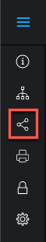

# Share a *`proof`* from the *`proofing viewer`* {#share-a-proof-from-the-proofing-viewer}

You can share a *`proof`* from the *`proofing viewer`* if sharing is enabled by the *`proof`* owner or creator.

>[!IMPORTANT] {type="important"}
>
>The Allow sharing proof via public URL or embed code setting must be enabled.

## Access requirements {#access-requirements}

You must have the following access to perform the steps in this article:

<table style="width: 100%;margin-left: 0;margin-right: auto;mc-table-style: url('../../../Resources/TableStyles/TableStyle-List-options-in-steps.css');" class="TableStyle-TableStyle-List-options-in-steps" cellspacing="0"> 
 <col class="TableStyle-TableStyle-List-options-in-steps-Column-Column1"> 
 <col class="TableStyle-TableStyle-List-options-in-steps-Column-Column2"> 
 <tbody> 
  <tr class="TableStyle-TableStyle-List-options-in-steps-Body-LightGray"> 
   <td class="TableStyle-TableStyle-List-options-in-steps-BodyE-Column1-LightGray" role="rowheader">Adobe Workfront plan*</td> 
   <td class="TableStyle-TableStyle-List-options-in-steps-BodyD-Column2-LightGray"> 
Current plan: Pro or Higher
 
or
 
Legacy plan: Select or Premium
 
For more information about proofing access with the different plans, see <a href="access-to-proofing-functionality.md" class="MCXref xref">Access to proofing functionality in Workfront</a>.
 </td> 
  </tr> 
  <tr class="TableStyle-TableStyle-List-options-in-steps-Body-MediumGray"> 
   <td class="TableStyle-TableStyle-List-options-in-steps-BodyE-Column1-MediumGray" role="rowheader">Adobe Workfront license*</td> 
   <td class="TableStyle-TableStyle-List-options-in-steps-BodyD-Column2-MediumGray"> 
Current plan: Work or Plan
 
Legacy plan: Any (You must have proofing enabled for the user)
 </td> 
  </tr> 
  <tr class="TableStyle-TableStyle-List-options-in-steps-Body-LightGray"> 
   <td class="TableStyle-TableStyle-List-options-in-steps-BodyE-Column1-LightGray" role="rowheader">Proof Permission Profile </td> 
   <td class="TableStyle-TableStyle-List-options-in-steps-BodyD-Column2-LightGray">Manager or higher</td> 
  </tr> 
  <tr class="TableStyle-TableStyle-List-options-in-steps-Body-MediumGray"> 
   <td class="TableStyle-TableStyle-List-options-in-steps-BodyB-Column1-MediumGray" role="rowheader">Access level configurations*</td> 
   <td class="TableStyle-TableStyle-List-options-in-steps-BodyA-Column2-MediumGray"> 
Edit access to Documents
 
For information on requesting additional access, see <a href="request-access.md" class="MCXref xref">Request access to objects in Adobe Workfront</a>.
 </td> 
  </tr> 
 </tbody> 
</table>

&#42;To find out what plan, role, or *`Proof Permission Profile`* you have, contact your *`Workfront`* or *`Workfront Proof administrator`*.

## Share the URL {#share-the-url}

You can share a *`proof`* via a URL if the owner has configured the *`proof`* for sharing. Proof owners can update sharing settings any time. For more information, see [Edit proof settings](edit-proof-settings.md).

1.  If the left icon menu is not displayed, click the `Menu` icon on the upper-left corner of the *`proofing viewer`*.

   

1.  In the left icon menu of the *`proofing viewer`*, click the `Share`&nbsp;icon.

   

1. In the `Share proof` options that appear, make sure `Get shareable link` is selected.

1.  &nbsp;Do either of the following:

    
    
    *  To copy the link to your clipboard, click `Copy link`.
    
    
      You can now distribute the link via a third-party tool, such as a chat or an email application.
    
    * To email the link directly from *`Adobe Workfront`*, do the following:    
        
        
        1. In the `Or email link to` field, begin typing and select the name of your recipient. Or specify the email address of an external user who you want to share with.
        1. Select from the following options:
        
        
        <table style="width: 100%;margin-left: 0;margin-right: auto;mc-table-style: url('../../../Resources/TableStyles/TableStyle-List-options-in-steps.css');" class="TableStyle-TableStyle-List-options-in-steps" cellspacing="0">
 <col class="TableStyle-TableStyle-List-options-in-steps-Column-Column1" style="width: 178px;">
 <col class="TableStyle-TableStyle-List-options-in-steps-Column-Column2">
 <tbody>
  <tr class="TableStyle-TableStyle-List-options-in-steps-Body-LightGray">
   <td class="TableStyle-TableStyle-List-options-in-steps-BodyE-Column1-LightGray" role="rowheader">Send public link</td>
   <td class="TableStyle-TableStyle-List-options-in-steps-BodyD-Column2-LightGray">
Includes a button in the email notification that directs users to the proof within the proofing viewer they are using and grants View access.

If Subscribe to proof via public URL or embed code is turned off for the proof, users can sign in with their Workfront login credentials to add comments to the proof. If it is turned on, anyone providing their email address and name (no password required) can sign and add comments to the proof.
</td>
  </tr>
  <tr class="TableStyle-TableStyle-List-options-in-steps-Body-MediumGray">
   <td class="TableStyle-TableStyle-List-options-in-steps-BodyE-Column1-MediumGray" role="rowheader">Send download link</td>
   <td class="TableStyle-TableStyle-List-options-in-steps-BodyD-Column2-MediumGray">Includes a button in the email notification that directs users to a download page, which provides file details, file name, and file size, with the file displayed inline. Users can click the Download link from the download page to download the file.</td>
  </tr>
  <tr class="TableStyle-TableStyle-List-options-in-steps-Body-LightGray">
   <td class="TableStyle-TableStyle-List-options-in-steps-BodyB-Column1-LightGray" role="rowheader">Add custom message</td>
   <td class="TableStyle-TableStyle-List-options-in-steps-BodyA-Column2-LightGray">Allows you to specify a custom subject and body for the email notification.</td>
  </tr>
 </tbody>
</table>        
        
        
        1. Click `Send`.
        
        
           Your recipients receive an email notification containing information about the *`proof`* and the buttons you chose to include.
        
        
                   
        

        
        
        
    
    
    

## Share the embed code {#share-the-embed-code}

You can share a *`proof`* via embed code if the *`proof`* owner has configured it for this.

For information about configuring a prof with an embedded code, see [Configure a proof](configure-proof.md) in [Configure a proof](configure-proof.md).

To share a *`proof`* via the embed code:

1.  In the toolbar on the left of the *`proofing viewer`*, click the `Share`&nbsp;icon.  

   

1. In the `Share *`proof`*` options that appear, click `Get embed code`, then click `Copy`.

## Share a *`proof`* by adding users to it {#share-a-proof-by-adding-users-to-it}

You can add users to a *`proof`* while reviewing a *`proof`* if you have any of the following permissions:<![CDATA[    ]]>

* Supervisor or Administrator permissions
* Manager permissions and you are the *`proof`* creator or owner
* Manager permissions with the Author or Moderator *`proof`* role

If the *`proof`* has an Automated Workflow, you can add the user to an individual stage. For more information, see [Automated Workflow overview](automated-workflow.md).

By default, users you add to the *`proof`*:

* Receive an email notification with a link to the *`proof`*.
* Can make approval decisions on the *`proof`* from the Home or My Work area, as described in [Approving work](approving-work.md).

* Do not need to have *`proofing`* enabled in order to review the *`proof`*.

When Automated Workflow is enabled and you add a user to the *`proof`* who does not have *`proofing`* enabled in *`Workfront`*, a new stage is created within the Automated Workflow. The user who you are adding is automatically added to this new stage when they view the *`proof`* for the first time. For more information, see [Automated Workflow overview](automated-workflow.md). 

To share a *`proof`* with individual users:

1.  In the toolbar on the left of the *`proofing viewer`*, click the `Share`&nbsp;icon.  

   

1. Click `Add recipients` in the list on the left.
1. Under  `New *`proof`* recipients`, begin typing the name of a user who you want to share the *`proof`* with, then click the name when it appears in the drop-down list.

1.  (Optional) Change any reviewer options to the right of the person's name:

    
    
    * `Proof role`: For more information, see [Manage Proof Roles in Workfront Proof](manage-proof-roles.md).
    
    * `Stage`: (Available only if the *`proof`* has an Automated Workflow). For more information, see&nbsp; [Automated Workflow Stages overview](stages.md).
    
    *  `Email alerts`: Select one of the following options to specify how the person will be notified about activity on the *`proof`*.
    
    
    <table style="width: 100%;mc-table-style: url('../../../Resources/TableStyles/TableStyle-List-options-in-steps.css');" class="TableStyle-TableStyle-List-options-in-steps" cellspacing="0"> 
 <col class="TableStyle-TableStyle-List-options-in-steps-Column-Column1" style="width: 175px;"> 
 <col class="TableStyle-TableStyle-List-options-in-steps-Column-Column2"> 
 <tbody> 
  <tr class="TableStyle-TableStyle-List-options-in-steps-Body-LightGray"> 
   <td class="TableStyle-TableStyle-List-options-in-steps-BodyE-Column1-LightGray" role="rowheader">All activity</td> 
   <td class="TableStyle-TableStyle-List-options-in-steps-BodyD-Column2-LightGray">Workfront sends an email to the reviewer every time there is any activity on the proof, such as&nbsp;a new&nbsp;comment, reply, or&nbsp;decision. 
This is a great option for the person who is managing the proofing process because&nbsp;it allows them to see the activity as it happens. 

Users do not receive an email alert about their own activity.
</td> 
  </tr> 
  <tr class="TableStyle-TableStyle-List-options-in-steps-Body-MediumGray"> 
   <td class="TableStyle-TableStyle-List-options-in-steps-BodyE-Column1-MediumGray" role="rowheader">Replies to my comments</td> 
   <td class="TableStyle-TableStyle-List-options-in-steps-BodyD-Column2-MediumGray">An email is sent to the reviewer only if someone replies explicitly to their&nbsp;comment&nbsp;(this excludes their own replies on their own comments). This means that if somebody on the proof makes a new comment, the reviewer is not notified.
This&nbsp;setting is recommended for your clients on the proof so that they are not&nbsp;notified of any other comments&nbsp;on the proof, and are&nbsp;notified only&nbsp;of replies to their own comments.

Although reviewers with this email alert setting are not notified of other new&nbsp;comments, they can still view&nbsp;all&nbsp;comments&nbsp;on the proof in&nbsp;the proofing viewer.

For information about comments, see <a href="create-manage-proof-comments.md" class="MCXref xref">Create and manage proof comments</a>.
</td> 
  </tr> 
  <tr class="TableStyle-TableStyle-List-options-in-steps-Body-LightGray"> 
   <td class="TableStyle-TableStyle-List-options-in-steps-BodyE-Column1-LightGray" role="rowheader">Decisions</td> 
   <td class="TableStyle-TableStyle-List-options-in-steps-BodyD-Column2-LightGray">Workfront sends an email to the reviewer only when someone makes a&nbsp;decision.
This can be useful for the person who is managing the approval process&nbsp;(such as a project manager) and&nbsp;needs to monitor progress on the proof and see which users have&nbsp;made their&nbsp;decision.

You are not notified of your own decision unless you select an email confirmation option when submitting your decision.
</td> 
  </tr> 
  <tr class="TableStyle-TableStyle-List-options-in-steps-Body-MediumGray"> 
   <td class="TableStyle-TableStyle-List-options-in-steps-BodyE-Column1-MediumGray" role="rowheader">Final decision</td> 
   <td class="TableStyle-TableStyle-List-options-in-steps-BodyD-Column2-MediumGray">Workfront sends an email when the last approver on the proof has made their&nbsp;decision.
This alert is often used by the designer, who does not usually need to take part in the actual review discussion. When the final decision is made, the designer is&nbsp;notified and&nbsp;can then take&nbsp;action on any necessary changes.

This alert can also be useful&nbsp;for a department leader&nbsp;who needs to be notified only when the review process is finished.
</td> 
  </tr> 
  <tr class="TableStyle-TableStyle-List-options-in-steps-Body-LightGray"> 
   <td class="TableStyle-TableStyle-List-options-in-steps-BodyE-Column1-LightGray" role="rowheader">Hourly Summary</td> 
   <td class="TableStyle-TableStyle-List-options-in-steps-BodyD-Column2-LightGray">Workfront sends an email to the reviewer every hour with a summary of all the&nbsp;comments, replies, and&nbsp;decisions&nbsp;that have occurred in the hour.
The email is sent only when&nbsp;activity besides your own&nbsp;occurs within the past&nbsp;hour. 

This alert is a good way of seeing an overview of the project.

An example use case for this summary is a&nbsp;senior reviewer&nbsp;who needs an overview of the project but does not need to be notified immediately of all activity on the proof.
</td> 
  </tr> 
  <tr class="TableStyle-TableStyle-List-options-in-steps-Body-MediumGray"> 
   <td class="TableStyle-TableStyle-List-options-in-steps-BodyE-Column1-MediumGray" role="rowheader">Daily Summary</td> 
   <td class="TableStyle-TableStyle-List-options-in-steps-BodyD-Column2-MediumGray">Workfront sends one email with all&nbsp;comments, replies, and decisions listed only on days when there is activity besides your own.
This alert is a good way of seeing a summary of the project&nbsp;without being overwhelmed with multiple&nbsp;updates throughout the day.

An example use case for this summary is a department leader&nbsp;who wants to monitor the overall progress of the project.

For more information, see <a href="create-manage-proof-comments.md" class="MCXref xref">Create and manage proof comments</a> and <a href="make-decisions-on-proof.md" class="MCXref xref">Make decisions on a proof</a>.
</td> 
  </tr> 
  <tr class="TableStyle-TableStyle-List-options-in-steps-Body-LightGray" data-mc-conditions=""> 
   <td class="TableStyle-TableStyle-List-options-in-steps-BodyB-Column1-LightGray" role="rowheader">No email</td> 
   <td class="TableStyle-TableStyle-List-options-in-steps-BodyA-Column2-LightGray">Workfront does not send any email alerts. This is useful&nbsp;for a person who is added to a proof only for reference purposes and does not need to be notified of any changes.
The system default is Daily summary (also seen as Not Set). If you or your reviewers do not make any other changes, all your proofs have this setting.
</td> 
  </tr> 
 </tbody> 
</table>    
    
    
    
    

1. (Optional) Repeat the two previous steps to add multiple users to the *`proof`*.&nbsp;
1.  (Optional) Set a `Deadline` for the reviewers (available only if the *`proof`* does not have automated workflow). For more information, see [Manage deadlines for a proof](set-deadlines-proof.md).
1. (Optional) Select `Send email notification to new recipients` to let them know you have added them to the *`proof`*.

1. When you are finished adding users to the *`proof`*, click `Done.`

