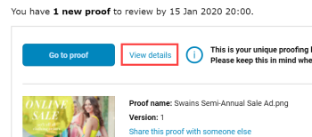
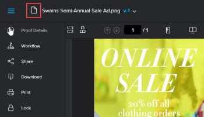
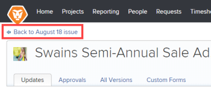
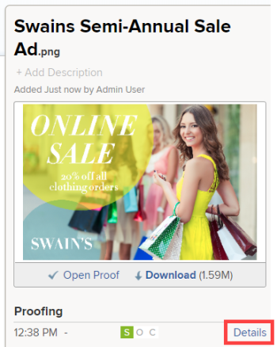

# View the *`Adobe Workfront`* object associated with a *`proof`* {#view-the-adobe-workfront-object-associated-with-a-proof}

When you review a *`proof`* that is associated with a *`Adobe Workfront`* object (usually a project, task, or issue), you can access the associated Workfront object to view updates and related documents and better understand the wider context of the work you need to do.

>[!NOTE]
>
>This functionality is not available if you are using an external collaborator license to access the *`proof`*. 

## Access requirements {#access-requirements}

You must have the following access to perform the steps in this article:

<table style="width: 100%;margin-left: 0;margin-right: auto;mc-table-style: url('../../../Resources/TableStyles/TableStyle-List-options-in-steps.css');" class="TableStyle-TableStyle-List-options-in-steps" cellspacing="0"> 
 <col class="TableStyle-TableStyle-List-options-in-steps-Column-Column1"> 
 <col class="TableStyle-TableStyle-List-options-in-steps-Column-Column2"> 
 <tbody> 
  <tr class="TableStyle-TableStyle-List-options-in-steps-Body-LightGray"> 
   <td class="TableStyle-TableStyle-List-options-in-steps-BodyE-Column1-LightGray" role="rowheader">Adobe Workfront plan*</td> 
   <td class="TableStyle-TableStyle-List-options-in-steps-BodyD-Column2-LightGray"> 
Current plan: Pro or Higher
 
or
 
Legacy plan: Select or Premium
 
For more information about proofing access with the different plans, see <a href="access-to-proofing-functionality.md" class="MCXref xref">Access to proofing functionality in Workfront</a>.
 </td> 
  </tr> 
  <tr class="TableStyle-TableStyle-List-options-in-steps-Body-MediumGray"> 
   <td class="TableStyle-TableStyle-List-options-in-steps-BodyE-Column1-MediumGray" role="rowheader">Adobe Workfront license*</td> 
   <td class="TableStyle-TableStyle-List-options-in-steps-BodyD-Column2-MediumGray"> 
Current plan: Work or Plan
 
Legacy plan: Any (You must have proofing enabled for the user)
 </td> 
  </tr> 
  <tr class="TableStyle-TableStyle-List-options-in-steps-Body-LightGray"> 
   <td class="TableStyle-TableStyle-List-options-in-steps-BodyE-Column1-LightGray" role="rowheader">Proof Permission Profile </td> 
   <td class="TableStyle-TableStyle-List-options-in-steps-BodyD-Column2-LightGray">Manager or higher</td> 
  </tr> 
  <tr class="TableStyle-TableStyle-List-options-in-steps-Body-MediumGray"> 
   <td class="TableStyle-TableStyle-List-options-in-steps-BodyB-Column1-MediumGray" role="rowheader">Access level configurations*</td> 
   <td class="TableStyle-TableStyle-List-options-in-steps-BodyA-Column2-MediumGray"> 
Edit access to Documents
 
For information on requesting additional access, see <a href="request-access.md" class="MCXref xref">Request access to objects in Adobe Workfront</a>.
 </td> 
  </tr> 
 </tbody> 
</table>

&#42;To find out what plan, role, or *`Proof Permission Profile`* you have, contact your *`Workfront`* or *`Workfront Proof administrator`*.

## View the *`Adobe Workfront`* object associated with a *`proof`* {#view-the-adobe-workfront-object-associated-with-a-proof-1}

1.  In an email inviting you to review a *`proof`*, click `View details` to open the Document details page for the *`proof`* in *`Workfront`*.

   

   Or

   With the *`proof`* open in the *`proofing viewer`*, click the `Go to Document details` icon in the upper-left corner.

   

   The Document details page opens in a new browser tab. On this page, you can:

    
    
    *   Access the *`proof`*'s associated *`Workfront`* object. 
    
    
      For example, in this screenshot of the upper-left corner of the Document details page, the breadcrumb link `Back to August 18 issue` indicates that the *`proof`* is associated with the "August 18" *`Workfront`* object, which is an issue:
    
    
          
    

    
    
      You can click the breadcrumb to view the updates, documents, and other information on the issue.
    
    
      The same is true if the *`proof`* is associated with other types of objects. For example, if the object is a task, the task name displays in the breadcrumb and you can click the breadcrumb to view information about the task.
    
    *  Go to the Proof details page for the *`proof`* by clicking `Details` in the panel on the right:
    
    
          
    

    
    
      For more information about the Proof details page, see [Manage Proof Details in Workfront Proof](manage-proof-details.md).
    
    
    

