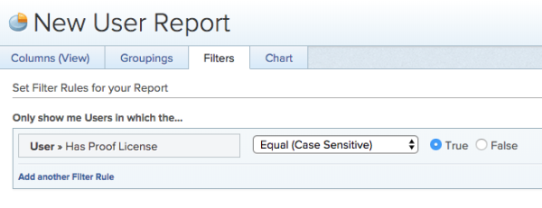

# List users with a `proofing` license in `Workfront` {#list-users-with-a-proofing-license-in-workfront}

You can view which users in `Workfront` currently have the option "User can generate `proofs`" enabled in either of the following ways:&nbsp;

## Create a user report {#create-a-user-report}

You can create a user report to view which users can generate `proofs`:

1. Navigate to **Reporting** area.
1. Click the&nbsp;**New Report**&nbsp;drop-down menu, then click&nbsp;**User Report**.

1. On the **Filters** tab, click **Add a Filter Rule**.

1. In the available field, expand **User**, then click **Has&nbsp;Proof License**.

1.  Select **Equal** > **True**.

   

1.  Click **Save+Close**.  

   The report displays all users in `Workfront` who have a `proofing` license assigned to them.

## Update the People view {#update-the-people-view}

You can add a new column in the People view to view which users can generate `proofs`:

1. Go to the **People**&nbsp;area.
1. Click the **People** tab.
1. In the **View** drop-down menu, do either of the following: 
    
    
    * To add this information to an existing view, select the view you want to customize,&nbsp;then click **Customize View**.
    * To add this information to a new view, click **New View**.
    
    

1. Click **Add Column**.
1. In the available field, expand **User**, then click **Has&nbsp;Proof License**.

1.  Click **Done**, then click **Save View** or **Save as New View**.  

   The view displays **True** or **False** depending on whether the user has a `proofing` license assigned to them.

