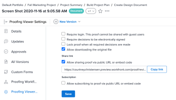
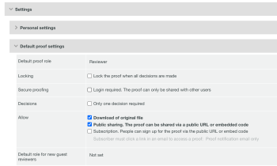

# Disable sharing proof via public URL or embed code

You can turn off the ability to share a proof with a public URL or embed code on a proof by proof basis or for individual users.

## Access requirements

You must have the following access to perform the steps in this article:

<table cellspacing="0"> 
 <col> 
 <col> 
 <tbody> 
  <tr> 
   <td role="rowheader"><em>Adobe Workfront</em> plan*</td> 
   <td> 
Current plan: Pro or Higher
 
or
 
Legacy plan: Select or Premium
 
For more information about proofing access with the different plans, see <a href="../../../administration-and-setup/manage-workfront/configure-proofing/access-to-proofing-functionality.md" class="MCXref xref">Access to proofing functionality in Workfront</a>.
 </td> 
  </tr> 
  <tr> 
   <td role="rowheader"><em>Adobe Workfront</em> license*</td> 
   <td> 
Current plan: <em>Work</em> or <em>Plan</em>
 
Legacy plan: Any (You must have proofing enabled for the user)
 </td> 
  </tr> <draft-comment>
   <tr data-mc-conditions="QuicksilverOrClassic.Draft mode"> 
    <td role="rowheader"><em>Proof Permission Profile</em> </td> 
    <td>Manager or higher</td> 
   </tr>
  </draft-comment>
  <tr data-mc-conditions="QuicksilverOrClassic.Draft mode"> 
   <td role="rowheader"><em>Proof Permission Profile</em> </td> 
   <td>Manager or higher</td> 
  </tr> 
  <tr> 
   <td role="rowheader">Access level configurations*</td> 
   <td> 
Edit access to Documents
 
For information on requesting additional access, see <a href="../../../workfront-basics/grant-and-request-access-to-objects/request-access.md" class="MCXref xref">Request access to objects in Adobe Workfront</a>.
 </td> 
  </tr> 
 </tbody> 
</table>

&#42;To find out what plan, role, or *Proof Permission Profile* you have, contact your *Workfront* or *Workfront Proof administrator*.

## Disable per *Proof*

You must be the *proof* owner or creator, or you must have the Author or Moderator proof role.

<ol> 
 <li value="1"> 
In the project that contains the proof, click Documents <draft-comment>
    <MadCap:conditionalText data-mc-conditions="QuicksilverOrClassic.Quicksilver">
     in the left panel
    </MadCap:conditionalText>
   </draft-comment><MadCap:conditionalText data-mc-conditions="QuicksilverOrClassic.Quicksilver">
    in the left panel
   </MadCap:conditionalText>.
 </li> 
 <li value="2"> 
Hover over the proof and select<draft-comment>
    <MadCap:conditionalText data-mc-conditions="QuicksilverOrClassic.Quicksilver"> 
     Document Details
    </MadCap:conditionalText>
   </draft-comment><MadCap:conditionalText data-mc-conditions="QuicksilverOrClassic.Quicksilver"> 
    Document Details
   </MadCap:conditionalText> .
 </li> <draft-comment>
  <li value="3" data-mc-conditions="QuicksilverOrClassic.Quicksilver"> 
In the left panel, click Proofing Viewer Settings, then disable the Allow sharing proof via public URL or embed code checkbox.
 
  
 </li>
 </draft-comment>
 <li value="3" data-mc-conditions="QuicksilverOrClassic.Quicksilver"> 
In the left panel, click Proofing Viewer Settings, then disable the Allow sharing proof via public URL or embed code checkbox.
 
  
 </li> <draft-comment>
  <li value="4" data-mc-conditions="QuicksilverOrClassic.Quicksilver"> 
Click Save. 
 </li>
 </draft-comment>
 <li value="4" data-mc-conditions="QuicksilverOrClassic.Quicksilver"> 
Click Save. 
 </li> 
</ol>

## Disable per user

You can disable the Public proof setting for individual users in your Workfront instance. You must have a *Proof Permission Profile* of administrator to make this change.

<ol> 
 <li value="1"> 
 Click the Main Menu icon  in the upper-right corner of <em>Adobe Workfront</em>, then click Proofing.
 </li> 
 <li value="2"> 
Click Account Settings near the top-right corner.
 </li> 
 <li value="3"> 
Click the Users tab, then click on the name of a user.
 </li> 
 <li value="4"> 
In the Default proof settings section, disable the Public Sharing checkbox. <draft-comment>
    <MadCap:conditionalText data-mc-conditions="QuicksilverOrClassic.Draft mode">
     The Allow proof option will be disabled on all new proofs generated by the user moving forward?
    </MadCap:conditionalText>
   </draft-comment><MadCap:conditionalText data-mc-conditions="QuicksilverOrClassic.Draft mode">
    The Allow proof option will be disabled on all new proofs generated by the user moving forward?
   </MadCap:conditionalText>
 
  
 </li> 
</ol>

